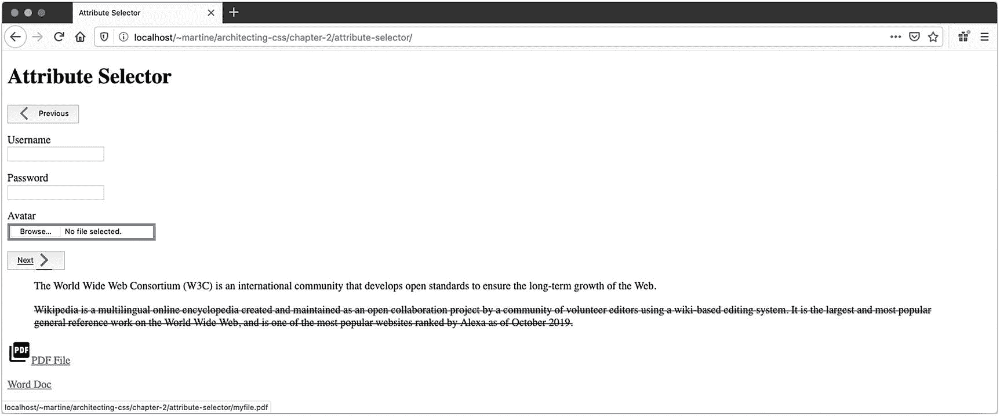
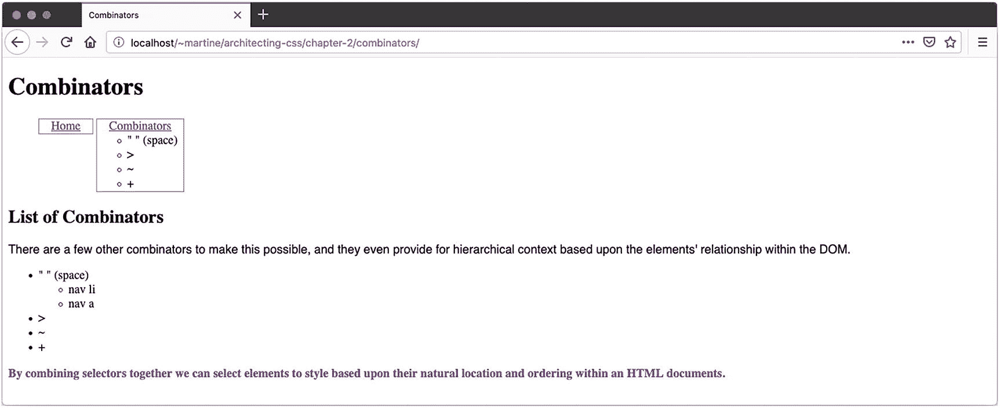
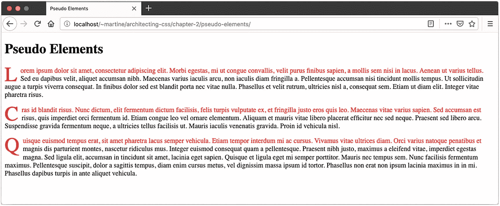
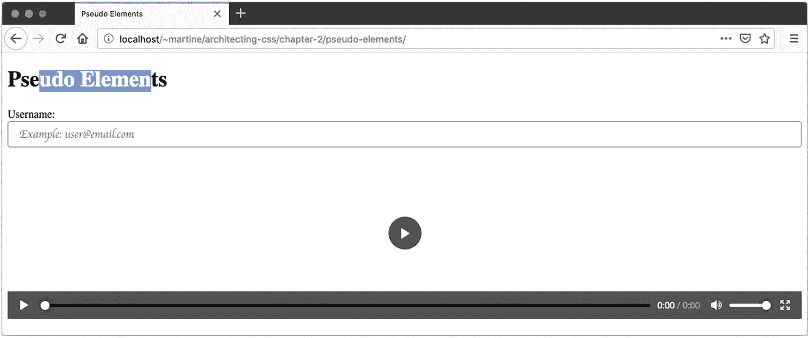
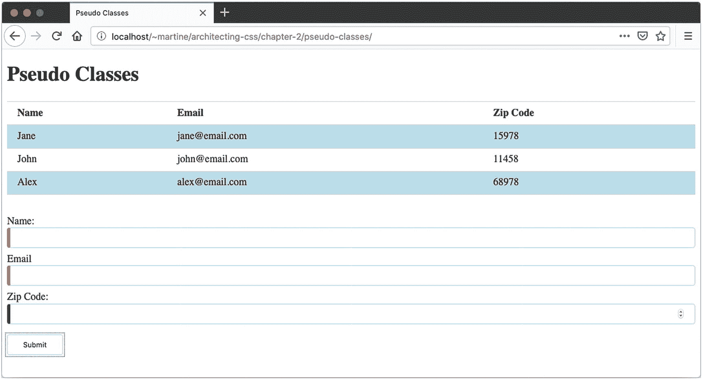
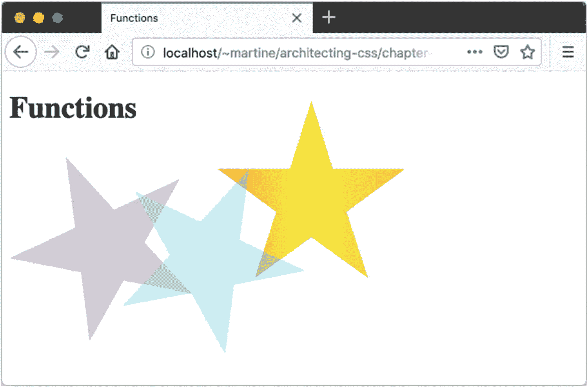

# 2.规则和选择器

虽然你可能已经熟悉了 CSS 的基础知识，但是这一章提供了一个在你做架构决策时可以使用的语言特性的快速概述。软件架构的一个重要部分是对工具和方法的深刻理解，这些工具和方法可用来完成各种任务，以实现我们的系统目标。

## 选择器

正如我们在第 [1](1.html) 章中看到的，选择器是 CSS 规则集的一部分，它决定了哪些元素应用了样式声明。熟练地使用选择器有助于分离 HTML 和 CSS，从而创建健壮且风格一致的网站和 web 应用程序。

### 基础

基本选择器允许根据元素在 HTML 中呈现的明显特征来选择元素:标记名、属性和类名。CSS 选择器语法非常有表现力，以至于有一个 DOM 函数`querySelector`接受 CSS 选择器字符串来定位 DOM 树中的元素。参见第 8 章了解更多关于 JavaScript 的内容。

#### 通用选择器

CSS 中的`*`是匹配页面上每个元素的通用选择器。有时这可能是有帮助的，例如清单 [2-1](#PC1) 和图 [2-1](#Fig1) ，它为用键盘选择的任何元素添加了一个可视指示器。


图 2-1

通用选择器

```html
*:focus {
  outline: 1px dotted grey;
}

Listing 2-1Outline Selected Elements

```

然而，这种便利是有代价的，通用选择器有效地缩短了关联声明的继承。

除非您有特定的用例，否则通常最好避免通用选择器，而支持继承。将通用选择器与其他选择器结合使用也是一个好主意。

通用选择器的一个用例是将声明应用于另一个元素的所有子元素，即使该属性不会被继承，例如 border。对于这个用例，可以考虑将定制属性或混合作为这种方法的替代。

#### 类型选择器

在 CSS 中选择一个元素就像使用标记名一样简单。这叫做类型选择器，所有的 HTML 标签都是有效的选择器。

清单 [2-2](#PC2) 和图 [2-2](#Fig2) 中的示例为所有段落元素添加了填充。


图 2-2

类型选择器

```html
p {
  padding: 0.5rem;
}

Listing 2-2Add Padding to Selected Elements

```

#### 类别选择器

要按类选择元素，只需使用一个点，后跟类名，如`.example`。因为一个 HTML 元素可以有多个类，所以可以组合多个类选择器，它们也可以与元素选择器组合。参见列表 [2-3](#PC3) 和 [2-4](#PC4) 。输出如图 [2-3](#Fig3) 所示。


图 2-3

类别选择器

```html
img {
  width: 200px;
}
button {
  background-color: lightblue;
}
button.outline {
  border: 1px solid green;
}
button.outline.bold {
  border: 5px solid darkgreen;
}

Listing 2-4Class Selector CSS

```

```html
<body>
  <div>
    <p>Lorem Ipsum...</p>
    
    <button class="outline">Cancel</button>
    <button id="ok" class="outline bold">OK</button>
  </div>
</body>

Listing 2-3Selector HTML

```

在这个例子中，由于类型选择器的原因，``元素没有接收到边框。“确定”按钮的边框比“取消”按钮更粗、更深。

#### ID 选择器

ID 选择器`#`根据元素的`ID`属性选择元素。请注意，在单个页面上使用重复的 id 对于 HTML 是无效的，因此该选择器应该匹配 0 或 1 个元素。清单 [2-5](#PC5) 中的例子使用了清单 [2-3](#PC3) 中上一个例子的 HTML。图 [2-4](#Fig4) 显示了输出。


图 2-4

ID 选择器

```html
img {
  width: 200px;
}

#ok {
  font-size: 1.5rem;
  font-weight: bold;
}
p#ok {
  color: pink;
}

Listing 2-5ID Selector CSS

```

这将使“确定”按钮上的按钮文本加粗。这个例子显示了 ID 选择器可以像类选择器一样与类型选择器组合。在这个例子中，通过以不匹配 HTML 的方式组合这些选择器，段落标记的内容不会变成粉红色。

#### 属性选择器

属性选择器根据元素的一个属性匹配元素。这个选择器使用方括号来包含属性匹配，并且可以选择与类型选择器结合使用。例如，`a [rel]`可以用来匹配所有具有给定关系的锚标签。为了允许`<area>`标签也匹配，单独使用`[rel]`。

除了测试属性的存在，这个选择器还可以测试特定的值，如清单 [2-6](#PC6) 和 [2-7](#PC7) 以及图 [2-5](#Fig5) 所示。



图 2-5

属性选择器

```html
label, input, a, button {
  display: block;
  margin-bottom: 1rem;
}
button {
  display: flex;
  align-items: center;
}

/* Matches password input fields */
input[type="password"] {
  color: red;
}

/* Strikes out any quotes cited from Wikipedia */
blockquote[cite*="wikipedia.org"] {
  text-decoration: line-through;
}

/* Underlines any element with a title attribute containing
   the word "continue" with any Capitalization.
*/
[title*="continue"] i {
  text-decoration: underline;
}

/* Display a gray border around any input which has an
   accept starting with image, such as image/png
*/
input[accept^="image"] {
  border: solid 4px gray;
}

/* Display a PDF icon beside any .pdf download links */
a[href$=".pdf"]::before {
  content: url(icon-pdf.png);
}

/* Matches a material design icon such as <i class="material-icons">arrow_back_ios</i> */
i[class|="material-icons"] {
  color: blue;
  width: 32px;
}

Listing 2-7Attribute Selector CSS

```

```html
<body>
  <h1>Attribute Selector</h1>
  <form>
    <button href="" title="go back">
      <i class="material-icons">arrow_back_ios</i>
      Previous
    </button>
    <label>
      Username
      <input type="text" >
    </label>
    <label>
      Password
      <input type="password" >
    </label>
    <label>
      Avatar
      <input type="file" accept="image/png">
    </label>
    <button href="" title="Continue">
    Next
    <i class="material-icons">arrow_forward_ios</i>
    </button>
  </form>
  <blockquote cite="w3.org">
    The World Wide Web Consortium (W3C) is an...
  </blockquote>
  <blockquote cite="https://en.wikipedia.org/wiki/Wikipedia">
    Wikipedia is a multilingual online encyclopedia...
  </blockquote>
  <a href="myfile.pdf" download>PDF File</a>
  <a href="myfile.docx" download>Word Doc</a>
</body>

Listing 2-6Attribute Selector HTML

```

因为`class`和`ID`都是 HTML 属性，所以类和 ID 选择器具有等同的属性选择器，如表 [2-1](#Tab1) 所示。

表 2-1

属性选择器等效项

<colgroup><col class="tcol1 align-left"> <col class="tcol2 align-left"> <col class="tcol3 align-left"></colgroup> 
|   | 

基本选择器

 | 

属性选择器

 |
| --- | --- | --- |
| 按 ID 选择 | `#contactForm` | `[id=contactForm]` |
| 按类别选择 | `.outline` | `[class~="outline"]` |

Grouping

为了尽量减少声明块的重复，可以将选择器组合到一个逗号分隔的列表中。例如，`a, button { ... }`将声明块应用于 HTML 中的锚和按钮元素。

### 组合子

我们已经看到了如何将类型选择器与类和 ID 选择器结合起来，但是如果我们想要结合多个类型选择器甚至属性选择器呢？还有一些其他的组合子可以实现这一点，它们甚至提供了基于 DOM 中元素关系的层次上下文。表 [2-2](#Tab2) 中的组合子示例可以在清单 [2-8](#PC8) 和 [2-9](#PC9) 以及图 [2-6](#Fig6) 中找到。

表 2-2

组合子

<colgroup><col class="tcol1 align-left"> <col class="tcol2 align-left"> <col class="tcol3 align-left"> <col class="tcol4 align-left"></colgroup> 
| 

名字

 | 

配合

 | 

例子

 | 

描述

 |
| --- | --- | --- | --- |
| 后裔 | `" " (space)` | `nav a` | nav 元素内的所有锚标记 |
| 儿童 | `">"` | `nav > ul > li` | 导航列表中的第一个列表项，忽略第一级之后的任何项 |
| 兄弟 | `"~"` | `p ~ p` | 共享同一父元素的所有段落(在第一个段落之后) |
| 相邻兄弟姐妹 | `"+"` | `h2 + p` | 同一层次上紧跟在`<h2>`标签之后的所有段落 |



图 2-6

组合子

```html
nav a {
  display: block;
  margin: 0 1rem;
}

nav > ul > li {
  border: solid 1px gray;
  display: inline-block;
  list-style-type: none;
  vertical-align: top;
}

p ~ p {
  color: purple;
  font-weight: bold;
}

h2 + p {
  font-family: sans-serif;
}

Listing 2-9Combinators CSS

```

```html
<body>
  <h1>Combinators</h1>
  <nav>
    <ul>
      <li><a href="">Home</a></li>
      <li>
        <a href="">Combinators</a>
        <ul>
          <li>" " (space)</li>
          <li>&gt;</li>
          <li>~</li>
          <li>+</li>
        </ul>
      </li>
    </ul>
  </nav>
  <main>
    <h2>List of Combinators</h2>
    <p>There are a few other combinators to make this...</p>
    <ul>
      <li>
        " " (space)
        <ul>
          <li>nav li</li>
          <li>nav a</li>
        </ul>
      </li>
      <li>></li>
      <li>~</li>
      <li>+</li>
    </ul>
    <p>By combining selectors together we can select...</p>
  </main>
</body>

Listing 2-8Combinators HTML

```

通过将选择器组合在一起，我们可以根据元素在 HTML 文档中的自然位置和顺序来选择样式。这有助于我们将布局、主题和内容分离开来，以实现更易管理的规则集。

### 伪元素

伪元素允许您选择 HTML 文档中不存在的元素，但可以在屏幕上直观地显示出来。`::first-letter`和`::first-line`都选择元素中的一部分文本。

虽然`::first-letter`的效果可以通过在想要的字母周围添加一个`<span>`标签来重现，但是对于流畅的布局，除了`::first-line`之外，实际上没有其他方法可以选择文本块的整个第一行。这是因为这个规则是在计算完布局之后*应用的，这样浏览器就知道哪些单词应该受到规则的影响。参见清单 [2-10](#PC10) 和 [2-11](#PC11) 以及图 [2-7](#Fig7) 。*



图 2-7

伪元素`–`:::第一行和::第一级

```html
p::first-letter {
  color: red;
  font-size: 3rem;
  line-height: 0;
  display: block;
  float: left;
  margin-top: .125rem;
  margin-right: .5rem;
}

p::first-line {
  color: red;
}

Listing 2-11Pseudo Elements CSS – ::first-line and ::first-level

```

```html
<body>
  <h1>Pseudo Elements</h1>
  <p>Lorem ipsum dolor sit amet, consectetur...</p>
  <p>Cras id blandit risus. Nunc dictum, elit...</p>
  <p>Quisque euismod tempus erat, sit amet pharetra...</p>
</body>

Listing 2-10Pseudo Elements HTML – ::first-line and ::first-level

```

`::after`和`::before`伪元素使用`content`属性根据特定标准插入内容(文本或图像)。我们在清单 [2-12](#PC12) 和 [2-13](#PC13) 以及图 [2-8](#Fig8) 中看到了这一点。


图 2-8

伪元素`–` ::before 和::after

```html
a {
  display: block;
}
a::before {
  content: url(link.png);
  display: inline-block;
  margin-right: .5rem;
  vertical-align: middle;
}
a::after {
  content: ' (link)'
}

Listing 2-13Pseudo Elements CSS – ::before and ::after

```

```html
<body>
  <a href>First Link</a>
  <a href>Second Link</a>
  <a href>Third Link</a>
</body>

Listing 2-12Pseudo Elements HTML – ::before and ::after

```

您曾经想要自定义输入元素上的占位符文本吗？你可以用`input[type=text]::placeholder`来做这件事(见清单 [2-14](#PC14) 和 [2-15](#PC15) 以及图 [2-9](#Fig9) 和 [2-10](#Fig10) )。


图 2-10

伪元素`–`::背景



图 2-9

伪元素`–`::占位符和::选择

```html
input {
  box-sizing: border-box;
  border-radius: 4px;
  border: solid 1px gray;
  padding: .5rem 1rem;
  font-size: 1rem;
  width: 100%;
}

input[type=text]::placeholder {
  font-family: cursive;
}
::selection {
  background-color: cornflowerblue;
  color: white;
}

::backdrop {
  background: cornflowerblue;
}

Listing 2-15Pseudo Elements CSS – ::placeholder, ::selection, and ::backdrop

```

```html
<form>
  <label>
    Username:
    <input type="text" placeholder="Example: user@email.com">
  </label>
</form>

<video width="100%" height="250" controls>
  <source src="" type="video/mp4">
</video>

Listing 2-14Pseudo Elements HTML – ::placeholder, ::selection, and ::backdrop

```

你有没有在一个网站上选择文本，并注意到选择的突出显示是在网站的品牌颜色中？这可以通过`*::selection {background-color: cornflowerblue}`来完成。

全屏浏览模式下的背景可以使用`::backdrop`自定义。

在前面的示例中也可以看到这两种情况。

Note

CSS 规范要求在伪元素前有一个双冒号前缀，比如`::after`。然而，大多数浏览器支持只有一个冒号(`:after`)的伪元素，而不会抛出错误。您可能会在遇到的样式表中看到这种用法，理解它的工作原理很重要。一般来说，我们推荐标准的双冒号前缀有两个原因:(1)它符合 CSS 规范，(2)它清楚地区分了伪元素和伪类。

### 伪类

伪类根据 HTML 文档中没有的信息选择元素。这可能包括状态或上下文元数据。

一些伪类使得基于用户交互调整样式成为可能。

*   当一个元素被悬停时匹配(比如使用鼠标)

*   `:focus –`匹配用键盘(通过制表符)或鼠标(通过点击元素)选择的元素

*   `:active –`匹配一个正在被激活的元素(比如点击，同时按下鼠标键)

*   `:target –`选择一个元素，该元素的 ID 与 URL 的片段(在#)之后的部分)相匹配

使用位置伪类可以很容易地以漂亮的格式显示表格数据。分别用`tr:first-of-type`和`tr:last-of-type`选择表格的第一行和最后一行。使用同样的技术，使用`<td>`选择第一列和最后一列。使用`tbody > tr:nth-child(even)`高亮显示每隔一行。

管理表单和显示有用的指示器可以使用以下一些伪类:

*   `:in-range`、`:out-of-range –`与定义范围相比的数值

*   `:placeholder-shown –`如果占位符文本当前可见

*   `:invalid`，`:valid –`检查表单字段的验证状态，查看是否有错误和成功指示器

*   `:checked`、`:indeterminate`、`–`用于选择当前选中的复选框或单选按钮，或者无法确定选中的选项

*   `:default –`仅当该元素是一组元素中的默认元素时才匹配(如表单上的默认提交按钮或默认单选选项)

*   `:disabled`、`:read-only`、`:read-write –`根据用户交互的可用性匹配表单字段的当前状态

*   `:optional`，`:required –`根据字段所需的状态匹配字段

另一个重要的伪类是`:not()`选择器，它选择*不*匹配选择器列表的元素。虽然许多伪类都定义了它们的反转状态(例如，`:optional`与`:required`)，但是在许多其他场景中，否定也是有用的。例如，您可以通过使用`article > *:not(img) { ... }`来选择`<article>`的每个直接子标签，即*而非*和``。

这些伪类中有许多为 CSS 提供了功能，否则在设计用户体验时需要 JavaScript 的参与。通过利用 CSS 实现上下文相关的 UI，我们将应用程序和视图逻辑分开，提高了网站和 web 应用程序的可维护性和性能。前面提到的一些伪类的例子可以在图 [2-11](#Fig11) 所示的清单 [2-16](#PC16) 和 [2-17](#PC17) 中找到。



图 2-11

伪类

```html
table {
  border-collapse: collapse;
  margin-bottom: 1rem;;
  width: 100%;
}
tr {
  border-top: solid 1px lightgrey;
  border-bottom: solid 1px lightgrey;
}
tbody tr:nth-last-of-type(odd) {
  background: lightblue;
}
th, td {
  padding: .5rem 1rem;
  text-align: left;
}

form {
  margin-top: 2rem;
}
form > *:not(button) {
  border-radius: 4px;
  box-sizing: border-box;
  display: block;
}

label {
  margin-bottom: .5rem;
}
input {
  border: solid 1px lightblue;
  padding: .5rem 1rem;
  width: 100%;
}
input:hover, input:active {
  border-color: slategray;
}
input:invalid {
  border-left: solid 5px red;
}
input:valid {
  border-left: solid 5px green;
}

button {
  padding: .5rem 1.5rem;
  border: solid 1px lightblue;
  border-radius: 3px;
  background: white;
  margin-top: .5rem;
}
button:hover, button:active {
  outline: dotted 1px blue;
  outline-offset: 2px;
}

Listing 2-17Pseudo Classes CSS

```

```html
<body>
  <h1>Pseudo Classes</h1>
  <table>
    <thead>
      <th>Name</th>
      <th>Email</th>
      <th>Zip Code</th>
    </thead>
    <tbody>
      <tr>
        <td>Jane</td>
        <td>jane@email.com</td>
        <td>15978</td>
      </tr>
      <tr>
        <td>John</td>
        <td>john@email.com</td>
        <td>11458</td>
      </tr>
      <tr>
        <td>Alex</td>
        <td>alex@email.com</td>
        <td>68978</td>
      </tr>
    </tbody>
  </table>
  <form>
    <label>
      Name:
      <input type="text" maxlength="20" required>
    </label>
    <label>
      Email
      <input type="email" maxlength="100" required>
    </label>
    <label>
      Zip Code:
      <input type="number" max="99999">
    </label>
    <button type="submit">Submit</button>
  </form>
</body>

Listing 2-16Pseudo Classes HTML

```

## 声明

如果我们不对元素应用样式，那么选择元素没有任何好处。每个规则集的声明部分是为匹配元素指定单个样式属性及其值的地方。

### 性能

CSS 中的属性指的是可能受到影响的布局和样式的各个方面。许多属性只适用于某些元素，而不适用于其他元素。有时，属性的可见性将取决于元素的显示设置。例如，`height`属性在带有`display: inline`的元素上被忽略，但是在`display: inline-block`上呈现。

有些 CSS 属性是许多单个属性的简写符号。考虑清单 [2-18](#PC18) 中的例子，其中两个声明块产生相同的结果。

```html
p {
  border-width: 2px;
  border-style: solid;
  border-color: #666666;
}

p {
  border: 2px solid #666666;
}

Listing 2-18Border Property

```

每个单独的边框属性都可以作为边框速记属性的可选值参数。其他一些速记属性包括`background`、`box-shadow`、`font`、`padding`、`margin`和`outline`。其中每一个都有一个不同的属性列表，并且它们有一个特定的属性提供顺序。在使用这些方法时，一定要查阅参考资料，直到您对每种方法的语法都很熟悉为止。

一些属性和值的组合可能会产生看似相似但实际上非常不同的结果。表 [2-3](#Tab3) 列出了其中一些，并解释了它们之间的区别。

表 2-3

属性歧义消除

<colgroup><col class="tcol1 align-left"> <col class="tcol2 align-left"> <col class="tcol3 align-left"></colgroup> 
| 

第一个属性

 | 

第二财产

 | 

描述

 |
| --- | --- | --- |
| 边距:2px | 填充:px； | 边距在方框模型之外，相邻时可以折叠。填充物在盒子里面。 |
| 边框:2px 纯黑； | 轮廓:2px 纯黑； | 边框添加到框模型尺寸，并存在于边距和填充之间。轮廓位于边框之外，不占用盒子上的空间。 |
| 可见性:隐藏； | 显示:无； | 隐藏元素仍然存在于页面上，并且可以占用空间和接收事件。渲染树中不存在未有效显示的元素。 |

属性对于突出显示屏幕上不希望项目回流的元素非常有用。这通常用于结合`:focus`伪类来突出显示元素。关于盒子模型的详细信息，以及与布局相关的属性，包括`display`、`grid`、`flex`，请参见第 [4](4.html) 章。

对可用 CSS 属性和值的全面回顾超出了本书的范围。对于一个优秀的参考，我们推荐 Mozilla 的 MDN CSS 参考，可以在 [`https://developer.mozilla.org/docs/Web/CSS/Reference`](https://developer.mozilla.org/docs/Web/CSS/Reference) 找到。

### 单位

有许多 CSS 属性需要一个`<length>`数据类型。该长度是一个标量(数字)值，带有相关的测量单位。选择正确的单位可以使一个漂亮的、流畅的、有反应的布局和一个在用户调整窗口大小或缩放时会中断的布局产生区别。正确的单位也会对实现特定布局所需的工作量产生巨大影响。

我们将讨论三种基本的单位类别。第一类包括在设计时建立的绝对度量。第二类是字体相关的，这意味着如果用户缩放页面或者改变默认的字体大小，这些值的含义会相对于彼此而改变。第三类包含相对于视口的长度，这意味着它们将相对于浏览器大小或用户设备上的特定显示而变化。

#### 绝对的

**px**T0】计算机图形学的传统计量单位；这仅适用于基于屏幕的显示。

**以**英寸到`–`英寸。`1in.` = `6pc` = `72pt` = `2.54cm`。这将是打印机上的真实英寸，但相对于屏幕的参考像素*定义，而屏幕的参考像素*是`96px`，与屏幕分辨率无关。

**PC**T0】Pica。印刷字体中的传统度量单位。

**点** `–`点。印刷字体中的传统度量单位。

**厘米**厘米`–`厘米。1cm = 10mm。请参阅前面关于打印机和屏幕的英寸说明。

**毫米**毫米`–`毫米。

Note

绝对测量单位不会相对于`font-size`等用户设置进行缩放。因此，使用这些单元(尤其是在屏幕上)可能会导致严重的可访问性问题，因此不推荐使用。

#### 字体-相对

**ch** `–`表示元素字体中“0”字符的宽度(包括字样和大小)。

**ex** `–`表示元素字体中“x”字符的高度(包括字样和大小)。

**em** `–`元素的计算`font-size`。如果这个单元用在`font-size`属性上，它将相对于继承的`font-size`。

**rem** `–`与`em`完全相同，但总是相对于根元素的`font-size`(对于 HTML 文档来说就是`<html>`)。这是许多网页设计者的首选默认单位，因为它允许可管理的流畅布局，同时解决了可访问性问题。

#### 视口-相对

**vh** `–`等于视口*高度*的 1%

**vw** `–`等于视口*宽度*的 1%

**vmin**T0】等于`vh`或`vw`的*较小的*

**VMAX**T0】等于`vh`或`vw`的*较大的*

#### 百分率

许多 CSS 属性将接受一个`<percentage>`或一个`<length-percentage>`(意味着长度或百分比)。虽然`rem`对于许多目的来说是最好的选择，尤其是那些与内容和可访问性相关的目的，但是百分比对于任何继承的大小都有效，包括字体相对大小、视图相对大小，甚至是绝对单位。

### 功能

虽然 CSS 不允许用户定义函数，但是有大量的函数可用于执行各种任务，其中一些描述如下:

**形状** `–`功能`circle()`、`ellipse()`、`inset()`和`polygon()`支持多种非矩形形状。与`shape-outside`属性结合以将文本换行为特定形状，或者与`clip-path`结合以裁剪图像或容器。

**变换** `–`变换函数数量众多，包括`rotateX()`、`scale()`、`skewY()`。还有`perspective()`、`matrix3d()`、`scaleZ()`等 3D 变换。这些变换可以调整屏幕上元素的形状、方向和位置，以创建各种视觉效果和布局。

**渐变** `–`有大量的函数支持渐变的创建，包括`linear-gradient()`、`radial-gradient()`、`repeating-linear-gradient()`、`repeating-radial-gradient()`。由渐变实现的颜色混合支持大量的视觉效果。

除了渐变，还有其他视觉效果。`blur()`功能将在所选元素上产生高斯模糊，甚至是图像。这对于模式对话框的背景很有用。`drop-shadow()`给主题增加了一些维度。并且`opacity()`允许元素处于完全不透明和完全透明之间，以允许维度覆盖。(请注意，如果您想要不透明的文本和半透明的背景，您可以考虑使用`rgba()`或`hsla()`颜色功能，如下文所述。)

在 CSS 中指定颜色最常见的方式是在 3 或 6 位数的十六进制代码前加一个散列符号，比如红色的`#FF0000`。也可以使用`hsl()`和`hsla()`功能通过色调、饱和度和亮度指定颜色，或者使用`rgb()`或`rgba()`指定为 RGB(红、绿、蓝)。每个函数集中的“a”指的是指定不透明度或透明度级别的 alpha 通道。

还可以使用`filter`属性以一致的方式操纵颜色，修改如`contrast()`、`saturate()`和`hue-rotate()`，应用效果如`grayscale()`或`sepia()`。这些函数特别有用，因为它们可以应用于页面上的图像和文本。

**资源**`–``url()`功能用于通过 CSS 将图像资源添加到设计中。这使得 HTML 中的< img >标签可以保留给与内容相关的图片，而不是与布局和设计相关的图片。

**计数** `–`计数函数`counter()`、`counters()`、`symbols()`用于管理计数器变量。有关计数器的更多信息，请参见下面的“变量”一节。

**数学** `–`有时候内置的单位不够，你需要根据其他元素来计算大小或位置。`calc()`函数使得用混合单位做一些基本的数学运算成为可能。支持加、减、乘、除和括号。举个例子，你可以使用`height: calc(10vh - 1rem)`来计算一个标题的高度，它是视窗高度的 10%，但是考虑到了`1rem`边框。

清单 [2-19](#PC19) 和 [2-20](#PC20) 显示了图 [2-12](#Fig12) 的源代码。



图 2-12

功能

```html
.shape {
  clip-path: polygon(50% 0%, 61% 35%, 98% 35%, 68% 57%, 79% 91%, 50% 70%, 21% 91%, 32% 57%, 2% 35%, 39% 35%);
  display: inline-block;
  position: relative;
  height: calc(100vw / 3);
  width: calc(100vw / 3);
}
.shape:nth-of-type(1) {

  background: rgba(255, 0, 255, 0.31);
  transform: rotate(-25deg);
  filter: saturate(15%);
}
.shape:nth-of-type(2) {
  background: rgb(255,116,0);
  background: linear-gradient(90deg, rgba(255,116,0,1) 0%, rgba(255,237,0,1) 47%, rgba(255,167,0,1) 100%);
  filter: opacity(.75);
  transform: translate(0, -50px);
  left: calc((100vw / 3) - 200px);
}
.shape:nth-of-type(3) {
  background: hsl(189, 100%, 50%);
  transform: rotate(25deg);
  opacity: .33;
  left: calc((100vw / 3) - 100px);
  top: -200px;
}

Listing 2-20Functions CSS

```

```html
<body>
  <h1>Functions</h1>
  <div class="shape"></div>
  <div class="shape"></div>
  <div class="shape"></div>
</body>

Listing 2-19Functions HTML

```

图 [2-12](#Fig12) 中所示的例子突出了一些功能。示例中星星的位置取决于浏览器窗口的大小，因为计算基于`vw`和`vh`单位。

### 变量

有几种方法可以在 CSS 中使用动态数据(示例见清单 [2-21](#PC21) 和 [2-22](#PC22) 以及图 [2-13](#Fig13) ):

**自定义属性** `–`这些变量的定义很像任何其他 CSS 属性，可以包含任何在 CSS 中合法的值。然后可以使用`var()`函数在样式表中引用它们。

**属性** `–`使用`attr()`函数，您可以从 HTML 属性中获取值。将它与`content`属性结合起来，以独特的方式显示属性数据。

每个 HTML 元素可以有 0 到多个命名的计数器，这些计数器在文档树中相关联，并使用 CSS 进行操作。HTML 列表自动生成一个“列表项”计数器，除非显式重置，否则每个列表元素递增 1。这也包括无序列表。使用`counter-set`、`counter-increment`或`counter-decrement`属性调整计数器，并使用`counter()`或`counters()`以您选择的方式显示指定计数器的值。这是为了支持嵌套列表而存在的，但可能有许多其他用途。


图 2-13

变量

```html
ul {
  counter-reset: li;
}
li:before {
  content: counter(li)"-" attr(category)": ";
  counter-increment: li;

  text-transform: capitalize;
  background: lightblue;
  display: inline-block;
  padding: .5rem 1rem;
  border-radius: 25px;
  margin: 0 1rem 1rem 0;
}

Listing 2-22Variables CSS

```

```html
<body>
  <h1>Variables</h1>
  <ul>
    <li category="fruit">Apple</li>
    <li category="vegetable">Lettuce</li>
    <li category="starch">Corn</li>
  </ul>
</body>

Listing 2-21Variables HTML

```

## 规则

CSS at-rules(之所以这样命名是因为每个名称中都有@或“at”符号)是一些语言特性，它们提供了对样式结构的一些控制。这些规则提供了一种收集或分组其他规则集的机制。

### @导入

在第 [1](1.html) 章中，我们看了在 HTML 文档中包含 CSS 的三种方法，包括`<link>`元素。`@import` at-rule 为 CSS 提供了类似的功能。这两者都在 CSS 文件中包含了拉机制，有效地将其内容插入到 import 语句的位置。

这非常有用，因为它允许我们将样式表分解成更具逻辑性和更易管理的文件，而不会对 HTML 文档产生任何影响。关于`@imports`和其他引入外部样式表的机制的更深入的讨论，请参见第 [7](7.html) 章。

### @支持

`@supports` at-rule 允许基于用户代理对 CSS 特性的特定支持来应用规则。这是一种基于 web 浏览器声明支持的内容来提供样式和格式的方式，而不是使用老派的技巧来尝试检测给定的规则是否会按预期工作。

这种 at-rule 允许您开始利用当今最新的 CSS，它使得为尖端浏览器提供替代规则(或者为旧浏览器提供替代规则)成为可能，如清单 [2-23](#PC23) 和 [2-24](#PC24) 中所示。

```html
p {
  text-decoration: underline;
  text-underline-offset: 1rem;
}

@supports not (text-underline-offset: 1rem) {
  p {
    text-decoration: none;
    padding-bottom: 1rem;
    border-bottom: solid 3px orange;
    display: inline-block;
  }
}

Listing 2-24At-Rules CSS

```

```html
<body>
  <h1>At-Rules</h1>
  <p>Hello World</p>
</body>

Listing 2-23At-Rules HTML

```

因为`text-underline-offset`是 Firefox 支持的(图 [2-14](#Fig14) ，Firefox 忽略了`@support not`代码。然而，在撰写本书时，Opera 不支持`text-underline-offset`，因此使用`@supports not`中提供的回退代码(图 [2-15](#Fig15) )。


图 2-15

Opera 中不支持 At-Rules，`text-underline-offset`


图 2-14

火狐支持 At-Rules，`text-underline-offset`

### @媒体

CSS media at-rule 用于对系统、环境或用户代理执行查询。这种使用被称为**媒体查询**。

Media Query

媒体查询允许作者测试和查询用户代理或显示设备的值或特征，而与正在呈现的文档无关。它们用在 CSS **@media** 规则中，以有条件地将样式应用于文档，以及各种其他上下文和语言，如 HTML 和 JavaScript。

—媒体查询级别 4 <sup>[1](#Fn1)</sup>

如第 [4](4.html) 章所述，这些媒体查询可用于构建响应性布局，但它们还有许多其他用途。例如，可以创建一个打印机友好的主题，隐藏导航和横幅，同时保留内容，如清单 [2-25](#PC25) 所示。

```html
@media print and monochrome {
  nav, .banner { display: none; }
}

Listing 2-25Printer-Friendly Design

```

通过使用`@page` at-rule 提供特定于页面的指令，可以获得对打印的额外控制。 <sup>[2](#Fn2)</sup>

还可以为没有支持悬停的定点设备(如鼠标)的设备调整布局，这在平板电脑和移动设备中很常见。在清单 [2-26](#PC26) 中，我们在每个链接旁边显示目标 URL，但是只在不支持悬停的设备上显示。

```html
@media (not(hover)) {
  a::after {
    content: attr(href);
    font-size: x-small;
    position: absolute;
  }

}

Listing 2-26Tablet-Friendly Icon

```

## 摘要

本章讲述了 CSS 规则集的基本构件。你已经学会了如何

*   指定打印机特定的布局和设计

*   仅使用 CSS 根据文件扩展名插入文档图标

*   将多个选择器组合成更高级的表达式

*   突出显示表格中的交替行

*   基于浏览器和设备功能提供替代样式

下一章将介绍级联样式表的*级联*部分，并解释用户代理决定页面上每个元素的每个属性值的过程。

<aside aria-label="Footnotes" class="FootnoteSection" epub:type="footnotes">Footnotes [1](#Fn1_source)

媒体查询级别 4。(2019 年 8 月 9 日)。检索自 [`www.w3.org/TR/mediaqueries-4/`](http://www.w3.org/TR/mediaqueries-4/)

  [2](#Fn2_source)

[T2`https://developer.mozilla.org/en-US/docs/Web/CSS/@page`](https://developer.mozilla.org/en-US/docs/Web/CSS/%2540page)

 </aside>