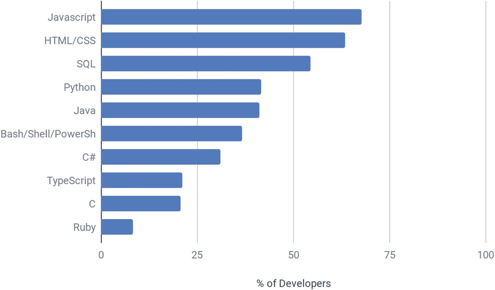
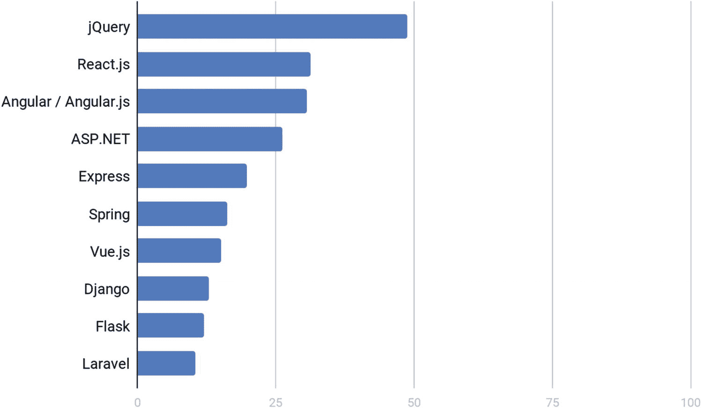
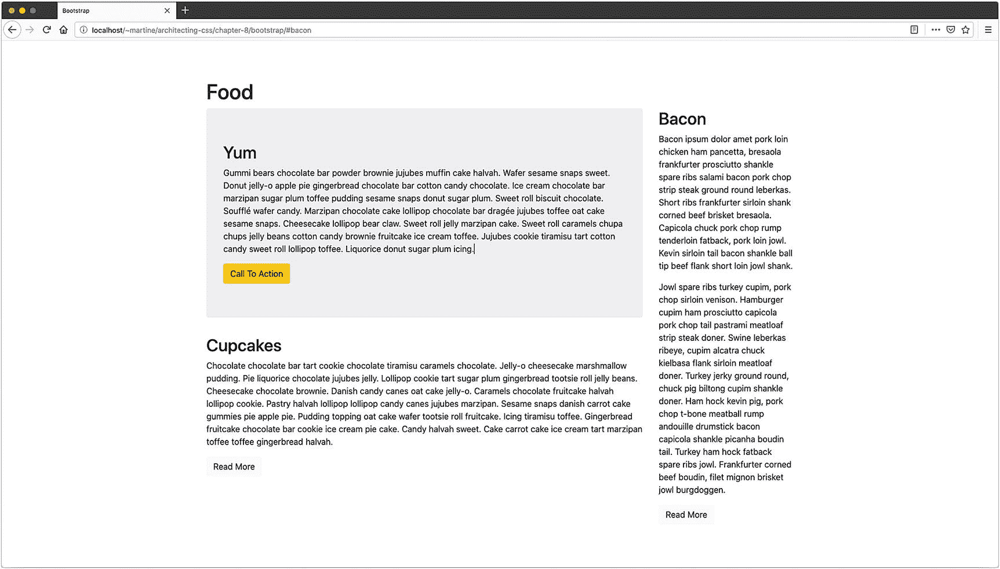
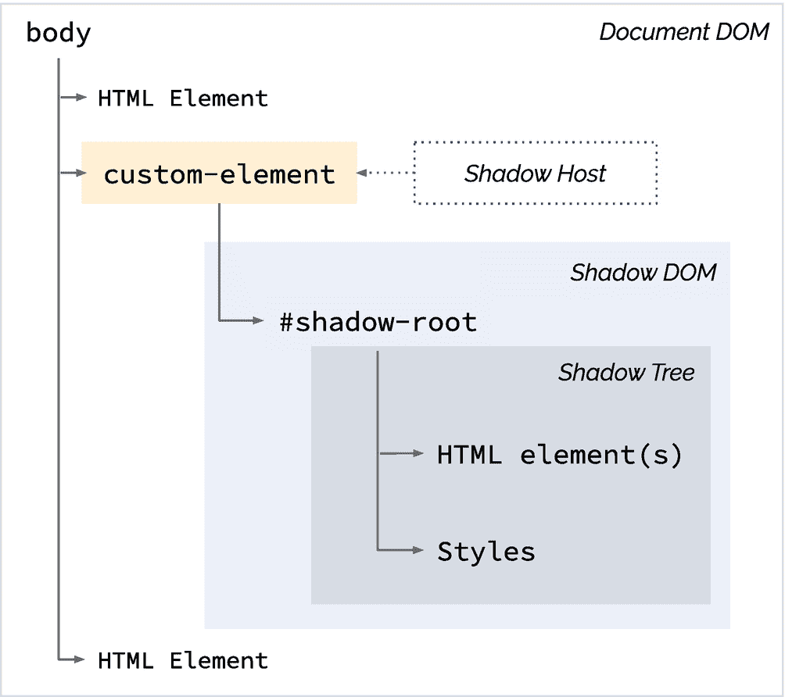
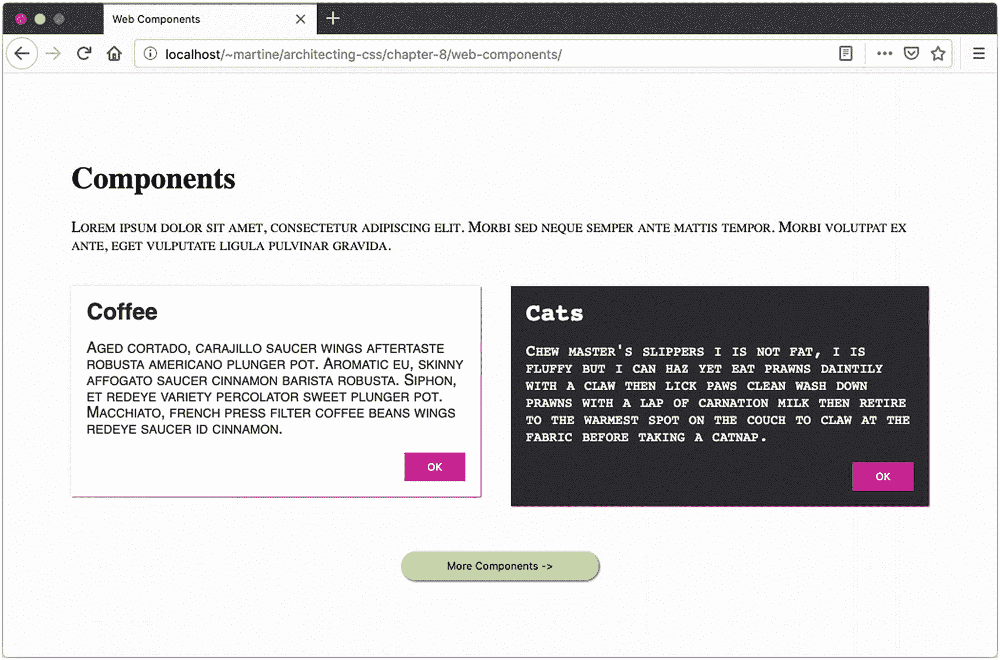
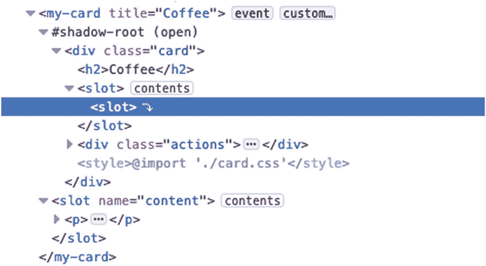

# 八、框架、库和 JavaScript

在现实世界的应用程序中，您的 CSS 并不是孤立运行的。本章涵盖了现代前端 web 应用程序的一些重要考虑因素，包括您对 CSS 或 JavaScript 框架的选择如何影响您的应用程序风格。

## Java Script 语言

好的，是的，这是一本关于 CSS 的书，那么为什么我们突然开始谈论 JavaScript 了呢？事实是，大量的前端开发是使用某种框架和/或 UI 库完成的，其中许多依赖于 JavaScript。此外，由于状态变化或用户交互，JavaScript 经常被用来操纵 CSS。

根据 Stack Overflow 的 2019 年度调查，过去连续七年最受欢迎的编程语言是 JavaScript。前十名的细分见图 [8-1](#Fig1) 。 <sup>[1](#Fn1)</sup>



图 8-1

根据堆栈溢出，2019 年最受欢迎的编程、脚本和标记语言

最受欢迎的 web 框架仍然是 jQuery，其次是 React 和 Angular。十大细分如图 [8-2](#Fig2) 所示。 <sup>[2](#Fn2)</sup>



图 8-2

根据堆栈溢出，2019 年最受欢迎的 Web 框架

### 使用 JS 操作 CSS

通过 jQuery 等库和`element.ClassList`等普通 JavaScript 属性，我们已经通过 JS 操纵 CSS 很多年了。但是这对特异性和层叠到底有什么影响呢？表 [8-1](#Tab1) 列出了一些通过 JS 影响视觉输出的常见方式及其对特异性的影响。

表 8-1

CSS 改变 JavaScript 方法

<colgroup><col class="tcol1 align-left"> <col class="tcol2 align-left"> <col class="tcol3 align-left"></colgroup> 
| 

属性和方法

 | 

它的作用

 | 

对特异性的影响

 |
| --- | --- | --- |
| **元素。类别列表**添加()移除()更换()切换()项目()包含() | 读取和操作附加到特定元素的类。 | 因为样式是通过引用类来应用的，所以级联和继承不会受到太大的影响。 |
| **element.style***例子:*`elem.style =``"color: blue, font-size: 12px"`*或*`elem.setAttribute("style", "color:blue; font-size: 12px"`*或*`elem.style.color = "blue"` | 在元素上内联添加样式。 | 很难覆盖，因为它们是内联的。如果元素已经有内联样式，它们将被 JavaScript 应用的样式覆盖。 |

这既是一个巨大的优势，也是一个巨大的风险，JavaScript 能够轻易地覆盖 CSS 声明的任何内容，但不是必须这样做。

如果我们不想在 JavaScripts 中混合 CSS 规则，那么通过 classList 给我们的方法允许在不接触 CSS 本身的情况下向元素添加和移除类。这带来了样式定义留在 CSS 文件中而不是在 JS 和 CSS 文件之间分割的巨大好处。

影响样式或 DOM 本身带来的好处是，所应用的 CSS 的特殊性无关紧要，因为它将被覆盖。通过这种技术，不管任何其他上下文，作为开发人员，我们可以规定，如果用户执行了某个动作，或者达到了某个特定的状态，将应用一组特定的样式，而不管其他样式或上下文。这种技术通常用于显示和隐藏对话框，例如通知消息。这种技术的优点是样式的改变可以和它的触发器或动作保持一致，并且不管上下文如何，被应用的样式不会被先前存在的 CSS 覆盖。

有些情况下，JavaScript 允许我们做纯 HTML 和 CSS 解决方案无法做到的事情。一个完美的例子是使用事件监听器来控制动画的定时、开始或结束(参见清单 [8-1](#PC1) `to` [8-3](#PC3) 和图 [8-3](#Fig3) )。


图 8-3

动画监听器输出

```html
var image, button;

(function() {
  'use strict';
  image = document.getElementById('image');
  image.addEventListener('animationend', reEnableButton);
  button = document.getElementById('button');
})();

function reEnableButton() {
  button.disabled = false;
  image.classList.remove('rotate');
}

function rotateImage() {
  image.classList.add('rotate');
  button.disabled = true;
}

Listing 8-3Animation Listener JavaScript

```

```html
html, body {
  padding: 36px;
  margin: 0;
}

@keyframes rotate {
  0% { transform: rotate(0deg); }
  100% { transform: rotate(360deg); }
}
.rotate { animation: rotate ease-in-out 500ms 1; }

.image { text-align: center; }
img { max-width: 100%; }
button {
  display: block;
  margin: 1rem auto;
  padding: 1rem;
  width: 25%;
}

Listing 8-2Animation Listener CSS

```

```html
<body>
  <div class="image">
    
    <button onClick="rotateImage()" id="button">Rotate Image</button>
  </div>
</body>

Listing 8-1Animation Listener HTML

```

按钮触发 JavaScript 禁用按钮，并添加一个类`rotate`，使图像旋转一次。因为在页面加载时，我们设置 JavaScript 来监听动画的结束，一旦动画结束，我们可以重置页面。该按钮被重新启用，并且 rotate 类被删除。在这个例子中，即使我们用 JavaScript 操作 CSS，CSS 类仍然在 CSS 文件中定义和维护，因此，继承和级联没有被改变或影响。

## 基于组件的体系结构

当使用基于组件的架构时，不仅要根据应用程序的品牌/规范来设计应用程序的主题，而且 UI 库本身也非常重要。每个库在易用性方面都有不同程度的主题性和复杂性，以及实际上可能的样式。当选择一个 UI 库时，理解可定制性以及一个库或框架是如何可定制的，可以让你省去很多麻烦。**封装**——将组件 CSS 限制在组件本身——允许编写只适用于特定组件而不适用于应用程序其余部分的 CSS。如果一个 UI 库的组件有非常严格的封装和很少的主题选项，那么设计风格将会非常困难。

有许多不同的库和框架可以创建或使用组件。每一个都有稍微不同的实现。我们不会看所有的。当观察现代 JavaScript 框架如何创建组件并与组件交互时，大多数框架要么使用 web 组件，要么模仿它们。值得注意的是，特别是如果组件被模拟，它的行为将与我在下文中描述的略有不同。Angular 有一个模拟模型，并继续支持等效的阴影穿透组合器(::`ng-deep`)，但可以设置为使用 web 组件，或者设置为根本没有封装。在 React 中，这取决于 CSS 在项目中是如何设置的。选项也涵盖了整个范围。准确理解框架提供了多少封装将有助于更好地决定如何构建 CSS。

## 库和框架

根据定义，库是应用程序将使用的声明的集合。框架是一种抽象，为应用程序提供基本的功能或框架。一个框架可以包含一个或多个库。

UI 库如[jQuery UI](https://jqueryui.com/)<sup>[3](#Fn3)</sup>或[Angular Material](https://material.angular.io/)<sup>[4](#Fn4)</sup>提供了一系列可以添加到应用程序中的组件或小部件。它们有现成的样式和功能。要定制他们的外观，他们需要有主题。主题化既可以通过工具来完成，这些工具可以提供必要的 CSS，比如 themerollers，也可以按照指南手动完成。无论哪种方式，所述库的主题性和可定制性将会变化。可变性是组件如何构造以及作者如何使元素易于定制的直接结果。超出主题允许范围的进一步定制通常会非常困难，导致使用非常特殊的选择器，比如使用`!important`。因此，在考虑库的时候，了解它的主题化功能以及定制它的容易程度是非常重要的，这样它的元素就可以匹配你的应用程序。

库本身的架构也可能影响它的使用方式，并且在某些情况下可能提供多种方法。Bootstrap <sup>[5](#Fn5)</sup> 很有意思，因为它的结构允许两种完全不同的实现，各有利弊。

第一种，也可能是最常见的实现，是直接在页面中导入 CSS 和 JavaScript，从本地源，通过 CDN，或者使用包管理器，如 NPM、NuGet 或 RubyGems。该框架整体上是可用的，并且正在被应用。这意味着许多类已经添加了样式，可以在网站上使用了。一些组件，比如模态，具有依赖于与之相关的 JavaScript 的功能。这些也将随时可用。

这种方法的缺点在于三个方面:

1.  命名不再是语义性的。

2.  样式本质上是由 HTML 控制的。

3.  所有内容都是完整导入的，即使没有被使用。

考虑一个包含三个页面的静态网站，所有三个页面使用相同的基本布局。布局包含一个主要部分和一个位于主要部分右侧的侧边部分(见清单 [8-4](#PC4) 和 [8-5](#PC5) 以及图 [8-4](#Fig4) )。



图 8-4

自举输出

```html
html, body {
  padding: 36px;
  margin: 0;
}

Listing 8-5Bootstrap CSS

```

```html
<!DOCTYPE html>
<html lang="en">
<head>
  <title>Bootstrap</title>
  <meta charset="UTF-8">

  <!-- bootstrap -->
  <link rel="stylesheet" href="https://stackpath.bootstrapcdn.com/bootstrap/4.3.1/css/bootstrap.min.css" integrity="sha384-ggOyR0iXCbMQv3Xipma34MD+dH/1fQ784/j6cY/iJTQUOhcWr7x9JvoRxT2MZw1T" crossorigin="anonymous">
</head>

<body class="container">
  <h1>Food</h1>

  <div class="row">
    <main class="col-md-9">
      <div class="jumbotron">
        <h2>Yum</h2>
        <p>Gummi bears chocolate bar powder brownie… </p>
        <button class="btn btn-warning">Call To Action</button>
      </div>
      <h2 id="cupcakes">Cupcakes</h2>
      <p>Chocolate chocolate bar tart cookie chocolate… </p>
      <a class="btn btn-light">Read More</a>
    </main>
    <aside id="bacon" class="col-md-3">
      <h2>Bacon</h2>
      <p>Bacon ipsum dolor amet pork loin chicken ham… </p>
      <p>Jowl spare ribs turkey cupim, pork chop sirloin… </p>
      <a class="btn btn-light">Read More</a>
    </aside>
  </div>

  <!-- Bootstrap scripts -->
  <script src="https://code.jquery.com/jquery-3.3.1.slim.min.js" integrity="sha384-q8i/X+965DzO0rT7abK41JStQIAqVgRVzpbzo5smXKp4YfRvH+8abtTE1Pi6jizo" crossorigin="anonymous"></script>
  <script src="https://cdnjs.cloudflare.com/ajax/libs/popper.js/1.14.7/umd/popper.min.js" integrity="sha384-UO2eT0CpHqdSJQ6hJty5KVphtPhzWj9WO1clHTMGa3JDZwrnQq4sF86dIHNDz0W1" crossorigin="anonymous"></script>
  <script src="https://stackpath.bootstrapcdn.com/bootstrap/4.3.1/js/bootstrap.min.js" integrity="sha384-JjSmVgyd0p3pXB1rRibZUAYoIIy6OrQ6VrjIEaFf/nJGzIxFDsf4x0xIM+B07jRM" crossorigin="anonymous"></script>

</body>
</html>

Listing 8-4Bootstrap HTML

```

这种方法的好处是简单。无论是使用自定义主题，还是使用前面例子中的默认主题，都可以快速启动并运行。许多基本样式已经存在，可以用来创建一个布局。最大的缺点是代码的可维护性。如果多个页面上有多个行动号召按钮，保持一致性就变得非常困难。

```html
<button class="btn btn-warning">Call To Action</button>

```

如果更新了`btn`或`btn-warning`类，那么应用程序中包含这个通用类的所有按钮都将被更新，不管是不是动作调用。这个类没有给出它的用途，或者更糟，比如在这个例子中，它是因为它的颜色而被使用，而不是作为警告。唯一的另一个选择是找到应用程序中所有的动作调用，并更新它们的类名。

不再是样式表控制元素的外观，样式现在与 HTML 紧密绑定在一起。布局也是如此，想要将侧边改为占页面的三分之一，而不是四分之一，将涉及到进入每个页面，并更新 HTML。

另一种选择是利用 Bootstrap 提供的可用 Sass 混合(参见清单 [8-6](#PC7) 和 [8-7](#PC8) )。

```html
@import './node_modules/bootstrap/scss/functions';
@import './node_modules/bootstrap/scss/variables';
@import './node_modules/bootstrap/scss/mixins';

@import './node_modules/bootstrap/scss/jumbotron';
@import './node_modules/bootstrap/scss/buttons';

html {
  padding: 36px;
}

body {
  padding: 36px 15px;
  margin: 0 auto;
  font-family: -apple-system,BlinkMacSystemFont,"Segoe UI",Roboto,"Helvetica Neue",Arial,"Noto Sans",sans-serif,"Apple Color Emoji","Segoe UI Emoji","Segoe UI Symbol","Noto Color Emoji";
  font-weight: 400;
  line-height: 1.5;
  color: #212529;
  box-sizing: border-box;
}

h1, h2 {
  margin-top: 0;
  margin-bottom: .5rem;
  font-weight: 500;
  line-height: 1.2;
}
h1 { font-size: 2.5rem ;}
h2 { font-size: 2rem ;}

.container {
  box-sizing: border-box;
  @include make-row(15px);
  & > * {
    box-sizing: border-box;
    @include make-col-ready(1rem);
  }
}

button { @extend .btn }
.call-to-action {
  box-sizing: border-box;
  @extend .jumbotron;
  button {
    @include button-variant($yellow, $yellow);
  }
}
a.read-more {
  @extend .btn;
  @include button-variant($gray-100, $gray-100);
}

@media (min-width: 756px) {
  body {  max-width: 540px; }
}

@media (min-width: 768px) {
  body {  max-width: 720px; }
  main { @include make-col(9); }
  aside { @include make-col(3) }
}

@media (min-width: 992px) {
  body {  max-width: 960px; }
}

@media (min-width: 1200px) {
  body {  max-width: 1140px; }
}

Listing 8-7Bootstrap Mixins SCSS

```

```html
<!DOCTYPE html>
<html lang="en">

<head>
  <title>Bootstrap</title>
  <meta charset="UTF-8">
  <!-- Application CSS -->
  <link rel="stylesheet" href="./styles.css">
</head>

<body>
  <h1>Food</h1>
  <div class="container">
    <main>
      <div class="call-to-action">
        <h2>Yum</h2>
        <p>Gummi bears chocolate bar powder brownie… </p>
        <button>Call To Action</button>
      </div>
      <h2>Cupcakes</h2>
      <p>Chocolate chocolate bar tart cookie chocolate… </p>
      <a class="read-more">Read More</a>
    </main>
    <aside>
      <h2>Bacon</h2>
      <p>Bacon ipsum dolor amet pork loin chicken ham pancetta… </p>
      <a class="read-more">Read More</a>
    </aside>
  </div>
</body>
</html>

Listing 8-6Bootstrap Mixins HTML

```

这种方法不容易启动和运行。因为它使用 SCSS，它将需要处理 SCSS 到 CSS 的能力。还需要了解 SCSS 和框架中 mixins 可用的内容。然而，一旦过了设置和学习曲线，我们会得到一些很大的好处。因为我们现在通过`@include`和`@extend`将样式分配给类，而不是将通用类名应用于 HTML 中的元素，所以我们知道我们的元素在所有页面上看起来都是一样的。整个应用程序中的元素也可以从一个地方更新，而不是在站点中搜索特定概念的所有实例。最后，只有我正在使用的引导部分被导入，这减少了页面重量。

!Important

每当试图对一个组件库进行主题化或者调整 CSS 框架的样式时，特殊性有时是一个挑战，因为库或框架可能已经使用了非常具体的选择器；所以，用`!important`可能很有诱惑力。这里有龙！

虽然有些情况下真的没有其他选择，或者重要的是小恶，但这种情况很少。

使用`!important`增加了声明的优先级，使得覆盖或包含在普通级联中变得非常困难。您不再能够以更具体的选择器为目标来改变元素的样式。你现在需要另一个更具体重要的。这种恶性循环使得代码难以调试和维护，甚至更难扩展。

所以当覆盖样式时，如果你使用`!important`，要小心谨慎，要有意图而不是沮丧。

了解所选库的架构及其功能，将有助于做出明智的决定，即如何构建代码以获得更好的长期可维护性和性能。

### Web 组件

在文档对象模型(DOM)中，自定义元素可以通过使用影子 DOM 附加到 DOM 来创建和封装。阴影 DOM 是可以附加到渲染文档的 DOM 元素的子树，由阴影主机、阴影根和阴影树组成(见图 [8-5](#Fig5) )。



图 8-5

影子天赋

使用这种技术创建的组件是完全封装的，作者可以完全控制消费者能够设计的样式，因为从父页面或组件的角度来看，Shadow DOM 中的所有内容都类似于一个黑盒。有一段时间，我们可以通过使用`>>>`或`::deep`这样的阴影穿透组合符来忽略封装，但这些组合符已经被弃用或从大多数浏览器中删除，以支持当前正在完善的即将到来的 [CSS 阴影部分](https://drafts.csswg.org/css-shadow-parts/) <sup>[6](#Fn6)</sup> 规范。然而，即使在实现了这个新规范之后，组件的作者仍将控制用户能够摆弄的东西；特异性、`!important`和阴影穿透组合将继续无法编辑组件作者不允许更改的样式。

从架构上来说，web 组件的好处是可以将样式化的 web 组件放到任何 UI 中，而不用担心被父应用程序的 CSS 修改。见清单 [8-8](#PC9) 至 [8-11](#PC12) 和图 [8-6](#Fig6) 。



图 8-6

Web 组件输出

```html
html, body {
  background: #fafafa;
  padding: 36px;
  margin: 0;
}

section.components {
  display: flex;
  margin: 0 -1rem;
}

my-card { margin: 1rem; }

.actions { text-align: center; }

button {
  background: rgb(187, 255, 120);
  border: none;
  border-radius: 1rem;
  box-shadow: 1px 1px 1px 1px gray;
  margin-top: 2rem;
  padding: .5rem 3rem;
}

.dark {
  font-family: monospace;
  font-size: 1.0625rem;
}

p, h2 { font-variant: small-caps; }

Listing 8-11Web Component Page CSS (styles.css)

```

```html
:host {
  font-family: sans-serif;
  --primary: mediumvioletred;
  --background: white;
  --text: #242529;
  --buttonText: white;
}
:host(.dark) {
  --background: #242529;
  --text: white;
}

.card {
  background: var(--background);
  color: var(--text);
  box-shadow: 1px 1px 1px var(--primary), 0px 0px 2px lightgrey;
  padding: 1rem;
}

h2 { margin: 0 1rem 0 0; }

.actions {
  text-align: right;
  margin-top: 1rem;
}

button {
  background: var(--primary);
  color: var(--buttonText);
  font-family: sans-serif;
  padding: .5rem 1.5rem;
  border: none;
}

Listing 8-10Web Component CSS (card.css)

```

```html
const actionButtonEvent = new CustomEvent('actions', {
  bubbles: true

,
  detail: { text: 'ok button' }
});

class MyCardComponent extends HTMLElement {
  constructor() {
    super();

    const shadow = this.attachShadow({ mode: 'open' });

    const card = document.createElement('div');
    card.setAttribute('class', 'card');

    const titleText = this.getAttribute('title');
    if (titleText) {
      const title = document.createElement('h2');
      title.innerText = titleText;
      card.appendChild(title);
    }

    const slot = document.createElement('slot');
    card.appendChild(slot);

    const actions = document.createElement('div');
    actions.setAttribute('class', 'actions');
    const button = document.createElement('button');
    button.innerText = 'OK';
    button.setAttribute('type', 'button');
    button.addEventListener('click', () => {
      this.dispatchEvent(actionButtonEvent);
    });
    actions.appendChild(button);
    card.appendChild(actions);

    const style = document.createElement('style');
    style.textContent = `@import './card.css'`;

    card.appendChild(style);
    shadow.appendChild(card);
  }
}

(function() {
  'use strict';
  customElements.define('my-card', MyCardComponent);
  document.querySelector('my-card').addEventListener('actions', e => console.log('outer actions event', e));
})();

Listing 8-9Web Component JavaScript (script.js)

```

```html
<html lang="en">

<head>
  <title>Web Components</title>
  <link rel="stylesheet" href="./styles.css">
  <meta charset="utf-8">
</head>

<body>
  <h1>Components</h1>
  <p>Lorem ipsum dolor sit amet, consectetur adipiscing elit. Morbi sed neque semper ante mattis tempor. Morbi volutpat ex ante, eget vulputate ligula pulvinar gravida.</p>
  <p></p>
  <section class="components">
    <my-card title="Coffee">
      <slot name="content">
        <p>Aged cortado, carajillo saucer wings aftertaste...</p>
      </slot>
    </my-card>

    <my-card title="Cats" class="dark">
      <slot name="content">
        <p>Chew master's slippers I is not fat, I is fluffy...</p>
      </slot>
    </my-card>
  </section>
  <div class="actions">
    <button type="button">More Components -></button>
  </div>
  <script src="./script.js"></script>
</body>

</html>

Listing 8-8Web Component HTML

```

请注意，即使样式直接应用于两个样式表中的按钮元素，按钮样式也不会相互交互。这是非常强大的，因为这意味着组件和应用程序可以独立构建，并且可以互相使用，而不用担心命名冲突。然而，有些东西是可以转移的。通过`:host`和较少支持的`:host-context`选择器，组件可以知道它的上下文。在这种情况下，组件专门查看它的主机是否有一个 dark 类。如果是的话，那么它的风格就不同了。然而，这些是作者预先计划好的风格。如果将另一个类名传递给这个特定的组件，它将继续显示其默认值，如图 [8-7](#Fig7) 左侧所示。



图 8-7

包括插槽的节点树

有些样式会渗入到组件中。槽中的元素或直接分配给宿主的类(自定义标记)受组件样式和页面样式的影响。注意图 [8-6](#Fig6) 中的段落标签；如下所述，它们从父组件和组件中获取样式。

左侧组件:

```html
Browser default (serif) -> :host (sans-serif)

```

右侧组件:

```html
Browser default (serif) -> :host (sans-serif) -> .dark (monospace)

```

`:host`比浏览器默认值更具体，反过来，`.dark`比`:host`更具体。

那么为什么标题也变成了等宽，而按钮却不受影响呢？通过给`.dark`添加一个无衬线字体系列，我们基本上将 monospace 设置为`:host`上的默认字体系列，这是我们能插入组件的最大限度。按钮在组件 CSS 中指定了自己的字体，覆盖了默认的`:host`，因此不受影响。进一步尝试通过特定性来深入组件内部的元素，比如即使没有为该属性设置样式，也不能进行`.dark button { ... }`操作。

我们之所以能够设计段落标签的样式，并将继续能够对它们做我们想做的任何事情，是因为它们在一个槽中。插槽的内容实际上是由父插槽控制的。查看 DOM 树，可以看到槽内容位于影子树之外，如图 [8-7](#Fig7) 所示。

阴影树中的槽只不过是一个占位符。槽的内容在`shadow-root`的兄弟节点中，而不是在`shadow-tree`本身中。因此，它不像组件的其余部分那样封装，可以像页面上的任何其他元素一样设计样式。但是，因为它是主体的子元素，所以分配给影子主体的样式通常会级联到这些元素。

### 使用 Web 组件的样式化应用程序

当创建一个使用组件的应用程序时，很容易开始只考虑小的可重用项目，而忽略了全局。应用程序中字体、颜色、按钮样式等的一致性是一件好事，我想我们都同意这一点。然而，如果我们在每一个组件中重写这些风格，我们就为自己设置了差异和可维护性的噩梦。组件封装的紧密程度会影响方法。

然而，不管封装如何，从这样一个文件开始，其中一些可重用的值被设置为语义的、易于读取的变量被导入到所有位置，这在两个方面有所帮助:在任何地方都使用相同的文件，因此获得了一致性，并且因为它包含的那些值也被维护在一个位置，所以如果主要品牌颜色从蓝色切换到紫色，人们就不必在应用程序中寻找该颜色的每个实例。当使用诸如 Sass 或更低版本的预编译器时，这也是设置一些 mixins 的好地方。有关预编译器的更多信息，请参见第 7 章。清单 [8-12](#PC15) 显示了这样一个文件的摘录。

```html
/∗ brand colors ∗/
--primary: #8A4F7D;
--accent: #88A096;
--border-color: #DDDDDD;
--link-color: var(--accent);
--background: #FAFAFA;
--font-family: sans-serif;

--box-shadow: 1px 1px 1px var(--primary), 0px 0px 2px lightgrey;

/∗ breakpoints ∗/
--small: 500px;
--medium: 800px;
--large: 1200px;

...

Listing 8-12Sample Variable File

```

如果应用程序仍然有一个基本样式表，其样式应用于所有组件，这是一个放置默认值的好地方，例如链接在悬停和聚焦时应该是什么样子，标题应该是什么样子，以及应用程序的基本字体和颜色是什么。这是一个设置主题的好地方。(参见清单 [8-13](#PC16) )。

```html
@import 'variable.css';

html, body {
  Background: var(--primary);
  padding: 0;
  margin: 0;
  font-family: var(--font-family);
  color: black
}

h1, h2, h3, h4, h5, h6 {
  color: var(--primary);
}

a:link,
a:visited {
  color: var(--accent);
}
a:hover,
a:focus {
  text-decoration: underline;
}
...

Listing 8-13Sample Theme File

```

一旦建立了这两个文件，组件应该只需要担心布局和异常，即特定于该组件的事情，而不需要担心其他事情。如果你发现自己一遍又一遍地复制和粘贴相同的东西，这将是对属于这些文件中的一个样式或一组样式的一个很好的衡量。如果是这种情况，是时候考虑这些样式是否需要导入或者在某个地方设置为默认值了。

如果组件被紧密封装，并且主题文件不可能在整个应用程序中级联样式，那么可以导入的变量就变得非常关键。将整个主题文件导入到每个组件中只会使应用程序膨胀，因为即使在一个地方维护，它本质上也会被复制到每个组件中。这里的可能性包括使用预处理程序来创建 mixins，或者将主题文件分解成更小的块、按钮、表格、链接等等，以便只导入需要的部分。

## 摘要

在这一章中，我们讨论了 CSS 和 JS 之间常见的交互机制，以展示 JS 是如何与我们的样式表交互(有时会干扰)的。我们还研究了我们使用的库的架构如何影响我们构建代码的方式。在下一章中，我们将深入各种架构最佳实践以及具体的 CSS 架构模式，展示它们的优缺点。

<aside aria-label="Footnotes" class="FootnoteSection" epub:type="footnotes">Footnotes [1](#Fn1_source)

2019 年开发者调查结果。(2019).从可见焦点中检索。(2019 年 8 月 14 日)。检索于 2019 年 10 月 29 日，来自 [`https://insights.stackoverflow.com/survey/2019#technology`](https://insights.stackoverflow.com/survey/2019%2523technology)

  [2](#Fn2_source)

2019 年开发者调查结果。(2019).从可见焦点中检索。(2019 年 8 月 14 日)。检索于 2019 年 10 月 29 日，来自 [`https://insights.stackoverflow.com/survey/2019#technology`](https://insights.stackoverflow.com/survey/2019%2523technology)

  [3](#Fn3_source)

[T2`https://jqueryui.com/`](https://jqueryui.com/)

  [4](#Fn4_source)

[T2`https://material.angular.io/`](https://material.angular.io/)

  [5](#Fn5_source)

[T2`https://getbootstrap.com/`](https://getbootstrap.com/)

  [6](#Fn6_source)

[T2`https://drafts.csswg.org/css-shadow-parts/`](https://drafts.csswg.org/css-shadow-parts/)

 </aside>