# 6.改编现有网站

到目前为止，本书的章节已经讨论了如何从站点响应的角度出发，从头开始构建一个新站点。然而，从头开始构建可能并不总是一种选择，并且已经放弃了为移动使用构建单独的站点，很可能您会想要调整您现有的站点和代码库以做出响应。为此，有三个选项可供选择:

Adapt the current styles   Refactor the code to be mobile first   Do a full reskin  

在这三个选项中，您选择的方法取决于您站点的具体情况，因为每个选项都有自己的优缺点。本章将通过一个例子来研究每一种不同的方法，这样你就可以清楚地看到修改一个现有的站点使之具有响应性所涉及的步骤，之后你就可以选择最适合你的项目的方法了。

在这一章中，我为一个虚构的公司制作了一个没有响应的站点，我称之为没有响应的设计公司，我将用它来演示将一个现有站点转换为有响应的站点的不同方法。它包含在本书网站的代码包中( [`www.apress.com`](http://www.apress.com/) )。你可能想在你的电脑上按照我提供的说明进行操作。

## 改编现有的样式和脚本

调整站点的三种方法中的第一种是保留现有的 HTML，并调整现有的样式和 JavaScript，以便它们通过添加媒体查询来响应设备视口。

这种方法是一种桌面优先的方法，因此您会优雅地降低较小设备的体验。降低网站内容质量的方法有很多，第一种方法是简单地隐藏不太重要的内容，并重新排列剩余的内容，使其适合较小设备的屏幕，这两种方法都可以单独使用 CSS 来实现。这种方法的好处是可以相对快速地完成，但是，您认为不太重要的内容可能对您的一个或多个用户很重要。第二种方法是使用 CSS 来调整内容，使其在网站上更好地工作，并在适当的时候使用 JavaScript 来改变用户与内容的交互方式。这两种方法的总体目标都应该是提供比用户在较小的设备上直接使用桌面站点更好的体验。

通过采用调整当前样式的方法，您可以保持现有的样式不变，而不是使用媒体查询来定位在网站开始崩溃的地方覆盖现有样式的样式。

这种方法带来的一个好处是，现有的代码库可能已经过浏览器测试。这反过来会减少你遇到尚未修复的浏览器特有错误的可能性。在不支持媒体查询的浏览器中，网站看起来与修改前一样。在浏览器支持媒体查询的情况下，你可以集中精力在你添加的新断点上测试站点，而不是在重新换肤过程中引入的错误。

这种方法的一个主要缺点是，您正在调整的原始桌面站点可能已经有了臃肿的代码库，遗留或冗余的代码导致了效率低下。通过调整一个已经臃肿的网站，您可能会使问题变得更糟，并且可能会因为在连接速度较慢的设备上加载更多代码而面临性能问题。在这种情况下，您可能希望在着手提高站点的响应能力之前减少这些低效问题。实现这一点的方法之一是移除任何未使用的 CSS 选择器，这些选择器可能是站点的旧版本遗留下来的。有很多工具可以用来实现这一点，其中之一是 Firefox 插件 Dust-Me Selectors ( [`https://addons.mozilla.org/en-US/firefox/addon/dust-me-selectors/`](https://addons.mozilla.org/en-US/firefox/addon/dust-me-selectors/) )，它将扫描您的网站并找到任何未使用的 CSS。

采用这种方法的另一个问题是，在许多情况下，浏览器仍然会在较小的设备上下载较大的图像。蒂姆·卡德勒克进行了测试，看看在什么情况下浏览器会下载图像( [`http://timkadlec.com/2012/04/media-query-asset-downloading-results/`](http://timkadlec.com/2012/04/media-query-asset-downloading-results/) )。在他测试的几乎所有浏览器中，他发现对于包含在页面中的图片。img 元素，浏览器将下载图像，即使 CSS 指定它不应该显示。此外，他还发现，如果背景图像被设置为 CSS 中的元素，并且媒体查询指定该元素不应被显示，则图像仍然会被下载。但是，有一种方法可以防止背景图片加载。在进一步的测试中，Tim 发现如果在想要隐藏的元素的父元素上使用`display: none`，背景图片将不会被下载。因此，如果你想隐藏背景图像，这是你需要采取的方法。

就像简单地更新一个站点一样，当修改现有的样式时，确保您保持现有的编码样式是很重要的。这样做的原因是样式必须保持一致，包括类名使用相同的命名约定，字体大小使用相同的单位。

了解了为网站调整现有 CSS 和 JavaScript 的优缺点后，让我们来看一个例子，看看在构建一个响应式网站时如何做到这一点。第一步是看看现有的网站，并确定到底需要改变什么。我已经为我虚构的公司示例提供了一个基本模板的截图，这样你就可以开始看到改进它的可能方法(见图 [6-1](#Fig1) )。

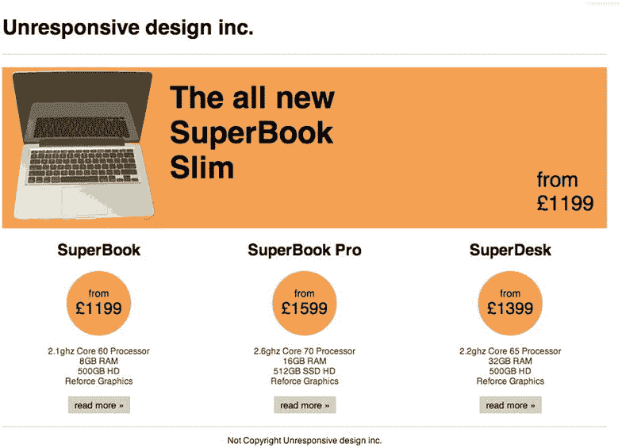

图 6-1。

The fixed width site that will be make responsive

### 定义断点

在查看了我想要修改以提高响应性的原始站点之后，我需要决定一组断点，使其能够在各种设备上工作。对于这个网站，我将添加两个断点:第一个是针对平板电脑等小型设备，第二个是针对手机等超小型设备。

对于第一个断点，我想尝试缩小现有的网站，以便它能舒适地适合小型设备。我想添加一个断点，以便当现有的网站不再适合在视窗中，它可以切换到网站的较小版本。为了实现这一点，断点需要在水平滚动条由于站点太宽而被迫出现之前中断。为此，我需要考虑到网站的宽度加上垂直滚动条的宽度。不幸的是，滚动条的宽度可以根据包括操作系统和浏览器在内的许多因素而变化，所以我将计算站点宽度加上`20px`的断点。这意味着，对于这个特定的站点，该站点将在`1000px`有一个断点。当我在这个例子的后面提到这个断点时，我将把它称为小断点。此断点的代码是:

`@media screen and (max-width: 1000px){`

`}`

下一个断点需要以移动设备为目标。由于设备种类繁多，尺寸和屏幕分辨率各不相同，很难说平板电脑尺寸的界限和移动设备尺寸的界限。因此，在使用媒体查询确定将什么归类为移动设备时，您需要做出判断。一个很好的起点是查看您希望支持的一些平板电脑的纵向宽度。最容易找到这些信息的地方是 [`www.viewportsizes.com`](http://www.viewportsizes.com/) ，它允许你找到关于不同视窗宽度的信息。使用这个站点，您可以查看一些最常见的平板电脑的视窗宽度，以确定您想要将什么定义为移动断点。你可能会看到苹果的 iPad，其纵向视窗宽度为`768px`，以及微软的 Surface，其纵向视窗宽度也为`768px`。因此，如果`768px`对于平板电脑来说很常见，您可以将移动设备的断点设置为`767px`，因为这比平板电脑少 1px。当我在这个例子的后面提到这个断点时，我将把它称为额外的小断点。此断点的代码是:

`@media screen and (max-width: 767px){`

`}`

### 排印

现有的排版对于大多数设备来说是一个很好的尺寸，但是，对于超小型设备来说就有点太大了，所以你需要给你的标题添加一些样式。为此，您需要查看已经使用的基本字体大小，以便能够正确计算字体大小值。这方面的代码应该是:

`@media screen and (max-width: 767px){`

`h1{`

`font-size: 22px;`

`font-size: 1.571em;`

`}`

`h2{`

`font-size: 18px;`

`font-size: 1.286em;`

`}`

`}`

### 包装材料

调整了字体大小后，现在需要调整包装的宽度，使其不会超出设备视窗的边界。为此，您需要决定您的站点应该如何跨越您定义的不同断点。第一个断点是小断点，它被定义为具有`1000px`的`max-width`。如前所述，这是针对现有桌面站点和移动站点之间的设备的断点。对于这个断点，您可以将站点包装器的宽度设置为`710px`，因为站点需要在从`768px`到`1000px`的视口中工作，这包括滚动条。你还需要考虑 20px 左右的填充。此断点的代码应该是:

`@media screen and (max-width: 1000px){`

`.wrapper{`

`width: 710px;`

`}`

`}`

当你下到额外的小视口时，让站点有一个流动的宽度是有意义的。这有几个原因，首先是在这些较小的设备上，您想要尝试利用浏览器视窗宽度的每个像素来显示内容，并且您不能承受在边缘周围有多余的空间。第二个原因是在`320px`和`767px`之间，用于查看网站的屏幕宽度有很大的变化。因此，您需要尝试为所有这些宽度提供优化的体验。为了使您能够在这些额外的小视口设备上制作包装流体，您需要将宽度设置为 100%。设置后，您会注意到包装器仍然比视口宽。这是因为您对包装应用了填充。为移动站点保留这种填充是有意义的，因此与其删除它，不如使用`box-sizing`属性允许你在 100%宽度中包含填充。在第 4 章的[中，我讨论了对通用(*) CSS 选择器应用盒子大小；不幸的是，因为这是一个现有的代码库，所以在全球范围内应用是不实际的，因为您可能会破坏一些现有的样式。这就是为什么当你修改现有的 CSS 时，你应该根据具体情况来调整盒子的大小。超小视口包装器的最终样式是:](04.html)

`@media screen and (max-width: 767px){`

`.wrapper{`

`width: 100%;`

`-moz-box-sizing: border-box;`

`-webkit-box-sizing: border-box;`

`box-sizing: border-box;`

`}`

`}`

### （电视机的）超大屏幕

如果在我进行的过程中，你和我一起测试过你的浏览器，你会注意到超大屏幕目前正在扩展到网站的包装之外。如果您查看大屏幕的现有 CSS 来了解为什么会发生这种情况，您将会看到大屏幕的宽度被设置为`940px`。显然，媒体查询需要根据不同设备上的大屏幕显示效果进行调整。

对于这个小断点，您只需要调整大屏幕的大小，使其适合包装器。因为包装器是`710px`宽，您需要使用以下代码调整大屏幕以匹配`710px`宽:

`@media screen and (max-width: 1000px){`

`.jumbotron{`

`width: 710px;`

`}`

`}`

然而，当遇到额外的小断点时，你需要做更彻底的改变，因为大屏幕的内容将不再适合现有的布局。您需要调整布局，以便在一个额外的小设备上观看时，大屏幕上的内容可以堆叠起来。要实现这一点，第一步是设置大屏幕，使其填充包装纸，让包装纸填充任一侧:

`@media screen and (max-width: 767px){`

`.jumbotron{`

`width: 100%;`

`height: auto;`

`text-align: center;`

`padding: 20px 0;`

`}`

`}`

如果你看一看大屏幕的原始位置，你会看到里面的元素都被绝对定位，这意味着在改变宽度和改变高度为`auto`之后，这个网站看起来真的很破。这可以通过重置元素的位置和宽度来解决:

`@media screen and (max-width: 767px){`

`.jumbotron img,`

`.jumbotron p,`

`.jumbotron h2,`

`.jumbotron .roundal,`

`.jumbotron .roundal span{`

`position: static;`

`left: auto;`

`right: auto;`

`bottom: auto;`

`top: auto;`

`width: auto;`

`}`

`}`

让超大屏幕在这些超小型设备上看起来合适的最后一步是调整标题文本，使字体大小更适合移动设备。此外，为了使标题文本不会靠近大屏幕的边缘，您可以在标题文本中添加填充:

`@media screen and (max-width: 767px){`

`.jumbotron h2{`

`font-size: 22px;`

`font-size: 1.375em;`

`padding: 10px 20px;`

`}`

`}`

如果你现在看着超小型设备上的大屏幕，你会看到信息更加清晰(见图 [6-2](#Fig2) )。

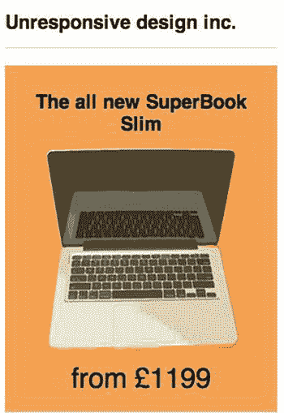

图 6-2。

Our slimmed down site for the Jumbotron

### 制品

下一步是调整产品，使它们在各种断点处看起来都很棒。首先，你应该从决定它们在小型设备上的外观开始。要确定这一点，您需要考虑现有内容是否适合现有结构，或者您是否需要调整布局。调整布局可能很简单，只需将三列布局改为两列布局，也可能意味着将布局改为宽度可变的单列。然而，在这个例子中，在这个小的断点上，通过简单地将三个产品元素的宽度改为`223px`，现有的布局和内容可以很好地适应现有的三列结构:

`@media screen and (max-width: 1000px){`

`.product{`

`width: 223px;`

`}`

`}`

调整小型设备以继续使用三列，尽管宽度更小，下一步是研究如何调整产品元素以在超小型设备上工作。此时，视口变得太小，无法继续在三列中显示产品，当使用额外的小断点时，您使用的是一个流体宽度，因此有必要更改产品元素，使它们不再在列中，而是相互堆叠。为此，您需要将产品元素的宽度调整为 100%。此外，您可能希望确保产品之间有一个清晰的分隔线，这可以通过填充和边框来实现:

`@media screen and (max-width: 767px){`

`.product{`

`width: 100%;`

`padding: 20px 0px;`

`border-top: 1px solid #ccc;`

`}`

`}`

添加了填充和边框后，第一个产品现在在顶部有了一个额外的边框和额外的填充，因此您可以使用`:first-child`选择器来定位第一个产品并移除多余的填充和边框:

`@media screen and (max-width: 767px){`

`.product:first-child{`

`border-top: 0px;`

`padding-top: 0px;`

`}`

`}`

类似地，在最后一件产品下面显示了额外的多余填充，因此可以通过使用`:last-child`选择器瞄准最后一件产品并移除多余的填充来移除:

`@media screen and (max-width: 767px){`

`.product:last-child{`

`padding-bottom: 0px;`

`}`

`}`

如果你现在看看这些产品是如何堆叠的，你会注意到它们工作得相当好，如图 [6-3](#Fig3) 所示。

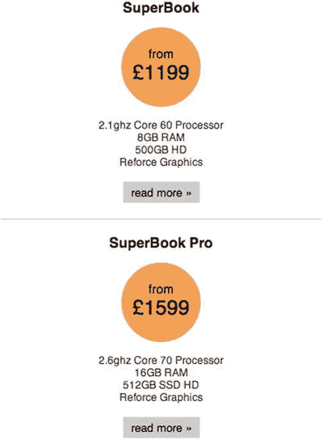

图 6-3。

Slimmed down product panels

### 结论

在对站点进行适应性修改后，您现在拥有了一个可以在各种不同设备上运行的站点。以这种方式修改网站既有好处也有坏处，我现在将讨论它们，这样当涉及到您自己的网站时，您可以决定简单地修改您现有的网站是否适合您的需要。

当你调整大屏幕时，你可能已经注意到了一个主要问题，那就是当你把网站降级到更小的设备上时，你有时需要覆盖大量的样式来为移动设备提供良好的体验。虽然在这个例子中它相对简单，但是一个更大的站点可能需要你做更多的样式覆盖。无论您是先在移动设备上工作，还是先在桌面上工作，您总是会覆盖上一个断点的一些样式。通常一个移动优先的站点是建立在每个断点已经存在的基础上的，但是像这样一个桌面优先的站点，有时必须将值重置回它们的浏览器默认值会使代码库更加臃肿。

在这个例子中，简单地修改站点的好处是桌面站点的样式不需要改变，这意味着焦点可以是正在添加的新断点。这不仅节省了开发时间，还有助于简化测试，因为我们知道，在大多数情况下，我们发现的错误会被引入到我们的媒体查询中。

## 重构

改造现有网站的第二种方法是首先重构现有的代码库，使其具有可移动性。这里的好处是，你不必从头开始的风格。您还可以对网站设计进行调整，并在重构过程中删除多余的代码。

### 定义断点

作为站点重构的第一步，您需要在面向大型设备的媒体查询中包装当前用于样式化站点的现有样式，例如站点已经支持的桌面浏览器。要为此选择合适的媒体查询，请查看网站的现有样式以确定其宽度。如果你看看我们正在制作的示例站点的代码，你会看到主包装器有`940px`宽，加上左右两边的`20px`填充，总共有`980px`宽。考虑到滚动条，因此您将设置媒体查询来检查最小宽度`1024px`:

`@media screen and (min-width: 1024px){`

`}`

使用这个媒体查询来包装现有的样式，没有样式被应用到宽度小于`1024px`的任何视口。从这一点开始，我将把这个断点称为中间断点。

您还希望能够调整站点，以在比站点当前支持的更大的视口尺寸上工作，在这种情况下，您需要添加一个针对这些更大视口的额外断点:

`@media screen and (min-width: 1200px){`

`}`

除了已经定义的较大媒体查询之外，您可能还想为小型设备(如平板电脑)添加一个额外的媒体查询。此媒体查询将使您能够利用平板设备提供的较大视窗，为此，您将把 iPad 的较小宽度作为这些小型设备的突破点:

`@media screen and (min-width: 768px){`

`}`

### 重构现有样式

定义了断点之后，现在可以重构现有的样式了。您已经将所有现有的样式移动到一个断点中，因此这意味着在小于`1024px`的设备上，将不会显示任何样式，如图 [6-4](#Fig4) 所示。

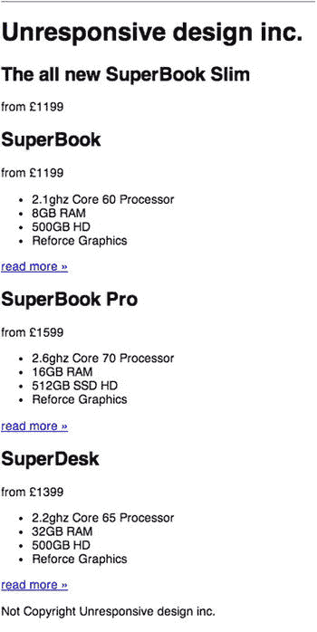

图 6-4。

No styles are shown on smaller devices

此时，您可以开始迁移当前针对较大州的样式，以便它们可以在全球范围内使用。您可以很容易地找出全球可用的样式，这些样式应用了不管断点如何都会使用的字体和通用间距。

在示例站点的情况下，站点使用默认的浏览器字体，所以不需要修改字体。该站点不对元素类型应用任何通用间距，但是有一个用于清除浮动的`clearfix`助手类。这对于在媒体查询之外可用是有意义的，因为在较小的设备上也需要它。

移动任何通用样式后，下一步是查看站点的不同部分，看看可以在哪里获取现有样式并将其应用到较小的视口，在此过程中重构它们。

让我们从站点的主包装器开始这个重构过程。应用的填充和边距可以很容易地从媒体查询中提取出来。其他样式特定于较大的视口尺寸，因此让我们将它们留在原来的位置:

`.wrapper{`

`padding: 0 20px 20px;`

`margin: 0 auto;`

`}`

#### 页眉

下一步是查看标题样式，看看哪些样式可以用于较小的设备。在本例中，应用于页眉的现有样式只是间距和底部边框。将它们从媒体查询中移出是有意义的，这样它们就可以被其他视口大小访问。将要移动的样式如下所示:

`.global-header{`

`margin: 0 0 20px;`

`border-bottom: 1px solid #ccc;`

`}`

如果您在浏览器中查看标题，您会看到它现在已经应用了一些基本样式。但是，由于在此阶段没有对字体大小进行任何处理，标题文本显得相当大(如图 [6-5](#Fig5) 所示)。

图 6-5。

The site header, with no font sizes applied

为了纠正这一点，让我们向`h1`元素添加样式，以设置字体大小并使文本居中对齐:

`h1{`

`font-size: 1.4em;`

`text-align: center;`

`}`

现在，当你在浏览器中查看时，字体大小更适合较小的视窗，如图 [6-6](#Fig6) 所示。

图 6-6。

The site header, with the font size and alignment applied

#### （电视机的）超大屏幕

这个网站的下一个需要关注的元素是大屏幕。大屏幕的原始 CSS 有 35 行长，大部分只适用于较大的视窗宽度，所以仔细看看什么是合适的是很重要的。为此，我在下面包含了原始的超大屏幕 CSS，并突出显示了您可能想要用作较小设备上的超大屏幕的起点的行:

`.jumbotron{`

`position: relative;`

`background: #f4a156;`

`width: 940px;`

`height: 250px;`

`margin-bottom: 20px;`

`}`

`.jumbotron img{`

`position: absolute;`

`left: 0px;`

`top: 0px;`

`}`

`.jumbotron h2{`

`position: absolute;`

`left: 260px;`

`top: 20px;`

`font-size: 3em;`

`width: 300px;`

`margin: 0px;`

`}`

`.jumbotron .roundal{`

`position: absolute;`

`right: 0px;`

`bottom: 0px;`

`}`

`.jumbotron .roundal span{`

`position: absolute;`

`right: 20px;`

`bottom: 20px;`

`font-size: 2em;`

`}`

从上面选取 CSS 中突出显示的行，然后就剩下生成的 CSS:

`.jumbotron{`

`background: #f4a156;`

`margin-bottom: 20px;`

`}`

`.jumbotron h2{`

`margin: 0px;`

`}`

如果你现在在浏览器中查看大屏幕，你会看到你已经有了样式的开始，如图 [6-7](#Fig7) 所示。

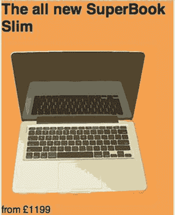

图 6-7。

The Jumbotron with this base CSS in place

您将会注意到，大屏幕的橙色背景并没有像您预期的那样在整个视窗中延伸。这是因为您使用的包装器在站点的两侧应用了一致的间距。为了使您能够保持一致的间距，但将背景扩展为全幅，您可以使用负边距。要在大屏幕上添加一致的间距，只需应用填充即可。此外，您可能希望文本居中对齐。这显示在下面的 CSS 中:

`.jumbotron{`

`background: #f4a156;`

`margin:  0 -20px 20px;`

`padding:  20px;`

`text-align: center;`

`}`

字体大小也特别大。这是因为第二级标题的字体大小尚未针对较小的视窗进行设置，因此它们现在应该设置为适当的大小。既然一级标题设置为 1.4em，那么二级标题也应该设置为`1.3em`。您也不希望在超大屏幕中的第二级标题上方有额外的间距，所以专门为这个超大屏幕将页边距顶部设置为`0px`。

`h2{`

`font-size: 1.3em;`

`}`

`.jumbotron h2{`

`margin-top: 0px;`

`}`

在这个位置，大屏幕现在看起来是完整的，如图 [6-8](#Fig8) 所示。

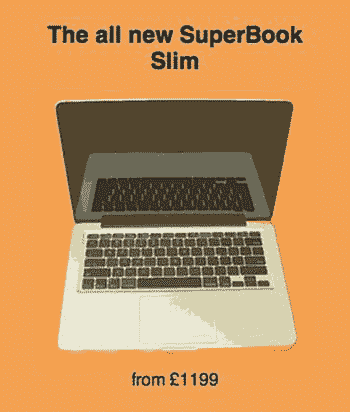

图 6-8。

The complete Jumbotron

#### 产品面板

下一步是为产品面板构建样式。用于较大视口中这些面板的大多数样式也可以用于较小视口中这些面板的样式。和以前一样，我突出显示了下面的 CSS 代码行，这些代码行可用于简单地将其移出媒体查询:

`.product{`

`float: left;`

`width: 300px;`

`padding-left: 20px;`

`text-align: center;`

`}`

`.product:first-child{`

`padding-left: 0px;`

`}`

`.product .roundal{`

`width: 100px;`

`height: 75px;`

`margin: 0 auto;`

`background: #f4a156;`

`border-radius: 50px;`

`padding-top: 25px;`

`}`

`.product .roundal span{`

`display: block;`

`font-size: 1.6rem;`

`}`

`.product ul{`

`padding: 0px;`

`}`

`.product li{`

`list-style: none;`

`font-size: 0.8rem;`

`color: #333;`

`}`

`.product a{`

`font-size: 0.9rem;`

`color: #000;`

`text-decoration: none;`

`display: inline-block;`

`background: #ccc;`

`padding: 5px 10px;`

`border-radius: 2px;`

`}`

`.product a:hover, .product a:focus, .product a:active{`

`background: #999;`

`color: #eee;`

`}`

`.product *:first-child{`

`margin-top: 0px;`

`}`

`.product *:last-child{`

`margin-bottom: 0px;`

`}`

将突出显示的 CSS 移到媒体查询之外后，现在需要添加一些额外的填充和边框来完成产品面板。为了使边框两边都有间距，在每个产品面板的顶部和底部添加 20px 的填充。然后将边框应用到产品面板的底部:

`.product{`

`text-align: center;`

`padding: 20px 0px;`

`border-bottom: 1px solid #ccc;`

`}`

这样，确保你在第一个面板上没有太多的空间。仅移除第一个产品面板的衬垫，这将使用`:first-child`选择器进行定位:

`.product:first-child{`

`padding-top: 0px;`

`}`

准备好之后，看看产品面板在浏览器中的样子，如图 [6-9](#Fig9) 所示。

图 6-9。

The product panels on a smaller device

你需要看的 CSS 的最后一部分是页脚。让我们从查看当前应用于更大的媒体查询中的页脚的 CSS 开始。我突出显示了 CSS 中有意义的行，以便将其置于媒体查询之外，这样它就可以应用于额外的小视窗及以上:

`.global-footer{`

`margin: 20px 0;`

`border-top: 1px solid #ccc;`

`}`

`.global-footer p{`

`text-align: center;`

`font-size: 0.8rem;`

`}`

不需要为页脚再写任何 CSS，完成的页脚如图 [6-10](#Fig10) 所示。

图 6-10。

The finished footer on extra small devices

### 针对不同的断点

在这一点上，该网站在超小型设备上运行良好，但我们还没有考虑它在小型或大型设备上的外观。也有可能是因为添加了新的样式，我们打破了原来的(中等)布局。让我们先把浏览器的宽度增加到一个小设备的大小，看看网站看起来怎么样，如图 [6-11](#Fig11) 所示。

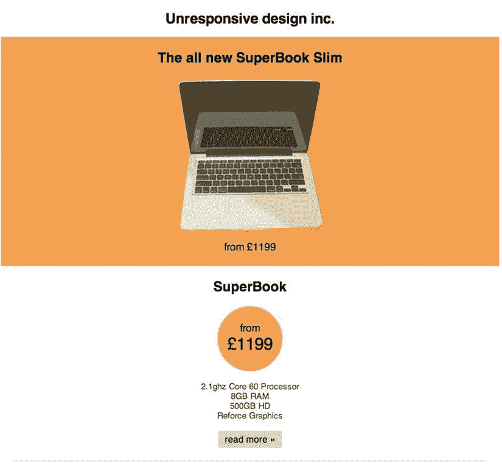

图 6-11。

The site shown on a small device

现在，在小型设备上看到网站的样子后，您会注意到堆叠的产品面板周围有很多空间，可以通过将产品一个接一个地排成一行来更好地利用这些空间。这与原始无响应站点的行为方式相同，但是，您可以应用一个流体宽度，而不是为产品面板设置一个固定的宽度。因为这里需要三列，所以可以将宽度设置为`33.33%`。要让面板并排放置，请应用一个浮动并移除元素顶部的填充。最终的代码如下所示:

`.product{`

`width: 33.33%;`

`padding-top: 0px;`

`float: left;`

`}`

如果你在你的浏览器中检查这个，面板现在应该是并排的，如图 [6-12](#Fig12) 所示。

图 6-12。

The product panels on a small device

如果您继续增加视窗大小，直到达到中等视窗宽度，您会注意到站点的页眉和超大屏幕都被破坏了。这是因为您应用于早期断点的样式。我已经在图 [6-13](#Fig13) 中展示了割台和大屏幕是如何损坏的。

图 6-13。

The medium breakpoint with the broken Jumbotron

作为重构的一部分，您可以选择对网站的设计进行修改，在本例中，您将对页眉和大屏幕都进行修改。第一步，看表头；目前 CSS 已经将样式应用于`h1`使其向左浮动，CSS 是:

`.global-header h1{`

`float: left;`

`}`

如果不想让它向左浮动，可以去掉这个样式。然而，你想增加字体大小，但是你用和移动站点一样的方式应用字体大小是有意义的，移动站点直接在`h1`上。更改字体大小的新样式如下所示:

`h1{`

`font-size: 2rem;`

`}`

有了这个地方，下一步是看大屏幕。首先，让我们看看当前应用于大屏幕的 CSS。第一部分是包含大屏幕主元素的 CSS，这个元素上的类是`jumbotron`。现有的 CSS 是:

`.jumbotron{`

`position: relative;`

`width: 940px;`

`height: 250px;`

`}`

正如你会注意到的，大屏幕有一个定义为`940px`宽的值集。因为我们希望大屏幕始终与包装一样宽，所以您可以简单地删除宽度，这样 CSS 现在看起来就像:

`.jumbotron{`

`position: relative;`

`height: 250px;`

`}`

下一步是定位图像。虽然您可以重构 HTML 来使用基本的网格并使用它来构建超大屏幕，但为了简单起见，让我们简单地使用绝对定位来定位超大屏幕的内容。现有样式当前定位图像，因此它绝对位于左上角:

`.jumbotron img{`

`position: absolute;`

`left: 0px;`

`top: 0px;`

`}`

但是我们想把图像放在大屏幕中心的左边。为此，您应该将选择器的 left 属性的值设置为 50%。然后，您可以使用与图像宽度相等的负边距将其向左拉。您还想将顶部向下凸起，给它一点额外的空间，所以让我们将顶部设置为 20px:

`.jumbotron img{`

`position: absolute;`

`left: 50%;`

`top: 20px;`

`margin-left: -250px;`

`}`

下一步是设计大屏幕的标题。它目前的样式绝对定位它，所以它坐在旁边的图像的原始位置。因为我们改变了图像的位置，所以您还需要调整标题的位置，使其仍然位于图像旁边。要做到这一点，请将标题放在大屏幕中心的右侧。当前的 CSS 是:

`.jumbotron h2{`

`position: absolute;`

`left: 260px;`

`top: 20px;`

`font-size: 3rem;`

`width: 300px;`

`margin: 0px;`

`}`

要获得想要的效果，只需更改左侧，使其为 50%:

`.jumbotron h2{`

`position: absolute;`

`left: 50%;`

`top: 20px;`

`font-size: 3rem;`

`width: 300px;`

`margin: 0px;`

`}`

下一步是在大屏幕上定位定价。您希望它出现在标题文本的下方，所以让我们使用相同的技术来使文本偏离中心。我们已经在使用绝对定位，所以你只需要改变位置。现有的 CSS 是:

`.jumbotron .roundal{`

`position: absolute;`

`right: 0px;`

`bottom: 0px;`

`}`

首先，将左侧的定位设置更改为 50%，然后将底部设置更改为`50px`。这将使文本直接位于标题下方。更新位置后，增加字体大小使其更加突出，在这种情况下，让我们将字体大小增加到`2rem`:

`.jumbotron .roundal{`

`position: absolute;`

`left: 50%;`

`bottom: 50px;`

`width: 300px;`

`font-size: 2rem;`

`}`

最后，您可以简单地删除下面的样式，这些样式最初定位在`roundel`内的跨度，但是不再需要:

`.jumbotron .roundal span{`

`position: absolute;`

`right: 20px;`

`bottom: 20px;`

`font-size: 2rem;`

`}`

调整了标题样式和大屏幕样式后，让我们在浏览器中查看它们，如图 [6-14](#Fig14) 所示。

图 6-14。

The completed header and footer

除了页眉和大屏幕，网站的页脚也有问题，因为它有一个额外的边框显示，如图 [6-15](#Fig15) 所示。

图 6-15。

The double border issue on the medium breakpoint

这是因为产品的底部添加了边框，但是较大的视窗的页脚顶部已经添加了边框。要解决此问题，只需从样式表中删除以下样式:

`.global-footer{`

`margin: 20px 0;`

`border-top: 1px solid #ccc;`

`}`

现在，如果你在浏览器中再次查看，你会看到这条线已经被删除，如图 [6-16](#Fig16) 所示。

图 6-16。

The fixed footer for the medium breakpoint

这完成了中等断点，但是作为使站点响应的一部分，您还想利用较大显示器上的可用空间。前面我讨论了用于实现这一点的媒体查询，但是现在让我们来看看调整站点所需的 CSS。

因为到目前为止构建的所有东西在固定宽度的包装器中都是流动的，所以只需改变这个包装器的宽度，就可以为更大的视口调整站点。在某些情况下，您可能想通过做更多的事情来利用额外的空间，但是对于这个例子，让我们简单地调整包装器。当大断点在`1200px`处中断时，您会希望将包装器的宽度设置为`1170px`宽，以便为滚动条留出空间。为此，只需将以下 CSS 放入大型媒体查询中:

`.wrapper{`

`width: 1170px;`

`}`

加载完成后的页面，视口大于等于`1200px`将显示新的更宽的站点，如图 [6-17](#Fig17) 所示。

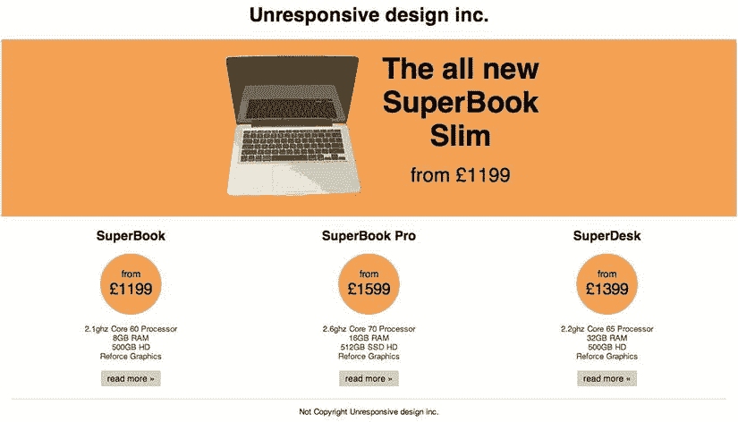

图 6-17。

The completed refactored site shown on a large viewport

## 全 Reskin

修改现有网站的第三种方法是保留现有的大部分 HTML，但是抛弃现有的 CSS，重新开始。

选择使用完整的 reskin 方法有好处也有坏处，关键的好处是，通过重新启动 CSS 并根据需要重构 HTML，您可以克服在站点的生命周期中可能已经蔓延到 CSS 中的任何低效问题。此外，因为您将替换现有的 CSS，所以您可以采用移动优先、渐进增强的方法，首先为较小的移动设备构建站点，然后根据设备功能集和视口大小增强站点。

### 准备

作为一个完整的 reskin，第一步是清除原始样式，看看还剩下什么。通过删除核心样式，你只剩下简单的内容。如果你在浏览器中查看，你会看到文档的轮廓非常清晰，如图 [6-18](#Fig18) 所示。

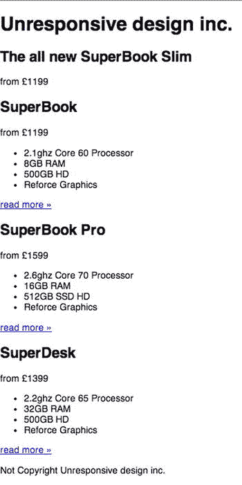

图 6-18。

The initial site with the original styles removed

这仍然很容易理解的部分原因是正确地使用了标题标签，所以尽管网站只有浏览器默认样式，内容仍然有一个强大的、清晰的标题层次结构。当你看你自己的网站时，你可能会注意到你的一些标题似乎没有遵循一个适当的层次结构。这是一个很好的机会来看看如何重构你的标题，让它们为用户提供一个合适的页面层次结构。为了演示不恰当的层次结构可能会是什么样子，我整理了一个例子，如图 [6-19](#Fig19) 所示。

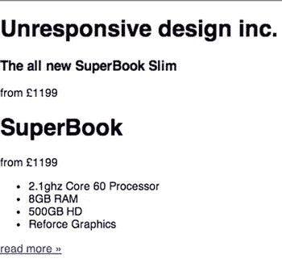

图 6-19。

An example of a page with an improper hierarchy

页面遵循清晰的层次结构非常重要，原因有很多，其中最重要的原因是这样可以让用户更容易访问页面，尤其是那些使用屏幕阅读器的用户，他们可能会依赖页面的层次结构来浏览内容。标题层次结构很重要的另一个原因是，它使我们能够轻松地应用与正确的标题元素相匹配的样式。

### 常规样式

在开始核心的编码之前，让我们首先改变元素的默认盒子模型。这是通过使用`box-sizing` CSS3 属性实现的，该属性在[第 4 章](04.html)中介绍过，并使用 CSS 通用选择器(*)将其应用于所有元素:

`* {`

`-webkit-box-sizing: border-box; /* Safari/Chrome, other WebKit */`

`-moz-box-sizing: border-box;    /* Firefox, other Gecko */`

`box-sizing: border-box;         /* Opera/IE 8+ */`

`}`

通过将值设置为`border-box`，您将移动元素内部的边框和填充，允许您使用宽度的百分比值，同时仍然使用填充的`px`值。早先当我们修改 CSS 的时候，由于破坏现有风格的可能性，我们不能很容易地将这种技术应用到 CSS 中。当重新划分一个站点时，你不会有这个问题，因为你可以基于你选择实现的盒子模型来构建所有的样式。

### 定义断点

重要的是要计划在什么时候使用媒体查询来定义断点。因为您首先构建的是移动站点，所以您会根据设备视口的宽度在每个断点处逐步增强站点。因此，每个断点都应该尝试建立在前一个断点之上。首先构建 mobile 意味着不包含在任何媒体查询中的基本 CSS 是针对超小型设备的 CSS。考虑到这一点，您将需要定义三个断点，每个断点使用一个合理的最小宽度值。

要定义的第一个断点是最小宽度`768px`。这将允许您以从`768px`开始的视口宽度瞄准设备。这种选择背后的原因是，这通常是纵向平板电脑的起点，随着平板电脑获得更大的屏幕和更宽的视窗，您可以利用这一点来增强网站。当后面提到这个断点时，我称它为小断点:

`@media screen and (min-width: 768px){`

`}`

要定义的第二个断点是最小宽度`1000px`，目的是针对大量用户使用的非常流行的 1024×800 屏幕分辨率。虽然前面的断点可以假设大多数用户将使用某种平板电脑，但该断点在平板电脑和台式机之间共享，因此不能用于做出这种假设。以后提到这个断点时，我称之为中断点:

`@media screen and (min-width: 1000px){`

`}`

要定义的最后一个断点是最小宽度`1200px`。正如本书前面所讨论的，随着更大显示器的增长，利用额外的可用空间是有意义的。当稍后提到这个断点时，我将它称为大断点:

`@media screen and (min-width: 1200px){`

`}`

### 排印

一旦你对断点满意了，让我们开始对排版应用合理的默认尺寸。第一步是设置页面的基本字体大小。为此，一个合理的默认大小是`14px`，它在 HTML 标签上设置为百分比:

`html{`

`font-size: 87.5%;`

`}`

设置默认字体大小会影响网站上的所有文本，但是，您可能希望为标题设置自己的自定义字体大小:

`h1{`

`font-size: 22px;`

`font-size: 1.571rem;`

`}`

`h2{`

`font-size: 18px;`

`font-size: 1.286rem;`

`}`

您可能已经注意到，对于`h1`和`h2`选择器，我已经定义了两次字体大小属性，第一次使用像素值，第二次声明使用`rem`中的值。这样做的原因是您想要使用`rem`(也称为相对 em)，因为它们是相对于默认字体大小的。然而，这并不是所有的浏览器都支持的，所以作为一个后备，我用像素来定义字体大小。这种方法的缺点是，在不支持`rem`的旧浏览器中，基于文本大小的缩放将不起作用，然而，整页缩放仍将起作用，这意味着使用这些旧浏览器的人仍然可以使用该网站。

定义了移动 CSS 之后，让我们为更大的设备增加字体大小。您将通过向小型媒体查询添加增加的字体大小来实现这一点，因为您正在使用`min-width`，所以它将应用于所有大于它的断点:

`@media screen and (min-width: 767px){`

`h1{`

`font-size: 28px;`

`font-size: 2rem;`

`}`

`h2{`

`font-size: 24px;`

`font-size: 1.714rem;`

`}`

`}`

### 包装材料

您可能已经知道，HTML 包含一个带有类`wrapper`的`div`元素，它封装了站点的 HTML。在被替换的站点的原始 CSS 中，这被用来定义站点的宽度并使其在页面上居中。但是，对于移动设备，您不希望设置宽度，因为您希望包装器是流动的。但是，您确实希望对站点的两侧应用一致的间距，因此您可以为此使用包装器。这可以通过在包装的左右两边增加空白来分隔页面来实现:

`.wrapper{`

`margin: 0 20px;`

`}`

在包装器中添加了页边距后，网站内容的左右两边将会有`20px`页边距。尽管流体宽度非常适用于超小型设备，但您希望在小型设备上设置固定的宽度，并且还希望在视口中居中固定的宽度设计，这可以通过使用边距来实现:

`@media screen and (min-width: 767px){`

`.wrapper{`

`width: 740px;`

`margin: 0px auto;`

`}`

`}`

为小型设备设置了宽度后，当到达中等断点时，您会发现为小型断点设置的宽度留下了大量的可用空间。因此，在这些中等尺寸的显示器上使站点更宽是有意义的:

`@media screen and (min-width: 1000px){`

`.wrapper{`

`width: 980px;`

`}`

`}`

最后，您希望能够利用更大显示器提供的额外空间，因此让我们再次增加包装的宽度。在这种情况下，我选择使用最小宽度的断点`1200px`。这是为了确保浏览器不显示水平滚动条。让我们将站点的宽度设置为`1170px`，以允许浏览器的滚动条:

`@media screen and (min-width: 1200px){`

`.wrapper{`

`width: 1170px;`

`}`

`}`

### 页眉

看了网站的版式和包装，让我们继续设计网站的标题。在超小型设备上，我们希望在标题底部有一个跨越视口宽度的边框。然而，当包装器的边距设置为`20px`时，页眉自然不会跨越 100%的视口。要解决这个问题，让我们使用负边距将标题的宽度拉至视窗的全宽。然后，您可以使用填充将此间距添加到页眉的内部，然后将边框添加到页眉的底部:

`.global-header{`

`border-bottom: 1px solid #ccc;`

`margin: 0 -20px;`

`padding: 0 20px;`

`}`

对于较大的视口，您可能需要删除这些额外的间距:

`@media screen and (min-width: 767px){`

`.global-header{`

`margin: 0px;`

`padding: 0px;`

`}`

`.global-header h1{`

`text-align: left;`

`}`

`}`

### （电视机的）超大屏幕

标题的正下方是大屏幕，用来突出显示我们虚构的公司 responsive design inc .想要推广的最新产品。这个面板应该很突出，所以让我们添加一个橙色的背景色，同时拉出大屏幕，使其适合视窗的整个宽度:

`.jumbotron{`

`background: #f4a156;`

`margin: 0 -20px;`

`padding: 20px;`

`text-align: center;`

`}`

接下来，让我们为大屏幕中显示的标题元素添加一些样式，使其顶部没有任何边距:

`.jumbotron h2{`

`margin-top: 0px;`

`}`

最后，让我们来设计一下大屏幕上突出显示的这款产品的价格。为此，让我们简单地增加字体大小，使其更加突出:

`.jumbotron .roundal{`

`font-size: 18px;`

`font-size: 1.286rem;`

`}`

如果你现在在浏览器中加载网站，你将能够看到风格化的大屏幕，如图 [6-20](#Fig20) 所示。

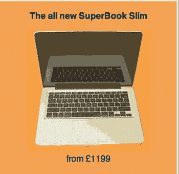

图 6-20。

The newly styled Jumbotron

现在让我们将它应用到更大的设备上。要达到想要的效果，还是用绝对定位吧。为此，您需要将高度和元素设置为`position: relative`:

`.jumbotron{`

`margin: 0px;`

`height: 290px;`

`position: relative;`

`}`

下一步是定位图像。您希望大屏幕中的所有内容都在中央，所以让我们将其设置为左侧 50%，然后使用`margin-left`添加偏移。在这种情况下，图像的宽度为 250 像素，所以您希望它偏离中心 20 个像素，在这种情况下，偏移量为-270 像素:

`.jumbotron img{`

`position: absolute;`

`left: 50%;`

`margin-left: -270px;`

`}`

同样，标题需要居中，然后使用`margin-left`偏离中心。尽管图像向左偏离中心，但文本将向右偏离中心。让我们也增加字体大小:

`.jumbotron h2{`

`position: absolute;`

`left: 50%;`

`margin-left: 20px;`

`width: 250px;`

`font-size: 42px;`

`font-size: 3rem;`

`text-align: left;`

`}`

最后，我们来定位价格。这应该与标题对齐，但更靠近大屏幕的底部:

`.jumbotron .roundal{`

`position: absolute;`

`left: 50%;`

`margin-left: 20px;`

`bottom: 40px;`

`font-size: 28px;`

`font-size: 2rem;`

`}`

现在，如果你看看大屏幕是如何出现在更大的设备上的，它看起来会如图 [6-21](#Fig21) 所示。

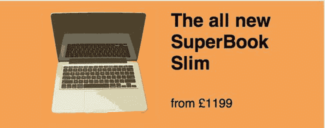

图 6-21。

The Jumbotron as seen on larger devices

### 制品

产品是这个网站的核心部分，所以用一种清晰简洁的方式向用户展示它们是很重要的。已经有 HTML 列出了产品名称和规格的价格，但是，您需要对其进行样式化，以便它在超小型设备上运行良好。在这些设备上，产品可以堆叠在一起，这样用户就可以上下滚动来查看不同的产品。由于每个产品都是一个`div`，这是一个块级元素，所以每个产品自然都是全幅堆叠的。但是运用风格来分隔产品也很重要。最后，您可以将文本居中对齐，以与页眉和大屏幕的样式保持一致:

`.product{`

`text-align: center;`

`margin: 20px 0;`

`border-bottom: 1px solid #ccc;`

`padding-bottom: 20px;`

`}`

确定了产品之后，下一步是设计产品的价格。为此，您可以使用一个`roundal`。为了实现这一点，让我们将`roundal`的样式设为`100px`宽，高度将由`70px`的高度和`30px`的顶部填充组成。圆形效果将通过给它一个橙色的背景色和`50px`的边框半径来实现。最后，这将使用边距居中对齐。为了以更大的字体显示价格，将 span to be display 块(强制换行)的字体大小设置为`1.6rem`:

`.product .roundal{`

`width: 100px;`

`height: 100px;`

`margin: 0 auto;`

`background: #f4a156;`

`border-radius: 50px;`

`padding-top: 30px;`

`}`

`.product .roundal span{`

`display: block;`

`font-size: 1.6rem;`

`}`

接下来，您可能想要添加产品的样式规范。首先，让我们删除浏览器应用于列表的默认填充，然后删除项目符号，因为在列出规范时不需要它们:

`.product ul{`

`padding: 0px;`

`}`

`.product li{`

`list-style: none;`

`}`

下一步是设计 read-more 链接。这应该是一个按钮，所以让我们来设计一下:

`.product a{`

`color: #000;`

`text-decoration: none;`

`display: inline-block;`

`background: #ccc;`

`padding: 0px 10px;`

`border-radius: 2px;`

`line-height: 40px;`

`}`

声明了按钮之后，您还想为按钮添加悬停、聚焦和活动状态。虽然您的第一想法可能是小型触摸屏设备不具备悬停功能，因为它们通常都有触摸屏，但您需要确保覆盖 CSS 中的所有内容，因为您无法知道用户是否正在使用触摸设备:

`.product a:hover, .product a:focus, .product a:active{`

`background: #999;`

`color: #eee;`

`}`

最后，您会注意到产品周围出现了额外的间距。这是由 product 元素中第一个和最后一个元素的边距造成的。您可以使用`first-child`和`last-child`选择器快速移除它们。这样做而不是直接设置元素样式的原因是，元素的顺序可能会改变，或者可能会添加新元素，无论元素是什么，CSS 都仍然适用:

`.product > *:first-child{`

`margin-top: 0px;`

`}`

`.product > *:last-child{`

`margin-bottom: 0px;`

`}`

将产品构建成堆栈后，您会发现无论浏览器的宽度如何，它们都工作得很好(见图 [6-22](#Fig22) ):

图 6-22。

Product stack works well regardless of browser

尽管流体宽度产品在所有视口尺寸下都工作良好，但在较大的视口中，您会注意到有很多空间。产品和其中元素的流动性意味着当指定产品元素的宽度时，它和其中的内容将继续以指定的宽度工作。这意味着，在较大的视窗上，您可以通过将产品放入栏中来利用额外的空间。要实现这一点，只需将产品元素的宽度设置为`33.333%`，这样产品就占据了可用宽度的三分之一:

`@media screen and (min-width: 767px){`

`.product{`

`float: left;`

`width: 33.333%;`

`}`

`}`

然后你可以看到这些列并排出现在浏览器中(见图 [6-23](#Fig23) )。

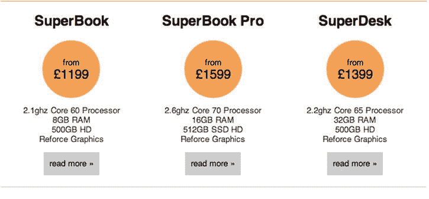

图 6-23。

Products line up side by side in browser

如果你用百分比来表示产品元素的宽度，它们会随着站点宽度的增加而增加。

### 页脚

reskin 的最后一个样式是页脚。这真的很简单，因为产品已经在产品和页脚之间提供了一个分隔符，所以你需要做的就是居中对齐文本，并在下面添加一点点间距:

`.global-footer{`

`text-align: center;`

`padding-bottom: 10px;`

`}`

这些样式不需要任何媒体查询来扩展，因为它们在包装器中是流动的。

### 结论

使用新的 CSS 重新设计站点后，您已经了解了如何首先构建移动版本，并在移动版本的基础上使用每个断点来构建一个可以简化的站点。

您还了解到，通过在超小型设备上构建流畅的元素，您可以在不同的断点对它们应用固定的宽度，然后您只需要应用最少的额外样式。

重要的是要记住，当你重新构建 CSS 时，你不一定需要一个完全相同的站点作为最终结果。对于你自己的网站，在你着手一个 reskin 之前，最好和你的设计师和 UX 团队讨论他们是否想对网站做一些调整，因为 reskin 是做这件事的最好时机。

## 摘要

这一章解释了如何修改一个现有的站点来响应。您学习了三种不同的技术来使站点具有响应性。

第一种使站点具有响应性的方法是修改现有的 CSS。改编现有 CSS 的主要好处是，它比执行完整的 reskin 要快得多。通过修改现有的 CSS，您已经有了一个开始的基础。另一方面，这可能是一个缺点，因为它会导致代码变得更加臃肿，因为您可能必须用浏览器默认行为来覆盖您已经设置的值。一个非常简单的例子就是绝对定位，在较小的设备上，您不需要以某种方式改变元素的定位方式，甚至经常删除已经应用的绝对定位。

第二种使网站具有响应性的方法是重构现有的代码库，使其既具有响应性，又是从移动优先的角度构建的。这里的关键好处是，你可以先获得构建一个移动站点的性能和可用性的好处，而不需要做一个完整的皮肤。主要的缺点是，在一个大型网站上，您可能会面临一个大的代码库需要重构，并且很难隔离不再需要的遗留代码，因为可能有一个页面嵌入到使用它的网站深处。

使站点具有响应性的最后一种方法是对站点进行全面的重新换肤。做一个完整的网站皮肤的主要好处是，它使你能够从移动优先的角度来构建，使用渐进式增强来构建网站，这可以帮助代码库更加精简。使用这种以移动设备为先的方式来构建网站，可以让你在逐步增强网站的同时添加更多的样式。

前几章已经强调了使用移动优先的方法来构建网站的好处，所以修改现有网站的首选方法是做一个完整的 reskin，删除原始 CSS 并开始使用移动优先的方法。然而，如果时间是一个问题，你可能会发现你需要简单地修改现有的风格，虽然不理想，但你会实现一个可用的响应站点。如果你发现你还有一点时间，你可以考虑优化你的站点来减少桌面优先构建的一些缺点。

虽然这一章关注的是使网站具有响应性的 CSS 方面，但是你并不局限于此。如果有必要的话，你可以重构你的 HTML 的一部分，使你能够更好地适应你的网站。此外，如果站点的功能会受益，您可以编写响应式 JavaScript 来改变站点不同元素的工作方式。

下一章将着眼于如何改进我们在构建一个响应式网站时使用的工具和遵循的工作流程。