# 十、优化您的响应网站

不管你是已经建立了你的网站，还是即将开始建立一个响应性的项目，你都需要花时间来优化你的网站。性能不是一个很好的特性，而是多设备现代网络的必需品，因为它是用户体验的一个关键部分。然而，网站性能是一个非常大的主题领域。事实上，有些书只讲述了其中的一部分，所以在这一章中，我将把重点放在网站性能和网站优化方面，这些方面可以给一个响应性网站带来最大的不同。

在过去的几年中，家庭和办公室的互联网连接速度显著提高，利用可用带宽的增加，使 Web 内容变得更加丰富、互动和多样化。问题是，这导致了网站的平均规模不断膨胀，尤其是图片和 JavaScript 的权重不断增加。

在同一时期，用户一直在改变他们的浏览习惯，转向移动设备，这些设备充其量只能连接 4G 网络，但更有可能的是，他们将使用较慢的 3G 网络，有时甚至是 2G 网络。这意味着我们比以往任何时候都需要寻找方法来精简我们的网站，同时为用户提供最好的体验。

这一章将探讨优化网站性能的方法。具体来说，您将了解:

Improving network performance   The critical rendering path   Server-side optimization techniques   Measuring your site performance  

## 为什么您应该关注站点性能

在过去几年中，网站性能已经成为一个大问题，网页越来越大，HTTP Archive 的统计数据表明，2013 年 3 月平均网页为 1，311KB，2014 年 3 月平均网页为 1，703KB。 [1](#Fn1) 这比一年的时间增加了 392KB。

如果我们进一步研究 2014 年 3 月平均网页的资产细分(摘自 HTTP Archive)，您会发现各种显示形式的大小如下:

Images: 1,063KB   Scripts: 276KB   Other: 207KB   HTML: 56K   Style sheets: 48KB  

虽然平均网页的大小在增加，但用户对加载时间的期望却在减少，今天的 Web Performance 强调，用户在放弃之前等待站点加载的时间每年都在减少。另一篇文章强调了这样一个事实:较慢的网页会导致用户较少参与网站，这意味着它会降低网站的效率。 [3](#Fn3)

有时很难证明业务对性能的需求，因为优化一个站点需要时间成本。然而，网页表现和将用户转化为所提供产品的销售是有关系的。2014 年 4 月，Web Performance Today 发布了一篇关于这种关系的文章，强调沃尔玛的网站发现，加载时间每改善一秒，转化率就增加 2%。同样，这篇文章强调了 Mozilla 的改进，他们将加载时间减少了 2.2 秒，导致下载量增加了 15.4%，相当于每年增加 1000 万次下载。这种关系凸显了企业对更好的 web 性能的需求。

## 提高网络性能

网络会对用户加载网站的速度产生重大影响。网络对网站性能的影响可以分为两个方面:带宽和延迟。

带宽是数据在互联网上从 A 点传输到 B 点的速度，通常是 ISP 向最终用户出售互联网套餐的衡量标准。通常带宽是以每秒多少比特来衡量的，所以一个互联网包通常以 X Mbs 出售。带宽主要通过允许用户下载网站资产的速度来影响网站用户。

延迟是数据包发送到服务器到发送方收到数据包之间的往返时间。然而，提高带宽与改善延迟没有直接关系。这是显而易见的，尽管带宽持续快速提高，但延迟并没有得到同样的改善。伊利亚·格里戈利克在他的博客文章中进一步阐述了延迟如何成为新的网络性能瓶颈。 [5](#Fn5)

伊利亚·格里戈利克在他的书《高性能浏览器联网》中讨论了用户接入互联网之前，不同类型的移动网络之间的延迟，特别是他指出，在 3G 连接上，用户通常有 100 到 500 毫秒的延迟。在 4G 连接中，这个时间会提高到大约 100 毫秒，然而，Ilya 强调，由于标准的演进方式，3G 和 4G 之间的界限变得模糊。这是因为 4G 本身并不是一项技术，它实际上是一项技术要成为 4G 所必须满足的一系列要求。这导致了两种不同的技术正在开发中——LTE 和 HSPA+—每种技术都互不相同，这意味着预计延迟和带宽也会有所不同。

Natasha Rooney 在 2014 年 2 月的伦敦网络标准会议上谈到了移动电话网络如何影响网站，特别是她谈到了它们如何增加网络连接的延迟。

增加延迟的原因是在移动电话和互联网之间存在移动电话网络(如图 [10-1](#Fig1) 所示)，这在沿途的几个点上引入了延迟。

图 10-1。

Illustration explaining how a mobile phone connects to Internet

在谈到延迟时，Natasha 提到了相关的不同延迟:

Control plane latency (approximately 100ms latency): To establish the radio connection, a one-time latency is introduced due to the process of the device’s radio transitioning from being in a standby state to an active state.   User plane latency (approximately 5ms latency): The latency incurred by each packet of data being transferred between the device and the carrier’s radio tower.   Core network latency (approximately 30-100ms): The latency caused by transferring packets between the radio tower to the carrier gateway, which is variable dependent on the mobile phone network.   Internet routing latency (variable latency): The latency between the carriers gateway and the requested destination address.  

这些延迟对加载网站有负面影响，站点发出的每个额外的 HTTP 请求都会导致额外的延迟。这就是为什么如果你研究提高网络性能的技术，你会注意到有一个重复出现的主题；目的是减少 HTTP 请求的数量，并减少传输给用户的数据。

现在，了解了开发人员在网络性能方面面临的问题后，让我们来了解一下可以用来提高网络性能的不同技术。

### 连接文件

网络性能的一个问题是，当您试图加载大量文件时，会增加网站的开销。这是因为网站需要执行大量的 HTTP 请求。为了解决这个问题，您需要确定如何减少 HTTP 请求的数量，为此，您需要减少包含在网站中的文件数量。

减少文件数量的一种方法是将它们连接起来，我的意思是将它们合并在一起。一个例子是将几个样式表按照它们在页面上被引用的顺序合并成一个文件。

手动连接文件可能是一项耗时的任务，然而，在第 7 章中，我解释了工具 Grunt 的使用，它可以用来自动完成这项任务。特别是，您可以使用 grunt-contrib-concat 任务来连接您的文件。

### 优化图像

在大多数网站上，图片占据了页面的大部分权重，因此优化图片非常重要。有许多方法可以优化网站上使用的图像，通过结合以下技术，可以减轻页面重量，减少用户加载网站时的延迟。

#### 鬼怪；雪碧

当使用 CSS 中的图像作为背景时，最终可能会有大量的图像，加载每一个图像都会增加额外的 HTTP 请求。

减少用于加载背景图像的 HTTP 请求数量的一种方法是使用精灵。在这里，您可以将多个图像合并成一个图像，然后使用背景定位来选择您想要使用的图像部分。

要创建精灵，只需将图像资源合并到一个主图像中。这可以通过 Photoshop 之类的图形包或者使用 SpritePad 之类的 sprite 生成工具来实现([http://wear ekiss . com/sprite pad](http://wearekiss.com/spritepad))。一般来说，你不需要在图像之间留任何空间，这样得到的精灵看起来应该如图 [10-2](#Fig2) 所示。

图 10-2。

An example of a sprite showing four icons

组装好 sprite 工作表后，现在需要编写 CSS 来将它显示给用户。这是通过设置一个共享的背景图像，然后根据您想要显示的图像简单地更改背景位置来实现的。生成的 CSS 如下所示:

`.orange-smile-icon,`

`.green-smile-icon,`

`.blue-smile-icon,`

`.pink-smile-icon {`

`width: 25px;`

`height: 25px;`

`background: url('sprite.png') 0 0 no-repeat;`

`}`

`.orange-smile-icon{`

`background-position: 0 0;`

`}`

`.green-smile-icon{`

`background-position: -25px 0;`

`}`

`.blue-smile-icon{`

`background-position: -50px 0;`

`}`

`.pink-smile-icon{`

`background-position: -75px 0;`

`}`

除了 HTTP 请求的数量之外，sprite 还可以为您的资产大小节省一点空间，例如，您刚刚使用的 sprite 只有 2.6KB，而单个图像的组合文件大小为 5.6KB。节省空间的原因是文件必须包含描述符来定义文件格式，因此，因为您只有一个文件，而不是四个文件，所以只有一组描述符增加了您的文件大小。

在第 7 章中，我讨论了 CSS 预处理器，其中一个是 Sass，它可以用一个叫做 Compass 的框架来扩展。Compass 最受欢迎的特性之一是，它允许您从图像文件夹中生成一个 CSS sprite 以及相应的代码。这样做的好处是，您不必手动创建 sprite 工作表，添加新的 sprite 就像将新图像放入包含该图像的文件夹中一样简单。

#### 内嵌图像

数据 URI(统一资源标识符)是一种可以将数据内联到网站文件中的方法，与包含外部资源的方法类似。通过选择在 HTML 或 CSS 中包含资产的数据，而不是执行额外的请求来获取外部文件，它们使您能够减少 HTTP 请求的数量。

作为一个简单的例子，你可以使用位于 [`http://jpillora.com/base64-encoder/`](http://jpillora.com/base64-encoder/) 的 Base64 文件编码器。你将编码一个简单的笑脸(如图 [10-3](#Fig3) 所示)，大小为 25px `×` 25px。

图 10-3。

Individual icon before Base64 encoding

通过将其从图像转换为 Base64 编码的图像，然后可以将其用作数据 URI，最终结果如下:

``

您需要知道，使用 Base64 编码的图像比图像文件本身占用的空间更大。在上面的例子中，原始图像是 1.4KB，但是，Base64 编码的图像实际上是 1.95KB，增加了大约 39%。因此，虽然您减少了 HTTP 请求的数量，但是也增加了文件的大小。

除了增加图像的文件大小，您还需要考虑增加样式表的文件大小。这导致下载时间的增加，进而导致页面呈现的更大延迟。考虑到这一点，您需要考虑哪里适合使用这种技术，哪里不适合。

最适合将图像作为样式表的一部分的例子是用于导航的图标。这种图像相对来说比较小，所以不会超出样式表，而且因为它们在站点中使用，所以将它们作为样式表的一部分预加载可以避免额外的 HTTP 请求。要最小化添加到样式表中的大小，您可以使用 Base64 对图标的单个 sprite 进行编码，然后像使用 sprite 一样使用该图像。

#### 使用正确的图像格式

开发网站时，考虑网站中不同图像所使用的文件格式是很重要的。目前网络上使用的图像文件格式主要有四种:JPEG、PNG、GIF 和 SVG。

##### GIF 格式

GIF 格式是一种 8 位图像格式，支持 256 种颜色的调色板。

在构建网站时，GIF 格式最适合于颜色相对较少的图像，如徽标、简单图形和图表。

最近，GIF 格式的使用由于其对动画的支持而复兴，这导致它被用于在 Web 上显示类似视频的内容。

##### 联合图像专家组

JPEG 格式是由联合图像专家组开发的 24 位有损格式，是网络上最流行的图像文件格式。这种流行的原因是 JPEG 实现的压缩非常好，并且这种格式允许您在文件大小和质量之间选择您想要的平衡。

使用 JPEG 格式实现的压缩级别是由于它丢弃了被认为不必要的图像数据。保存图像的人可以选择不同的压缩级别，但是，对图像应用的压缩越多，格式丢弃的数据就越多，导致图像质量下降。如果您想要保持良好的质量压缩比，您通常会希望将图像的压缩级别设置为 70%或 75%左右。

在构建网站时，最有可能找到 JPEG 格式的地方是照片，因为它们通常有很多细节，而其他格式可能会导致一个大文件。

由于压缩图像的方式，JPEG 格式不适合只有几种颜色的图像(如徽标)。这是因为使用 JPEG 格式会降低质量，并可能引入一些伪像，这在只有几种颜色的图像上是显而易见的。在这种情况下，您应该考虑使用其他图像格式。此外，JPEG 格式不支持透明度，因此如果您需要透明度，您将需要使用不同的文件格式，如 PNG。

##### 巴布亚新几内亚

PNG 格式是一种无损格式，有两种不同的风格:PNG-8 和 PNG-24。PNG-8 支持 256 种不同的颜色，而 PNG-24 格式支持 1600 万种颜色。该格式还支持透明性。

当考虑 PNG 在哪里最合适时，这取决于 PNG 格式的味道。PNG-8 风格适用于颜色相对较少的图像，如徽标、简单图形和图表。在大多数情况下，PNG-8 文件比 GIF 文件小。

然而，PNG-24 的味道非常不同，可以用于多种用途。它支持完整的 alpha 透明度，因此您可以将透明度作为详细图像的一部分。无损格式意味着 PNG-24 文件可能会非常大，所以不要过度使用这种格式很重要，因为它会对网站的文件大小产生负面影响。

##### 挽救（saving 的简写）

SVG 是可缩放矢量图形的缩写，是一种基于 XML 的矢量图像格式，可以在网站上使用。它最适合图标和徽标等颜色数量有限的图像。

作为矢量格式，图像可以在不损失任何图像质量的情况下进行缩放。对于响应式设计，这是理想的，因为这意味着图像在各种不同的设备上看起来都很清晰，包括那些高像素密度的设备。

遗憾的是，SVG 图像格式在 Internet Explorer 8 和更低版本中无法工作。在这些较旧的浏览器中支持 SVG 的最简单的方法是使用一些基本的 JavaScript 简单地使图像返回到 PNG。在[第 9 章](09.html)我讨论了 Modernizr.js，它可以让你检测浏览器特性，其中一个可以检测的特性就是 SVG。

让我们看一个例子，使用 Modernizr.js 进行特性检测，并使用 jQuery 处理一些快速 DOM 操作，将这种回退处理为 PNG。首先，您需要编写 HTML。让我们在一个名为`data-png`的数据属性中引用图像的 PNG 版本的 URL。您还必须添加一个名为`svg`的类来突出显示这是一个您想要用 PNG 更新的图像。使用以下代码来实现这一点:

``

有了 HTML，现在可以编写 JavaScript 来处理将 SVG 替换为 PNG。先用`Modernizr`检查浏览器是否支持 SVG 如果不是，那么使用 jQuery 遍历添加了`.svg`的每个元素，然后用存储在`data-png`中的值替换当前的`src`属性:

`if(!Modernizr.svg){`

`$('.svg').each(function(){`

`var $this = $(this);`

`$this.attr('src', $this.attr('data-png'));`

`});`

`}`

#### 图像压缩

考虑好要使用的图像格式后，尽量减小图像的文件大小是很重要的。像 Adobe Photoshop 和 GIMP 这样的图形软件包通常不会以最佳方式保存图像，但是，有一些第三方工具可以最大限度地压缩图像，因此您可以最小化文件大小。目的是在不降低图像质量的情况下减小图像的文件大小。

有许多工具可以实现图像压缩；让我们探索一下这些不同的工具。

##### Smush.it

Smush .它是由 Yahoo！它能够对各种不同的图像文件类型执行压缩。

这个工具有几种不同的用法，第一种是把你的图片上传到网站上( [`http://www.smushit.com/ysmush.it/`](http://www.smushit.com/ysmush.it/) `)`)。上传图片后，网站会对其进行处理，然后允许你下载压缩版本。

不幸的是，将所有图片手动上传到网站非常耗时，所以另一个选择是使用命令行工具。这个命令行工具是一个节点工具，所以你需要确保你已经安装了节点(关于它的教程可以在第 7 章中找到)。要安装该工具，您应该使用终端命令:

`npm install node-smushit -g`

安装后，您可以使用以下命令压缩单个映像:

`smushit imagename.png`

虽然压缩单个图像很容易，但通常您可能想要压缩整个图像文件夹，而不是单个图像。为此，您可以向 smushit 命令传递文件夹而不是图像名称:

`smushit img/`

如果使用 Grunt，可以通过使用 grunt-smushit 任务，使用 Smush.it 自动压缩图像。正如第 7 章中所讨论的，这与其他繁重任务的安装方式相同。

##### 无损压缩

另外一个图像优化的工具是 ImageOptim，可以从 [`http://imageoptim.com`](http://imageoptim.com/) 下载。要使用该工具，打开应用程序，您将看到如图 [10-4](#Fig4) 所示的窗口。

图 10-4。

The ImageOptim tool, drag your images onto the window to compress them

要压缩图像，只需将想要压缩的图像拖到窗口的中央。将图像放入该工具后，它将开始压缩您的图像。当它完成一个图像，一个小勾会出现在左边的行和信息提供了多少压缩节省。如图 [10-5](#Fig5) 所示。

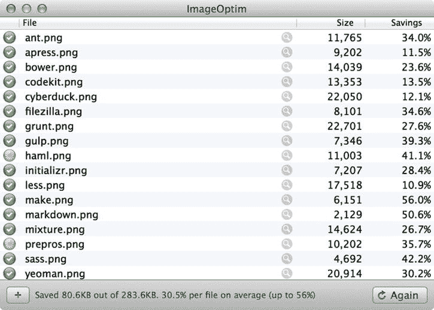

图 10-5。

ImageOptim showing a list of images along with the savings made by compressing

#### 目标图像响应

在前面讨论网络时，我讨论了在任何给定时刻可用的带宽如何影响网站下载站点资产的速度。我还注意到，由于小型设备使用的连接类型，它们的可用带宽通常低于大型设备。

在响应式站点上工作时，您可能会以不同的大小显示图像，大小取决于设备视窗宽度的大小。虽然浏览器可以简单地根据视窗的大小缩放图像，但是更好的选择是加载特定于该视窗大小的图像。由于图像在网站的文件大小中占很大比例，因此对于这些较小的设备来说，确保您交付的图像尽可能小是有意义的，这些设备通常会在延迟增加而带宽减少的连接上运行。虽然使用正确的文件类型和图像压缩会有所帮助，但是您可以通过在这些较小的设备上使用较小的图像来实现最大的节省。

有两种方法可以实现响应式图像，这两种方法都是“图片”元素规范的一部分(该规范是 HTML 生活标准的一部分，可以在 [`http://www.whatwg.org/specs/web-apps/current-work/multipage/embedded-content.html`](http://www.whatwg.org/specs/web-apps/current-work/multipage/embedded-content.html) `)`找到)。

##### img 元素

实现响应式图像的一种方法是通过在`img` HTML 元素上使用新的`srcset`属性，这允许您定义多个图像，以及何时应该使用每个图像的提示。

我们要看的`srcset`的第一个用途是根据设备的像素密度来定位图像，这里的主要好处是您可以为具有高像素密度屏幕的设备提供更高分辨率的图像，这将使它们看起来更清晰。为了实现这一点，我们需要使用属性“srcset”，将值设置为逗号分隔的图像列表，每个图像都有图像的像素密度。我已经在图 [10-6](#Fig6) 中展示了这一点。

图 10-6。

The logic required for targeting images based on pixel density

了解了使用 srcset 属性的逻辑之后，我们现在来看一个示例，看看它在我们的代码中是什么样子的:

``

值得注意的是，在这个例子中，我还包含了一个`src`属性，这允许不支持`srcset`的传统浏览器退回到较低质量的图像，而不是无法显示图像。我已经在这里展示过了:

``

使用`srcset`属性的一个更好的方法是根据视窗的宽度来定位图像。实现这一点的第一步是设置`srcset`属性的值；为此，使用逗号分隔的图像，每个图像都有定义的源图像宽度(参见图 [10-7](#Fig7) )。

图 10-7。

“srcset” being used to define the widths of our images

这就是事情开始变得有点复杂的地方，尽管你已经告诉浏览器每张图片有多大，但你还没有告诉浏览器在任何给定点图片有多大。这就是`sizes`属性的用武之地。使用`sizes`属性，您可以告诉浏览器，对于任何给定的视窗大小，您期望图像的大小是多少。你可以使用我们在[第 3 章](03.html)中作为媒体查询的一部分使用的相同媒体表达来实现这一点。对于每个媒体表达式，我们还指定当媒体表达式为真/匹配时图像的宽度。如果您指定一个不包含媒体表达式的宽度值，当没有媒体查询匹配时，该宽度将作为图像的默认宽度(参见图 [10-8](#Fig8) )。

图 10-8。

“sizes” attribute being used to define the widths the image appears at each breakpoint

你会注意到，在上面的例子中，我用`vw`单位指定了宽度，用视窗宽度的百分比表示。因此，当您指定`50vw`时，您是在指示 50%的视口宽度。如果图像总是浏览器宽度的 100 %,您可以只设置默认值为`100vw`,而不指定任何其他规则。`sizes`属性并不限制您使用`vw`宽度单位，您可以选择使用其他宽度单位，如 em 或 px。

设置了`srcset`和`sizes`属性后，您的浏览器就能够自动确定最适合加载的图像。在这样做时，浏览器可以考虑设备的许多特性，这些特性包括显示器的像素密度、图像相对于视口宽度的大小、用户偏好(用户可以选择加载较低质量的图像以减少数据消耗)以及用户连接的网络类型。一个完成的`img`元素实现了带有图像宽度的`srcset`属性，如下所示:

``

需要注意的是，不能将基于宽度的`srcset`和基于像素密度的`srcset`混合使用，因此，虽然知道基于像素密度的`srcset`很重要，但最好使用基于宽度的`srcset. This is`，因为，正如我们已经提到的，它给了浏览器选择最合适图像的控制权。

作为一个新属性，浏览器对`srcset`的本地支持是有限的，但是，因为它增加了现有的`src`属性，所以您仍然可以使用它来为浏览器加载默认图像。然而，如果你想在所有浏览器中完全使用`srcset`，你可以选择使用多填充。Scott Jehl 的 PictureFill 就是这样一个聚合填充，可以在 [`https://github.com/scottjehl/picturefill`](https://github.com/scottjehl/picturefill) 找到。PictureFill 旨在填充图片元素的完整规范，包括将`srcset`添加到`img`元素中。

##### 图像来源

定义响应图像的另一种方法是使用新的`picture`元素。`picture`元素被开发为一种方式，允许开发人员基于许多特征(包括格式、分辨率和方向)交付适合设备的图像。这样做的目的是，浏览器可以根据其当前的环境选择最佳版本的图像进行加载。

如果我们现在查看组成图片元素的每个组件，首先要查看的是图片标签。这包含了构成我们图片元素的所有部分。

`<picture>`

`</picture>`

在图片元素内部，我们有多个“源”元素。这些“源”元素中的每一个都应该有一个用于媒体表达式的“媒体”属性。当确定应该显示哪个图像时，浏览器将遍历每个“源”元素，直到它找到具有匹配/正确的媒体表达的图像。除此之外，我们还需要包含一个“srcset”属性来指定要使用的图像。类似于我们已经在 img 元素上使用的“srcset ”,我们可以用它来指定多个图像。在下面的例子中，我们为每个“源”元素指定了一个单独的图像。

`<picture>`

`<source srcset="large.jpg" media="(min-width: 980px)">`

`<source srcset="medium.jpg" media="(min-width: 768px)">`

`</picture>`

在我们的源元素之后，我们还需要包含一个`img`元素。当使用`img`元素作为`picture`元素的一部分时，我们可以使用`srcset`属性来指定默认图像。此外，我们需要在`img`元素上为我们的图像指定 alt 文本。我们还应该为不支持`picture`元素的浏览器包含一个使用`src`属性的默认图像。

`<picture>`

`<source srcset="large.jpg" media="(min-width: 980px)">`

`<source srcset="medium.jpg" media="(min-width: 768px)">`

``

`</picture>`

看完了`picture`元素的不同部分，我们现在来看一个如何使用它的例子。在下面的例子中，我们定义了三个图像，前两个作为`source`元素，第三个作为`img`元素。对于每个源元素，我们使用了媒体属性来应用媒体表达式。

`<picture>`

`<source srcset="large.jpg" media="(min-width: 1200px)">`

`<source srcset="medium.jpg" media="(min-width: 600px)">`

``

`</picture>`

如果我们在浏览器中加载一个小视窗(在本例中小于 600 像素宽)的页面，然后打开开发工具，我们会看到浏览器只下载较小的图像，如图 [10-9](#Fig11) 所示。

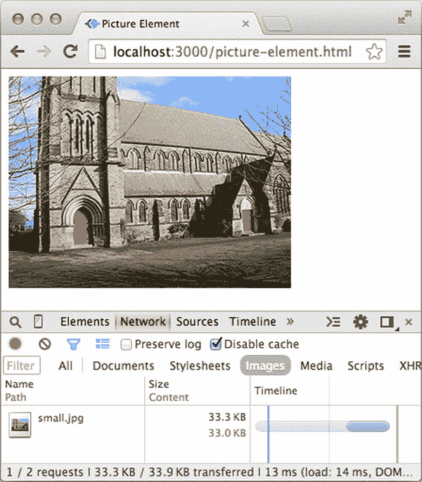

图 10-9。

Our small image being loaded on the small viewport size

通过只下载一个较小的图像到较小的设备上，我们减少了页面的文件大小，这有助于提高我们网站在较小设备上的性能。虽然这可以通过使用`scrset,`来实现，但是`picture`元素增加的冗长性允许我们选择在哪个设备上显示哪个图像，而不是让浏览器来选择。这使我们能够根据设备的大小灵活地改变图像的艺术方向。看了在较小的视窗中加载我们的站点时会发生什么，我们现在将在一个中等大小的视窗中加载我们的页面，如图 [10-10](#Fig12) 所示。

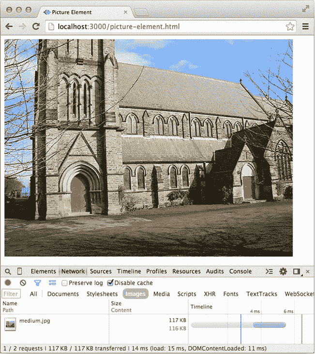

图 10-10。

Our page loaded with a medium sized viewport, the medium sized image is therefore loaded

不出所料，浏览器选择下载我们指定为源元素之一的中等大小的图像。

浏览器对`picture`元素的支持很好，因为该规范旨在允许不支持它的浏览器简单地使用包含的图像元素。此外，如果我们希望对图片元素启用完全支持，而不仅仅是这种回退，我们可以使用我们已经提到的 PictureFill polyfill。

这方面的例外是 Internet Explorer 9，不幸的是，它与我们在图片元素中包含的`source`元素有一个问题，因为它会将它们从页面中删除。为了防止这种情况，我们可以使用一种黑客技术，将`source`元素包装在一个视频元素中。使用条件注释将功能定位于 Internet Explorer 9，然后我们可以将视频元素设置为不可见。这将阻止 Internet Explorer 9 删除`source`元素，因此 polyfill 将能够使用它们。为了说明我们如何做到这一点，在下面的例子中，我们在源元素之前的开始视频元素标签周围和结束视频元素标签周围使用了条件注释。

`<picture>`

`<!--[if IE 9]><video style="display: none;"><![endif]-->`

`<source srcset="large.jpg" media="(min-width: 1200px)">`

`<source srcset="medium.jpg" media="(min-width: 600px)">`

`<!--[if IE 9]></video><![endif]-->`

``

`</picture>`

因为可以同时使用`srcset`属性和`picture`元素，所以这不是选择是使用`picture`元素还是使用`srcset`属性的问题。相反，这是一个为你的具体情况选择你需要的详细程度的问题。

如果你只是以不同的分辨率提供相同的图像，这样你的网站就能提供最佳的图像，允许浏览器选择最适合浏览器环境的图像，那么使用`srcset`和`sizes`属性会很好。但是，如果您想将不同的图像指向特定的视窗尺寸，并完全控制图像显示的视窗尺寸，那么您应该选择使用`picture`元素将图像指定为`source`元素。

我们也可以选择使用`srcset`和`sizes`属性为每个`source`元素指定不同的图像。为此，我们可以在我们的`source`元素上使用媒体表达式来控制艺术方向，然后指定多个图像作为`srcset`的一部分，同时定义`sizes`以使浏览器能够选择要显示的图像的最佳版本。

### 有条件地加载内容

对于一个响应式网站，通常你已经将所有内容预加载到页面中；但是，有时您可能希望根据视口的大小有条件地加载内容。当建立一个网站移动第一，你把重点放在页面上的核心内容。然而，当网站首先在一个更大的设备上被浏览时，你就有了所有这些额外的空间，你可以很好地利用它们。您可以实际测试视窗是否足够大，然后使用 AJAX 动态加载附加内容，而不是将内容添加到 HTML 中并隐藏它(这只会增加页面权重)。

有条件地加载内容的好处是，通过从初始页面加载中去掉并非在所有设备上都可以看到的内容，可以降低初始页面权重。此附加内容中包含的任何资产也不会被下载。

然而，主要的缺点是您使用了额外的 HTTP 请求，这意味着用户必须等待加载额外的内容，所以如果内容真的很重要，您可能不希望采用这种方法，以便用户能够立即看到它。

### 域分片

浏览器中 HTTP 的当前实现限制了可以同时处理的 HTTP 请求的数量，并且这个数字在两个到八个连接之间变化。相比之下，对网站主域名的 HTTP 请求平均为 51 次(2014 年 3 月，HTTP 存档)。这意味着许多请求将等待其他请求完成，这会延迟网站的加载。

要克服这一限制，您可以使用一种称为域分片的技术，在这种技术中，您可以跨一系列域或子域部署页面的资源，以使浏览器能够同时请求更多的文件。这使您能够克服当前 HTTP 实现所强加的八个 HTTP 请求的限制。

通过跨一系列域加载资产，可以克服八个 HTTP 请求的限制，理论上可以更快地加载资产。这里的问题是这样做的好处可能不同，因为域分片实际上是现代浏览器的反模式。我的意思是，域分片是克服当前浏览器的 HTTP 实现所带来的限制的常见解决方案。然而，虽然在某些情况下它可能会工作，但在其他情况下它可能会降低性能。性能下降的原因是浏览器需要为每个使用的域进行额外的 DNS 请求，因此如果 DNS 响应缓慢，内容实际上可能需要更长的时间来下载。

Mobify ( [`http://www.mobify.com/blog/domain-sharding-bad-news-mobile-performance/`](http://www.mobify.com/blog/domain-sharding-bad-news-mobile-performance/) )做了一些研究，看看在我们现在生活的这个多设备的世界里，域名分片是否真的有益。他们的研究侧重于在移动浏览器中进行测试，并发现在所有测试的浏览器中，域分片几乎没有什么好处，事实上，在一些测试中，它实际上导致页面加载资产的时间增加。

### 服务器配置

服务器的配置方式会对最终用户的网站性能产生显著的影响，因此，尽可能地对其进行优化是有意义的。

#### 启用服务器端压缩

要提高服务器性能，您可以做的第一件事是为基于文本的资产启用服务器端压缩。

当用户的 web 浏览器向 web 服务器请求页面时，浏览器将发送一个标题，让服务器知道它支持压缩内容。它还让服务器知道支持哪种类型的压缩，最常见的两种压缩类型是 GZIP 和 deflate。

因为服务器知道用户的浏览器支持压缩，所以在发送每个请求的文件之前，它将压缩该文件，然后将压缩的版本发送到用户的浏览器。在接收到文件时，浏览器查看文件的标题，如果是压缩文件，它将向浏览器指示该文件是压缩的，以及使用了哪种压缩。浏览器可以解压缩，然后处理该文件。

在 Apache 中启用压缩可以通过`.htaccess`文件来实现，并且您可以基于您的站点提供的文件类型来设置规则。有两种方法可以使用`.htaccess`文件启用压缩，第一种是向文件类型添加输出过滤器:

`AddOutputFilterByType DEFLATE text/plain`

`AddOutputFilterByType DEFLATE text/html`

`AddOutputFilterByType DEFLATE text/css`

`AddOutputFilterByType DEFLATE application/javascript`

启用压缩的第二种方法是对具有特定扩展名的所有文件进行压缩:

`<files *.html>`

`SetOutputFilter DEFLATE`

`</files>`

#### 使用过期标题

当网站的用户第一次访问时，他们的浏览器需要下载页面的所有资源，包括 HTML、图像、CSS 和 JavaScript。如果没有浏览器缓存，每次用户访问网站时，用户的浏览器都必须这样做。

不幸的是，web 浏览器根本不知道这些文件是否已经更改，所以这就是为什么每次用户访问站点时都需要重新加载它们。作为开发人员，我们需要通知浏览器哪些文件不太可能经常更改，以便浏览器能够有效地缓存它们，这可以通过使用 Expires 头来实现。

Expires 头告诉浏览器它接收的文件在一定时间后才会改变。这对浏览器的好处是，它能够缓存文件，因为它知道在规定的时间过去之前，不必再次重新提取文件。当您的用户再次访问该站点时，浏览器只是从缓存中加载文件，而不是获取文件。

在配置 Expires 头之前，考虑您希望用户的浏览器缓存什么类型的文件是很重要的，以下是您可能希望缓存的一些建议:

CSS   JavaScript   Images  

还有一些不希望使用过期标头的示例:

AJAX APIs   Dynamic pages  

在 Apache 中设置 Expires 头可以通过将它们添加到 sites `.htaccess`文件中来实现。第一步是启用 Expires 标头并设置默认规则，该规则将被添加到网站提供的所有文件中，在下面的示例中，我设置了默认规则 1 周:

`<IfModule mod_expires.c>`

`ExpiresActive On`

`# Add a default rule`

`ExpiresDefault "access plus 1 week"`

`</IfModule>`

启用 Expires 头之后，您可以开始为 CSS、JavaScript 和图像定义自定义规则。您可以通过使用`ExpiresByType`来做到这一点，包括文件类型和您希望文件在用户缓存中保留的时间长度。

`<IfModule mod_expires.c>`

`ExpiresActive On`

`# Add a default rule`

`ExpiresDefault "access plus 1 week"`

`# CSS rules`

`ExpiresByType text/css "access 1 year"`

`# Javascript rules`

`ExpiresByType application/javascript "access plus 1 year"`

`# Images rules`

`ExpiresByType image/jpeg "access plus 1 month"`

`ExpiresByType image/jpg "access plus 1 month"`

`ExpiresByType image/gif "access plus 1 month"`

`ExpiresByType image/png "access plus 1 month"`

`</IfModule>`

#### CDN 上的主机

在决定如何提高网络性能时，一个选择是考虑使用内容交付网络(CDN)来为您的站点资产提供服务。这样做可以提高性能的原因是，用户与 web 服务器的距离会影响响应时间。CDN 是分布在多个地理位置的分布式服务器网络，这意味着您的用户能够通过离他们最近的服务器查看您的网站。

除了更接近你的用户，使用 CDN 还可以帮助你提高网站的可用性。由于分布在多个位置，如果一个位置出现连接问题，您的用户可以继续由其他位置提供服务。

有许多可用的 CDN 提供商，一些流行的提供商包括:

Akamai   Amazon Web Services CloudFront   Cloudflare  

#### SPDY/HTTP 2.0

SPDY 和 HTTP 2.0 都是过时的 HTTP 协议的替代品，在性能和功能上都优于其前身。

在提到的网络性能方面，延迟是现有 HTTP 协议的一个弱点。这是因为 HTTP 是为一种与我们今天构建的网页类型非常不同的网页而设计的，并且 web 发展的方式在最初开发 HTTP 协议时是无法预料的。

Chromium SPDY 白皮书 [7](#Fn7) 强调了现有 HTTP 协议面临的一些问题:

Single request per connection   Only clients can initiate a request   HTTP headers are uncompressed   Redundant HTTP headers  

为了克服这些问题，Google 开发了 SPDY 协议。他们在白皮书中列出的目标是:

Allow concurrent requests across a single TCP connection   Reduce the bandwidth by compressing headers and eliminating unnecessary headers   Reduce complexity that we get when using HTTP   Enforce SSL as standard by using it as the underlying transport protocol   Allow the server to initiate connections to the user’s browser  

要开始使用 SPDY，您需要确保您的服务器设置为支持该协议。如果你使用 Apache，你需要安装`mod_spdy`模块，如果你使用 nginx，你需要安装`http_spdy_module`模块。有了这个设置，您还需要购买一个 SSL 证书，并在您的域上设置它。最后，您将希望重定向所有流量以使用您站点的 HTTPS 版本，以便所有用户看到站点的相同版本并共享相同的链接，并且那些拥有支持 SPDY 的浏览器的用户将开始看到性能优势。

SPDY 为需要加载大量资产的站点提供了最大的好处。这是因为它允许网站的文件并行下载，而不是批量下载，并且由于这种并行下载是通过单个 TCP 连接进行的，因此也减少了数据包丢失。

除了这些好处，SPDY 还允许服务器在用户没有请求的情况下将内容推送到用户的浏览器。这里的想法是，在页面完成下载之前，服务器可以发送相关的文件，比如图像、样式表和 JavaScript 文件。

SPDY 正在所有主流浏览器中实现，最近在 2014 年全球开发者大会上宣布支持 Safari。这意味着很可能大量的用户将会使用或很快会使用支持 SPDY 的浏览器。因此，您需要确保托管您的站点的服务器设置为支持 SPDY。

在了解了 SPDY 是什么以及它所提供的新的性能优势之后，它为 HTTP 2.0 协议最终确定后的预期提供了一个良好的基础。HTTP 2.0 协议目前正在开发中，它基于 Google 开发的 SPDY 协议。

## 关键渲染路径

加载网页性能的一个重要概念是关键呈现路径。Google 将关键渲染路径定义为“渲染网页初始视图所需的代码和资源” [8](#Fn8)

为了呈现网页，用户的浏览器必须从它们所在的 web 服务器上下载它所使用的资源。关键路径是在向用户显示任何内容之前必须下载和处理的文件，因此，提高关键呈现路径的性能有助于提高用户对站点性能的感知。

让我们看一个简单的例子，看看关键的渲染路径是如何在浏览器中渲染的。让我们从一些典型的 HTML 开始，它包含一个样式表、一个 JavaScript 文件和一些图片:

`<!doctype html>`

`<html lang="en">`

`<head>`

`<title>Page Not Found</title>`

`<link rel="stylesheet" href="css/screen.css">`

``

`</head>`

`<body>`

``

``

`</body>`

`</html>`

浏览器采取的第一步是下载 HTML 文件；下载完成后，浏览器将开始解析 HTML 文档。

在现代浏览器中，有两个独立的解析器用于 HTML 解析:第一个是预解析器(也称为推测解析器)，第二个是主 HTML 解析器。

当预解析器通读 HTML 时，它将试图找到任何需要下载的资源来呈现页面。在给出的例子中，预解析器将找到样式表，然后是 JS 文件，接着是两个图像。在找到这些资源中的每一个时，预解析器将从网络请求它们。值得注意的是，预解析器只会解析对资源的引用，而不会构造或修改 DOM 树。

当解析器在 HTML 文档中寻找需要的资源时，浏览器的主解析器开始解析 HTML，用它来构建 DOM 树。

当主 HTML 解析器解析 HTML 时，它不会在找到样式表时停止，因为它不会被阻止继续解析 HTML 文档，因为 CSS 无法对 DOM 树进行任何更改。虽然浏览器在下载 CSS 文档时不会阻止 HTML 文档的解析，但它会阻止页面的呈现，直到 CSS 文档完全下载完毕。同样重要的是要意识到，在某些浏览器中，当浏览器等待 CSS 完全下载时，脚本可能会被阻止。

如果主 HTML 解析器遇到一个 JavaScript 文件，情况会略有不同。尽管浏览器的解析器已经向服务器请求了文件，并继续解析页面的其余部分，但是主 HTML 解析器需要等到文件完全下载完毕。这是因为 HTML 解析器必须考虑这样的情况，即当 HTML 解析器到达``

通过使用这种服务，您可以避免构建自己的后端解决方案，但是，这种服务的局限性在于，它需要 JavaScript 来加载图像的正确版本。如果 JavaScript 加载失败，用户将只能看到质量较低的图像。

## 衡量你的网站的表现

为了能够成功地优化您的站点，您需要能够衡量您的站点的性能以及您所做的任何更改的性能增益。

有各种各样的工具可以让你测试你的站点的性能，所以让我们来看看这些工具中的一些，看看当你试图优化你的站点的性能时，它们是如何给你带来好处的。

### Pingdom 网站速度测试

可以用来测试网站性能的工具之一是 Pingdom 网站速度测试( [`http://tools.pingdom.com/fpt/`](http://tools.pingdom.com/fpt/) ，它允许你输入你的网站的 URL 来测试性能，如图 [10-11](#Fig11) 所示。

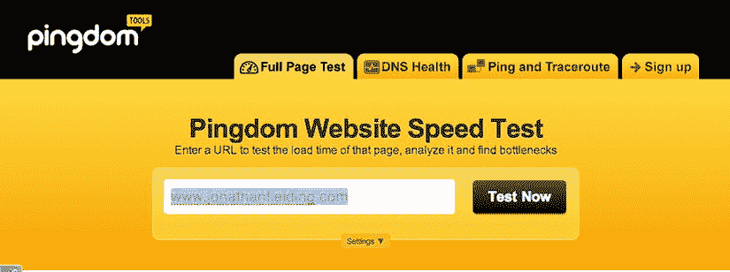

图 10-11。

The Pingdom Website Speed Test, just enter your URL and click Test Now

单击“立即测试”按钮后，该工具将分析站点并发现任何潜在的性能问题。开始运行测试后，你会看到一些关于你的站点的基本性能信息(如图 [10-12](#Fig12) 所示)，包括你的站点发出的 HTTP 请求的数量、加载时间和你的页面大小。

图 10-12。

The basic performance grade for the site

#### 瀑布

在摘要下面，瀑布图显示了网页向服务器发出的 HTTP 请求。瀑布视图的示例如图 [10-13](#Fig13) 所示。每个请求都有颜色编码:

Pink: DNS   Blue: Connection to server   Orange: Browser sends request to the server   Yellow: Browser waits for response from server   Green: The browser is receiving data from the server  

图 10-13。

The Waterfall of the performance of the site shown in Pingdom

#### 绩效评分

Pingdom 还提供了查看不同性能领域的个人性能分数的能力。作为开发者，这可以让你很快看到你的网站做得很差的地方，这样你就可以纠正它们，因为如果你修复它们，这些地方可能会给你带来最高的性能收益。我的博客( [`www.jonathanfielding.com`](http://www.jonathanfielding.com/) )的表现评分如图 [10-14](#Fig14) 所示。

图 10-14。

Pingdom performance scoring for my blog

#### 页面分析

Pingdom 还提供了一些进一步的页面分析数据，这些数据在查看站点性能问题时非常有用。它提供的数据可以分为三类:加载时间分析、大小分析和请求分析。我的博客的完整页面分析如图 [10-15](#Fig15) 所示。

加载时间分析是与页面加载时间相关的数据；它包括站点在瀑布图中显示的每个状态下花费的时间，加载每个内容类型花费的时间，以及从每个域加载花费的时间。后者可能特别有用，因为它允许您轻松地看到由第三方服务(如您网站上包含的广告)导致的页面加载瓶颈。

大小分析数据提供了页面权重来源的详细分类。特别是，它显示了每种内容类型的大小，这表明哪种类型的内容最大。它还显示了从其他域提供的内容的大小，当您试图确定为什么您的站点看起来很大，而您觉得自己的文件大小合适时，这很有用。

请求分析信息与您的站点必须发出的请求数量有关。这分为两种类型的数据:每个内容类型的请求数和每个域的请求数。同样，这允许您查看第三方插件是否正在创建您可能没有意识到的过多的 HTTP 请求。

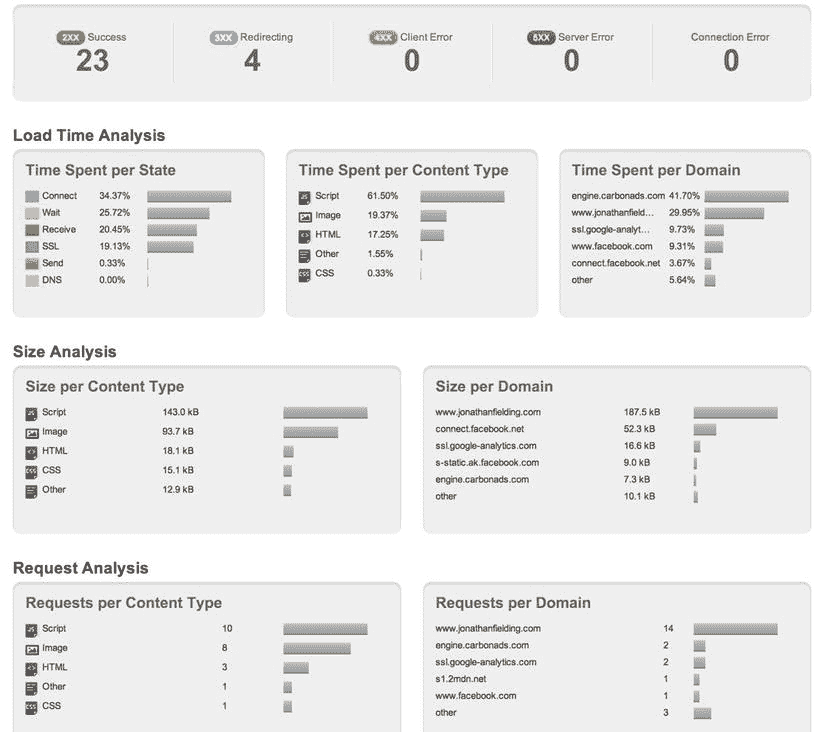

图 10-15。

Pingdom full page analysis

### 进行优化

YSlow ( [`https://developer.yahoo.com/yslow/`](https://developer.yahoo.com/yslow/) )是雅虎开发的工具这允许你测试你的网页的性能。它可以作为浏览器插件安装，这意味着您可以在自己的浏览器中直接测量网页的性能。

要开始使用 YSlow，请访问 [`http://yslow.org/`](http://yslow.org/) ，在那里您可以选择您的浏览器并安装 YSlow 插件的相关版本。安装完成后，访问您的网站并单击浏览器中添加的 YSlow 图标。图标如图 [10-16](#Fig16) 所示。

图 10-16。

Chrome toolbar, the YSlow icon is highlighted

单击 YSlow 图标后，会出现一个弹出窗口，向您提供 YSlow 的一些信息。如果您的站点阻止自己嵌入 iframe，那么您需要确保选中了此页面上的复选框。要运行 YSlow 测试，只需点击运行测试按钮，如图 [10-17](#Fig17) 所示。

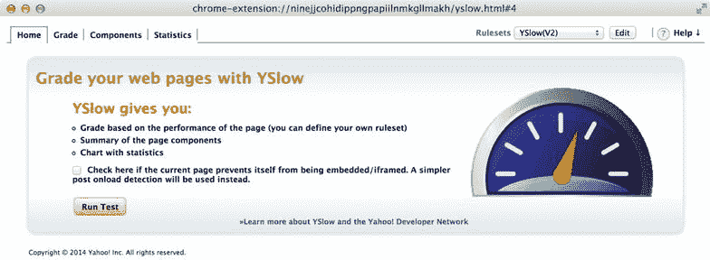

图 10-17。

The YSlow panel

一旦 YSlow 运行了它的测试，你就可以浏览每一个标签来决定你的站点运行的如何。

#### 级别

一旦 YSlow 运行了它的测试，你将被带到 Grade 选项卡，在这里 YSlow 将根据你的站点的性能给它打分。它还给出了你在 23 个不同领域的分数，你可以点击这些分数来获得关于你为什么得到那个分数以及你可以做什么来提高它的更多信息。在我的博客上运行测试后的成绩视图如图 [10-18](#Fig18) 所示。

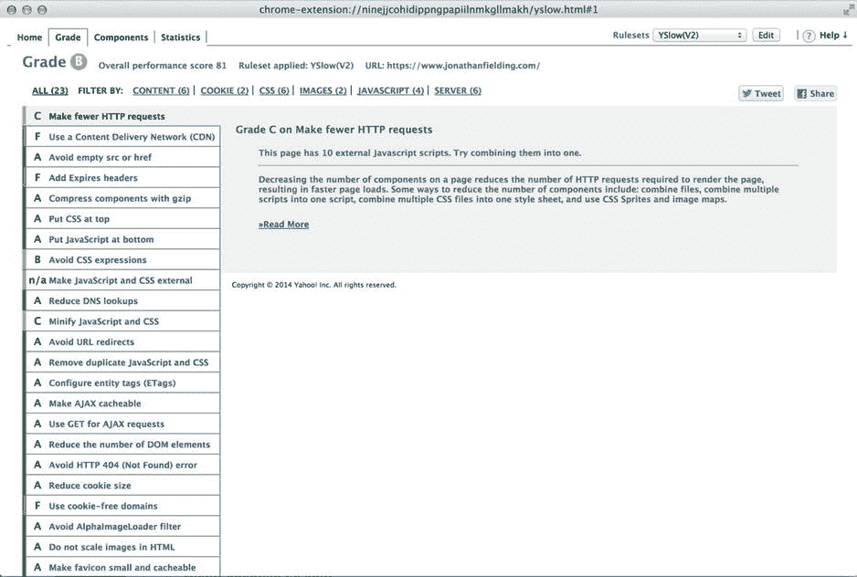

图 10-18。

The YSlow Grade panel for my blog

#### 成分

YSlow 的 Components 选项卡提供了关于组成站点的各个资源的信息。它们按类型排序，您可以通过扩展类型来查看各个文件，从而找到关于每个资源的更多信息。

查看单个文件时，您可以看到有关文件大小、文件头以及随文件发送和接收的 cookies 的信息。这可能是有用的，因为这意味着你可以很容易地看到，如果你发送大量的 cookie 数据与您的文件，所以你可以解决这个问题，同时优化您的网站。我的博客的组件信息如图 [10-19](#Fig19) 所示。

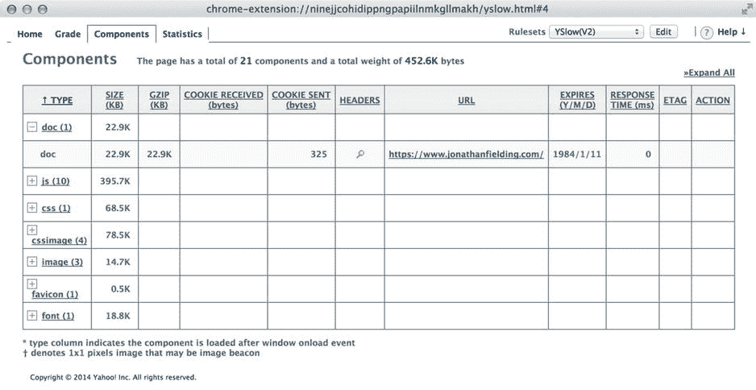

图 10-19。

The YSlow Components panel for my blog

#### 统计数字

YSlow 的 Statistics 选项卡提供了一些图表，显示了每种内容类型的请求所占的百分比，以及每种内容类型的 HTTP 请求数量。我的博客的统计面板如图 [10-20](#Fig20) 所示。

图 10-20。

The YSlow Statistics panel for my blog

### 网页测试

WebPageTest ( [`http://www.webpagetest.org`](http://www.webpagetest.org/) )是一个测量页面性能的免费工具，最初由 AOL 开发供内部使用，但在 2008 年在 BSD 许可下开源。该工具的托管版本由 WPO 基金会运营，该基金会是一家非营利性企业，旨在提高网站性能。

WebPageTest 使您能够在世界各地的许多不同位置，在许多不同的浏览器中，在您的站点上运行 web 性能测试。它还允许您通过自定义高级设置来运行一些高级测试。

要开始使用 WebPageTest 测试您的站点，您需要访问他们的网站并输入您站点的 URL。你可以选择一个测试地点，这意味着你可以选择你的目标市场的位置，让你看到你的真实用户访问你的网站时的表现。此外，您可以选择用于运行性能测试的浏览器。WebPageTest 的一些特性并不是在所有的浏览器上都可用，所以您可能需要在多个浏览器中运行测试来利用所有的特性。使用 WebPageTest 运行测试的起始页如图 [10-21](#Fig21) 所示。

图 10-21。

Initial start page of WebPageTest, with the option to select browser and advanced options

因为 WebPageTest 站点是一个受欢迎的服务，所以您可能需要排队等候才能使用它。然而，通常你不用等超过几分钟。

一旦加载了结果，与其他测试类似，WebPageTest 会给你的站点一个性能等级。此外，该页面还显示了关于在第一次查看和重复查看时加载网站所用时间的信息。我的博客的绩效等级如图 [10-22](#Fig22) 所示。

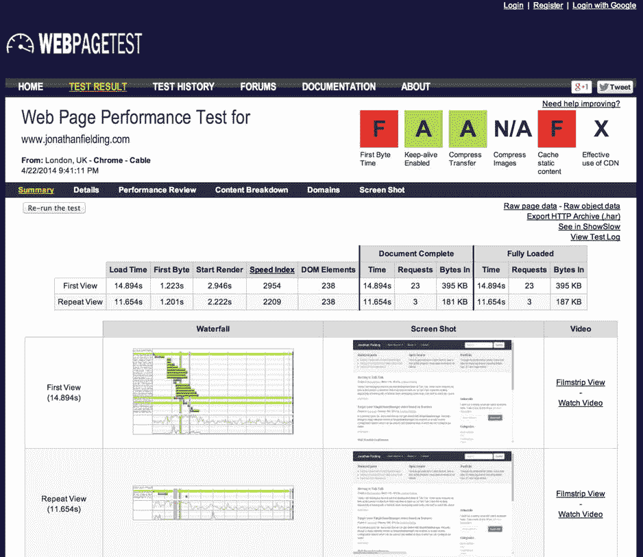

图 10-22。

The WebPageTest performance grade for my blog

#### 瀑布景观

运行完这个测试后，您可以单击显示的瀑布图像，进入瀑布视图。该视图显示了加载每个文件所用时间的详细信息，包括 DNS 查找、初始连接、SSL 协商、首字节时间和内容下载。

这个视图非常有用，可以让您看到资产加载受阻的任何地方，或者资产转移的任何问题。我的博客的瀑布视图结果如图 [10-23](#Fig23) 所示。

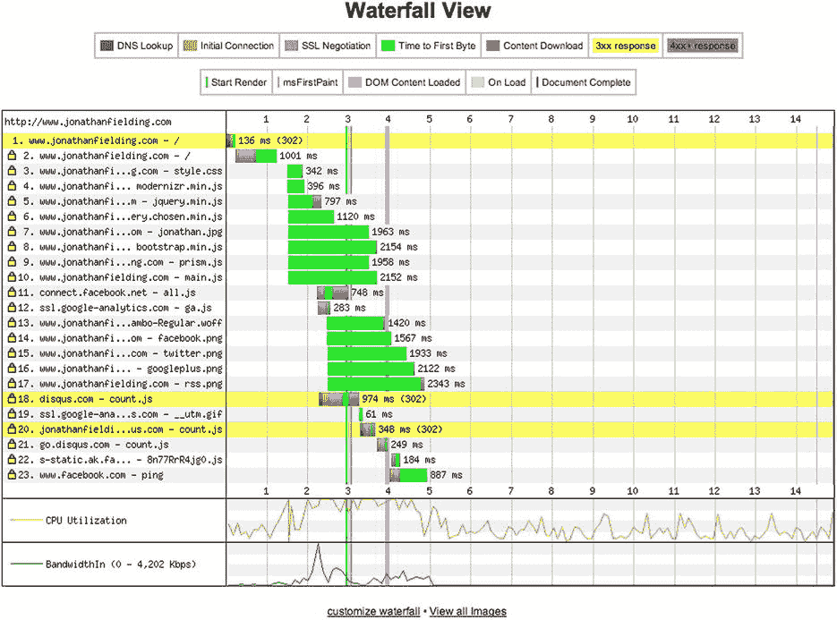

图 10-23。

The WebPageTest Waterfall View after testing my blog

#### 高级测试

WebPageTest 在衡量网站性能的工具中真正脱颖而出的地方在于它的可配置性。我的意思是，在设置您的性能测试时，您可以从几个高级选项中选择各种选项。

要选择这些高级选项，您只需单击“高级设置”链接，这将展开站点的这一部分，以便您可以选择所需的高级选项。高级选项分为以下选项卡:

Test Settings   Advanced   Chrome   Auth   Script   Block   SPOF  

虽然我不会详细解释所有这些选项，但最重要的设置之一是第一个(测试设置)选项卡上显示的连接设置。通过允许您选择不同的连接速度，此设置使您作为开发人员能够在用户可能面临的条件下测试网站。可供选择的范围从快速电缆连接到 56K 调制解调器。当决定测试哪些速度时，你需要对你的目标用户可能使用的速度持现实态度。用于选择这些高级选项的菜单如图 [10-24](#Fig24) 所示。

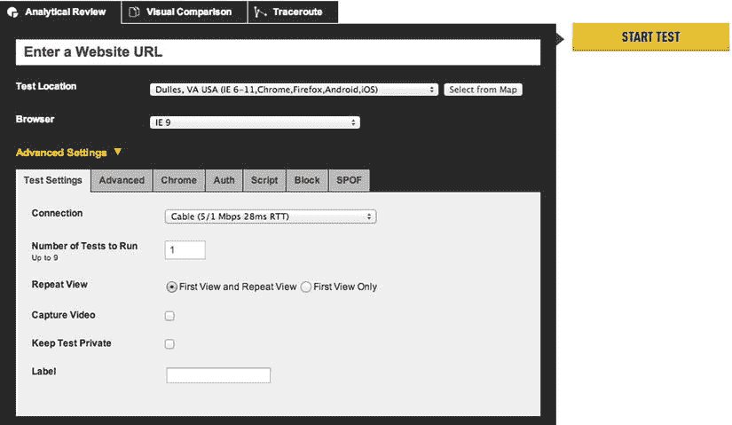

图 10-24。

The WebPageTest advanced testing menu

### 谷歌分析网站速度

尽管确保在测试环境中一切正常对于确保一个站点对最终用户表现良好大有帮助，但我们无法测试每一个用例，因为有各种设备连接的组合。

在第 9 章中，你学习了如何使用 Google Analytics 来衡量用户的旅程，Google Analytics 可以帮助你的另一种方式是查看你的网站对最终用户的实际表现。

当使用 Google Analytics 查看一个站点对最终用户的表现时，你可以从查看站点速度概览页面开始。默认情况下，该页面显示以下信息:

Average page load time   Average redirection time   Average domain lookup time   Average server connection time   Average server response time   Average page download time  

此信息与上个月的平均值一起显示，并带有一个图表，显示该值在所选时间段(默认为月)内的波动情况。现场速度概览页面如图 [10-25](#Fig25) 所示。

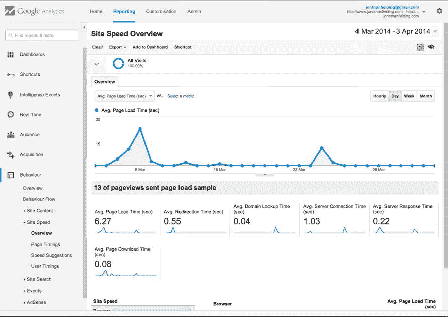

图 10-25。

Google Analytics Site Speed Overview

除了总体概述，Google Analytics 还能够就如何提高页面性能给出一些建议。这可以在网站速度建议页面上找到。初始视图包括一个页面列表，其中有一个标题为“速度建议”的列，每行都有一个链接，您可以单击该链接查看该页面的建议(如图 [10-26](#Fig26) 所示)。

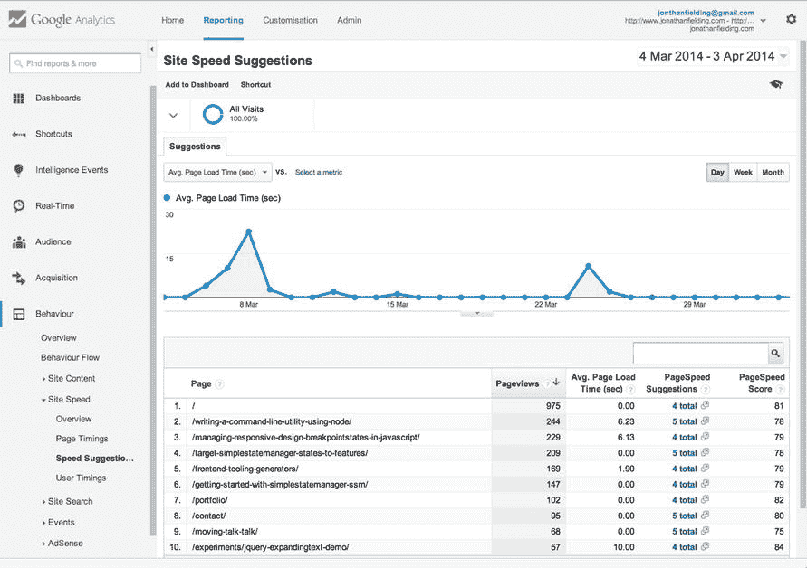

图 10-26。

Google Analytics site Speed Suggestions

## 摘要

本章讨论了优化网站性能的方法。因为性能是一个很大的主题，所以我把重点放在了对一个响应性网站有最大影响的方面。

首先讨论的领域之一是网络性能的重要性，现在您应该对延迟和带宽以及它们如何影响您站点的网络性能有了很好的理解。然后，我讨论了如何通过使用允许您减少 HTTP 请求和优化服务器设置的技术来优化您的站点，以最好地应对这些限制。

然后，我解释了如何通过使用服务器端技术来确定向站点用户提供什么服务，从而优化站点性能。这包括查看如何使用设备描述库来确定用户正在使用的设备类型，以便为他们提供优化的内容。

虽然了解优化性能的方法使您能够使用性能响应技术来构建您的站点，但是能够度量性能也很重要。为了让您能够做到这一点，我介绍了两种您可以在站点开发过程中使用的工具:测量工具 WebPageTest、Pingdom 和 YSlow，以及生活工具，即在用户设备上测量站点性能的工具，特别是 Google Analytics 站点速度工具。

希望这本书能帮助你努力构建响应性网页。通过这本书，你将了解到从头开始创建一个网站或者改造一个现有网站的步骤。通过将这些技能应用到你的工作中，你将有助于改善用户在使用我们网站时的体验。

我真的希望你喜欢读这本书，就像我喜欢写这本书一样，并且当你想尝试不同的技术或改进你的响应网站时，你可以回头看看这本书作为参考。

Footnotes [1](#Fn1_source)

[`http://httparchive.org/`](http://httparchive.org/) 。

  [2](#Fn2_source)

[`http://www.webperformancetoday.com/2011/07/20/new-findings-mobile-web-users-are-more-disappointed-than-ever/`](http://www.webperformancetoday.com/2011/07/20/new-findings-mobile-web-users-are-more-disappointed-than-ever/) 。

  [3](#Fn3_source)

[`http://www.webperformancetoday.com/2013/12/11/slower-web-pages-user-frustration/`](http://www.webperformancetoday.com/2013/12/11/slower-web-pages-user-frustration/) 。

  [4](#Fn4_source)

[`http://www.webperformancetoday.com/2011/07/20/new-findings-mobile-web-users-are-more-disappointed-than-ever/`](http://www.webperformancetoday.com/2011/07/20/new-findings-mobile-web-users-are-more-disappointed-than-ever/) 。

  [5](#Fn5_source)

[`http://www.igvita.com/2012/07/19/latency-the-new-web-performance-bottleneck/`](http://www.igvita.com/2012/07/19/latency-the-new-web-performance-bottleneck/) 。

  [6](#Fn6_source)

[`http://chimera.labs.oreilly.com/books/1230000000545`](http://chimera.labs.oreilly.com/books/1230000000545) 。

  [7](#Fn7_source)

[`http://www.chromium.org/spdy/spdy-whitepaper`](http://www.chromium.org/spdy/spdy-whitepaper) 。

  [8](#Fn8_source)

[`https://developers.google.com/speed/docs/best-practices/rtt`](https://developers.google.com/speed/docs/best-practices/rtt) 。

  [9](#Fn9_source)

如果你有兴趣阅读浏览器用户代理字符串的历史，你可以在 [`http://webaim.org/blog/user-agent-string-history/`](http://webaim.org/blog/user-agent-string-history/) 找到它。