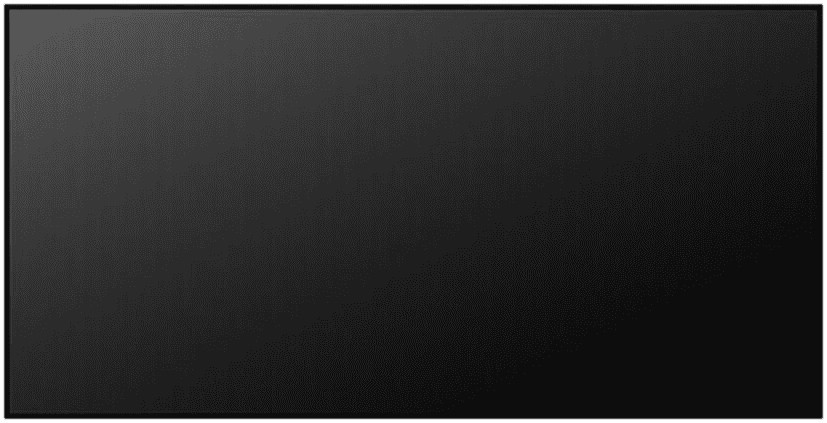
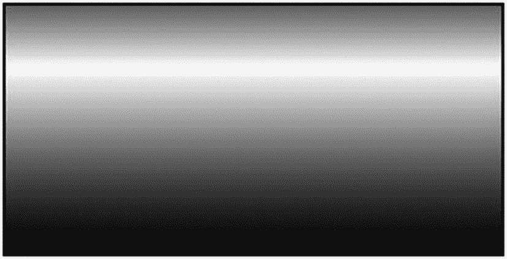
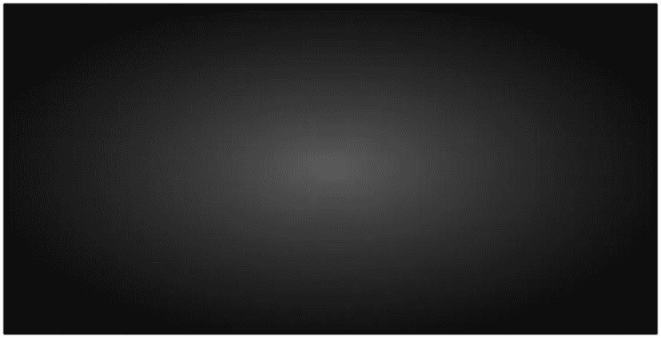
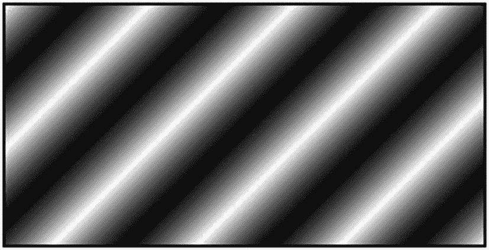

# 十五、渐变

渐变是一种从一种颜色平滑过渡到另一种颜色的颜色填充。CSS 3 中引入了渐变函数，根据规范，渐变函数可以用在任何需要图像的地方，但是它们主要与`background`或`background-image`属性一起使用来创建背景渐变。

## 线性渐变

`linear-gradient()`函数定义了一个渐变，提供了从一种颜色到另一种颜色的平滑过渡。

```html
linear-gradient([<angle> | to <side-or-corner>]
                {, <color stop> [stop position]} (2-∞) )

```

最简单的形式是，线性渐变由两种颜色组成，从上到下均匀分布。在图 [15-1](#Fig1) 中，渐变从灰色开始，在底部过渡到黑色。


图 15-1

简单线性渐变

```html
.mygradient {
  background-image: linear-gradient(gray, black);
}

```

可以使用关键字`to`设置渐变的角度，后跟渐变结束的目的地:`top`、`right`、`bottom`、`left`或它们的任意组合。示例如图 [15-2](#Fig2) 所示。



图 15-2

右下线性渐变

```html
linear-gradient(to bottom right, gray, black);

```

使用`deg`单位可以指定更精确的角度，0 `deg`与`to top`相同。度数顺时针旋转，允许负角度。

```html
linear-gradient(0deg,   gray, black); /* to top */
linear-gradient(90deg,  gray, black); /* to right */
linear-gradient(180deg, gray, black); /* to bottom */
linear-gradient(-90deg, gray, black); /* to left */

```

可以在起始色和结束色之间添加额外的色标。任何颜色停止点后面都可以跟一个以百分比或长度值指定的停止点位置。如果没有指定停止位置，颜色会均匀分布。在下面的例子中，白色设置为 25 %,而不是默认的 50%。图 [15-3](#Fig3) 展示了这段代码的结果。



图 15-3

具有多个色标的渐变

```html
linear-gradient(gray, white 25%, black);

```

目前描述的标准语法在 Chrome 26+、Firefox 16+、Safari 6.1+、Opera 12.1+和 IE 10+中受支持。遗留语法可以与`-moz`、`-webkit`和`-o`前缀一起使用，以扩展对 Firefox 3.6、Chrome 1、Safari 4 和 Opera 11.1 的支持。

```html
.linear-gradient
{
  background-color: red; /* fallback color */

  /* Chrome 1-9, Safari 4-5 */
  background: -webkit-gradient(linear, left top, right top, from(red), to(orange));

  /* Chrome 10-25, Safari 5.1-6.1 */
  background: -webkit-linear-gradient(left, red, orange);

  /* Firefox 3.6-15 */
  background: -moz-linear-gradient(left, red, orange);

  /* Opera 11.1-12.1 */
  background: -o-linear-gradient(left, red, orange);

  /* Standard syntax */
  background: linear-gradient(to right, red, orange);
}

```

## 径向渐变

径向渐变从中心点向外过渡。在 CSS 中，这些渐变是用`radial-gradient()`函数定义的。

```html
radial-gradient([<shape> + <size>] [at <position>]
                {, <color stop> [stop position]} {2-∞} )

```

要创建径向渐变，必须定义至少两个色标。图 [15-4](#Fig4) 中的径向渐变从中间的灰色开始，逐渐变为黑色。



图 15-4

简单径向渐变

```html
radial-gradient(gray, black);

```

像`linear-gradient()`一样，允许有两个以上的颜色停止点，它们后面可以有一个长度或百分比值，表示颜色的停止位置。示例如图 [15-5](#Fig5) 所示。


图 15-5

设置停止位置的径向渐变

```html
radial-gradient(black 25%, white, black 75%);

```

径向渐变的形状可以是`ellipse`或`circle`。默认的形状是`ellipse`，它允许渐变扩展以匹配元素的高度和宽度，如图 [15-5](#Fig5) 所示。可选的`circle`值，如图 [15-6](#Fig6) 所示，强制渐变为圆形，与元素的形状无关。


图 15-6

圆形径向渐变

```html
radial-gradient(circle, black 25%, white, black 75%);

```

省略号的两个长度值或圆的单个值可用于设置渐变的水平和垂直半径。对于省略号，它们也可以是相对于元素尺寸的百分比值，如图 [15-7](#Fig7) 所示的例子。


图 15-7

调整径向渐变的大小

```html
radial-gradient(75% 25%, gray, black);

```

如果需要更小的精度，可以使用预定义的关键字之一来设置尺寸:`closest-side`、`closest-corner`、`farthest-side`或`farthest-corner`。这些值规定了离原点最近或最远的元素的边或角是否包含渐变(见图 [15-8](#Fig8) )。例如，`farthest-side`值调整渐变的大小，使它的最后一种颜色在元素远离其原点的最远一侧结束。


图 15-8

大小关键字

```html
radial-gradient(farthest-side, gray, black);

```

默认情况下，径向渐变的原点居中。可以通过用关键字`at`指定渐变原点的位置，后跟一个以与`background-position`属性相同的方式指定的位置来更改。首先指定水平位置，然后选择垂直位置。可以用关键字(`left`、`center`、`right + top`、`center`和`bottom`)、长度值、百分比值或其组合来设置位置。图 [15-9](#Fig9) 给出了一个例子，其中渐变原点被移动到元素的右下方。


图 15-9

右下原点

```html
radial-gradient(at right bottom, gray, black);

```

当与`-moz`、`-webkit`和`-o`厂商前缀一起使用时，对`radial-gradient()`功能的支持基本上与对`linear-gradient()`的支持相同。像`linear-gradient()`一样，径向渐变的语法也经历了一些修改。这里显示了一个完整的跨浏览器语法示例:

```html
.radial-gradient
{
  background-color: red; /* fallback color */

  /* Chrome 1-9, Safari 4-5 */
  background: -webkit-gradient(radial, center center, 0px, center center, 100%, color-stop(0%,red), color-stop(100%,orange));

  /* Chrome 10-25, Safari 5.1-6.1 */
  background: -webkit-radial-gradient(center, ellipse cover, red 0%, orange 100%);

  /* Firefox 3.6-16 */
  background: -moz-radial-gradient(center, ellipse cover, red 0%, orange 100%);

  /* Opera 11.6-12.1 */
  background: -o-radial-gradient(center, ellipse cover, red 0%, orange 100%);

  /* Standard syntax */
  background: radial-gradient(ellipse at center, red 0%, orange 100%);
}

```

## 重复渐变

线性和径向渐变不允许渐变图案重复，因为它们会自然拉伸以填充定义它们的元素。另外两个函数用于创建重复的渐变:`repeating-linear-gradient()`和`repeating-radial-gradient()`。

为了重复线性渐变，使用了`repeating-linear-gradient()`功能。该功能的参数与`linear-gradient()`相同。

```html
repeating-linear-gradient([<angle> | to <side-or-corner>]
                          {, <color stop> [stop position]} (2-∞) )

```

重复的线性渐变会无限重复色标。渐变的大小由最终的色标决定。为避免急剧过渡，图 [15-10](#Fig10) 中的起始颜色在结束时重复。



图 15-10

重复线性渐变

```html
repeating-linear-gradient(-45deg, white 0, black 10%, white 20%);

```

径向渐变的重复函数也与非重复版本共享相同的语法。图 [15-11](#Fig11) 所示的例子说明了重复功能。请注意，与前面的示例相比，此渐变具有明显的颜色过渡。


图 15-11

重复径向渐变

```html
repeating-radial-gradient(black, black 5%, white 5%, white 10%);

```

定义渐变的语法比其他 CSS 特性要复杂得多。因此，最好使用在线工具来图形化设计所需的渐变。一个这样的工具可以在 Colorzilla 上找到。com 。 <sup>[1](#Fn1)</sup> 除了符合标准的渐变代码，它还提供了最大浏览器兼容性所需的前缀版本。

<aside class="FootnoteSection" epub:type="footnotes">Footnotes [1](#Fn1_source)

[T2`www.colorzilla.com/gradient-editor`](http://www.colorzilla.com/gradient-editor)

 </aside>