# 3.目标项目 1

在前一章中，您已经了解了 Twitter Bootstrap 网格系统。在这一章中，你将开发一个顶部固定有导航栏的网页，如图 [3-1](#Fig1) 所示。


图 3-1

带有顶部导航栏的基本模板

这个导航条是响应性的，这意味着它可以在小显示设备上同样显示。在这些情况下，菜单隐藏在汉堡图标后面(图 [3-2](#Fig2) )。

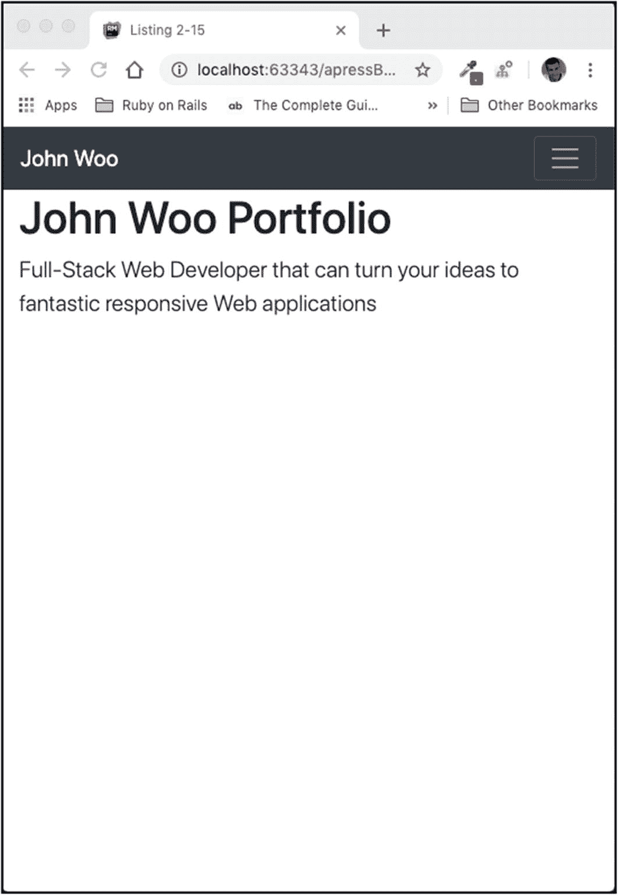

图 3-2

这是一个网站在移动设备上的外观

当用户点击汉堡图标时，菜单展开，如下图(图 [3-3](#Fig3) )。


图 3-3

菜单选项出现在汉堡图标上点击

您将开发这个网页，但同时，您将理解 Twitter 引导类是如何工作的。

## 学习目标

1.  学习一步一步地为你的网站建立一个导航栏。

2.  让导航栏有反应。

3.  了解如何创建一个汉堡包形状的按钮，以及如何使它展开菜单选项。

4.  学习如何让一个段落的内容突出。

5.  了解如何使您的主要内容区域不被导航栏隐藏。

## 介绍

这一章和接下来的章节将会教你框架的概念，同时尝试创建一个项目。让我们从我们的第一个项目开始。

假设我们要构建图 [3-4](#Fig4) 中的如下网站。


图 3-4

目标项目 1—带有顶部导航栏的基本模板

本项目具有以下特点:


图 3-5

这是一个网站在移动设备上的样子

1.  它有一个导航栏。这个导航栏是有反应的。这意味着当你调整浏览器的大小来模拟手机的大小时，你会看到类似图 [3-5](#Fig5) 的东西。

正如你所看到的，菜单选项已经被折叠，变成了一个汉堡包图标。如果用户想要获得菜单选项列表，他们需要点击这个图标(图 [3-6](#Fig6) )。


图 3-6

菜单选项出现在汉堡图标上点击

在这个网站上，你可以从 Twitter Bootstrap 免费获得其他功能。例如，当您将鼠标悬停在选项上时，您会看到选项的颜色和强度会发生变化。

让我们尝试使用 Twitter Bootstrap 从零开始建立这个网站。

## 从 HTML 开始

让我们从基本的 HTML 开始，它包括一个导航栏和一个将成为菜单选项的项目列表，如下所示(清单 [3-1](#PC1) )。

```html
<!DOCTYPE html>
<html lang="en">
<head>
    <!-- Required meta tags -->
    <meta charset="utf-8">
    <meta name="viewport" content="width=device-width, initial-scale=1, shrink-to-fit=no">

    <!-- Bootstrap CSS -->
    <link rel="stylesheet" href="https://stackpath.bootstrapcdn.com/bootstrap/4.4.1/css/bootstrap.min.css" integrity="sha384-Vkoo8x4CGsO3+Hhxv8T/Q5PaXtkKtu6ug5TOeNV6gBiFeWPGFN9MuhOf23Q9Ifjh" crossorigin="anonymous">

    <!-- Custom CSS -->
    <link rel="stylesheet" href="stylesheets/main.css" type="text/css">

    <title>Listing 3-1</title>
</head>
<body>
    <nav>

        <ul>
            <li ><a href="#">Home</a></li>
            <li><a href="#about">About</a></li>
            <li><a href="#contact">Contact</a></li>
        </ul>

    </nav>

    <!-- Optional JavaScript -->
    <!-- jQuery first, then Popper.js, then Bootstrap JS -->
    <script src="https://code.jquery.com/jquery-3.4.1.slim.min.js" integrity="sha384-J6qa4849blE2+poT4WnyKhv5vZF5SrPo0iEjwBvKU7imGFAV0wwj1yYfoRSJoZ+n" crossorigin="anonymous"></script>
    <script src="https://cdn.jsdelivr.net/npm/popper.js@1.16.0/dist/umd/popper.min.js" integrity="sha384-Q6E9RHvbIyZFJoft+2mJbHaEWldlvI9IOYy5n3zV9zzTtmI3UksdQRVvoxMfooAo" crossorigin="anonymous"></script>
    <script src="https://stackpath.bootstrapcdn.com/bootstrap/4.4.1/js/bootstrap.min.js" integrity="sha384-wfSDF2E50Y2D1uUdj0O3uMBJnjuUD4Ih7YwaYd1iqfktj0Uod8GCExl3Og8ifwB6" crossorigin="anonymous"></script>
</body>
</html>

Listing 3-1Starting with a nav Element and List of Menu Items

```

将前面的代码保存到文件`index.html`中，并在浏览器上加载页面。注意引用的`stylesheets/main.css`暂时不包含任何东西。但是创建这个文件以便您的页面可以找到它。

您将看到以下内容(图 [3-7](#Fig7) )。

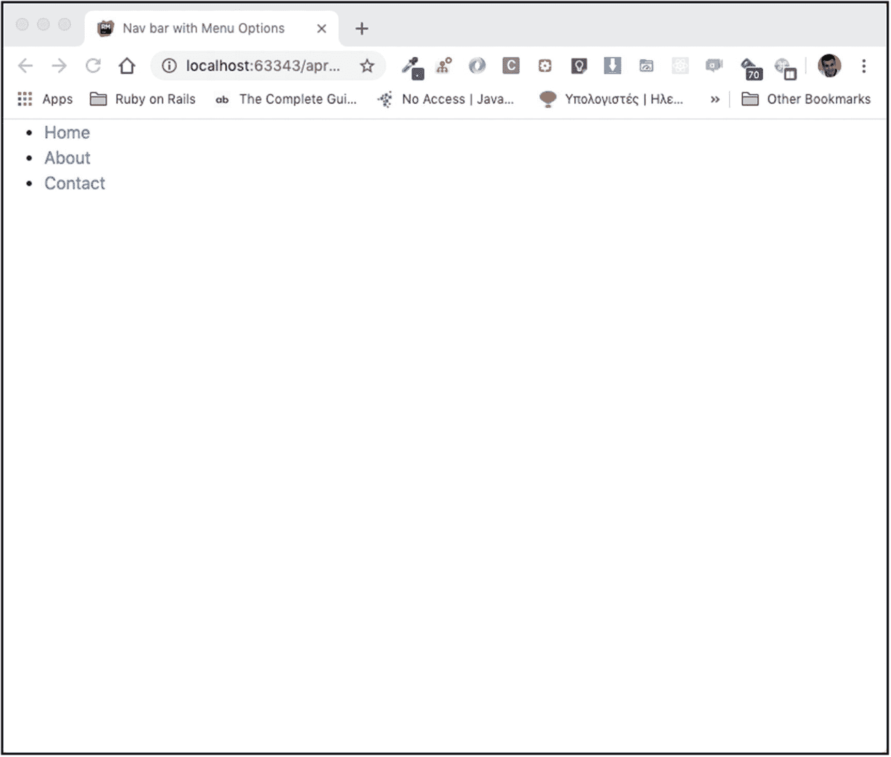

图 3-7

有导航栏和菜单项但没有样式的页面

我想这是意料之中的。`body`元素只包含一个块元素`nav`和一个带有菜单选项的`ul`。注意，我们使用语义 HTML5 元素`nav`，而不仅仅是一个`div`。

### 上课了`nav`

您将首先在保存菜单选项的`ul`元素上添加类`nav`。这将从列表中删除项目符号。进行以下更改。而不是`<ul>,`写`<ul class="nav">`。保存文件并重新加载页面。您将看到以下内容(图 [3-8](#Fig8) )。

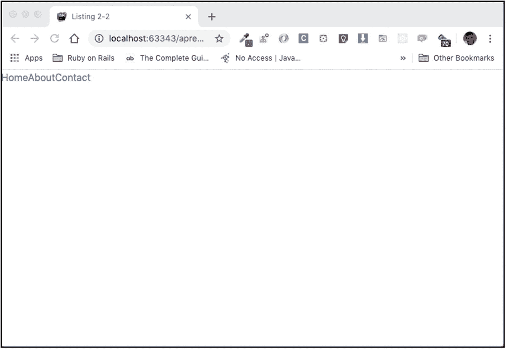

图 3-8

在`ul`元素上添加了类`nav`

### 导航项目和导航链接

现在让我们在菜单项周围留出一些空间，因为现在它们是一个紧挨着一个的。

为了实现这一点，您将在`li`元素上添加类`nav-item`，在锚`a`元素上添加类`nav-link`。阅读清单 [3-2](#PC2) ，看看你的 HTML 页面的当前状态应该是怎样的。

```html
<!DOCTYPE html>
<html lang="en">
<head>
    <!-- Required meta tags -->
    <meta charset="utf-8">
    <meta name="viewport" content="width=device-width, initial-scale=1, shrink-to-fit=no">

    <!-- Bootstrap CSS -->
    <link rel="stylesheet" href="https://stackpath.bootstrapcdn.com/bootstrap/4.4.1/css/bootstrap.min.css" integrity="sha384-Vkoo8x4CGsO3+Hhxv8T/Q5PaXtkKtu6ug5TOeNV6gBiFeWPGFN9MuhOf23Q9Ifjh" crossorigin="anonymous">

    <!-- Custom CSS -->
    <link rel="stylesheet" href="stylesheets/main.css" type="text/css">

    <title>Listing 3-2</title>

</head>
<body>
    <nav>

        <ul class="nav">
            <li class="nav-item">
                <a class="nav-link" href="#">Home</a>
            </li>
            <li class="nav-item">
                <a class="nav-link" href="#about">About</a>
            </li>
            <li class="nav-item">
                <a class="nav-link" href="#contact">Contact</a>
            </li>
        </ul>

    </nav>
    <!-- Optional JavaScript -->
    <!-- jQuery first, then Popper.js, then Bootstrap JS -->
    <script src="https://code.jquery.com/jquery-3.4.1.slim.min.js" integrity="sha384-J6qa4849blE2+poT4WnyKhv5vZF5SrPo0iEjwBvKU7imGFAV0wwj1yYfoRSJoZ+n" crossorigin="anonymous"></script>
    <script src="https://cdn.jsdelivr.net/npm/popper.js@1.16.0/dist/umd/popper.min.js" integrity="sha384-Q6E9RHvbIyZFJoft+2mJbHaEWldlvI9IOYy5n3zV9zzTtmI3UksdQRVvoxMfooAo" crossorigin="anonymous"></script>
    <script src="https://stackpath.bootstrapcdn.com/bootstrap/4.4.1/js/bootstrap.min.js" integrity="sha384-wfSDF2E50Y2D1uUdj0O3uMBJnjuUD4Ih7YwaYd1iqfktj0Uod8GCExl3Og8ifwB6" crossorigin="anonymous"></script>
</body>
</html>

Listing 3-2Menu Items on the Same Line, One Separate from the Other

```

如果您在浏览器上加载前面的页面，您将看到以下内容(图 [3-9](#Fig9) )。

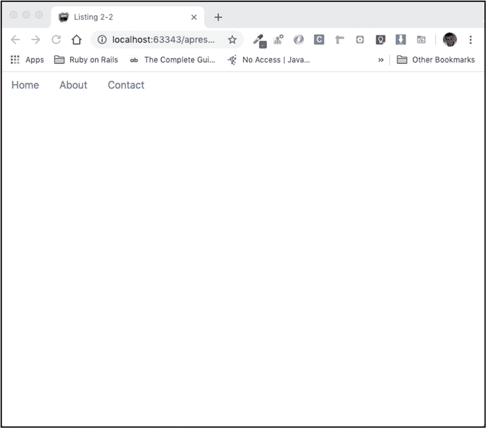

图 3-9

菜单项分开

## 折叠和展开

为了使菜单项列表可折叠，也就是说，在小设备上被替换为汉堡包图标，当点击时，将获得菜单选项，您需要在`nav`元素上添加一个特殊的类，并且您需要用特殊的类将可折叠/可展开的内容包装到一个`div`中，如清单 [3-3](#PC3) 所示。

```html
<!DOCTYPE html>
<html lang="en">
<head>
    <!-- Required meta tags -->
    <meta charset="utf-8">
    <meta name="viewport" content="width=device-width, initial-scale=1, shrink-to-fit=no">

    <!-- Bootstrap CSS -->
    <link rel="stylesheet" href="https://stackpath.bootstrapcdn.com/bootstrap/4.4.1/css/bootstrap.min.css" integrity="sha384-Vkoo8x4CGsO3+Hhxv8T/Q5PaXtkKtu6ug5TOeNV6gBiFeWPGFN9MuhOf23Q9Ifjh" crossorigin="anonymous">

    <!-- Custom CSS -->
    <link rel="stylesheet" href="stylesheets/main.css" type="text/css">

    <title>Listing 3-3</title>
</head>
<body>
    <nav class="navbar-expand-lg">

        <div class="collapse navbar-collapse">
            <ul class="nav">
                <li class="nav-item">
                    <a class="nav-link" href="#">Home</a>
                </li>
                <li class="nav-item">
                    <a class="nav-link" href="#about">About</a>
                </li>
                <li class="nav-item">
                    <a class="nav-link" href="#contact">Contact</a>
                </li>
            </ul>
        </div>

    </nav>
    <!-- Optional JavaScript -->
    <!-- jQuery first, then Popper.js, then Bootstrap JS -->
    <script src="https://code.jquery.com/jquery-3.4.1.slim.min.js" integrity="sha384-J6qa4849blE2+poT4WnyKhv5vZF5SrPo0iEjwBvKU7imGFAV0wwj1yYfoRSJoZ+n" crossorigin="anonymous"></script>
    <script src="https://cdn.jsdelivr.net/npm/popper.js@1.16.0/dist/umd/popper.min.js" integrity="sha384-Q6E9RHvbIyZFJoft+2mJbHaEWldlvI9IOYy5n3zV9zzTtmI3UksdQRVvoxMfooAo" crossorigin="anonymous"></script>
    <script src="https://stackpath.bootstrapcdn.com/bootstrap/4.4.1/js/bootstrap.min.js" integrity="sha384-wfSDF2E50Y2D1uUdj0O3uMBJnjuUD4Ih7YwaYd1iqfktj0Uod8GCExl3Og8ifwB6" crossorigin="anonymous"></script>
</body>
</html>

Listing 3-3Make Menu Options Collapse and Expand

```

为了使菜单选项折叠和展开，您所做的工作如下:

1.  您已经在`nav`元素上添加了类`navbar-expand-lg`。这指示浏览器在`lg`断点处展开内容，即显示大于或等于 992 像素的内容。显然，如果您希望菜单扩展为宽度为> =768px 的显示，您可以使用另一个断点，例如`md`断点。

2.  您已经用类`collapse`和`navbar-collapse`将`ul`元素包装成了一个`div`元素。这使得浏览器知道它需要折叠和展开哪些内容。

如果你将新的 HTML 内容加载到你的浏览器中，并将像素宽度设置为 991px，那么你会看到一个如下图所示的空白页(图 [3-10](#Fig10) )。

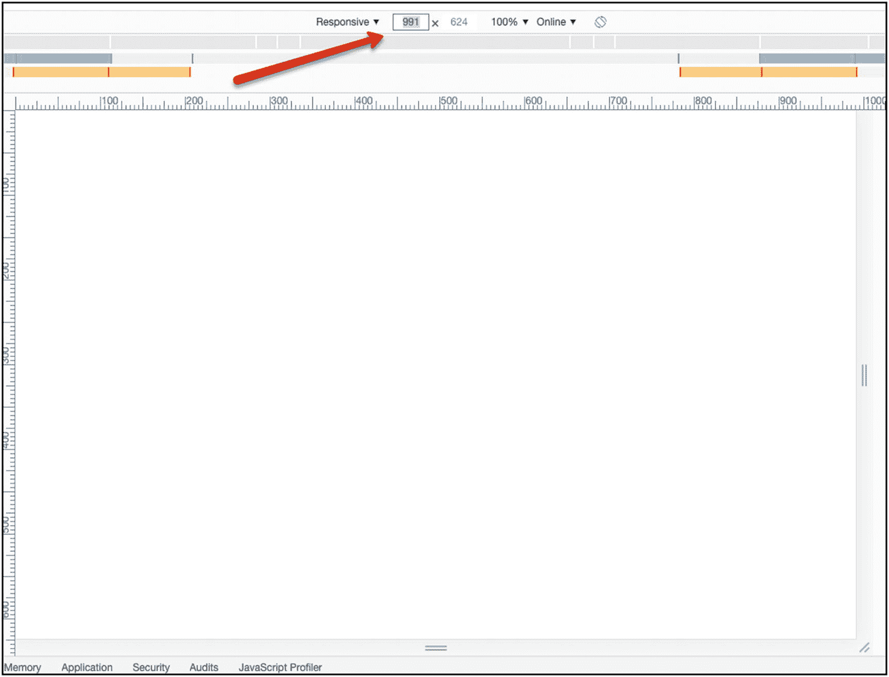

图 3-10

宽度小于 992 像素的空白页

但是，如果您扩展到 992px，那么您会看到菜单选项再次出现(图 [3-11](#Fig11) )。


图 3-11

菜单选项出现在 992px 上

## 品牌链接

如果你回过头再看最后的结果，你会看到有带文本`John Woo`的链接，当页面缩小到移动大小时没有隐藏。它总是可见的，它应该是一个将用户带到网站主页的链接。它不是菜单项列表的一部分。

让我们把它放在可折叠的`div`之上，但是仍然在`nav`元素之内(列表 [3-4](#PC4) )。

```html
<!DOCTYPE html>
<html lang="en">
<head>
    <!-- Required meta tags -->
    <meta charset="utf-8">
    <meta name="viewport" content="width=device-width, initial-scale=1, shrink-to-fit=no">

    <!-- Bootstrap CSS -->
    <link rel="stylesheet" href="https://stackpath.bootstrapcdn.com/bootstrap/4.4.1/css/bootstrap.min.css" integrity="sha384-Vkoo8x4CGsO3+Hhxv8T/Q5PaXtkKtu6ug5TOeNV6gBiFeWPGFN9MuhOf23Q9Ifjh" crossorigin="anonymous">

    <!-- Custom CSS -->
    <link rel="stylesheet" href="stylesheets/main.css" type="text/css">

    <title>Listing 3-4</title>
</head>
<body>
    <nav class="navbar-expand-lg">

        <a href="#">John Woo</a>

        <div class="collapse navbar-collapse">
            <ul class="nav">
                <li class="nav-item">
                    <a class="nav-link" href="#">Home</a>
                </li>
                <li class="nav-item">
                    <a class="nav-link" href="#about">About</a>
                </li>
                <li class="nav-item">
                    <a class="nav-link" href="#contact">Contact</a>
                </li>
            </ul>
        </div>

    </nav>
    <!-- Optional JavaScript -->
    <!-- jQuery first, then Popper.js, then Bootstrap JS -->
    <script src="https://code.jquery.com/jquery-3.4.1.slim.min.js" integrity="sha384-J6qa4849blE2+poT4WnyKhv5vZF5SrPo0iEjwBvKU7imGFAV0wwj1yYfoRSJoZ+n" crossorigin="anonymous"></script>
    <script src="https://cdn.jsdelivr.net/npm/popper.js@1.16.0/dist/umd/popper.min.js" integrity="sha384-Q6E9RHvbIyZFJoft+2mJbHaEWldlvI9IOYy5n3zV9zzTtmI3UksdQRVvoxMfooAo" crossorigin="anonymous"></script>
    <script src="https://stackpath.bootstrapcdn.com/bootstrap/4.4.1/js/bootstrap.min.js" integrity="sha384-wfSDF2E50Y2D1uUdj0O3uMBJnjuUD4Ih7YwaYd1iqfktj0Uod8GCExl3Og8ifwB6" crossorigin="anonymous"></script>
</body>
</html>

Listing 3-4Add the Link That Would Take the User to the Home Page

```

如果您保存前面的代码并重新加载您的页面，您将在左侧看到`John Woo`链接，如果您缩小页面，它仍然可见，不会像菜单选项一样消失(图 [3-12](#Fig12) )。


图 3-12

品牌链接独立于菜单选项

## 让品牌链接突出

左上角的品牌链接需要和菜单在同一层；它需要突出一点。让我们这样做吧

1.  将类`navbar`添加到`nav`包装元素

2.  将类`navbar-brand`添加到锚元素

Caution

`nav`包装元素上的`navbar`类对于导航栏的整体风格至关重要，而不仅仅是品牌链接。

清单 [3-5](#PC5) 是你需要在你的 HTML 页面中拥有的，以使这个工作。

```html
<!DOCTYPE html>
<html lang="en">
<head>
    <!-- Required meta tags -->
    <meta charset="utf-8">
    <meta name="viewport" content="width=device-width, initial-scale=1, shrink-to-fit=no">

    <!-- Bootstrap CSS -->
    <link rel="stylesheet" href="https://stackpath.bootstrapcdn.com/bootstrap/4.4.1/css/bootstrap.min.css" integrity="sha384-Vkoo8x4CGsO3+Hhxv8T/Q5PaXtkKtu6ug5TOeNV6gBiFeWPGFN9MuhOf23Q9Ifjh" crossorigin="anonymous">

    <!-- Custom CSS -->
    <link rel="stylesheet" href="stylesheets/main.css" type="text/css">

    <title>Listing 3-5</title>

</head>
<body>
    <nav class="navbar navbar-expand-lg">

        <a class="navbar-brand" href="#">John Woo</a>

        <div class="collapse navbar-collapse">
            <ul class="nav">
                <li class="nav-item">
                    <a class="nav-link" href="#">Home</a>
                </li>
                <li class="nav-item">
                    <a class="nav-link" href="#about">About</a>
                </li>
                <li class="nav-item">
                    <a class="nav-link" href="#contact">Contact</a>
                </li>
            </ul>
        </div>

    </nav>
    <!-- Optional JavaScript -->
    <!-- jQuery first, then Popper.js, then Bootstrap JS -->
    <script src="https://code.jquery.com/jquery-3.4.1.slim.min.js" integrity="sha384-J6qa4849blE2+poT4WnyKhv5vZF5SrPo0iEjwBvKU7imGFAV0wwj1yYfoRSJoZ+n" crossorigin="anonymous"></script>
    <script src="https://cdn.jsdelivr.net/npm/popper.js@1.16.0/dist/umd/popper.min.js" integrity="sha384-Q6E9RHvbIyZFJoft+2mJbHaEWldlvI9IOYy5n3zV9zzTtmI3UksdQRVvoxMfooAo" crossorigin="anonymous"></script>
    <script src="https://stackpath.bootstrapcdn.com/bootstrap/4.4.1/js/bootstrap.min.js" integrity="sha384-wfSDF2E50Y2D1uUdj0O3uMBJnjuUD4Ih7YwaYd1iqfktj0Uod8GCExl3Og8ifwB6" crossorigin="anonymous"></script>
</body>
</html>

Listing 3-5Brand Link on the Same Line and Standing Out

```

如果您在浏览器上加载前面的 HTML 页面，您将看到图 [3-13](#Fig13) 所示的内容。


图 3-13

左侧突出的品牌链接

## 给你的导航条添加一些颜色

让我们给你的导航条添加一些颜色。为了做到这一点，你必须

1.  在`nav`元素中使用`navbar-dark`或`navbar-light`类之一。

2.  将它与背景颜色实用程序类结合起来。

前者主要处理字体颜色，而后者处理背景颜色。通常你想将`*-dark`类与深色背景色结合，将`*-light`类与浅色背景色结合。

背景颜色实用程序在图 [3-14](#Fig14) 中列出。


图 3-14

背景颜色实用程序类

Caution

颜色类`navbar-dark`和`navbar-light`被设计成期望`ul`元素拥有类`navbar-nav`。所以我们也要加上这个。

在清单 [3-6](#PC6) 中，我们应用了`bg-dark`背景颜色工具类，结合了导航栏的`navbar-dark`配色方案。我们还将类`navbar-nav`添加到`ul`元素中。

```html
<!DOCTYPE html>
<html lang="en">
<head>
    <!-- Required meta tags -->
    <meta charset="utf-8">
    <meta name="viewport" content="width=device-width, initial-scale=1, shrink-to-fit=no">

    <!-- Bootstrap CSS -->
    <link rel="stylesheet" href="https://stackpath.bootstrapcdn.com/bootstrap/4.4.1/css/bootstrap.min.css" integrity="sha384-Vkoo8x4CGsO3+Hhxv8T/Q5PaXtkKtu6ug5TOeNV6gBiFeWPGFN9MuhOf23Q9Ifjh" crossorigin="anonymous">

    <!-- Custom CSS -->
    <link rel="stylesheet" href="stylesheets/main.css" type="text/css">

    <title>Listing 3-6</title>

</head>
<body>
    <nav class="navbar navbar-expand-lg navbar-dark bg-dark">

        <a class="navbar-brand" href="#">John Woo</a>

        <div class="collapse navbar-collapse">
            <ul class="navbar-nav nav">
                <li class="nav-item">
                    <a class="nav-link" href="#">Home</a>
                </li>
                <li class="nav-item">
                    <a class="nav-link" href="#about">About</a>
                </li>
                <li class="nav-item">
                    <a class="nav-link" href="#contact">Contact</a>
                </li>
            </ul>
        </div>

    </nav>
    <!-- Optional JavaScript -->
    <!-- jQuery first, then Popper.js, then Bootstrap JS -->
    <script src="https://code.jquery.com/jquery-3.4.1.slim.min.js" integrity="sha384-J6qa4849blE2+poT4WnyKhv5vZF5SrPo0iEjwBvKU7imGFAV0wwj1yYfoRSJoZ+n" crossorigin="anonymous"></script>
    <script src="https://cdn.jsdelivr.net/npm/popper.js@1.16.0/dist/umd/popper.min.js" integrity="sha384-Q6E9RHvbIyZFJoft+2mJbHaEWldlvI9IOYy5n3zV9zzTtmI3UksdQRVvoxMfooAo" crossorigin="anonymous"></script>
    <script src="https://stackpath.bootstrapcdn.com/bootstrap/4.4.1/js/bootstrap.min.js" integrity="sha384-wfSDF2E50Y2D1uUdj0O3uMBJnjuUD4Ih7YwaYd1iqfktj0Uod8GCExl3Og8ifwB6" crossorigin="anonymous"></script>
</body>
</html>

Listing 3-6Coloring the Navigation Bar

```

如果您在浏览器上加载前面的 HTML 页面，您将看到图 [3-15](#Fig15) 所示的内容。

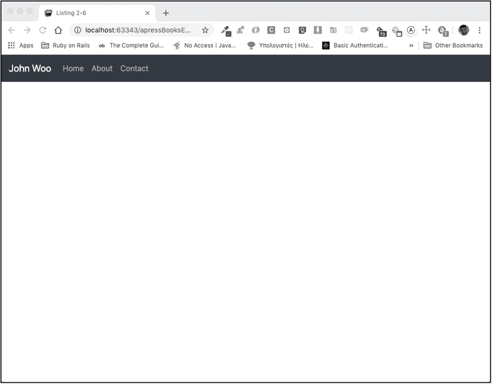

图 3-15

给导航栏着色

另外，将鼠标指针悬停在菜单选项上。你会看到链接变得越来越轻。

## 在小型设备上添加按钮以展开菜单选项

让我们添加一个按钮。这将被点击以展开小型设备上的菜单选项。参见清单 [3-7](#PC7) 。

```html
<!DOCTYPE html>
<html lang="en">
<head>
    <!-- Required meta tags -->
    <meta charset="utf-8">
    <meta name="viewport" content="width=device-width, initial-scale=1, shrink-to-fit=no">

    <!-- Bootstrap CSS -->
    <link rel="stylesheet" href="https://stackpath.bootstrapcdn.com/bootstrap/4.4.1/css/bootstrap.min.css" integrity="sha384-Vkoo8x4CGsO3+Hhxv8T/Q5PaXtkKtu6ug5TOeNV6gBiFeWPGFN9MuhOf23Q9Ifjh" crossorigin="anonymous">

    <!-- Custom CSS -->
    <link rel="stylesheet" href="stylesheets/main.css" type="text/css">

    <title>Listing 3-7</title>
</head>
<body>
    <nav class="navbar navbar-expand-lg navbar-dark bg-dark">

        <a class="navbar-brand" href="#">John Woo</a>

        <button type="button">
        </button>

        <div class="collapse navbar-collapse">
            <ul class="nav navbar-nav">
                <li class="nav-item">
                    <a class="nav-link" href="#">Home</a>
                </li>
                <li class="nav-item">
                    <a class="nav-link" href="#about">About</a>
                </li>
                <li class="nav-item">
                    <a class="nav-link" href="#contact">Contact</a>
                </li>
            </ul>
        </div>

    </nav>
    <!-- Optional JavaScript -->
    <!-- jQuery first, then Popper.js, then Bootstrap JS -->
    <script src="https://code.jquery.com/jquery-3.4.1.slim.min.js" integrity="sha384-J6qa4849blE2+poT4WnyKhv5vZF5SrPo0iEjwBvKU7imGFAV0wwj1yYfoRSJoZ+n" crossorigin="anonymous"></script>
    <script src="https://cdn.jsdelivr.net/npm/popper.js@1.16.0/dist/umd/popper.min.js" integrity="sha384-Q6E9RHvbIyZFJoft+2mJbHaEWldlvI9IOYy5n3zV9zzTtmI3UksdQRVvoxMfooAo" crossorigin="anonymous"></script>
    <script src="https://stackpath.bootstrapcdn.com/bootstrap/4.4.1/js/bootstrap.min.js" integrity="sha384-wfSDF2E50Y2D1uUdj0O3uMBJnjuUD4Ih7YwaYd1iqfktj0Uod8GCExl3Og8ifwB6" crossorigin="anonymous"></script>
</body>
</html>

Listing 3-7Add a Button That Will Toggle the Menu On and Off on Small Devices

```

您已经将按钮添加为品牌锚的同级，但是在它之后。如果您在浏览器上加载该 HTML 页面，您将看到以下内容(图 [3-16](#Fig16) )。

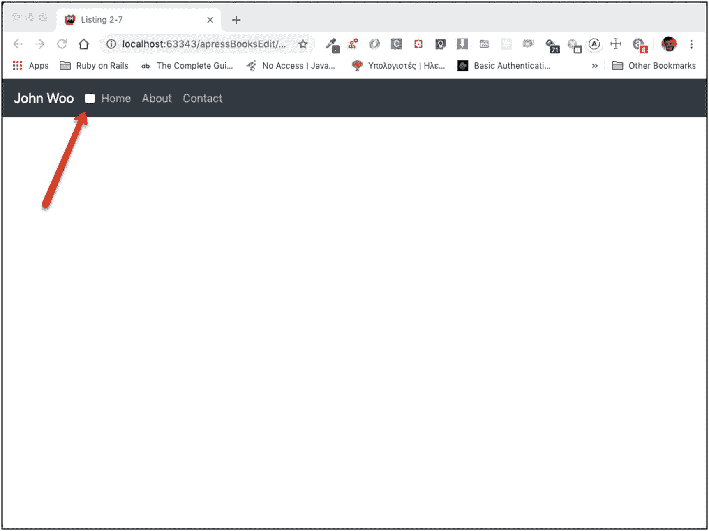

图 3-16

打开和关闭菜单的非样式按钮

这太糟糕了。确实如此。但这是一个开始。

### 使按钮只出现在小型设备上

目前，按钮的问题是它总是出现。您希望它只出现在宽度小于您在`nav`元素上设置的扩展断点的设备上。您设置的断点是`lg`，这意味着您希望按钮出现在宽度为< 992px 的显示器上。

为了做到这一点，您可以添加类`navbar-toggler`。就这么办吧。参见清单 [3-8](#PC8) 。

```html
<!DOCTYPE html>
<html lang="en">
<head>
    <!-- Required meta tags -->
    <meta charset="utf-8">
    <meta name="viewport" content="width=device-width, initial-scale=1, shrink-to-fit=no">

    <!-- Bootstrap CSS -->
    <link rel="stylesheet" href="https://stackpath.bootstrapcdn.com/bootstrap/4.4.1/css/bootstrap.min.css" integrity="sha384-Vkoo8x4CGsO3+Hhxv8T/Q5PaXtkKtu6ug5TOeNV6gBiFeWPGFN9MuhOf23Q9Ifjh" crossorigin="anonymous">

    <!-- Custom CSS -->
    <link rel="stylesheet" href="stylesheets/main.css" type="text/css">

    <title>Listing 3-8</title>
</head>
<body>
    <nav class="navbar navbar-expand-lg navbar-dark bg-dark">

        <a class="navbar-brand" href="#">John Woo</a>

        <button type="button" class="navbar-toggler">
        </button>

        <div class="collapse navbar-collapse">
            <ul class="nav navbar-nav">
                <li class="nav-item">
                    <a class="nav-link" href="#">Home</a>
                </li>
                <li class="nav-item">
                    <a class="nav-link" href="#about">About</a>
                </li>
                <li class="nav-item">
                    <a class="nav-link" href="#contact">Contact</a>
                </li>
            </ul>
        </div>

    </nav>
    <!-- Optional JavaScript -->
    <!-- jQuery first, then Popper.js, then Bootstrap JS -->
    <script src="https://code.jquery.com/jquery-3.4.1.slim.min.js" integrity="sha384-J6qa4849blE2+poT4WnyKhv5vZF5SrPo0iEjwBvKU7imGFAV0wwj1yYfoRSJoZ+n" crossorigin="anonymous"></script>
    <script src="https://cdn.jsdelivr.net/npm/popper.js@1.16.0/dist/umd/popper.min.js" integrity="sha384-Q6E9RHvbIyZFJoft+2mJbHaEWldlvI9IOYy5n3zV9zzTtmI3UksdQRVvoxMfooAo" crossorigin="anonymous"></script>
    <script src="https://stackpath.bootstrapcdn.com/bootstrap/4.4.1/js/bootstrap.min.js" integrity="sha384-wfSDF2E50Y2D1uUdj0O3uMBJnjuUD4Ih7YwaYd1iqfktj0Uod8GCExl3Og8ifwB6" crossorigin="anonymous"></script>
</body>
</html>

Listing 3-8Make the Button Appear Only on Widths Below the Expanded Breakpoint

```

现在，当您的显示器> =992px 时，该按钮不会出现(图 [3-17](#Fig17) )。

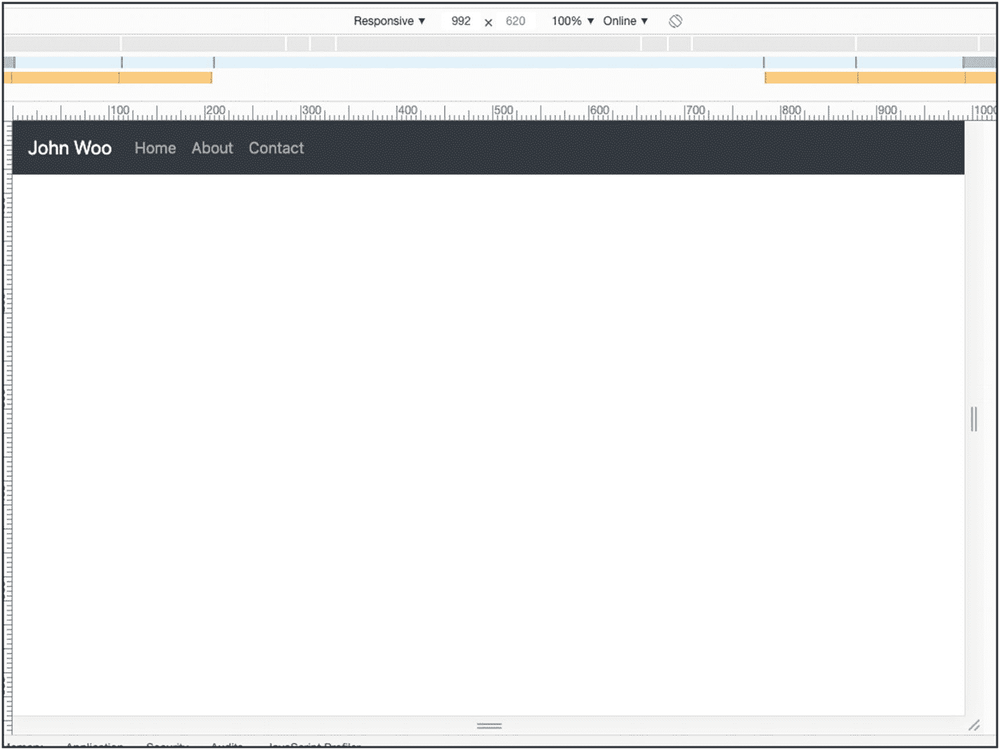

图 3-17

菜单可见；用于切换的按钮不可见(> =992px)

当你缩小 1 个像素，到 991px，那么你会看到菜单消失，按钮出现(图 [3-18](#Fig18) )。


图 3-18

菜单隐藏，但按钮存在(< 992 像素)

按钮以一种很难看到的方式出现。这是固定的下一步。

### 创建汉堡图标

这个按钮在小设备上看起来不太好，这是因为它里面没有实际的内容。为了创建汉堡的视觉图标，Twitter Bootstrap 为您提供了类`navbar-toggler-icon`。您需要将它应用到`button`元素中的`span`元素上。参见清单 [3-9](#PC9) 。

```html
<!DOCTYPE html>
<html lang="en">
<head>
    <!-- Required meta tags -->
    <meta charset="utf-8">
    <meta name="viewport" content="width=device-width, initial-scale=1, shrink-to-fit=no">

    <!-- Bootstrap CSS -->
    <link rel="stylesheet" href="https://stackpath.bootstrapcdn.com/bootstrap/4.4.1/css/bootstrap.min.css" integrity="sha384-Vkoo8x4CGsO3+Hhxv8T/Q5PaXtkKtu6ug5TOeNV6gBiFeWPGFN9MuhOf23Q9Ifjh" crossorigin="anonymous">

    <!-- Custom CSS -->
    <link rel="stylesheet" href="stylesheets/main.css" type="text/css">

    <title>Listing 3-9</title>
</head>
<body>
    <nav class="navbar navbar-expand-lg navbar-dark bg-dark">

        <a class="navbar-brand" href="#">John Woo</a>

        <button type="button" class="navbar-toggler">
            <span class="navbar-toggler-icon"></span>
        </button>

        <div class="collapse navbar-collapse">
            <ul class="nav navbar-nav">
                <li class="nav-item">
                    <a class="nav-link" href="#">Home</a>
                </li>
                <li class="nav-item">
                    <a class="nav-link" href="#about">About</a>
                </li>
                <li class="nav-item">
                    <a class="nav-link" href="#contact">Contact</a>
                </li>
            </ul>
        </div>

    </nav>
    <!-- Optional JavaScript -->
    <!-- jQuery first, then Popper.js, then Bootstrap JS -->
    <script src="https://code.jquery.com/jquery-3.4.1.slim.min.js" integrity="sha384-J6qa4849blE2+poT4WnyKhv5vZF5SrPo0iEjwBvKU7imGFAV0wwj1yYfoRSJoZ+n" crossorigin="anonymous"></script>
    <script src="https://cdn.jsdelivr.net/npm/popper.js@1.16.0/dist/umd/popper.min.js" integrity="sha384-Q6E9RHvbIyZFJoft+2mJbHaEWldlvI9IOYy5n3zV9zzTtmI3UksdQRVvoxMfooAo" crossorigin="anonymous"></script>
    <script src="https://stackpath.bootstrapcdn.com/bootstrap/4.4.1/js/bootstrap.min.js" integrity="sha384-wfSDF2E50Y2D1uUdj0O3uMBJnjuUD4Ih7YwaYd1iqfktj0Uod8GCExl3Og8ifwB6" crossorigin="anonymous"></script>
</body>
</html>

Listing 3-9Creating the Hamburger Icon

```

如果在宽度为 991 像素的显示器上加载前面的 HTML 页面，您将看到以下内容(图 [3-19](#Fig19) )。


图 3-19

汉堡图标现在出现

### 向按钮添加行为

如果你试着点击汉堡包按钮，什么也不会发生。您现在需要向按钮添加行为。单击该按钮时，菜单选项会展开。您将通过向`button`元素添加两个`data-*`属性来实现这一点:

*   `data-toggle="collapse"`，它告诉 Twitter Bootstrap 这个按钮用于折叠/展开 HTML 文档的特定区域

*   `data-target="#navbar"`，它告诉 Twitter Bootstrap 需要折叠/展开的特定区域是用 CSS 选择器`#navbar`选择的区域。当然，由于在您的 HTML 文档中没有这样的元素(id 为`navbar`)，但是您想要折叠/展开的元素是保存菜单项列表的容器，您将向这个特定的`div`添加值为`navbar`的`id`属性。让我们这样做(清单 [3-10](#PC10) )。

```html
<!DOCTYPE html>
<html lang="en">
<head>
    <!-- Required meta tags -->
    <meta charset="utf-8">
    <meta name="viewport" content="width=device-width, initial-scale=1, shrink-to-fit=no">

    <!-- Bootstrap CSS -->
    <link rel="stylesheet" href="https://stackpath.bootstrapcdn.com/bootstrap/4.4.1/css/bootstrap.min.css" integrity="sha384-Vkoo8x4CGsO3+Hhxv8T/Q5PaXtkKtu6ug5TOeNV6gBiFeWPGFN9MuhOf23Q9Ifjh" crossorigin="anonymous">

    <!-- Custom CSS -->
    <link rel="stylesheet" href="stylesheets/main.css" type="text/css">

    <title>Listing 3-10</title>
</head>
<body>
    <nav class="navbar navbar-expand-lg navbar-dark bg-dark">

        <a class="navbar-brand" href="#">John Woo</a>

        <button type="button" class="navbar-toggler" data-toggle="collapse" data-target="#navbar">
            <span class="navbar-toggler-icon"></span>
        </button>

        <div class="collapse navbar-collapse" id="navbar">
            <ul class="nav navbar-nav">
                <li class="nav-item">
                    <a class="nav-link" href="#">Home</a>
                </li>
                <li class="nav-item">
                    <a class="nav-link" href="#about">About</a>
                </li>
                <li class="nav-item">
                    <a class="nav-link" href="#contact">Contact</a>
                </li>
            </ul>
        </div>

    </nav>

    <!-- Optional JavaScript -->
    <!-- jQuery first, then Popper.js, then Bootstrap JS -->
    <script src="https://code.jquery.com/jquery-3.4.1.slim.min.js" integrity="sha384-J6qa4849blE2+poT4WnyKhv5vZF5SrPo0iEjwBvKU7imGFAV0wwj1yYfoRSJoZ+n" crossorigin="anonymous"></script>
    <script src="https://cdn.jsdelivr.net/npm/popper.js@1.16.0/dist/umd/popper.min.js" integrity="sha384-Q6E9RHvbIyZFJoft+2mJbHaEWldlvI9IOYy5n3zV9zzTtmI3UksdQRVvoxMfooAo" crossorigin="anonymous"></script>
    <script src="https://stackpath.bootstrapcdn.com/bootstrap/4.4.1/js/bootstrap.min.js" integrity="sha384-wfSDF2E50Y2D1uUdj0O3uMBJnjuUD4Ih7YwaYd1iqfktj0Uod8GCExl3Og8ifwB6" crossorigin="anonymous"></script>
</body>
</html>

Listing 3-10Make the Button Toggle the Menu

```

如果您保存前面的内容并在浏览器上加载页面，您现在将会看到该按钮可以打开和关闭菜单。在图 [3-20](#Fig20) 中，我展示了菜单展开后的样子。

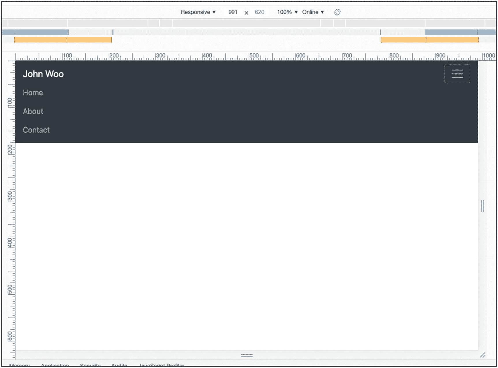

图 3-20

单击按钮后展开的菜单

## 对我们的导航栏的最后润色

*   `fixed-top` on `nav`元素将固定导航栏在页面顶部的位置。

*   您还将添加一些元素和属性，以使整个导航栏准备好用于辅助技术，例如，屏幕阅读器。

*   您还将把类`active`添加到第一个菜单项中，以表明您位于该链接所对应的页面上。

这是你的页面的最终版本，导航栏已经准备好了(清单 [3-11](#PC11) )。

```html
<!DOCTYPE html>
<html lang="en">
<head>
    <!-- Required meta tags -->
    <meta charset="utf-8">
    <meta name="viewport" content="width=device-width, initial-scale=1, shrink-to-fit=no">

    <!-- Bootstrap CSS -->
    <link rel="stylesheet" href="https://stackpath.bootstrapcdn.com/bootstrap/4.4.1/css/bootstrap.min.css" integrity="sha384-Vkoo8x4CGsO3+Hhxv8T/Q5PaXtkKtu6ug5TOeNV6gBiFeWPGFN9MuhOf23Q9Ifjh" crossorigin="anonymous">

    <!-- Custom CSS -->
    <link rel="stylesheet" href="stylesheets/main.css" type="text/css">

    <title>Listing 3-11</title>
</head>
<body>
    <nav class="navbar navbar-expand-lg navbar-dark bg-dark fixed-top">
        <a class="navbar-brand" href="#">John Woo</a>

        <button type="button" class="navbar-toggler" data-toggle="collapse" data-target="#navbar"
                aria-controls="navbar"
                aria-expanded="false"
                aria-label="Toggle navigation">
            <span class="navbar-toggler-icon"></span>
        </button>

        <div class="collapse navbar-collapse" id="navbar">
            <ul class="nav navbar-nav">
                <li class="nav-item">
                    <a class="nav-link active" href="#">Home <span class="sr-only">(current)</span></a>
                </li>
                <li class="nav-item">
                    <a class="nav-link" href="#about">About</a>
                </li>
                <li class="nav-item">
                    <a class="nav-link" href="#contact">Contact</a>
                </li>
            </ul>
        </div>
    </nav>

    <!-- Optional JavaScript -->
    <!-- jQuery first, then Popper.js, then Bootstrap JS -->
    <script src="https://code.jquery.com/jquery-3.4.1.slim.min.js" integrity="sha384-J6qa4849blE2+poT4WnyKhv5vZF5SrPo0iEjwBvKU7imGFAV0wwj1yYfoRSJoZ+n" crossorigin="anonymous"></script>
    <script src="https://cdn.jsdelivr.net/npm/popper.js@1.16.0/dist/umd/popper.min.js" integrity="sha384-Q6E9RHvbIyZFJoft+2mJbHaEWldlvI9IOYy5n3zV9zzTtmI3UksdQRVvoxMfooAo" crossorigin="anonymous"></script>
    <script src="https://stackpath.bootstrapcdn.com/bootstrap/4.4.1/js/bootstrap.min.js" integrity="sha384-wfSDF2E50Y2D1uUdj0O3uMBJnjuUD4Ih7YwaYd1iqfktj0Uod8GCExl3Og8ifwB6" crossorigin="anonymous"></script>
</body>
</html>

Listing 3-11Final HTML Page

```

如果保存前面的内容并在 992 像素宽的显示器上加载页面，您将看到图 [3-21](#Fig21) 。

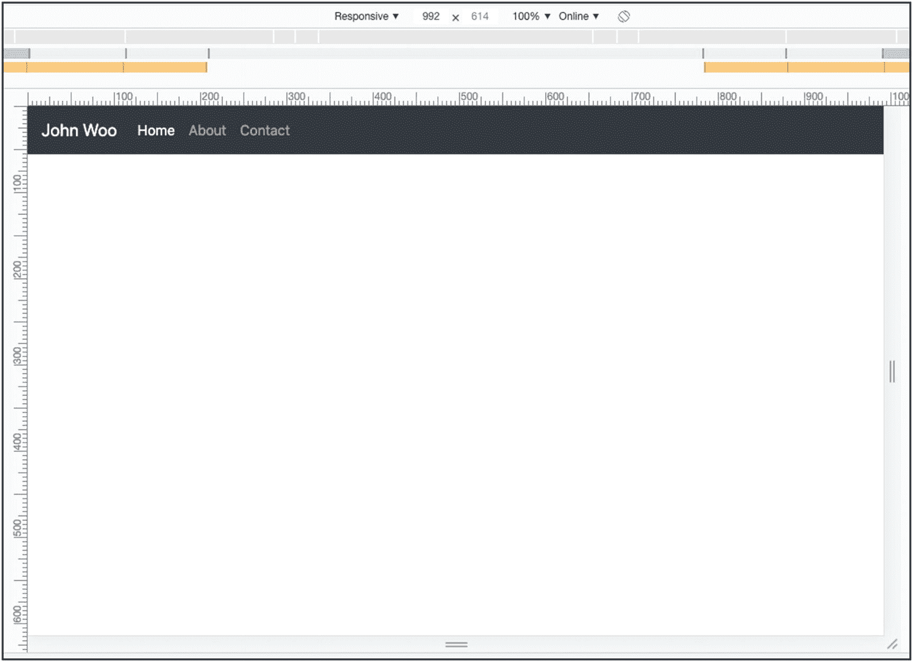

图 3-21

992px 上带有导航栏的最终页面

你的导航栏工作得很好，你没有写一行 CSS 或 JavaScript 代码。是不是很神奇？这都要感谢 Twitter Bootstrap。

## 添加主要内容

您已经添加/创建了导航栏。现在让我们添加页面的主要内容(清单 [3-12](#PC12) )。

```html
<!DOCTYPE html>
<html lang="en">
<head>
    <!-- Required meta tags -->
    <meta charset="utf-8">
    <meta name="viewport" content="width=device-width, initial-scale=1, shrink-to-fit=no">

    <!-- Bootstrap CSS -->
    <link rel="stylesheet" href="https://stackpath.bootstrapcdn.com/bootstrap/4.4.1/css/bootstrap.min.css" integrity="sha384-Vkoo8x4CGsO3+Hhxv8T/Q5PaXtkKtu6ug5TOeNV6gBiFeWPGFN9MuhOf23Q9Ifjh" crossorigin="anonymous">

    <!-- Custom CSS -->
    <link rel="stylesheet" href="stylesheets/main.css" type="text/css">

    <title>Listing 3-12</title>
</head>
<body>
    <nav class="navbar navbar-expand-lg navbar-dark bg-dark fixed-top">
        <a class="navbar-brand" href="#">John Woo</a>

        <button type="button" class="navbar-toggler" data-toggle="collapse" data-target="#navbar"
                aria-controls="navbar"
                aria-expanded="false"
                aria-label="Toggle navigation">
            <span class="navbar-toggler-icon"></span>
        </button>

        <div class="collapse navbar-collapse" id="navbar">
            <ul class="nav navbar-nav">
                <li class="nav-item">
                    <a class="nav-link active" href="#">Home <span class="sr-only">(current)</span></a>
                </li>
                <li class="nav-item">
                    <a class="nav-link" href="#about">About</a>
                </li>
                <li class="nav-item">
                    <a class="nav-link" href="#contact">Contact</a>
                </li>
            </ul>
        </div>
    </nav>

    <div class="container">

        <h1>John Woo Portfolio</h1>
        <p>Full-Stack Web Developer that can turn your ideas to fantastic responsive Web applications</p>

    </div>

    <!-- Optional JavaScript -->
    <!-- jQuery first, then Popper.js, then Bootstrap JS -->
    <script src="https://code.jquery.com/jquery-3.4.1.slim.min.js" integrity="sha384-J6qa4849blE2+poT4WnyKhv5vZF5SrPo0iEjwBvKU7imGFAV0wwj1yYfoRSJoZ+n" crossorigin="anonymous"></script>
    <script src="https://cdn.jsdelivr.net/npm/popper.js@1.16.0/dist/umd/popper.min.js" integrity="sha384-Q6E9RHvbIyZFJoft+2mJbHaEWldlvI9IOYy5n3zV9zzTtmI3UksdQRVvoxMfooAo" crossorigin="anonymous"></script>
    <script src="https://stackpath.bootstrapcdn.com/bootstrap/4.4.1/js/bootstrap.min.js" integrity="sha384-wfSDF2E50Y2D1uUdj0O3uMBJnjuUD4Ih7YwaYd1iqfktj0Uod8GCExl3Og8ifwB6" crossorigin="anonymous"></script>
</body>
</html>

Listing 3-12We Add the Main Content

```

您已经在`nav`元素下面添加了一个带有类`container`的`div`。在这个新的`div`中，您添加了一个`h1`和一个`p`元素，其中包含一些内容。

让我们保存内容并在浏览器上加载页面。您将看到以下内容(图 [3-22](#Fig22) )。


图 3-22

隐藏在顶部导航栏后面的主要内容

我猜你能看出问题所在。`h1`标题隐藏在顶部导航栏的后面。

为了解决这个问题，我们必须添加一些自定义的 CSS。你将不得不要求`body`把它的实际内容放在顶部以下很多像素的位置，就像导航条的高度一样。图 [3-23](#Fig23) 描述了如何在开发者工具的帮助下找出顶部导航栏的高度。

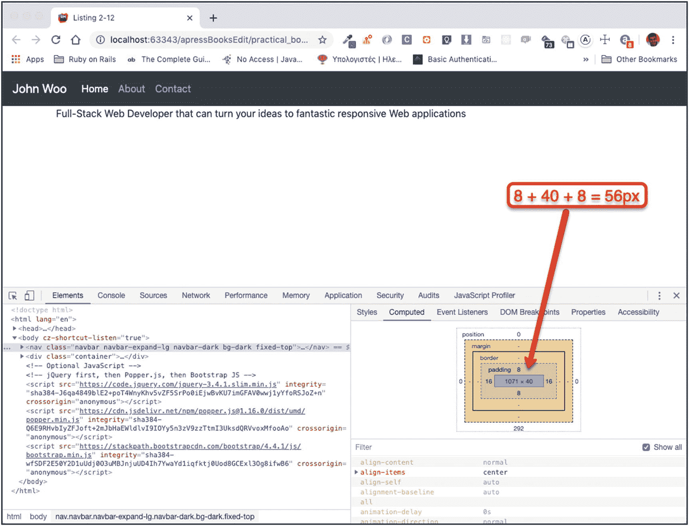

图 3-23

计算顶部导航栏的高度

从开发者工具中可以看到，顶部导航栏的高度是 56px，通过添加顶部和底部填充和内容高度计算得出。

有了 56px，让我们在`stylesheets/main.css`文件中添加一些内容(列出 [3-13](#PC13) )。

```html
body {
    padding-top: 56px;
}

Listing 3-13Content of the main.css File

```

现在，如果你再次加载你的页面(确保它引用了`stylesheets/main.css`)，它将看起来如下(图 [3-24](#Fig24) )。

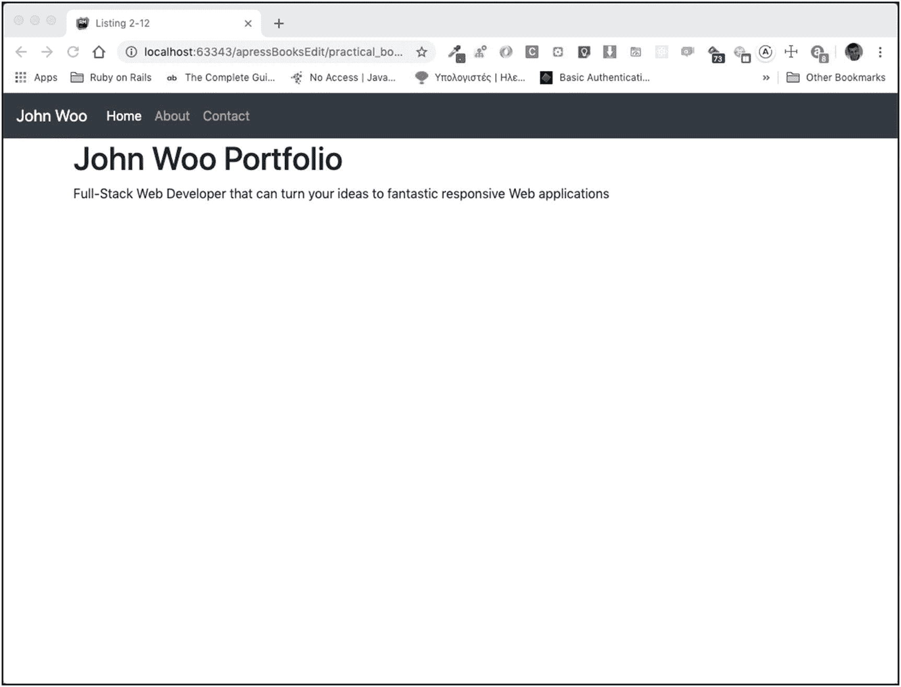

图 3-24

h1 现在可见

## 突出段落内容

与原网站有一些小的不同。一种是段落内容是普通的、正常大小的文本。你想让它突出。您将为此使用类`lead`(再次由 Twitter Bootstrap 提供给我们)。

让`p`元素拥有那个类(清单 [3-14](#PC14) )。

```html
<!DOCTYPE html>
<html lang="en">
<head>
    <!-- Required meta tags -->
    <meta charset="utf-8">
    <meta name="viewport" content="width=device-width, initial-scale=1, shrink-to-fit=no">

    <!-- Bootstrap CSS -->
    <link rel="stylesheet" href="https://stackpath.bootstrapcdn.com/bootstrap/4.4.1/css/bootstrap.min.css" integrity="sha384-Vkoo8x4CGsO3+Hhxv8T/Q5PaXtkKtu6ug5TOeNV6gBiFeWPGFN9MuhOf23Q9Ifjh" crossorigin="anonymous">

    <!-- Custom CSS -->
    <link rel="stylesheet" href="stylesheets/main.css" type="text/css">

    <title>Listing 3-14</title>
</head>
<body>
    <nav class="navbar navbar-expand-lg navbar-dark bg-dark fixed-top">
        <a class="navbar-brand" href="#">John Woo</a>

        <button type="button" class="navbar-toggler" data-toggle="collapse" data-target="#navbar"
                aria-controls="navbar"
                aria-expanded="false"
                aria-label="Toggle navigation">
            <span class="navbar-toggler-icon"></span>
        </button>

        <div class="collapse navbar-collapse" id="navbar">
            <ul class="nav navbar-nav">
                <li class="nav-item">
                    <a class="nav-link active" href="#">Home <span class="sr-only">(current)</span></a>
                </li>
                <li class="nav-item">
                    <a class="nav-link" href="#about">About</a>
                </li>
                <li class="nav-item">
                    <a class="nav-link" href="#contact">Contact</a>
                </li>
            </ul>
        </div>
    </nav>

    <div class="container">

        <h1>John Woo Portfolio</h1>
        <p class="lead">Full-Stack Web Developer that can turn your ideas to fantastic responsive Web applications</p>

    </div>

    <!-- Optional JavaScript -->
    <!-- jQuery first, then Popper.js, then Bootstrap JS -->
    <script src="https://code.jquery.com/jquery-3.4.1.slim.min.js" integrity="sha384-J6qa4849blE2+poT4WnyKhv5vZF5SrPo0iEjwBvKU7imGFAV0wwj1yYfoRSJoZ+n" crossorigin="anonymous"></script>
    <script src="https://cdn.jsdelivr.net/npm/popper.js@1.16.0/dist/umd/popper.min.js" integrity="sha384-Q6E9RHvbIyZFJoft+2mJbHaEWldlvI9IOYy5n3zV9zzTtmI3UksdQRVvoxMfooAo" crossorigin="anonymous"></script>
    <script src="https://stackpath.bootstrapcdn.com/bootstrap/4.4.1/js/bootstrap.min.js" integrity="sha384-wfSDF2E50Y2D1uUdj0O3uMBJnjuUD4Ih7YwaYd1iqfktj0Uod8GCExl3Og8ifwB6" crossorigin="anonymous"></script>
</body>
</html>

Listing 3-14Make the Paragraph Stand Out

```

如果您保存并再次加载您的页面，您将会看到图 [3-25](#Fig25) 。

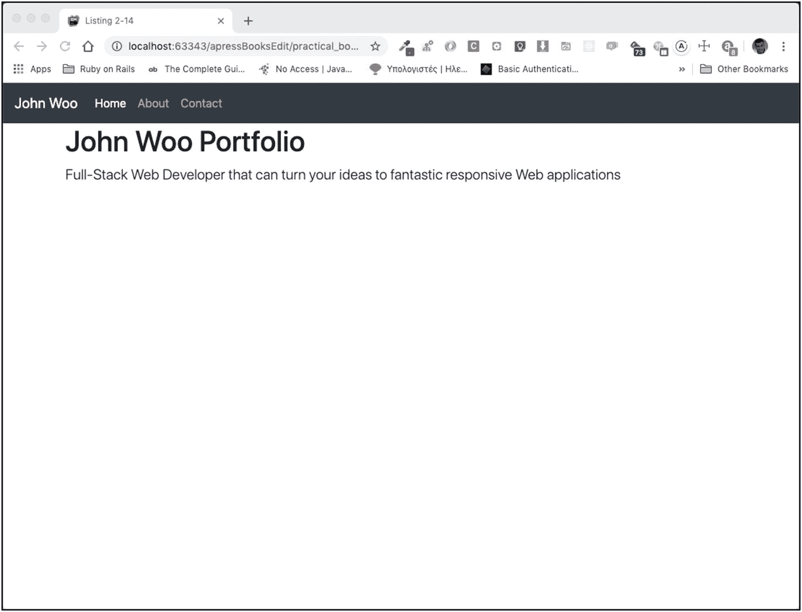

图 3-25

段落突出

## 将导航栏内容与主页内容对齐

到目前为止，一切顺利，但是还有一个问题需要解决。导航栏的内容与页面的主要内容不一致。见图 [3-26](#Fig26) 中的问题。

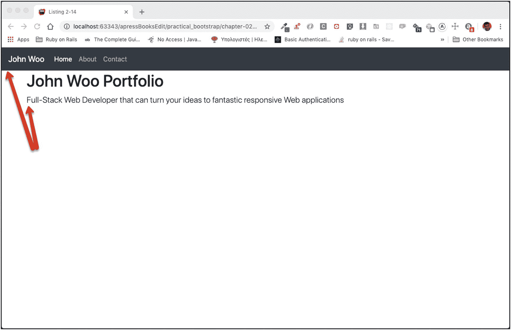

图 3-26

导航栏内容与主页内容不对齐

您可以通过用类`container`将导航栏内容包装到一个`div`中来解决这个问题，就像您对页面主要内容所做的那样(清单 [3-15](#PC15) )。

```html
<!DOCTYPE html>
<html lang="en">
<head>
    <!-- Required meta tags -->
    <meta charset="utf-8">
    <meta name="viewport" content="width=device-width, initial-scale=1, shrink-to-fit=no">

    <!-- Bootstrap CSS -->
    <link rel="stylesheet" href="https://stackpath.bootstrapcdn.com/bootstrap/4.4.1/css/bootstrap.min.css" integrity="sha384-Vkoo8x4CGsO3+Hhxv8T/Q5PaXtkKtu6ug5TOeNV6gBiFeWPGFN9MuhOf23Q9Ifjh" crossorigin="anonymous">

    <!-- Custom CSS -->
    <link rel="stylesheet" href="stylesheets/main.css" type="text/css">

    <title>Listing 3-15</title>
</head>
<body>
    <nav class="navbar navbar-expand-lg navbar-dark bg-dark fixed-top">
        <div class="container">
            <a class="navbar-brand" href="#">John Woo</a>

            <button type="button" class="navbar-toggler" data-toggle="collapse" data-target="#navbar"
                    aria-controls="navbar"
                    aria-expanded="false"
                    aria-label="Toggle navigation">
                <span class="navbar-toggler-icon"></span>
            </button>

            <div class="collapse navbar-collapse" id="navbar">
                <ul class="nav navbar-nav">
                    <li class="nav-item">
                        <a class="nav-link active" href="#">Home <span class="sr-only">(current)</span></a>
                    </li>
                    <li class="nav-item">
                        <a class="nav-link" href="#about">About</a>

                    </li>
                    <li class="nav-item">
                        <a class="nav-link" href="#contact">Contact</a>
                    </li>
                </ul>
            </div>
        </div>
    </nav>

    <div class="container">

        <h1>John Woo Portfolio</h1>
        <p class="lead">Full-Stack Web Developer that can turn your ideas to fantastic responsive Web applications</p>

    </div>

    <!-- Optional JavaScript -->
    <!-- jQuery first, then Popper.js, then Bootstrap JS -->
    <script src="https://code.jquery.com/jquery-3.4.1.slim.min.js" integrity="sha384-J6qa4849blE2+poT4WnyKhv5vZF5SrPo0iEjwBvKU7imGFAV0wwj1yYfoRSJoZ+n" crossorigin="anonymous"></script>
    <script src="https://cdn.jsdelivr.net/npm/popper.js@1.16.0/dist/umd/popper.min.js" integrity="sha384-Q6E9RHvbIyZFJoft+2mJbHaEWldlvI9IOYy5n3zV9zzTtmI3UksdQRVvoxMfooAo" crossorigin="anonymous"></script>
    <script src="https://stackpath.bootstrapcdn.com/bootstrap/4.4.1/js/bootstrap.min.js" integrity="sha384-wfSDF2E50Y2D1uUdj0O3uMBJnjuUD4Ih7YwaYd1iqfktj0Uod8GCExl3Og8ifwB6" crossorigin="anonymous"></script>
</body>
</html>

Listing 3-15Wrap Nav Bar Content into a Container

```

如果您在浏览器上保存并加载该页面，您将看到以下内容(图 [3-27](#Fig27) )。


图 3-27

导航栏内容与页面主要内容对齐

干得好！这与您想要构建的原始页面相匹配。

## 结束语

您已经创建了一个具有响应导航栏的网站，而没有编写任何 CSS 代码。Twitter Bootstrap 为你提供了一切。您只需要使用正确的类(在一种情况下，使用两个`data-*`属性)。

## 任务和测验

TASK DETAILS

1.  请注意以下事项:
    1.  主要内容要居中。

    2.  主要内容上方和导航栏下方有大量空白。确保你的页面上有相同的内容。

    3.  导航栏应该有反应，当你在小显示器上加载你的页面时，菜单项应该是隐藏的。在它们的位置，应该显示一个汉堡包图标。单击图标时，将展开带有菜单选项的列表。

1.  You need to implement a web page with a responsive navigation bar, like the following (Figure [3-28](#Fig28)).

    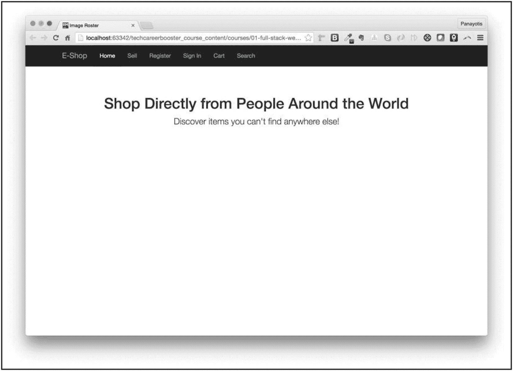

    图 3-28

    带有导航栏的任务项目

祝你好运！

## 关键要点

恭喜你！现在，您知道了如何实现一个响应式导航栏。以下是你学到的一些重要东西:

*   如何实现一个带有菜单选项的导航栏，这些菜单选项在小型设备上是隐藏的，在大型设备上是可见的。

*   对于小型设备，您实现了一个按钮，单击该按钮可以打开/关闭带有选项的菜单。

*   您还了解了如何给导航栏着色以及如何定位它。

*   您已经学习了如何将内容放在主页上，而不被顶部导航栏隐藏。

*   你已经学会了如何让一个段落引人注目。

在下一章，你将会熟悉最流行的 Twitter 引导组件，比如按钮、徽章、标签等等。