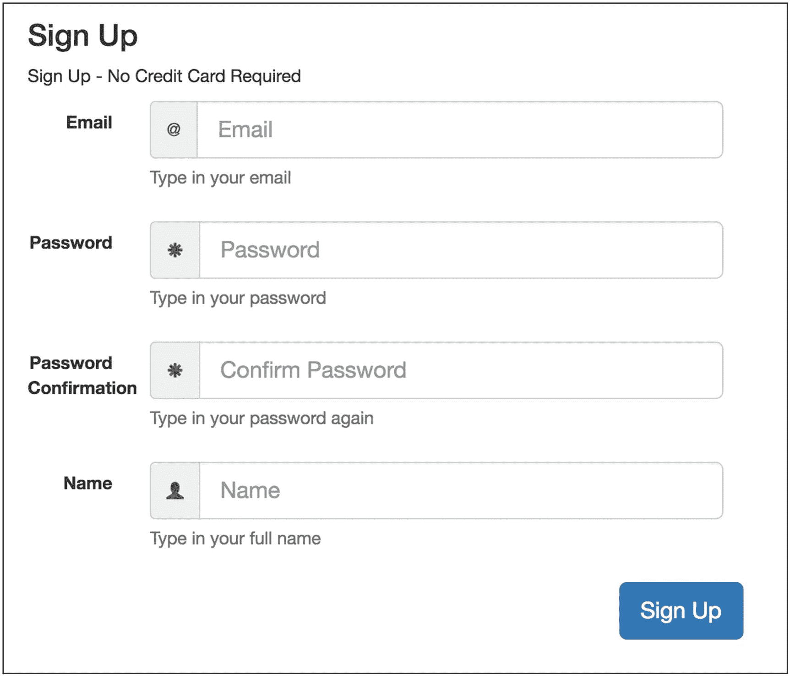
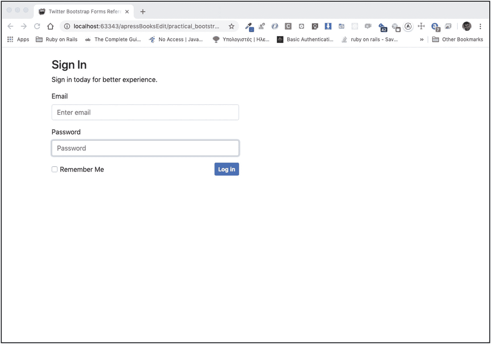
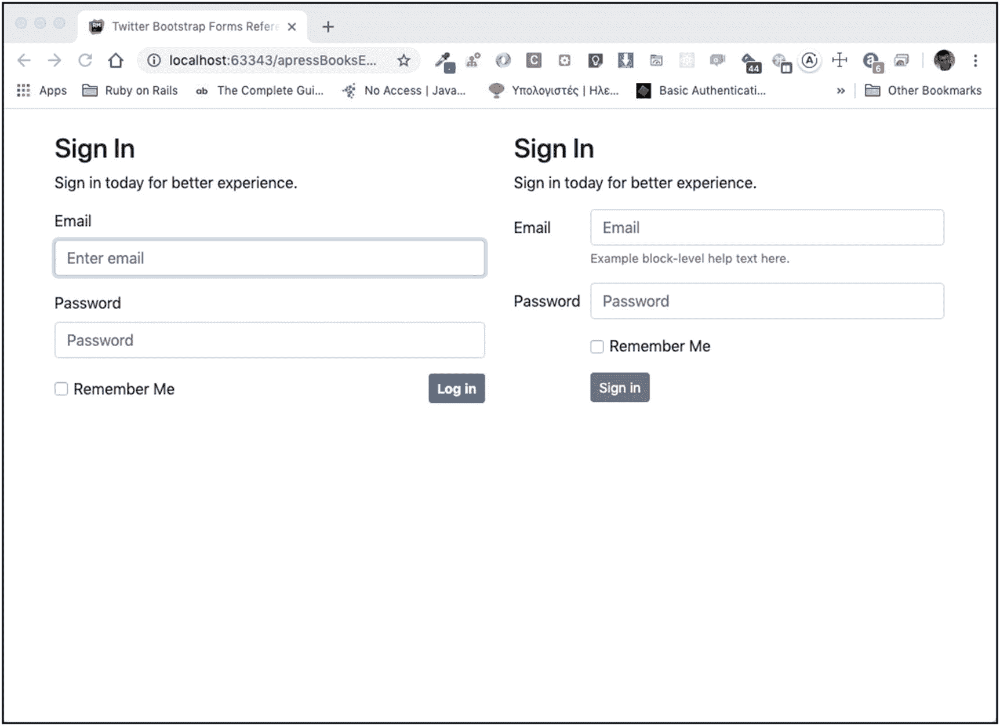
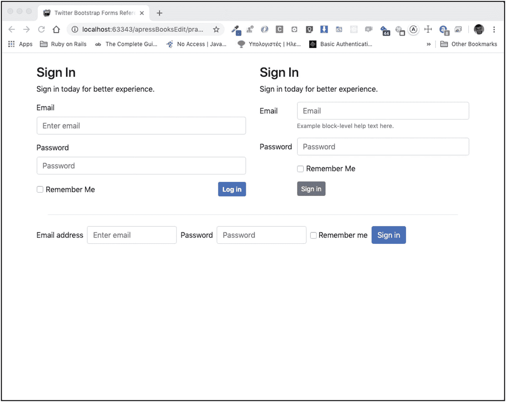
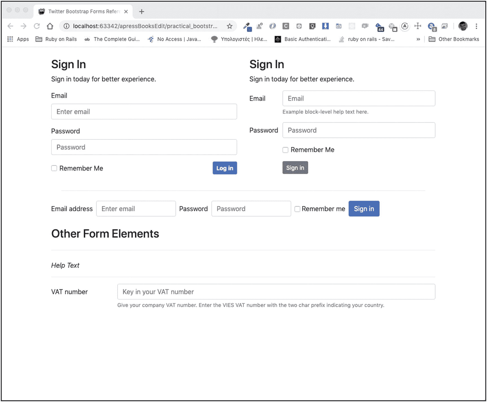
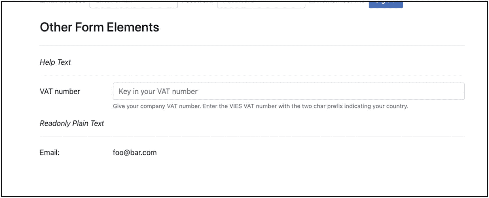
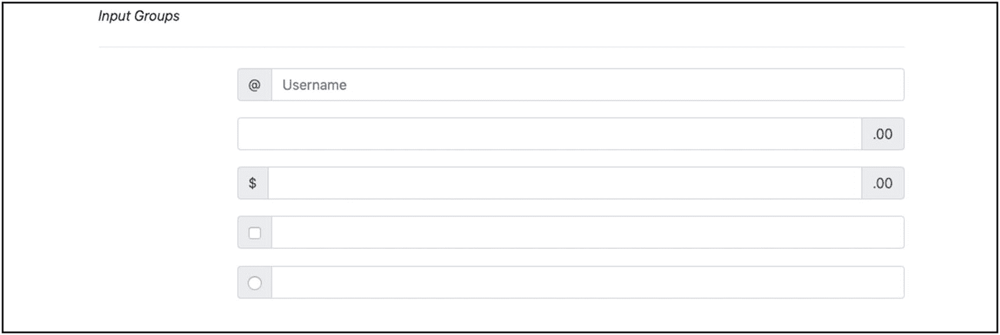
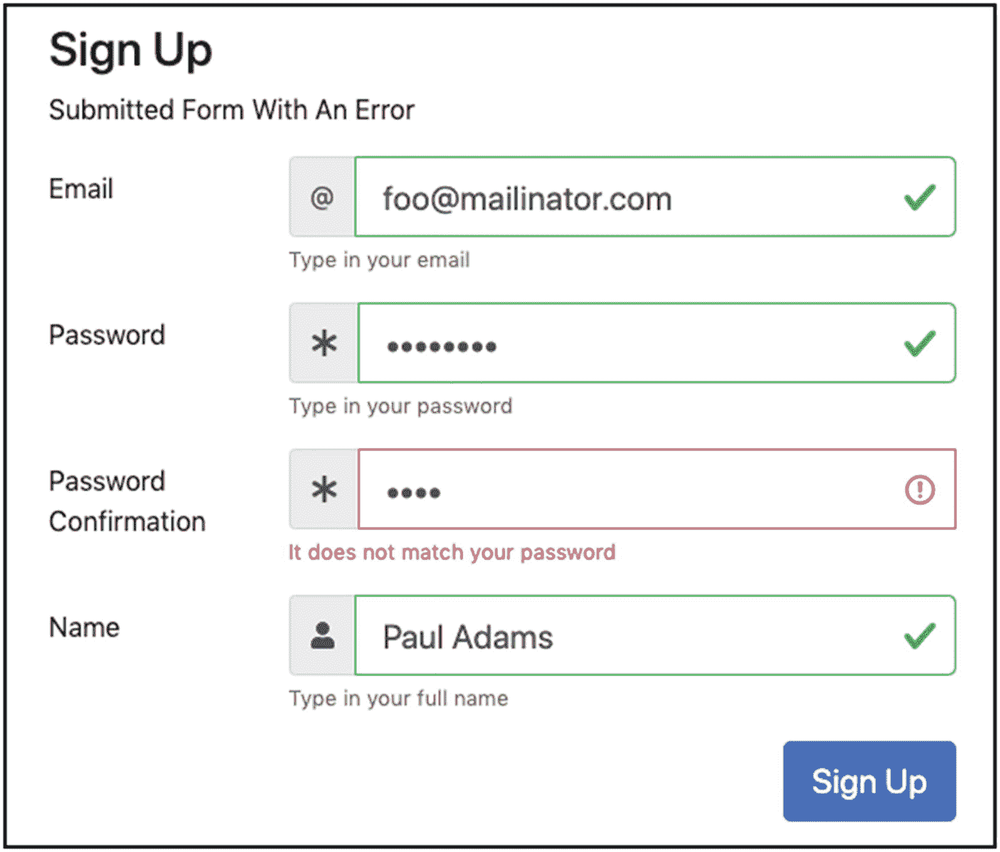

# 八、表单

您已经学习了 HTML 表单和每个表单控件。Twitter Bootstrap 以类的形式给了你一些额外的工具，这将允许你非常容易地设计你的表单。

你将能够构建一个如图 [8-1](#Fig1) 所示的基本表单


图 8-1

登录表单示例

或类似图 [8-2](#Fig2) 中的表单。



图 8-2

注册表单示例

您还可以非常直观地显示哪些字段已经成功填写，哪些字段没有填写(图 [8-3](#Fig3) )。


图 8-3

有错误的注册表单

## 学习目标

1.  了解如何实现 Twitter Bootstrap 基本表单。

2.  了解 Twitter 引导水平表单。

3.  了解水平表单如何使用网格类将标签和输入控件布置到不同的列，但在同一行上。

4.  了解 Twitter Bootstrap 内嵌表单。

5.  了解如何在输入控件下显示帮助文本。

6.  了解只读控件。

7.  了解如何使用 Twitter Bootstrap 显示选择框。

8.  了解验证。

9.  了解如何更改输入控件的大小。

10.  了解如何将两个控件组合在一起并创建一个输入组。

## 介绍

Twitter Bootstrap 提供了一系列影响表单和表单控件样式的类。在这一章中，你将设计一个 Twitter Bootstrap 表单参考页面，其中你将展示 Twitter Bootstrap 为你提供的关于这个主题的所有主要工具。

我们开始吧。

## 空的 Twitter 引导页面

您将从标准的空 Twitter 引导页面开始(清单 [8-1](#PC1) )。

```html
<!DOCTYPE html>
<html lang="en">
<head>
  <!-- Required meta tags -->
  <meta charset="utf-8">
  <meta name="viewport" content="width=device-width, initial-scale=1, shrink-to-fit=no">

  <!-- Bootstrap CSS -->
  <link rel="stylesheet" href="https://stackpath.bootstrapcdn.com/bootstrap/4.4.1/css/bootstrap.min.css" integrity="sha384-Vkoo8x4CGsO3+Hhxv8T/Q5PaXtkKtu6ug5TOeNV6gBiFeWPGFN9MuhOf23Q9Ifjh" crossorigin="anonymous">

  <!-- Custom CSS -->
  <link rel="stylesheet" href="stylesheets/main.css" type="text/css">

  <title>Twitter Bootstrap Forms Reference Page</title>
  <link rel="stylesheet" href="stylesheets/main.css">
</head>
<body>

  <div id="main-container" class="container">
    <!-- Content will be inserted here -->

  </div>

  <!-- Optional JavaScript -->
  <!-- jQuery first, then Popper.js, then Bootstrap JS -->
  <script src="https://code.jquery.com/jquery-3.4.1.slim.min.js" integrity="sha384-J6qa4849blE2+poT4WnyKhv5vZF5SrPo0iEjwBvKU7imGFAV0wwj1yYfoRSJoZ+n" crossorigin="anonymous"></script>
  <script src="https://cdn.jsdelivr.net/npm/popper.js@1.16.0/dist/umd/popper.min.js" integrity="sha384-Q6E9RHvbIyZFJoft+2mJbHaEWldlvI9IOYy5n3zV9zzTtmI3UksdQRVvoxMfooAo" crossorigin="anonymous"></script>
  <script src="https://stackpath.bootstrapcdn.com/bootstrap/4.4.1/js/bootstrap.min.js" integrity="sha384-wfSDF2E50Y2D1uUdj0O3uMBJnjuUD4Ih7YwaYd1iqfktj0Uod8GCExl3Og8ifwB6" crossorigin="anonymous"></script>
</body>
</html>

Listing 8-1Empty Bootstrap Page

```

将前面的 HTML 内容保存在`index.html`文件中。另外，准备一个空的`stylesheets/main.css`文件来存储你的 CSS 规则。如果您保存这些文件并在浏览器上加载页面，您将看不到任何内容，因为正文不包含任何内容。

目的是将页面的全部内容添加到一个`container div`中。这就是为什么你能在身体内部看到带有`container`类的`div`。

## 基本表单

您将从基本的 Twitter 引导表单开始。在`main-container`元素中添加以下内容(清单 [8-2](#PC2) )。

```html
<div class="row">
    <div class="col-12 col-lg-6">
        <h3>Sign In</h3>
        <p>Sign in today for better experience.</p>

        <form>
            <div class="form-group">
                <label for="email">Email</label>
                <input type="email" id="email" placeholder="Enter email" class="form-control">
            </div>

            <div class="form-group">
                <label for="password">Password</label>
                <input type="password" id="password" placeholder="Password" class="form-control">
            </div>

            <div class="d-flex justify-content-between align-items-center">
                <div class="form-check">
                    <input type="checkbox" class="form-check-input" id="remember-me-checkbox">
                    <label class="form-check-label" for="remember-me-checkbox">Remember Me</label>
                </div>

                <button class="btn btn-sm btn-primary" type="submit">
                    <strong>Log in</strong>
                </button>
            </div>

        </form>
    </div> <!-- left column -->

    <div class="col-12 col-lg-6">

    </div> <!-- right column -->

</div> <!-- row inside main container -->

Listing 8-2Basic Form

```

正如您在前面的代码中所看到的，您将首先创建一个两列布局。右栏暂时是空的。左栏包含一个标题`h3`和一个小段落`p`。但是这里重要的东西是`form`元素。

这是一个简单的`form`元素，没有附加任何类。这是 Twitter Bootstrap 提供的基本表单样式。

这里需要指出的是:

1.  标签和输入在`div`中组合在一起。每个`div`都有一个`form-group`类。但是，与复选框相关的`div`有一个例外。它没有这个类。稍后我会解释原因。

2.  每个输入控件都有类`form-control`，除了`checkbox`输入，它有类`form-check-input`。

3.  使用与 flexbox 相关的类`justify-content-between`和`align-items-center`将复选框和登录按钮放在同一行。更多的解释将在下面提供。

4.  类别`form-check`用在包含复选框的`div`上。

5.  类别`form-check-label`用在复选框的标签上。

否则，前面代码中的任何其他内容都非常简单，不使用任何新内容。

如果您保存前面的代码并在浏览器上加载页面，您将看到以下内容(图 [8-4](#Fig4) )。


图 8-4

在表单中签名

如您所见，在标准表单上增加一点 HTML，您会得到很多东西。查看输入获得焦点时是如何突出显示的。看看使用 flexbox 实用程序类左右移动东西是多么容易(图 [8-5](#Fig5) )。



图 8-5。

当输入获得焦点时突出显示

现在，我将对您在前面的代码片段中使用的一些类进行更多的解释:

*   这个类`form-group`做一些非常简单的事情。它增加了值`1rem`的底部边距。因此，如果您有一个垂直表单，就像示例中那样，输入和它们的标签在垂直方向上流动，这是很有用的。

*   类`form-check`已经用于与复选框相关的输入和标签。这个类应用的最重要的规则是值`1.25rem`的左填充。这使得复选框在垂直方向上与表单的其他元素很好地左对齐。如果你愿意，你也可以应用`form-group`类，特别是当其他控件跟在你的第一个复选框下面的时候。

*   类`form-control`对于附加到`input`元素非常重要。它负责宽度、高度、颜色、背景色、边框和其他样式属性。

*   然而，不要将这个类(`form-control`)用于类型`checkbox`的输入。这些是完全不同的视觉方式。他们需要被赋予自己特别设计的名为`form-check-input`的职业。这个类将位置`absolute`赋予复选框输入，没有具体的坐标。因此，它是相对于其最近的*定位的* <sup>[1](#Fn1)</sup> 祖先绘制的。因为您将输入放在一个带有类`form-check`的`div`中，所以它是相对于那个`div`绝对定位的。

*   `Labels`除了伴随`checkbox`输入的标签，不要选择任何特殊的类。这就需要有阶级`form-check-label`。它消除了底部空白。这使它更好地与实际输入保持一致。

*   附加在包含复选框和登录按钮的`div`上的类`d-flex`将`div`转化为 flexbox 容器。这意味着它在行方向上布局其元素。如果您临时移除它，您将看到登录按钮出现在复选框输入的下方。

*   类`justify-content-between`获取 flexbox `div`的两个子元素，并在行方向上对齐它们，以便它们之间有空白空间。因此，一个子对象左对齐，另一个子对象右对齐。

*   类`align-items-center`对齐 flex `div`的子对象，但是在非主轴方向。默认主轴是行(`x, horizontal`)。因此，`align-items-*`类在列(`y, vertical`)轴方向对齐子元素。这个特别的把它们排列在中间。

## 水平表单

以前的表单有一行是标签，在标签下面有一行是输入控件。在这里，您可以选择实现一个水平表单。该表单的标签和输入控件在同一行，占据相邻的列。HTML 标记更加复杂，并且使用与网格相关的类。让我们看看怎么做。

在右栏`div`(列表 [8-3](#PC3) )中增加以下内容。

```html
<div class="col-12 col-lg-6">
    <h3>Sign In</h3>
    <p>Sign in today for better experience.</p>

    <form>
      <div class="form-group row">
        <label class="col-lg-2 col-form-label" for="email2">Email</label>
        <div class="col-lg-10">
          <input type="email" placeholder="Email" class="form-control" id="email2">
          <small class="form-text text-muted">Example block-level help text here.</small>
        </div>
      </div>

      <div class="form-group row">
        <label class="col-lg-2 col-form-label" for="password2">Password</label>
        <div class="col-lg-10">
          <input type="password" placeholder="Password" class="form-control" id="password2">
        </div>
      </div>

      <div class="form-group row justify-content-end">
        <div class="col-lg-10">
          <div class="form-check">
            <input type="checkbox" class="form-check-input" id="remember-me-checkbox-2">
            <label class="form-check-label" for="remember-me-checkbox-2">Remember Me</label>
          </div>
        </div>
      </div>

      <div class="form-group row justify-content-end">
        <div class="col-lg-10">
          <button class="btn btn-sm btn-secondary" type="submit">Sign in</button>
        </div>
      </div>
    </form>
  </div> <!-- right column -->

Listing 8-3Right Column div with Horizontal Form

```

在我解释清单 [8-3](#PC3) 的 HTML 标记之前，让我们保存 HTML 页面并将其加载到您的浏览器上。您应该看到以下内容(图 [8-6](#Fig6) )。



图 8-6

右列上的水平窗体

如图 [8-6](#Fig6) 所示，水平表单将每一行分成两列，一列用于标签，一列用于输入控件本身。以下是您需要从代码中了解的内容:

1.  每个表单组(`div`和类`form-group`)现在都有一个额外的类`row`。这将允许我们使用 Bootstrap 的网格特性来布置每个组中的孩子。

2.  电子邮件和密码这两个标签占据了两列的宽度。这就是为什么他们有`col-lg-2`。注意，它们还需要有 c 类`ol-form-label`。这个类是专门设计来垂直对齐标签的。

3.  电子邮件和密码这两个输入被打包到一个带有类`col-lg-10`的`div`中，这使得它们占据了剩余的可用水平空间。

4.  包含复选框的行占据 10 的列宽，右对齐。这是在类`justify-content-end`和类`col-lg-10`的帮助下发生的，类`justify-content-end`使`div`的子元素位于 flex 容器的右侧，类`div`使`div`占据了十列。

5.  最后，请注意我们如何在电子邮件输入下方创建帮助文本。这是通过一个拥有类`form-text`和`text-muted`的`small`元素来完成的。

## 内嵌表单

有些情况下，您只有一行来显示表单的所有输入控件。下面是这种表单的一个例子(图 [8-7](#Fig7) )。


图 8-7

内嵌表单示例

您将在这两个表单下面创建这样一个表单。使用清单 [8-4](#PC4) ，并将其添加为 id 为`#main-container`的`div`的最后一个子节点。

```html
<div id="inline-form-container">
    <hr class="m-4">
    <form class="form-inline">
        <div class="form-group mr-sm-2">
            <label for="email3" class="mr-sm-2">Email address</label>
            <input type="email" placeholder="Enter email" id="email3" class="form-control">
        </div>

        <div class="form-group mr-sm-2">
            <label for="password3" class="mr-sm-2">Password</label>
            <input type="password" placeholder="Password" id="password3" class="form-control">
        </div>

        <div class="form-check mr-sm-2">
            <input type="checkbox" id="checkbox1" class="form-check-input">
            <label for="checkbox1" class="form-check-label">
                Remember me
            </label>
        </div>

        <button class="btn btn-primary" type="submit">Sign in</button>
    </form>
</div>

Listing 8-4Inline Form HTML Fragment

```

如果您保存前面的代码并在浏览器上重新加载页面，您将看到以下内容(图 [8-8](#Fig8) )。



图 8-8

底部的自举内嵌表单

`form`标签需要有类`form-inline`。这就完全不同了。否则，除了您已经知道的类之外，不会添加任何与表单相关的类。你只使用了一些保证金实用程序类，如类`mr-sm-2`。这些类所做的唯一事情就是添加一些边距，以使表单的元素周围有一些自由空间。

## 帮助文本

很多时候，输入控件需要用户输入一条不常见的信息。用户界面需要确保用户理解他们必须输入的内容。标签有帮助。占位符也有帮助。但是有时候，为了提供更详细的解释，需要额外的帮助。在这种情况下，您可能想要使用名为`Help Text`的工具。

帮助文本通常出现在输入控件的下方；它是一个短语，向用户解释他们必须键入的内容。

让我们将下面这段 HTML 代码作为最后的元素添加到主容器 div 中(清单 [8-5](#PC5) )。

```html
<h3 class="mt-4">Other Form Elements</h3>
<hr class="my-4">

<form>
    <div>
        <em>Help Text</em>
        <hr class="my-3">
    </div>

    <div class="form-group row">
        <label for="help-text" class="col-lg-2 col-form-label">VAT number</label>
        <div class="col-lg-10">
            <input type="text" class="form-control" id="help-text" placeholder="Key in your VAT number"/>
            <small class="form-text text-muted">Give your company VAT number. Enter the VIES VAT number with the two char prefix indicating your country.</small>
        </div>
    </div>
</form>

Listing 8-5Page with Help Text

```

以下是对上述 HTML 片段的解释:

1.  您添加了一个标题为`Other Form Elements`的页眉。这基本上是通过一个带有顶部边距的`h3`元素(类`mt-4`)和一个带有垂直边距的`hr`元素(类`my-4`)来完成的。

2.  您正在页面上引入一个新表单。这将是一个水平的表单，将用于封闭一系列的表单元素，我想跟你谈谈。

3.  从`Help Text`开始。这是用一个简单的`small`元素实现的，该元素有`form-text`和`text-muted`类。它正好位于它所伴随的输入控件之后。除此之外，前面这段代码没有什么特别之处。

如果您保存前面的代码并在浏览器上加载页面，您将看到以下内容(图 [8-9](#Fig9) )。



图 8-9

页面的其他表单元素部分的开始

## 只读纯文本

纯文本输入控件用于表示标签旁边的只读信息。让我们添加下面的 HTML 片段作为最后一个表单的一部分(清单 [8-6](#PC6) )。

```html
<div>
    <em>Readonly Plain Text</em>
    <hr class="my-3">
</div>

<div class="form-group row">
    <label class="col-sm-2 col-form-label" for="readonly-email">Email:</label>
    <div class="col-sm-10">
        <input type="text" readonly class="form-control-plaintext" id="readonly-email" value="foo@bar.com">
    </div>
</div>

Listing 8-6Input Control as Read-Only Plain Text

```

如果保存前面的代码并在浏览器上加载页面，您将看到图 [8-10](#Fig10) 。



图 8-10

作为只读纯文本的输入控件

你看到了吗？值为 foo@bar.com 的电子邮件输入被设计成不同于普通的输入控件。这是在类`form-control-plaintext`的帮助下完成的。否则，所有剩下的 HTML 标记都是您所知道的。

## 选择框

选择框和 Twitter Bootstrap 没有什么特别的。您唯一要做的事情就是将类`form-control`附加到`select`元素上。让我们添加下面的 HTML 代码作为最后一个表单的一部分(清单 [8-7](#PC7) )。

```html
<div>
    <em>Select Boxes</em>
    <hr class="my-3">
</div>

<div class="form-group row">
    <label class="col-lg-2 col-form-label" for="select-1">Single</label>

    <div class="col-lg-10">
        <select class="form-control" name="account" id="select-1">
            <option>option 1</option>
            <option>option 2</option>
            <option>option 3</option>
            <option>option 4</option>
        </select>
    </div>
</div>

<div class="form-group row flex-justify-end">
    <label class="col-lg-2 col-form-label" for="select-2">Multiple</label>

    <div class="col-lg-10">
        <select class="form-control" multiple="multiple" id="select-2">
            <option>option 1</option>
            <option>option 2</option>
            <option>option 3</option>
            <option>option 4</option>
        </select>
    </div>
</div>

Listing 8-7Single and Multiple Select Box

```

这很简单。除了`select`元素附加了类`form-control`之外，这里没有什么新的东西。如果您保存页面并在浏览器上重新加载，您将看到以下内容(图 [8-11](#Fig11) )。


图 8-11

带有选择框的页面部件

类`form-control`设计选择框的样式，类似于其他输入控件用这个类得到的样式。

## 输入验证

很多时候，人们希望突出显示用户已经给出错误输入的输入控件。或者可能想要突出显示具有正确输入的那些。一种方法是对输入控件进行相应的着色，例如，用红色表示错误的输入。

Twitter Bootstrap 提供了一组专门用来处理这个问题的类。这些类别是

1.  `is-valid`

2.  `is-invalid`

3.  `valid-feedback`

4.  `invalid-feedback`

您将类`is-valid`或`is-invalid`分别附加到您想要样式化为有效或无效的`input`上。

您将`valid-feedback`和`invalid-feedback`类附加到一个保存反馈消息的`div`上，分别用于有效和无效的情况。这个`div`需要存在于 input 元素的正下方，作为第一个直接兄弟。

让我们在您正在处理的表单的末尾添加以下 HTML 代码(清单 [8-8](#PC8) )。

```html
<div>
    <em>Input Validation</em>
    <hr class="my-4">
</div>

<div class="form-group row">
    <label class="col-lg-2 col-form-label" for="valid-input">Email</label>
    <div class="col-lg-10">
        <input type="email" class="form-control is-valid" id="valid-input" placeholder="Your username" value="foo@bar.com" required/>
        <div class="valid-feedback">
            Nice!
        </div>
    </div>
</div>

<div class="form-group row">
    <label class="col-lg-2 col-form-label" for="invalid-input">Password</label>
    <div class="col-lg-10">
        <input type="password" class="form-control is-invalid" id="invalid-input" placeholder="Your password" required>
        <div class="invalid-feedback">
            You have to give your password
        </div>
    </div>
</div>

Listing 8-8Input Validation

```

如果您保存前面的代码并在浏览器上加载页面，您将看到以下内容(图 [8-12](#Fig12) )。


图 8-12

输入验证

您看到有效和无效输入是如何设计的了吗？在一小部分类的帮助下，Bootstrap 允许你在样式上做惊人的工作。

## 输入控件的大小

Twitter Bootstrap 提供了一些非常方便的与输入控件大小相关的类。您可以使用大型控件，将类`form-control-lg`附加到输入控件。或者你可以使用小控件，用类`form-control-sm`代替。让我们在表单的末尾添加下面这段 HTML 代码(清单 [8-9](#PC9) )。

```html
<div>
    <em>Size of Input Controls</em>
    <hr class="my-4">
</div>

<div class="form-group row">
    <label class="col-lg-2 col-form-label" for="large-size-input">Large</label>

    <div class="col-lg-10">
        <input type="text" class="form-control form-control-lg" id="large-size-input"/>
    </div>
</div>

<div class="form-group row">
    <label class="col-lg-2 col-form-label" for="default-size-input">Default</label>

    <div class="col-lg-10">
        <input type="text" class="form-control" id="default-size-input"/>
    </div>
</div>

<div class="form-group row">
    <label class="col-lg-2 col-form-label" for="small-size-input">Small</label>

    <div class="col-lg-10">
        <input type="text" class="form-control form-control-sm" id="small-size-input"/>
    </div>
</div>

Listing 8-9Different Input Control Sizes

```

如果您保存此文件并在浏览器上重新加载页面，您将看到以下内容(图 [8-13](#Fig13) )。


图 8-13

不同的输入控件大小

如果你尝试添加一些输入，尺寸的差异会变得更加明显(图 [8-14](#Fig14) )。


图 8-14

某些输入的不同输入控件大小

## 输入组

有时候你想制造出如下效果(图 [8-15](#Fig15) )。


图 8-15

输入组示例

这是一个输入组示例。其他示例如下两个(图 [8-16](#Fig16) 和图 [8-17](#Fig17) )。


图 8-17

美元和小数输入组示例


图 8-16

小数输入组示例

这里有一个小标签和一个文本输入控件的组合(图 [8-18](#Fig18) )。


图 8-18

标签和输入控件组合在一起

将这两个(在第三个例子中是三个)控件组合成一个称为输入分组。

让我们在您的表单中添加以下代码(清单 [8-10](#PC10) )。

```html
<div>
    <em>Input Groups</em>
    <hr class="my-4">
</div>

<div class="row justify-content-end" id="input-groups-container">
    <div class="col-lg-10">

        <div class="input-group">
            <div class="input-group-prepend">
                <span class="input-group-text">@</span>
            </div>
            <input type="text" placeholder="Username" class="form-control"/>
        </div>

        <div class="input-group">
            <input type="text" class="form-control"/>
            <div class="input-group-append">
                <span class="input-group-text">.00</span>
            </div>
        </div>

        <div class="input-group">
            <div class="input-group-prepend">
                <span class="input-group-text">$</span>
            </div>
            <input type="text" class="form-control">
            <div class="input-group-append">
                <span class="input-group-text">.00</span>
            </div>
        </div>

        <div class="input-group">
            <div class="input-group-prepend">
                <div class="input-group-text">
                    <input type="checkbox">
                </div>
            </div>
            <input type="text" class="form-control">
        </div>

        <div class="input-group">
            <div class="input-group-prepend">
                <div class="input-group-text">
                    <input type="radio">
                </div>
            </div>
            <input type="text" class="form-control">
        </div>
    </div>
</div>

Listing 8-10Examples of Input Groups

```

另外，在`stylesheets/main.css`文件中添加以下 CSS 规则:

```html
#input-groups-container .input-group {
    margin-bottom: 1.2rem;
}

```

保存前面的所有代码，并在浏览器上重新加载页面。您将看到以下内容(图 [8-19](#Fig19) )。



图 8-19

输入组

让我们看看 HTML 代码中的输入组是由什么组成的。我分析第一个输入组，它是:

1.  `input-group`需要是一个带有类`input-group`的`div`。

2.  `div`需要包含`input`元素。在我们的例子中，这是用户输入用户名的地方。

3.  视觉装饰在实际`input`之前。因此，`input`需要在前面加上一个具有类`input-group-prepend`的`div`。

4.  这个`div`，带`input-group-prepend`的，需要有一个带`input-group-text`的`span`里面的装饰。

```html
<div class="input-group">

  <div class="input-group-prepend">

    <span class="input-group-text">@</span>

  </div>

  <input type="text" placeholder="Username" class="form-control"/>

</div>

```

非常容易！

那么你需要注意以下几点:

1.  如果视觉装饰需要放在`input`元素之后，那么它的`div`类需要写在`input`元素之后，它的类需要是`input-group-append`(而不是`input-group-prepend`)。

2.  你可以有两个视觉装饰——一个在主`input`控件之前，一个在主`input`控件之后。您只需在主`input`控件之前使用一个带有类`input-group-prepend`的`div`，在它之后使用另一个带有类`input-group-append`的`div`。

3.  对组的 prepend 或 append 部分中的复选框和单选按钮进行特殊设置。它们不应该被包裹在一个`span`里，而应该被包裹在一个`div`里。

前面分组的另一个变化是一个`input`控件和一个按钮的分组。在表单的末尾添加以下 HTML 代码(清单 [8-11](#PC13) )。

```html
<div>
    <em>Input & Button Groups</em>
    <hr class="my-4">
</div>

<div class="row justify-content-end">
    <div class="col-lg-10">
        <div class="input-group">
            <input type="text" class="form-control"/>
            <div class="input-group-append">
                <button type="button" class="btn btn-primary">Go!</button>
            </div>
        </div>
    </div>
</div>

Listing 8-11Input Group with a Button

```

如果您保存前面的代码并在浏览器上重新加载页面，您将看到以下内容(图 [8-20](#Fig20) )。


图 8-20

输入和按钮组

正如您在 HTML 代码中看到的，实现与前面的情况非常相似。唯一的区别是，你没有用类`input-group-text`将`button`包装在任何`span`或`div`中。您将`button`作为带有类`input-group-prepend`(或`input-group-append`)的`div`的直接且唯一的子元素。

## 任务和测验

TASK DETAILS


图 8-21

任务:登录表单

1.  你需要创建一个 Twitter 引导页面，上面有三个表单。

2.  第一个表单需要是如下表单中的一个标志(图 [8-21](#Fig21) )。


图 8-22

任务:注册表单

1.  在您的项目中导入/引用带有字体的 [FontAwesome 库](https://fontawesome.com/)。FontAwesome 项目解释了如何做到这一点。

2.  添加将表示图标的 HTML 片段。它可能是这样的:

    ```html
    <i class="fas fa-asterisk"></i>

    ```

3.  接下来需要第二个表单，即注册表单，如下所示(图 [8-22](#Fig22) )。

1.  这是一个基本的 Twitter 自举表单。您可能遇到的唯一困难是密码输入组中的符号。为了添加这些内容，您需要



图 8-23

任务:注册表单并进行验证

1.  这里没有什么新东西。确保在密码和名称字段中使用正确的字体图标。

2.  注意输入控件很大。

3.  第三个表单与第二个表单相同，但是所有的输入字段都被标记为有效或无效。其实除了密码确认无效外都是有效的(图 [8-23](#Fig23) )。

1.  请注意，在第三个表单中，所有输入字段都填充了一个值。你必须这么做。提示:设置`input` HTML 元素的`value`属性。

2.  此外，红色信息“它不匹配你的密码”是一个无效的反馈。这需要是一个`div`元素，紧挨着它所伴随的输入控件，也就是密码确认输入控件。

## 关键要点

*   如何创造惊人的表单

*   如何水平和垂直布局表单输入

*   如何将标签和输入字段组合在一起并设计它们的样式

*   如何将输入与其他视觉装饰组合在一起

*   如何制作小型和大型输入控件

*   如何在输入控件下方显示帮助文本

*   如何显示验证成功和错误输入

*   如何给出验证反馈

*   如何设置只读输入控件的样式

在下一章中，我将介绍更多的动态页面。您将学习如何创建模态对话框。

<aside aria-label="Footnotes" class="FootnoteSection" epub:type="footnotes">Footnotes [1](#Fn1_source)

定位的元素是没有位置`static`的任何元素。

 </aside>