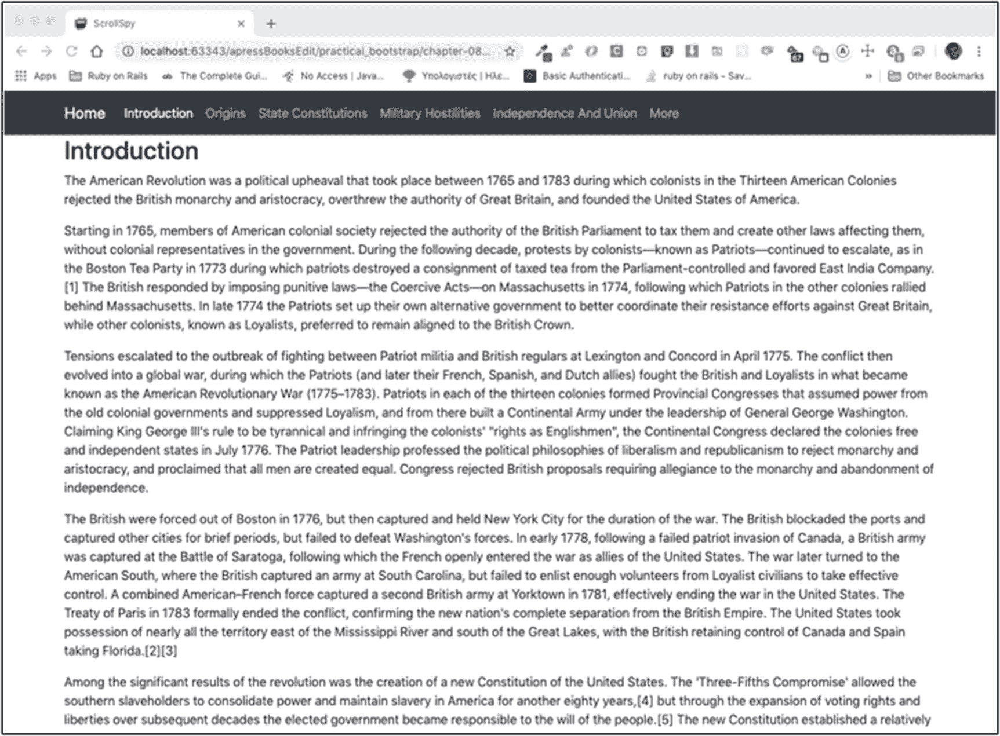
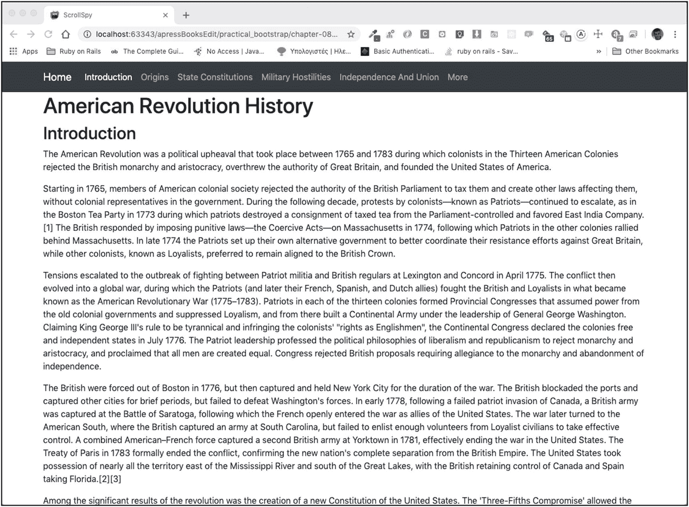
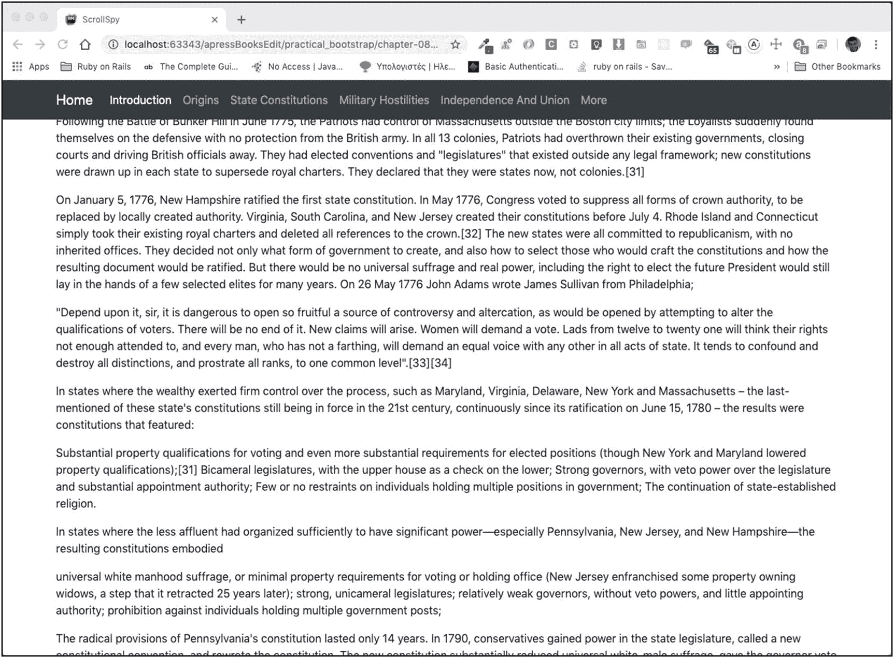
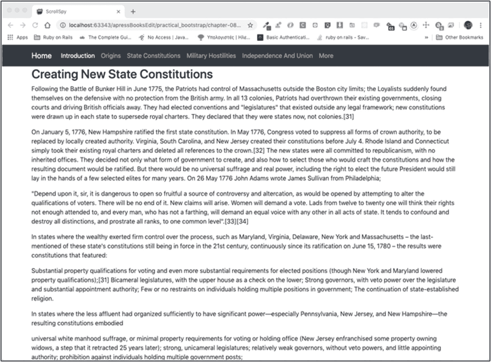
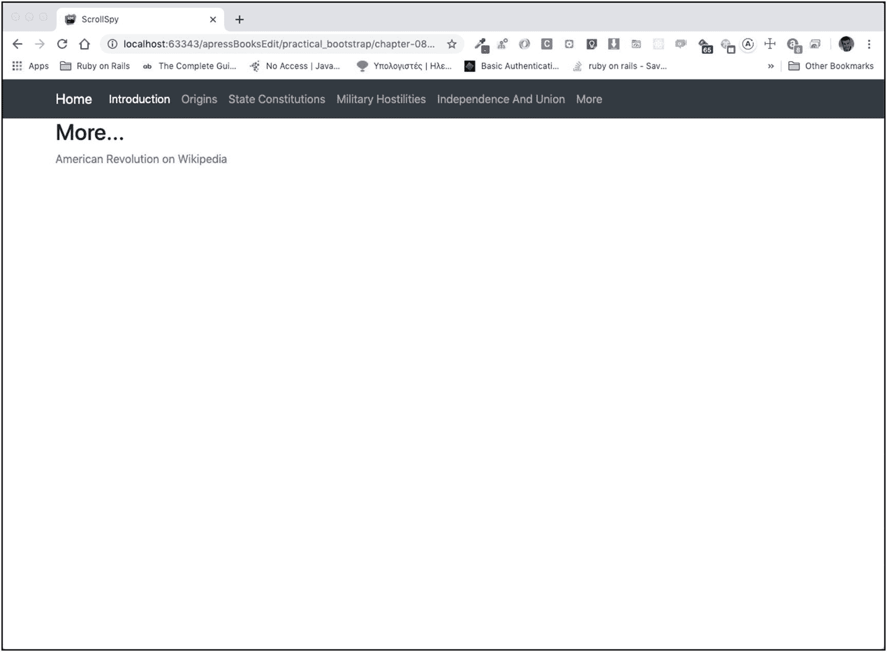

# 十、ScrollSpy（滚动新闻）

长内容页面通常有顶部导航栏，允许用户快速导航到页面中的各个部分。这个特性伴随着这样一个事实，即突出显示为活动的菜单项根据页面的可见部分自动更新/改变。ScrollSpy 是一个 Twitter Bootstrap JavaScript 插件，在使用时，它会根据文档中的位置自动改变高亮显示的菜单项。

在这一章中，你将学习 Twitter Bootstrap 如何让你在你的长内容页面中快速加入这样一个特性。

## 学习目标

1.  了解如何向长内容页面添加 scrollspying 功能。

2.  了解应该如何设置 HTML 标记来支持 scrollspying。

3.  了解如何调整滚动部分的偏移量和激活点。

## 有菜单的长页

让我们从一个带菜单的长 HTML 页面开始(清单 [10-1](#PC1) )。

```html
<!DOCTYPE html>
<html lang="en">
<head>
    <!-- Required meta tags -->
    <meta charset="utf-8">
    <meta name="viewport" content="width=device-width, initial-scale=1, shrink-to-fit=no">

    <!-- Bootstrap CSS -->
    <link rel="stylesheet" href="https://stackpath.bootstrapcdn.com/bootstrap/4.4.1/css/bootstrap.min.css" integrity="sha384-Vkoo8x4CGsO3+Hhxv8T/Q5PaXtkKtu6ug5TOeNV6gBiFeWPGFN9MuhOf23Q9Ifjh" crossorigin="anonymous">

    <!-- Custom CSS -->
    <link rel="stylesheet" href="stylesheets/main.css" type="text/css">

    <title>ScrollSpy</title>
</head>
<body>
    <nav class="navbar navbar-expand-lg navbar-dark bg-dark fixed-top">
        <div class="container">
            <a class="navbar-brand" href="main.html">Home</a>

            <button type="button" class="navbar-toggler" data-toggle="collapse" data-target="#navbar"
                    aria-controls="navbar"
                    aria-expanded="false"
                    aria-label="Toggle navigation">
                <span class="navbar-toggler-icon"></span>
            </button>

            <div class="collapse navbar-collapse" id="navbar">
                <ul class="nav navbar-nav">
                    <li class="nav-item">
                        <a class="nav-link active" href="#introduction">Introduction<span class="sr-only">(current)</span></a>
                    </li>
                    <li class="nav-item">
                        <a class="nav-link" href="#origins">Origins</a>
                    </li>
                    <li class="nav-item">
                        <a class="nav-link" href="#creating-new-state-constitutions">State Constitutions</a>
                    </li>
                    <li class="nav-item">
                        <a class="nav-link" href="#military-hostilities-begin">Military Hostilities</a>
                    </li>
                    <li class="nav-item">
                        <a class="nav-link" href="#independence-and-union">Independence And Union</a>
                    </li>
                    <li class="nav-item">
                        <a class="nav-link" href="#more">More</a>
                    </li>
                </ul>
            </div>
        </div>
    </nav>

    <div class="container">
        <h1 id="introduction">American Revolution History</h1>

        <h2>Introduction</h2>

        <p>
            The American Revolution was a political upheaval that took place between 1765 and 1783 during which colonists in the Thirteen American Colonies rejected the British monarchy and aristocracy, overthrew the authority of Great Britain, and founded the United States of America.
        </p>

        <p>
            Starting in 1765, members of American colonial society rejected the authority of the British Parliament to tax them and create other laws affecting them, without colonial representatives in the government. During the following decade, protests by colonists—known as Patriots—continued to escalate, as in the Boston Tea Party in 1773 during which patriots destroyed a consignment of taxed tea from the Parliament-controlled and favored East India Company.[1] The British responded by imposing punitive laws—the Coercive Acts—on Massachusetts in 1774, following which Patriots in the other colonies rallied behind Massachusetts. In late 1774 the Patriots set up their own alternative government to better coordinate their resistance efforts against Great Britain, while other colonists, known as Loyalists, preferred to remain aligned to the British Crown.
        </p>
        <p>
            Tensions escalated to the outbreak of fighting between Patriot militia and British regulars at Lexington and Concord in April 1775\. The conflict then evolved into a global war, during which the Patriots (and later their French, Spanish, and Dutch allies) fought the British and Loyalists in what became known as the American Revolutionary War (1775–1783). Patriots in each of the thirteen colonies formed Provincial Congresses that assumed power from the old colonial governments and suppressed Loyalism, and from there built a Continental Army under the leadership of General George Washington. Claiming King George III's rule to be tyrannical and infringing the colonists' "rights as Englishmen", the Continental Congress declared the colonies free and independent states in July 1776\. The Patriot leadership professed the political philosophies of liberalism and republicanism to reject monarchy and aristocracy, and proclaimed that all men are created equal. Congress rejected British proposals requiring allegiance to the monarchy and abandonment of independence.
        </p>

        <p>
            The British were forced out of Boston in 1776, but then captured and held New York City for the duration of the war. The British blockaded the ports and captured other cities for brief periods, but failed to defeat Washington's forces. In early 1778, following a failed patriot invasion of Canada, a British army was captured at the Battle of Saratoga, following which the French openly entered the war as allies of the United States. The war later turned to the American South, where the British captured an army at South Carolina, but failed to enlist enough volunteers from Loyalist civilians to take effective control. A combined American–French force captured a second British army at Yorktown in 1781, effectively ending the war in the United States. The Treaty of Paris in 1783 formally ended the conflict, confirming the new nation's complete separation from the British Empire. The United States took possession of nearly all the territory east of the Mississippi River and south of the Great Lakes, with the British retaining control of Canada and Spain taking Florida.[2][3]
        </p>

        <p>
            Among the significant results of the revolution was the creation of a new Constitution of the United States. The 'Three-Fifths Compromise' allowed the southern slaveholders to consolidate power and maintain slavery in America for another eighty years,[4] but through the expansion of voting rights and liberties over subsequent decades the elected government became responsible to the will of the people.[5] The new Constitution established a relatively strong federal national government that included an executive, a national judiciary, and a bicameral Congress that represented both states in the Senate and population in the House of Representatives.[6][7]
        </p>

        <p>
            Among the significant results of the revolution was the creation of a new Constitution of the United States. The 'Three-Fifths Compromise' allowed the southern slaveholders to consolidate power and maintain slavery in America for another eighty years,[4] but through the expansion of voting rights and liberties over subsequent decades the elected government became responsible to the will of the people.[5] The new Constitution established a relatively strong federal national government that included an executive, a national judiciary, and a bicameral Congress that represented both states in the Senate and population in the House of Representatives.[6][7]
        </p>

        <h2 id="origins">Origins</h2>

        <p>
            Historians typically begin their histories of the American Revolution with the British victory in the French and Indian War in 1763, which removed France as a major player in North American affairs. Lawrence Henry Gipson, the historian of the British Empire, states:
        </p>

        <p>
            It may be said as truly that the American Revolution was an aftermath of the Anglo-French conflict in the New World carried on between 1754 and 1763.[8]
        </p>

        <p>
            The Royal Proclamation of 1763 may have played a role in the separation of the United States from Great Britain as colonists at the time wanted to continue in the economically beneficial cultural practice of taking land for one's own livelihood as part of the drive west. The lands west of Quebec and west of a line running along the crest of the Allegheny mountains became Indian territory, temporarily barred from settlement (to the great disappointment of the land speculators of Virginia and Pennsylvania, who had started the Seven Years' War to gain those territories).
        </p>

        <p>
            For the prior history see Thirteen Colonies.
        </p>

        <h3>1764–1766: Taxes imposed and withdrawn</h3>

        <p>
            In 1764 Parliament passed the Currency Act to restrain the use of paper money that British merchants saw as a means to evade debt payments.[original research?] Parliament also passed the Sugar Act imposing customs duties on a number of articles. That same year Prime Minister George Grenville proposed to impose direct taxes on the colonies to raise revenue, but delayed action to see if the colonies would propose some way to raise the revenue themselves.[citation needed] None did, and in March 1765 Parliament passed the Stamp Act which imposed direct taxes on the colonies for the first time. All official documents, newspapers, almanacs and pamphlets—even decks of playing cards—were required to have the stamps.
        </p>

        <p>
            The colonists objected chiefly on the grounds not that the taxes were high (they were low),[9] but because they had no representation in the Parliament. Benjamin Franklin testified in Parliament in 1766 that Americans already contributed heavily to the defense of the Empire. He said local governments had raised, outfitted and paid 25,000 soldiers to fight France—as many as Britain itself sent—and spent many millions from American treasuries doing so in the French and Indian War alone.[10][11] Stationing a standing army in Great Britain during peacetime was politically unacceptable. London had to deal with 1,500 politically well-connected British officers who became redundant; it would have to discharge them or station them in North America.[12]
        </p>

        <p>
            In 1765 the Sons of Liberty formed. They used public demonstrations, boycotts, violence and threats of violence to ensure that the British tax laws were unenforceable. While openly hostile to what they considered an oppressive Parliament acting illegally, colonists persisted in sending numerous petitions and pleas for intervention from a monarch to whom they still claimed loyalty. In Boston, the Sons of Liberty burned the records of the vice admiralty court and looted the home of the chief justice, Thomas Hutchinson. Several legislatures called for united action, and nine colonies sent delegates to the Stamp Act Congress in New York City in October 1765\. Moderates led by John Dickinson drew up a "Declaration of Rights and Grievances" stating that taxes passed without representation violated their rights as Englishmen. Colonists emphasized their determination by boycotting imports of British merchandise.[13]
        </p>

        <p>
            The Parliament at Westminster saw itself as the supreme law making authority throughout all British possessions and thus entitled to levy any tax without colonial approval.[14] They argued that the colonies were legally British corporations that were completely subordinate to the British parliament and pointed to numerous instances where Parliament had made laws binding on the colonies in the past.[15] They did not see anything in the unwritten British constitution that made taxes special[16] and noted that Parliament had taxed American trade for decades. Parliament insisted that the colonies effectively enjoyed a "virtual representation" like most British people did, as only a small minority of the British population elected representatives to Parliament.[17] Americans such as James Otis maintained the Americans were not in fact virtually represented.[18]
        </p>

        <p>
            In London, the Rockingham government came to power (July 1765) and Parliament debated whether to repeal the stamp tax or to send an army to enforce it. Benjamin Franklin made the case for repeal, explaining the colonies had spent heavily in manpower, money, and blood in defense of the empire in a series of wars against the French and Indians, and that further taxes to pay for those wars were unjust and might bring about a rebellion. Parliament agreed and repealed the tax (February 21, 1766), but in the Declaratory Act of March 1766 insisted that parliament retained full power to make laws for the colonies "in all cases whatsoever".[19] The repeal nonetheless caused widespread celebrations in the colonies.
        </p>

        <p>
            Briggs says unnamed modern American economic historians have challenged the view that Great Britain was placing a heavy burden on the North American colonies and have suggested the cost of defending them from the possibility of invasion by France or Spain was £400,000 – five times the maximum income from them. Briggs rejects the analysis, saying that issue was not invoked at the time.[20]
        </p>

        <h3>1767–1773: Townshend Acts and the Tea Act</h3>

        <p>
            In 1767 the Parliament passed the Townshend Acts, which placed duties on a number of essential goods including paper, glass, and tea and established a Board of Customs in Boston to more rigorously execute trade regulations. The new taxes were enacted on the belief that Americans only objected to internal taxes and not external taxes like custom duties. The Americans, however, argued against the constitutionality of the act because its purpose was to raise revenue and not regulate trade. Colonists responded by organizing new boycotts of British goods. These boycotts were less effective, however, as the Townshend goods were widely used.
        </p>

        <p>
            In February 1768 the Assembly of Massachusetts Bay issued a circular letter to the other colonies urging them to coordinate resistance. The governor dissolved the assembly when it refused to rescind the letter. Meanwhile, in June 1768 a riot broke out in Boston over the seizure of the sloop Liberty, owned by John Hancock, for alleged smuggling. Custom officials were forced to flee, prompting the British to deploy troops to Boston. A Boston town meeting declared no obedience was due to parliamentary laws and called for the convening of a convention. A convention assembled but only issued a mild protest before dissolving itself. In January 1769 Parliament responded to the unrest by reactivating the Treason Act 1543 which permitted subjects outside the realm to face trials for treason in England. The governor of Massachusetts was instructed to collect evidence of said treason, and although the threat was not carried out it caused widespread outrage.
        </p>

        <p>
            On March 5, 1770 a large mob gathered around a group of British soldiers. The mob grew more and more threatening, throwing snowballs, rocks and debris at the soldiers. One soldier was clubbed and fell.[21] There was no order to fire but the soldiers fired into the crowd anyway. They hit 11 people; three civilians died at the scene of the shooting, and two died after the incident. The event quickly came to be called the Boston Massacre. Although the soldiers were tried and acquitted (defended by John Adams), the widespread descriptions soon became propaganda to turn colonial sentiment against the British. This in turn began a downward spiral in the relationship between Britain and the Province of Massachusetts.[21]
        </p>

        <p>
            A new ministry under Lord North came to power in 1770 and Parliament withdrew all taxes except the tax on tea, giving up its efforts to raise revenue while maintaining the right to tax. This temporarily resolved the crisis and the boycott of British goods largely ceased, with only the more radical patriots such as Samuel Adams continuing to agitate.
        </p>

        <p>
            Two ships in a harbor, one in the distance. On board, men stripped to the waist and wearing feathers in their hair are throwing crates into the water. A large crowd, mostly men, is standing on the dock, waving hats and cheering. A few people wave their hats from windows in a nearby building.
            This 1846 lithograph by Nathaniel Currier was entitled "The Destruction of Tea at Boston Harbor"; the phrase "Boston Tea Party" had not yet become standard.[22]
        </p>

        <p>
            In June 1772, in what became known as the Gaspee Affair, American patriots including John Brown burned a British warship that had been vigorously enforcing unpopular trade regulations. The affair was investigated for possible treason, but no action was taken.
        </p>

        <p>
            In 1772 it became known that the Crown intended to pay fixed salaries to the governors and judges in Massachusetts. Samuel Adams in Boston set about creating new Committees of Correspondence, which linked Patriots in all 13 colonies and eventually provided the framework for a rebel government. In early 1773 Virginia, the largest colony, set up its Committee of Correspondence, on which Patrick Henry and Thomas Jefferson served.[23]
        </p>

        <p>
            A total of about 7000 to 8000 Patriots served on "Committees of Correspondence" at the colonial and local levels, comprising most of the leadership in their communities — Loyalists were excluded. The committees became the leaders of the American resistance to British actions, and largely determined the war effort at the state and local level. When the First Continental Congress decided to boycott British products, the colonial and local Committees took charge, examining merchant records and publishing the names of merchants who attempted to defy the boycott by importing British goods.[24]
        </p>

        <p>
            In 1773 private letters were published where Massachusetts Governor Thomas Hutchinson claimed the colonists could not enjoy all English liberties, and Lieutenant Governor Andrew Oliver called for the direct payment of colonial officials. The letters, whose contents were used as evidence of a systematic plot against American rights, discredited Hutchinson in the eyes of the people the Assembly petitioned for his recall. Benjamin Franklin, postmaster general for the colonies, acknowledged that he leaked the letters which led to him being berated by British officials and fired from his job.
        </p>

        <p>
            Meanwhile, Parliament passed the Tea Act to lower the price of taxed tea exported to the colonies in order to help the East India Company undersell smuggled Dutch tea. Special consignees were appointed to sell the tea in order to bypass colonial merchants. The act was opposed not only by those who resisted the taxes but also by smugglers who stood to lose business. In most instances the consignees were forced to resign and the tea was turned back, but Massachusetts governor Hutchinson refused to allow Boston merchants to give into pressure. A town meeting in Boston determined that the tea would not be landed, and ignored a demand from the governor to disperse. On December 16, 1773 a group of men, led by Samuel Adams and dressed to evoke the appearance of American Indians, boarded the ships of the British East India Company and dumped £10,000 worth of tea from their holds (approximately £636,000 in 2008) into Boston Harbor. Decades later this event became known as the Boston Tea Party and remains a significant part of American patriotic lore.[25]
        </p>

        <h3>1774–1775: Intolerable Acts and the Quebec Act</h3>

        <p>
            The British government responded by passing several Acts which came to be known as the Intolerable Acts, which further darkened colonial opinion towards the British. They consisted of four laws enacted by the British parliament.[26] The first, the Massachusetts Government Act, altered the Massachusetts charter and restricted town meetings. The second Act, the Administration of Justice Act, ordered that all British soldiers to be tried were to be arraigned in Britain, not in the colonies. The third Act was the Boston Port Act, which closed the port of Boston until the British had been compensated for the tea lost in the Boston Tea Party. The fourth Act was the Quartering Act of 1774, which allowed royal governors to house British troops in the homes of citizens without requiring permission of the owner.[27]
        </p>

        <p>
            In response, Massachusetts patriots issued the Suffolk Resolves and formed an alternative shadow government known as the "Provincial Congress" which began training militia outside British-occupied Boston.[28] In September 1774, the First Continental Congress convened, consisting of representatives from each of the colonies, to serve as a vehicle for deliberation and collective action. During secret debates conservative Joseph Galloway proposed the creation of a colonial Parliament that would be able to approve or disapprove of acts of the British Parliament but his idea was not accepted. The Congress instead endorsed the proposal of John Adams that Americans would obey Parliament voluntarily but would resist all taxes in disguise. Congress called for a boycott beginning on 1 December 1774 of all British goods; it was enforced by new committees authorized by the Congress.[29]
        </p>

        <p>
            The Quebec Act of 1774 extended Quebec's boundaries to the Ohio River, shutting out the claims of the 13 colonies. By then, however, the Americans had little regard for new laws from London; they were drilling militia and organizing for war.[30]
        </p>

        <p>
            The British retaliated by confining all trade of the New England colonies to Britain and excluding them from the Newfoundland fisheries. Lord North advanced a compromise proposal in which Parliament would not tax so long as the colonies made fixed contributions for defense and to support civil government. This would also be rejected.
        </p>

        <h2 id="creating-new-state-constitutions">Creating New State Constitutions</h2>

        <p>
            Following the Battle of Bunker Hill in June 1775, the Patriots had control of Massachusetts outside the Boston city limits; the Loyalists suddenly found themselves on the defensive with no protection from the British army. In all 13 colonies, Patriots had overthrown their existing governments, closing courts and driving British officials away. They had elected conventions and "legislatures" that existed outside any legal framework; new constitutions were drawn up in each state to supersede royal charters. They declared that they were states now, not colonies.[31]
        </p>

        <p>
            On January 5, 1776, New Hampshire ratified the first state constitution. In May 1776, Congress voted to suppress all forms of crown authority, to be replaced by locally created authority. Virginia, South Carolina, and New Jersey created their constitutions before July 4\. Rhode Island and Connecticut simply took their existing royal charters and deleted all references to the crown.[32] The new states were all committed to republicanism, with no inherited offices. They decided not only what form of government to create, and also how to select those who would craft the constitutions and how the resulting document would be ratified. But there would be no universal suffrage and real power, including the right to elect the future President would still lay in the hands of a few selected elites for many years. On 26 May 1776 John Adams wrote James Sullivan from Philadelphia;
        </p>

        <p>
            "Depend upon it, sir, it is dangerous to open so fruitful a source of controversy and altercation, as would be opened by attempting to alter the qualifications of voters. There will be no end of it. New claims will arise. Women will demand a vote. Lads from twelve to twenty one will think their rights not enough attended to, and every man, who has not a farthing, will demand an equal voice with any other in all acts of state. It tends to confound and destroy all distinctions, and prostrate all ranks, to one common level".[33][34]
        </p>

        <p>
            In states where the wealthy exerted firm control over the process, such as Maryland, Virginia, Delaware, New York and Massachusetts – the last-mentioned of these state's constitutions still being in force in the 21st century, continuously since its ratification on June 15, 1780 – the results were constitutions that featured:
        </p>

        <p>
            Substantial property qualifications for voting and even more substantial requirements for elected positions (though New York and Maryland lowered property qualifications);[31]
            Bicameral legislatures, with the upper house as a check on the lower;
            Strong governors, with veto power over the legislature and substantial appointment authority;
            Few or no restraints on individuals holding multiple positions in government;
            The continuation of state-established religion.
        </p>

        <p>
            In states where the less affluent had organized sufficiently to have significant power—especially Pennsylvania, New Jersey, and New Hampshire—the resulting constitutions embodied
        </p>

        <p>
            universal white manhood suffrage, or minimum property requirements for voting or holding office (New Jersey enfranchised some property owning widows, a step that it retracted 25 years later);
            strong, unicameral legislatures;
            relatively weak governors, without veto powers, and little appointing authority;
            prohibition against individuals holding multiple government posts;
        </p>

        <p>
            The radical provisions of Pennsylvania's constitution lasted only 14 years. In 1790, conservatives gained power in the state legislature, called a new constitutional convention, and rewrote the constitution. The new constitution substantially reduced universal white-male suffrage, gave the governor veto power and patronage appointment authority, and added an upper house with substantial wealth qualifications to the unicameral legislature. Thomas Paine called it a constitution unworthy of America.[6]
        </p>

        <h2 id="military-hostilities-begin">Military hostilities begin</h2>

        <p>
            Massachusetts was declared in a state of rebellion in February 1775 and the British garrison received orders to disarm the rebels and arrest their leaders, leading to the Battles of Lexington and Concord on 19 April 1775\. The Patriots set siege to Boston, expelled royal officials from all the colonies, and took control through the establishment of Provincial Congresses. The Battle of Bunker Hill followed on June 17, 1775\. While a British victory, it was at a great cost; about 1,000 British casualties from a garrison of about 6,000, as compared to 500 American casualties from a much larger force.[35][36] First ostensibly loyal to the king and desiring to govern themselves while remaining in the empire, the repeated pleas by the First Continental Congress for royal intervention on their behalf with Parliament resulted in the declaration by the King that the states were "in rebellion", and the members of Congress were traitors.
        </p>

        <p>
            In the winter of 1775, the Americans invaded Canada. General Richard Montgomery captured Montreal but a joint attack on Quebec was a total failure; many Americans were captured or died of smallpox.
        </p>

        <p>
            In March 1776, with George Washington as the commander of the new army, the Continental Army forced the British to evacuate Boston. The revolutionaries were now in full control of all 13 colonies and were ready to declare independence. While there still were many Loyalists, they were no longer in control anywhere by July 1776, and all of the Royal officials had fled.[37]
        </p>

        <p>
            In August 1775, George III declared Americans in arms against royal authority to be traitors to the Crown. Following their surrender at the Battles of Saratoga in October 1777, there were thousands of British and Hessian soldiers in American hands. Although Lord Germain took a hard line, the British generals on the scene never held treason trials; they treated captured enemy soldiers as prisoners of war.[38] The dilemma was that tens of thousands of Loyalists were under American control and American retaliation would have been easy. The British built much of their strategy around using these Loyalists.[39] Therefore, no Americans were put on trial for treason. The British maltreated the prisoners they held, resulting in more deaths to American sailors and soldiers than from combat operations.[39] At the end of the war, both sides released their surviving prisoners.[40]
        </p>

        <h2 id="independence-and-union">Independence And Union</h2>

        <p>
            In April 1776 the North Carolina Provincial Congress issued the Halifax Resolves, explicitly authorizing its delegates to vote for independence.[41] In May Congress called on all the states to write constitutions, and eliminate the last remnants of royal rule.
        </p>

        <p>
            By June nine colonies were ready for independence; one by one the last four—Pennsylvania, Delaware, Maryland and New York—fell into line. Richard Henry Lee was instructed by the Virginia legislature to propose independence, and he did so on June 7, 1776\. On the 11th a committee was created to draft a document explaining the justifications for separation from Britain. After securing enough votes for passage, independence was voted for on July 2\. The Declaration of Independence, drafted largely by Thomas Jefferson and presented by the committee, was slightly revised and unanimously adopted by the entire Congress on July 4, marking the formation of a new sovereign nation, which called itself the United States of America.[42]
        </p>

        <p>
            The Second Continental Congress approved a new constitution, the "Articles of Confederation," for ratification by the states on November 15, 1777, and immediately began operating under their terms. The Articles were formally ratified on March 1, 1781\. At that point, the Continental Congress was dissolved and on the following day a new government of the United States in Congress Assembled took its place, with Samuel Huntington as presiding officer.[43][44]
        </p>

        <h2 id="more">More...</h2>

        <a href="https://en.wikipedia.org/wiki/American_Revolution">American Revolution on Wikipedia</a>
    </div>

    <!-- Optional JavaScript -->
    <!-- jQuery first, then Popper.js, then Bootstrap JS -->
    <script src="https://code.jquery.com/jquery-3.4.1.slim.min.js" integrity="sha384-J6qa4849blE2+poT4WnyKhv5vZF5SrPo0iEjwBvKU7imGFAV0wwj1yYfoRSJoZ+n" crossorigin="anonymous"></script>
    <script src="https://cdn.jsdelivr.net/npm/popper.js@1.16.0/dist/umd/popper.min.js" integrity="sha384-Q6E9RHvbIyZFJoft+2mJbHaEWldlvI9IOYy5n3zV9zzTtmI3UksdQRVvoxMfooAo" crossorigin="anonymous"></script>
    <script src="https://stackpath.bootstrapcdn.com/bootstrap/4.4.1/js/bootstrap.min.js" integrity="sha384-wfSDF2E50Y2D1uUdj0O3uMBJnjuUD4Ih7YwaYd1iqfktj0Uod8GCExl3Og8ifwB6" crossorigin="anonymous"></script>

  <script src="./javascripts/main.js" type="text/javascript"></script>
</body>
</html>

Listing 10-1Long Page with a Menu

```

该页面引用自定义 JavaScript 的本地`javascripts/main.js`文件。暂时把这个当做空的。它还引用自定义 CSS 的本地`stylesheets/main.css`文件。把那个也当成空的。如果您保存前一页的内容并将其加载到您的浏览器上，您将看到以下内容(图 [10-1](#Fig1) )。



图 10-1

带有顶部导航的长页面

从前面的章节中你已经知道了导航栏 HTML 标记。您还学习了如何处理隐藏`body`顶部内容的问题。以下是 CSS 文件中必须包含的内容:

```html
body {
    padding-top: 56px;
}

```

如果您保存前面的代码并在浏览器上重新加载页面，那么您将能够看到页面的顶部内容，而不会被导航栏隐藏(图 [10-2](#Fig2) )。



图 10-2

顶部内容可见的长页面

这个页面的另一个问题也是我在上一本书 [*大师 HTML & CSS*](https://leanpub.com/master-html-and-css) 第 [23 章](https://doi.org/10.1007/978-1-4842-6071-5_23)“定位”中处理过的问题，就是当你点击菜单项时导航栏所覆盖的内容的问题。例如，点击菜单项`State Constitutions`。你会看到下面的图(图 [10-3](#Fig3) )。



图 10-3

导航栏覆盖的内容

正如您所看到的，与您链接的链接相对应的部分的开头被导航栏所覆盖。

您可以通过将下面的`padding-top`和`margin-top` CSS 属性添加到`h1`和`h2`元素来解决这个问题，这两个元素是页面的 HTML 元素，带有菜单项链接到的锚点(清单 [10-2](#PC3) )。

```html
h1, h2 {
    padding-top: 56px;
    margin-top: -56px;
}

Listing 10-2Add to Your CSS File to Fix Hidden Section Content

```

如果您将前面的代码保存在您的`stylesheets/main.css`文件中，并在您的浏览器上重新加载该页面，点击`State Constitutions`将显示如下(图 [10-4](#Fig4) )。



图 10-4

单击菜单项时，内容不被覆盖

然而，当点击`More`菜单项时，你希望页面将它的内容放在顶部。这种情况现在没有发生(图 [10-5](#Fig5) )。


图 10-5

点击更多不会将内容显示在顶部

为了解决这个问题，你需要给页面的`body`增加一些下边距。

添加`margin-bottom: 900px;`。保存 CSS 文件并在浏览器上重新加载页面。点击`More`菜单项，会出现如下画面(图 [10-6](#Fig6) )。


图 10-7

指向各节开头的菜单项



图 10-6

点击更多会在顶部显示内容

## 显示活动部分

当前页面的问题是，当您单击一个菜单项并且内容滚动到该点时，相应的菜单项不会变为活动状态。此外，如果您只是从上到下、从一节到另一节滚动内容，相应的菜单项不会变为活动状态。

这两个问题现在都可以通过使用 ScrollSpy 来解决，scroll spy 是一个 Twitter 引导 JavaScript 插件:

1.  你需要告诉 ScrollSpy 哪个元素包含了你想要窥探的内容。通常，这就是`body`。你设置数据属性`data-spy="scroll"`。

2.  您需要告诉 ScrollSpy 哪个是包含菜单项列表的导航栏元素。在您的例子中，这是 id 为`navbar`的`div`。因此，您必须将`data-target="#navbar"`属性添加到`body`元素中。

3.  您还需要将`body`元素的`position`属性设置为值`relative`。

所以，首先，转到 HTML 页面

```html
<body>

```

对此:

```html
<body data-spy="scroll" data-target="#navbar">

```

将`position: relative`添加到`stylesheets/main.css`文件中的`body`元素中。

保存所有的东西，并在你的浏览器上重新加载页面。您将看到第一个菜单项被突出显示，然后当您滚动时，根据页面的可见部分，相应的菜单项被突出显示。

## 激活截面点

有时，当节的开始位置早于页面顶部时，您可能希望活动节在菜单上突出显示。例如，当节的起点距离页面顶部 200 像素时，您可能想要激活节。您可以使用数据属性`data-offset`来实现，该属性将您想要激活的区域的像素数作为值。

变化

```html
<body data-spy="scroll" data-target="#navbar">

```

对此:

```html
<body data-spy="scroll" data-target="#navbar" data-offset="200">

```

在浏览器上保存并重新加载页面。然后开始滚动。您将看到，在部分开始到达页面顶部之前，部分已被激活。

## 它是如何工作的？

除了如前所述需要设置的正确数据属性(`data-spy`、`data-target`和可选的`data-offset`，您还需要确保

1.  您的菜单项指向与这些部分的开头相对应的 id。再次查看导航栏中带有菜单项的 HTML 片段(图 [10-7](#Fig7) ):

2.  各部分的开头需要有相应的/正确的 id，例如:

```html
<h2 id="military-hostilities-begin">Military hostilities begin</h2>

```

## 使用 JavaScript 激活

您可能需要使用 JavaScript 动态激活 ScrollSpy。因此，不是在`body`元素上附加特定的数据属性，而是不添加任何东西，而是调用下面的 JavaScript 代码:

```html
$('body').scrollspy({ target: '#navbar' });

```

让我们看看实际情况。将 HTML `body`元素改为

```html
<body>

```

然后更新`javascripts/main.js`文件，使内容如清单 [10-3](#PC11) 所示。

```html
$(document).ready(function() {
    $('body').scrollspy({
        target: '#navbar'
    })
});

Listing 10-3Active ScrollSpy with JavaScript

```

当您保存所有文件并在浏览器上重新加载页面时，您仍然会看到 ScrollSpy 像以前一样工作。

请注意，您还可以在您直接构造的对象中赋予`offset`属性，并将其传递给`scrollspy()`方法。

## 任务和测验

Task Details

创建一个长页面来演示 ScrollSpy 功能。您的页面需要有一个顶部导航菜单，将页面内容移动到相应部分的开始。创建两个版本——一个使用 JavaScript，另一个使用数据属性。

## 关键要点

*   如何显示带有导航栏的长内容页面

*   如何让内容可见而不被导航栏隐藏

*   如何让最后一节内容出现在页面顶部

*   如何在用户从页面顶部滚动到底部时自动更改活动菜单项

*   如何使用数据属性或 JavaScript 来激活 ScrollSpy

在本书的最后一章，你将学习工具提示和弹出窗口，这是一个非常吸引人的页面特性，因为它为用户提供了与他们交互的元素的额外信息。