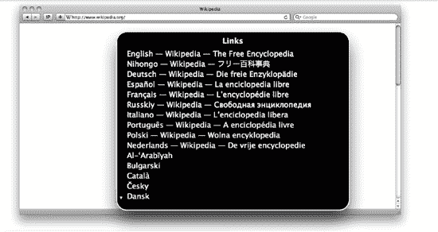
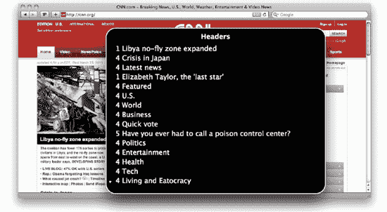
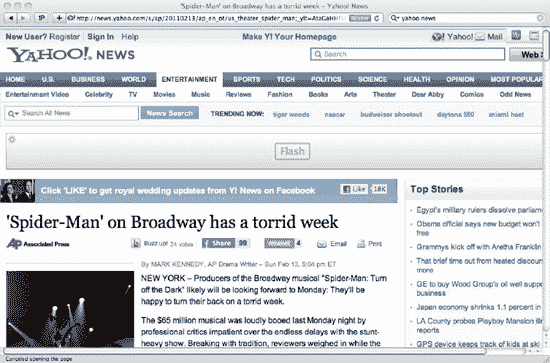
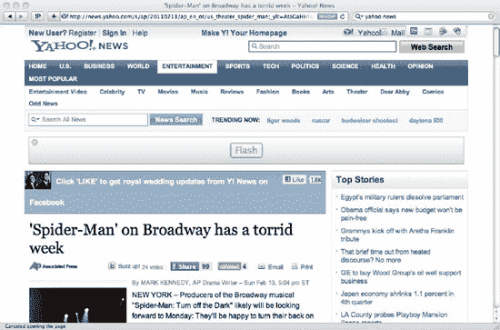
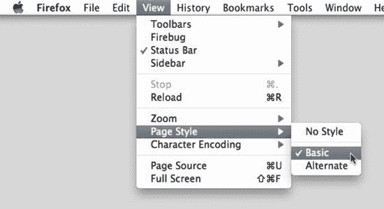
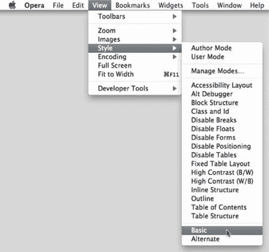

# 六、CSS 和可访问性

从本质上说，使网站易于访问意味着确保每个人都可以访问所有内容。这并不意味着每个人都必须有相同的体验，但这确实意味着不应该有任何人无法实现(或无法实现)的功能或内容，无论他们的个人能力、设备、浏览器或环境如何。

可访问性不是核对需求列表，或者使用自动化工具来验证我们的代码是否通过了特定的可访问性指南和验证。虽然法律可能要求您的组织通过特定的可访问性级别(不同的国家有不同的可访问性法律)，但在开发高流量网站时，确保您的网站可以被尽可能多的设备和用户访问应该是您主要关注的问题之一。这是你应该为你的用户、你的品牌以及他们对它的好感所做的事情。不违法可能会被视为意外收获。

关于网上可访问性，可以说(也已经说了)很多，足以写满一整本书，甚至一本集子。建立易访问的网站在很大程度上是，但不仅仅是，建立语义网站的副产品。然而，这并不仅仅是开发人员的责任。与网站相关的每个人都应该参与进来:用户体验设计师应该确保网站易于导航，内容易于查找；设计师应该设计出考虑残疾用户的布局，比如色盲或运动技能差的用户；产品经理和广告文案应该创造简单明了的信息；开发人员应该编写具有语义和可访问性的代码。有几个考虑因素，尤其是高流量的网站。此外，有许多与 HTML 相关和与内容相关的操作可以让您的内容更容易被访问，但是作为一本与 CSS 相关的书，它们超出了本文的范围。我们会给你一些建议，告诉你如何向尽可能多的访问者和客户开放你的网站和(最重要的)你的内容。 [1](#CHP-6-FN-1)

在本章中，我们将了解

*   一些最常见的用户可访问性问题概述
*   现有的可访问性指南以及如何满足这些指南
*   如何让访问者使用辅助技术更容易
*   更易访问的站点的设计和布局考虑
*   WAI-ARIA 以及如何在你的项目中使用它
*   针对有设备或环境障碍的用户的 CSS 最佳实践
*   渐进增强和适度退化的区别
*   如何使用雅虎！分级浏览器支持

___________________

这不仅是一件有益的、无私的事情，也是一件有利可图的事情。英国超市 Tesco 与皇家国家盲人学院(RNIB)合作，确保其网站无障碍。这导致了一年 1300 万英镑的额外收入，这在以前是不可能的。

### 减值问题概述

什么被认为是，什么不被认为是*损害*是一件很难以政治正确的方式讨论的事情。一些人认为这是一种残疾，另一些人认为这只是人与人之间的差异。当我们谈到缺陷时，我们指的是使用户使用网站变得更加困难的东西。一些最常见的无障碍障碍如下:

*   视力低下、视力不佳或失明
*   不同种类的色盲
*   运动障碍或运动技能受限
*   听力障碍
*   认知和智力残疾
*   年轻，这可能意味着认知障碍
*   年老，这可能意味着这里列出的许多问题

比你想象的更常见的是，人们会有不止一种情况，这使得满足每种可能的组合更加困难。

例如，那些聋哑人通过不同的方式交流和吸收信息。那些最初失聪然后在以后的生活中失去视力的人很可能使用他们已经知道的手语的修改版本，以触觉的形式。而那些生来失明，然后变聋的人很可能使用他们的书面或口头语言的触觉版本。即使是像耳聋这样的单一障碍，也可能有数十种(甚至数百种)解决方案(例如，唇读、手语、高级手语、助听器等等)。有比我们在这里可能进入的更多的组合。需要记住的一件重要事情是，这些用户已经决定了他们想要和确实喜欢如何使用他们的设备，并且已经准备好应用程序来帮助他们实现这一点。

我们不是为残障人士服务的专家，也不能指望成为专家，但我们可以尽最大努力不干扰用户选择的方法。这同样适用于每个人——如果一个用户定义了键盘快捷键，而我们未经允许就覆盖了它们，这对用户来说是令人沮丧的，对我们来说是放肆的。如果另一个用户试图右键点击一个页面，而我们取消了这个行为，同样，我们这样做是不礼貌的。让浏览器和设备有机会做他们认为合适的事情，通常是我们应该做的最礼貌和最恰当的事情。

让我们来看看有特殊障碍的人可能面临的一些更常见的问题。显然，这不是一份详尽的清单。我们将在本章的后面更详细地讨论每一个问题。

#### 部分失明

部分失明(但不是失明)的用户属于两个主要群体之一。那些难以集中注意力的人将受益于清晰、简单、中等粗细的字体和大字体。 [2](#CHP-6-FN-2) 允许他们在你的网站内改变字体大小和字体的能力会让他们的生活更轻松。确保您使用字体大小的相对值也将让他们使用内置的设备方法来调整字体大小，并避免！重要的声明将有助于确保您不会覆盖他们自己所做的任何设置。

_________________

2 在`[http://www.rnib.org.uk/professionals/accessibleinformation/text/Pages/fonts.aspx](http://www.rnib.org.uk/professionals/accessibleinformation/text/Pages/fonts.aspx).`阅读 RNIB 对字体的评论

视野狭窄的人(一次只能专注于屏幕上的小区域)将受益于调低字体大小的功能，这样段落在屏幕上占用的空间就更少了。这些用户更有可能把整个网站缩小，但每个人都不一样。您应该始终确保您已经测试了站点，以确定您可以在浏览器中将字体大小调高和调低两步，而不会破坏布局。

#### 失明

盲人用户很可能使用屏幕阅读器(我们将在本章后面的专门章节中提到)。他们浏览网站的方式也与视力正常的用户非常不同。他们可能希望直接跳到网站的各个部分，访问页面中所有链接的列表，或者访问由标记中的标题构成的页面轮廓。避免使用指向页面上特定物理位置的语言(例如，“点击右上角的链接”)，使用 WAI-ARIA、语义和微格式。更新的技术将能够利用这些优势。

#### 色盲

色盲用户可以使用他们自己的样式表或者完全关闭 CSS。向他们提供各种可供选择的配色方案对他们有很大的帮助，可以让你的组织保持对其品牌的控制，并确保你的网站保持吸引力。在本章的后面，我们会引用一些工具来模拟色盲并检查你的配色方案的问题。

#### 运动障碍

运动障碍的程度会有很大的不同。在大多数情况下，这些用户已经在使用他们自己的辅助技术来使他们能够使用他们的设备，但是我们可以做一些小事来帮助他们，比如使可点击的区域尽可能清晰和大。只要有可能，确保你链接的目标区域不需要很精确的点击。 [3](#CHP-6-FN-3) 这些考虑也适用于智能手机或平板电脑等触摸界面的用户。

无论如何，在许多情况下(比如标签页或按钮)，不把可点击区域做成容器大小是一种令人困惑的用户体验。

#### 听力障碍

除了特定的音频或视频内容之外，部分或完全失聪的用户在互联网上一般较少遇到可访问性问题。大部分网站没有(或者肯定不应该！)播放音频， [4](#CHP-6-FN-4) 这样对听障人士和其他用户一样有效。您应该避免单独使用声音来表示页面上的任何状态或信息。如果您的网站将音频或视频作为其主要目的的一部分，您需要考虑为这些媒体添加字幕。

*开放式字幕*是“烧录”到与其相关的媒体中的字幕；比如电影中无法关闭的字幕。它被称为“打开”,因为默认情况下它是显示的。 *隐藏式字幕*是与媒体相关联的文本数据，以文本格式存储并与视频一起提供。例如，长期以来，法律要求电视提供隐藏式字幕解码器。隐藏式字幕的好处是允许几个不同的文本“轨道”;例如，不同的语言或声音的描述以及对话。它可以与音频一起用作卡拉 ok 的歌词，因为它是时间编码的。它还有一个好处，就是允许我们用 CSS 潜在的样式化文本(不同的位置来避免重要的视频元素，颜色来代表不同的人，等等)。

_________________

3 费茨定律(`[http://en.wikipedia.org/wiki/Fitts's_law](http://en.wikipedia.org/wiki/Fitts's_law)`)预测快速移动到目标区域并点击它所需的时间取决于移动的距离和目标的大小。更大的目标让每个人更有效率。

网站当然不应该自动播放音频，因为这会让用户感到不舒服和困惑。

遗憾的是，到目前为止，隐藏式字幕在网络上和许多不同的解决方案中都没有得到很好的支持。HTML5 还没有对隐藏式字幕的官方支持，但是已经被证实的方法正在被实现，标准化肯定会随之而来。 [5](#CHP-6-FN-5)

目前，隐藏式字幕的 CSS 考虑在很大程度上取决于您的实现，而脚本是公开这些数据的唯一万无一失的方法。你可以在`[http://webaim.org/techniques/captions/](http://webaim.org/techniques/captions/)`阅读更多关于字幕的信息。

同样重要的是要意识到，那些生来失聪的人很可能已经学会了手语作为他们的第一语言。这意味着英语(或他们的当地语言)对他们来说类似于第二语言，因此表达方式、行话和俗语对他们来说可能更难理解。因此，清晰的语言和以往一样重要。

#### 认知障碍

认知障碍，如阅读障碍或自闭症，会使用户难以处理信息。一般来说，这种缺陷可以通过清晰明确的文案来解决，但你也可以做其他事情。保持布局的一致性，保持导航等关键元素的位置，会让所有用户的生活更轻松，尤其是那些有认知障碍或学习障碍的用户。这同样适用于不要使用太多不同的字体(尽管网站应该足够灵活，以便用户可以很容易地指定他们喜欢的字体)。此外，确保行与行之间有足够的空间，因为这使得文本更容易阅读(对于普通文本，1.5 的`line-height`值是一个很好的默认值)。

诵读困难是一种非常常见的障碍，尽管没有进行过精确的研究，但据信诵读困难影响了 5%到 10%的人口。诵读困难症患者可能会遭受各种各样的学习或认知障碍，这就是为什么当提到无障碍时，这个特殊的问题被如此频繁地提及。一些诵读困难者更喜欢打印页面，而不是阅读屏幕上的文本。这只是为什么有人会打印一页纸的各种原因之一。

如果你没有开发一个专门针对阅读障碍者的网站，那就没有必要证明你的网站的每一个细节都是阅读障碍友好的，但是你应该记住，在这种情况下最重要的因素是用户可以定制他们访问的页面，以满足他们非常特殊的需求，使其更容易阅读和理解内容。

_________________

5Web Video Text Tracks(Web vtt)，以前被称为 WebSRT(基于流行的 SRT (SubRip Text)格式)，目前正在由几个浏览器实现，因此是目前最有可能被标准化的提案。你可以在`[http://www.whatwg.org/specs/web-apps/currentwork/webvtt.html](http://www.whatwg.org/specs/web-apps/currentwork/webvtt.html).`阅读

#### 年轻时代

年轻用户和其他人一样可能遭受列表中的许多其他障碍，但他们也可以被认为有一种认知障碍，因为你应该使用简单、清晰的语言。为儿童设计的网站也是使用漫画无字体的唯一有效的地方，尽管一些阅读障碍者也可能会发现它更容易阅读。

#### 老年

老年用户可能会遭受列表中的任何一种或多种损伤(当然，除了前面提到的那种)。特别是视力和听力会随着年龄的增长而退化。因此，如果你确定你的网站是可访问的，你可能已经设计了一个老用户可以访问的网站。他们也可能对计算机不熟悉或不熟练，所以避免技术术语，使用常见的视觉联想效果很好。

#### 癫痫

癫痫症患者尤其会对闪烁的页面或页面中的元素产生不良反应。许多国家/地区的法律规定，在展示此类媒体之前必须发出警告。避免动画或无样式内容的闪烁(FOUC)。

 **提示:**BBC 有一个很棒的资源，可以帮助有不同无障碍问题的人了解他们需要知道的东西，让互联网对他们更友好。虽然在撰写本文时它仍处于测试阶段，但您可以在`[http://www.bbc.co.uk/accessibility/accessibility_beta/](http://www.bbc.co.uk/accessibility/accessibility_beta/)`访问它。

易访问性问题不一定意味着用户的身体或心理问题。这可能仅仅意味着他们用来访问你的网站的设备或环境的能力比预期的要低。

让我们来看看一系列可能转化为非生理性无障碍障碍的常见问题:

*   旧浏览器
*   拨号或慢速互联网连接
*   小型或低保真度屏幕
*   触摸屏
*   无法使用鼠标或键盘
*   缓慢的处理器或旧电脑
*   眼睛、手或耳朵可能被占用的环境(例如，锻炼或驾驶)
*   有意禁用 JavaScript、CSS、图像或 cookies

没有确切的数字可以告诉我们有多少用户可能属于这些类别。在许多情况下，它们可能是暂时的损伤(他们可能在旅途中试图验证一些信息，或者使用他人或其工作的计算机)。但是，如果我们只考虑第一个问题，看看有多少用户仍在使用旧浏览器浏览网页的统计数据，虽然这对许多低流量网站来说并不重要，但在高流量网站上，即使很小的百分比数字也可以转化为每天数万的访问者。此外，IE 6 的使用可能已经下降到全球所有互联网流量的 4%或 5%左右，但它仍然占非洲流量的 12%以上。如果你的网站获得了世界范围内的流量，看世界范围的统计数据而不是按国家进行分类会产生误导。 [6](#CHP-6-FN-6)

你可以在本章后面阅读更多关于如何帮助遭受设备和环境损害的用户。

 **提示:**意识到用户在某个特定时间可能面临的所有可访问性问题并不意味着我们应该以最小公分母来构建我们的网站。这意味着我们应该确保内容——我们网站的核心——对每个人都是可用的。

### 无障碍指南

有许多可访问性指南和清单。Web Accessibility Initiative(WAI`[http://www.w3.org/WAI/about.html](http://www.w3.org/WAI/about.html)`)是 W3C 的领域之一。他们有几个工作组，但最常引用和应用的是网页内容可访问性指南(WCAG `[http://www.w3.org/TR/WCAG10/full-checklist.html](http://www.w3.org/TR/WCAG10/full-checklist.html)`)。这个清单——不像 W3C 的许多其他文档——相对简洁，非常容易阅读。该页面设计用于打印和用作实际的清单。

考虑事项分为*优先级 1* 、*优先级 2* 或*优先级 3* 。优先级 1 项目被认为是可访问网站的基本要素。*优先 2* 物品强烈推荐，*优先 3* 物品有用。你可以分别考虑这些*必须*、*应该*和*可能*。

实质上，为了符合*优先级 1* 项目，您必须执行以下操作:

*   为页面上的每个图形元素提供等同的文本
*   清楚地提供通过其他方式(例如，通过颜色或位置)表示的信息的文本对等物
*   确保页面在禁用 CSS、JavaScript 或图像的情况下正常工作
*   使用简单明了的语言
*   避免闪烁
*   如果所有这些都失败了，就链接到一个遵循指南的页面的替代版本

还有很多额外的和更好的地方。我们强烈建议您详细阅读该页面，并尽可能遵循合理的建议。一些国家，如加拿大或瑞典，遵循他们自己的可访问性指南。 [7](#CHP-6-FN-7)

_________________

6 有关浏览器使用情况的更多统计信息，请访问`[http://gs.statcounter.com/](http://gs.statcounter.com/)`或`[http://www.w3counter.com/globalstats.php](http://www.w3counter.com/globalstats.php).`

7 加拿大有“通用外观和感觉标准”(`[http://www.tbs-sct.gc.ca/clf2-nsi2/](http://www.tbs-sct.gc.ca/clf2-nsi2/)`)，政府机构必须遵守该标准，包括关于网址、可访问性和可用性、网页格式和电子邮件的标准。现已消亡的瑞典行政发展署于 2006 年发布了《瑞典公共部门网站国家指南》；该指南一直由私人维护，并于 2008 年翻译成英文。它们涵盖了可用性、隐私问题、信息架构以及网络标准等领域。

#### 什么规律？

不同的国家有不同的法律来规范可访问性。通常他们倾向于不仅仅与网络有关，而是反对对残疾人的歧视和促进平等。

在联合王国，1995 年的《残疾歧视法》也提到了网站。《行为守则》的重要内容是这样的:《残疾歧视法》规定，服务提供者拒绝向公众提供任何服务，从而歧视残疾人是非法的。

皇家国家盲人研究所(RNIB)和残疾人权利委员会(DRC)已经推动就《残疾歧视法》采取法律行动。RNIB 已经联系了两家大型网站，要求它们做出改变，以避免法律诉讼并保持匿名。DRC 调查了 1000 个网站，发现超过 80%的网站与《残疾歧视法》的要求相冲突。这些网站受到无限赔偿和法律诉讼的威胁。

在美国,《美国残疾人法》也是为了同样的目的。它不仅适用于网站，也适用于任何服务，包括建筑、医疗、电话等等。

消费者协会起诉大型组织的无障碍标准很差并不罕见，这些标准将成千上万的残疾用户排除在他们的网站和内容之外。原告在这些案件中赢得大笔金钱是有先例的。对于高流量和高知名度的网站来说，这是一个更真实的威胁，不应该掉以轻心。

在法律诉讼中，很可能会使用 WCAG 准则。欧盟建议的合规级别为*优先级 2* 。我们建议尽量满足*优先级 2* 的最低要求，并尽可能努力满足*优先级 3* 的要求。 [8](#CHP-6-FN-8)

### 辅助技术

有各种类型的残疾人辅助技术。辅助技术的主要目标是帮助残疾人在日常生活中更加自主。

经常应用于使用计算机(以及随之而来的互联网)的一些辅助技术是屏幕阅读器、屏幕放大器、语音识别软件以及盲文显示器和键盘。

我们将主要关注屏幕阅读器和仅使用键盘的用户，因为这些情况下的许多指南也适用于其他辅助技术，并且它们代表了残疾人使用的辅助技术的很大一部分。

#### 屏幕阅读器

*屏幕阅读器*并不是视觉障碍用户的专属工具。患有其他类型残疾的用户在屏幕阅读器中找到了一种更有效、更可忍受的浏览互联网的方式(例如，当疲劳时，发现难以集中注意力，或忙于做其他事情)，这种方式以线性方式呈现内容，而不会强加给他们可能使他们更加焦虑、更难理解内容的行为。这提高了潜在屏幕阅读器用户的百分比。

_________________

2006 年，美国盲人联合会对美国最大的零售公司之一塔吉特百货公司提起诉讼，指控其网站设置障碍，使盲人顾客难以使用网站。2008 年，目标定为 600 万美元。其他的例子包括 2000 年一个盲人成功起诉悉尼奥组委，以及纽约州起诉 Ramada.com 和 Priceline.com 的案件。

像浏览器一样，屏幕阅读器接收更新，并且每个更新都增加了对新功能的支持。而且，就像浏览器一样，用户不一定要更新他们的屏幕阅读器软件。其中一个主要原因是成本。屏幕阅读器的构建并不简单，通常是针对利基市场的。因此，它们通常非常昂贵。屏幕阅读器的功能和行为有很大的不同。VoiceOver ( `[http://www.apple.com/accessibility/voiceover/](http://www.apple.com/accessibility/voiceover/)`)是一款苹果屏幕阅读器，作为 OS X 的一部分是免费的，功能齐全。如果您正在使用 Mac，我们建议您尝试一下，向您介绍一些您的用户将会面临的问题。这是一次真正有启发性的经历。按下 Command-F5 随时打开或关闭 VoiceOver。自 Windows 2000 以来，Windows 还包括了它的基本屏幕阅读器 Windows 讲述人。

屏幕阅读器提供了与网站交互的方法，这些方法不同于视力正常的用户使用的方法。VoiceOver 将此称为 Web 项目转子。这使得用户可以调出链接、标题等列表，并直接导航到它们，而不是被迫以线性方式在网站中导航，直到找到他们想要的内容。这很快暴露了许多明显的可访问性问题。VoiceOver 还会直观地呈现它大声朗读的内容。图 6-1 、 [6-2](#fig_6_2) 和 [6-3](#fig_6_3) 显示了一些例子。

***图 6-1。**维基百科为用户提供了合理的链接，尽管有 306 个。*

***图 6-2。** CNN 有一个合理的标题列表，尽管标题级别令人困惑。*

***图 6-3。**麦当劳的链接只使用图片，没有标题属性。情况越来越糟，但让我们继续前进。*

处理屏幕阅读器有一些 CSS 作者应该考虑的因素。

*   如果您的布局以线性阅读时可能没有意义的顺序呈现内容，请在标记中以正确的顺序放置它，并使用 CSS 按照您喜欢的方式重新排列内容。
*   如果隐藏内容并使用`:hover`伪类来显示它，对`:focus`伪类做同样的事情。这些用户不太可能使用指点设备，如跟踪板或鼠标。
*   在页面顶部列出“跳过链接”的列表，链接到页面的主要部分，如导航、内容等。将它们放置在页面之外，使它们在焦点上可见。这可以确保你的主链接出现在页面的最前面，并且对所有用户都有用。
*   给你的出版商一种通过 CSS 隐藏内容的方法(见下一节),这样看似“阅读更多”的链接实际上可以对屏幕阅读器用户说“阅读更多关于 XYZ 的故事”。
*   当以不寻常的形式显示文本时(例如，全部大写)，通过`text-transform` CSS 属性进行这种转换，因为屏幕阅读器可能会以不可预知的方式读取大写的 HTML 文本，比如将它们拼写出来或大声喊出来。
*   屏幕阅读器通常不会读出通过 CSS 插入的内容，所以要确保你以这种方式添加的内容纯粹是装饰性的。

所有这些技术将有助于你的屏幕阅读器用户，也有助于搜索引擎和未来其他意想不到的设备的用户！要做一个基本的测试，试着关闭你的 CSS 并验证内容仍然有意义。然而，我们不能低估使用屏幕阅读器的价值；你会遇到的一些问题是如此容易解决，如此明显，你会踢自己，你的用户会喜欢你解决它们。

`speech`和(已弃用)`aural`媒体类型旨在帮助您将 CSS 明确定位于屏幕阅读器。我们建议您避免这种技术有三个原因。

*   这些媒体类型没有得到屏幕阅读器的广泛支持。不能保证它们会被应用。此外，这些样式表将由非屏幕阅读器设备下载，无论如何都会导致性能下降。
*   他们给我们的额外 CSS 功能，比如改变声音、音量、暂停和混音，都有可能覆盖用户的设置。用户知道并已经设置了他们希望如何阅读他们的内容(相当于用户样式表)。我们不仅不知道这一点，我们当然没有资格做出比他们更好的决定。用户是对的，我们不是；我们不应该乱来。
*   即使我们是这些技术的专家，我们所做的改变也是针对内容的。管理和维护这是一个不现实和令人生畏的前景。

我们最好在一个样式表中处理尽可能多的内容，除非在非常特殊和不可能的情况下。

 **提示:** WebAIM 对屏幕阅读器用户的偏好进行了一项调查，这在决定使用哪些默认设置进行测试时非常有价值。可以在`[http://webaim.org/projects/screenreadersurvey/](http://webaim.org/projects/screenreadersurvey/)`看。

#### 用 CSS 隐藏内容

通常我们会使用 CSS 属性，如`display`、`visibility,`或`text-indent`，将 HTML 元素从页面的视觉表现中隐藏起来。例如，如果我们用一个图像替换一个标题，我们可以使用类似下面的代码:

`h2 {
   background: url(img/heading.png) no-repeat;
   text-indent: -9999px;
}`

通过这样做，原始文本被移动到远离页面中心的位置，以至于现在看不见了，取而代之的是我们看到的预期背景，它通常包含以自定义的非 web 安全字体设置的文本。 [9](#CHP-6-FN-9)

另一种常见的情况是标记，如下所示:

`<a href="page.html">Read more</a>.`

用于访问链接列表的屏幕阅读器将简单地宣布“阅读更多”而没有上下文，通常在一个页面上多次。这对用户来说是非常令人沮丧的。[10T3】](#CHP-6-FN-10)

为我们的发布者提供一个类可以很好地解决这个问题。下面是标记的另一个例子:

`<a href="page.html">Read more about the exploding lemming epidemic</a>.`

这是我们可以使用的 CSS:

`.accessible {
   position: absolute;
   text-indent: -9999px;
}`

现在，虽然页面看起来和以前一模一样，但屏幕阅读器会读出“阅读更多关于爆发的旅鼠流行病的信息”，这与上下文无关。 [11](#CHP-6-FN-11)

尽管`display:none`或`visibility:hidden`看起来像是有效的解决方案——而且对于一些屏幕阅读器来说，只要文本出现在标记中，他们就会阅读它——但这并不适用于所有的屏幕阅读器。我们建议的`text-indent`是目前我们对这个问题的最佳解决方案。在禁用 CSS 的情况下访问页面的用户可能会看到略显冗长的文本，但这是一个可以接受的折衷方案。

_________________

一些 CSS 作者会使用-10000em 这样的值。我们推荐-9999px，因为屏幕空间不可能比这个更宽；ems 会招致浏览器的计算，从而导致(无可否认是微小的)性能损失，并且它会节省一个字符。

再次，被浪费的链接搜索引擎会喜欢。

虽然写“点击此处阅读更多…”很有诱惑力，但你应该避免使用这种语言，因为它是鼠标专用的，用户可能使用键盘、触摸界面或其他输入设备。

#### 仅使用键盘的用户

一些用户可能不具备使用鼠标的运动技能，或者可能就是没有机会使用鼠标。对于这些用户来说，为链接提供一个焦点状态是至关重要的，因为如果没有视觉指示，只使用键盘的用户很容易忘记选择了哪个链接。出于美观的原因，隐藏链接的轮廓可能很诱人，但是如果你这样做，请确保你提供了某种视觉替代。不要依赖悬停来访问内容或任何重要的东西，因为你不能保证用户将有一个悬停状态(例如，当使用触摸屏设备时)。

#### 其他辅助器具

用户可以使用许多其他设备来提高互联网的可访问性:

*   滚珠鼠标
*   自适应键盘
*   粘滞键
*   眼球追踪
*   语音导航

同样，这些设备寻求自己解决问题。如果你遵循本章概述的最佳实践，你将尽最大努力摆脱他们的方式，让他们继续做下去。

### 设计和布局

许多关于创建可访问网站的 CSS 建议是在信息架构、规划、内容创建和设计阶段决定的副产品。调色板和布局通常不是开发人员的责任，而是设计师或设计团队的责任。

这意味着参与创建和维护网站的每个人都应该接受某种程度的无障碍培训。尽管在理想情况下，所有相关方之间应该有一个持续的通信流，但是开发人员最终将实现已经签署的任何设计，或者基于组织的其他部分创建的指导原则来构建页面。

作为一名了解可访问性最佳实践和 web 标准的开发人员，您应该始终努力指出用户体验、内容或设计中可以改进的地方，目标是让尽可能多的人可以访问内容。

#### 颜色

易访问性始于你所构建的基础(标记你的内容的 HTML ),但也进一步发展到你在网站上使用的颜色，甚至它的行为。

色觉障碍不一定意味着用户视力不佳或色盲(仅举几个例子)，可能只是因为用户访问你的网站时使用的屏幕没有设计者设计的屏幕校准好或昂贵，你用来表达简单文本和链接之间的区别的几乎不明显的灰色阴影可能变得难以察觉——对用户来说，你的链接是看不见的。

作为一个基本准则，你应该始终确保背景和前景之间有足够的对比度。还要记住，有些用户更喜欢低对比度的配色方案(以及其他对比度非常高的配色方案，如黑色上的石灰或黄色文本)。虽然你不可能提供所有的选择，但是你应该让你的用户尽可能容易地将你的网站颜色设置成他们最舒服的颜色。

如前所述，这是一个始于设计师之手的过程，但也可以在实现阶段进行检查。

除了通过颜色区分链接(有足够的对比度)之外，通过形状将链接与文本的其余部分区分开来(例如，将链接加粗或加下划线，这是公认的链接样式)可以帮助色盲用户轻松地将链接与文本的其余部分区分开来。更进一步，你可以给链接添加底部边框，而不是默认的文本下划线，这样会使文本更难阅读，因为它会跨越下行线(像 *j* 或 *g* 这样的字母都有下行线)。您还需要一点填充，以确保文本和下划线之间存在间隙。为此，您可以使用以下 CSS:

`a {
 text-decoration: none;
 padding-bottom: 2px;
 border-bottom: 1px solid #333333;
}`

在前面的例子中，我们只包含了通用的`a`元素选择器，但是你应该确保你有不同的风格用于访问、悬停、活动和聚焦的链接。 [12](#CHP-6-FN-12)

完整的默认链接样式可能如下所示:

`a, a:link {
 color: #333333;
 text-decoration: none;
 padding-bottom: 2px;
 border-bottom: 1px solid #333333;
}
a:visited {
 color: #6e5252;
border-bottom-color: #6e5252;
}
a:hover, a:active, a:focus {
 color: #e89121;
border-bottom-color: #e89121;
}`

正如我们已经强调的，确保你的链接有一个被聚焦的视觉指示是至关重要的，因为键盘用户很容易忘记他们在页面中的位置。

这些选择器的顺序是否正确也是非常重要的。我们来看看为什么。这些是伪类选择器；`:link`(未访问)和`:visited`伪类互斥，而`:hover`、`:active`、`:focus`不互斥(可以相互配合使用，甚至可以与`:link`、`:visited`配合使用)。前面代码片段中的所有选择器(除了`a`选择器，它更少)都具有 0，0，1，1 的特异性(一个元素选择器和一个伪类选择器——你可以阅读[第 3 章](03.html#ch3)了解更多关于特异性的细节)，这意味着任何一个选择器都可以通过在代码中排在最后来覆盖所有其他选择器。知道了这一点，我们在其他状态之前定义了`:link`和`:visited`状态——如果它们是最后定义的，我们将永远看不到其他状态，因为它们将被未访问或已访问的状态覆盖。

_________________

从版本 8 开始，Internet Explorer 仅支持 focus 伪类。

网上有几个工具可以帮助你通过有视觉障碍的人的眼睛来看你的网站:

*   *色彩对比检查*:原创工具之一，来自 Jonathan Snook ( `[http://snook.ca/technical/colour_contrast/colour.html](http://snook.ca/technical/colour_contrast/colour.html)`)。它可能不是最漂亮的，但它非常适合测试基本的配色方案和对比度。
*   *配色方案设计师*:这个工具可以让你根据色盲的不同程度来验证调色板(`[http://colorschemedesigner.com/](http://colorschemedesigner.com/)`)。您可以轻松地将结果导出为各种有用的格式，如 HTML 和 CSS 或 XML。
*   *色盲先知*:这款色盲模拟器可以在 Windows、Linux 和 Mac 上工作；它的工作原理是对屏幕应用滤镜(`[http://colororacle.cartography.ch/index.html](http://colororacle.cartography.ch/index.html)`)。
*   *Sim Daltonist* 是一个 Mac 专用色盲模拟器(`[http://michelf.com/projects/sim-daltonism/](http://michelf.com/projects/sim-daltonism/)`)。它在一个单独的窗口中工作，显示由几种不同的色盲类型过滤的屏幕区域。您可以用不同的过滤器同时打开多个窗口。
*   *Contrast-A* :这个 Flash 工具根据 W3C 的亮度、颜色和亮度指南(`[http://www.dasplankton.de/ContrastA/](http://www.dasplankton.de/ContrastA/)`)检查背景和前景颜色的特定组合。
*   *GrayBit* : GrayBit 将整页转换成它的灰度版本(`[http://graybit.com/](http://graybit.com/)`)。
*   *检查我的颜色*:这个工具根据 W3C 的指导方针(`[http://www.checkmycolours.com/](http://www.checkmycolours.com/)`)检查网站元素的前景和背景颜色组合的亮度对比度、亮度差和色差。它还允许您直接在网站上选择通过验证的新颜色。

但是，当你测试网站的颜色对比时，看到一长串错误时，不要惊慌。这并不意味着你所有的内容都是不可访问的；你可以选择留下没有足够对比度的区域，但也不要保留内容。

当比较颜色对比度时，指定的阈值可能对您的设计人员来说过于严格和不切实际。相反，目标是至少 125 亮度差和至少 400 色差。

虽然这与用真实用户测试网站的可访问性并体验他的困难不同，但使用这些工具检查颜色对比不佳的情况会让你离迎合尽可能多的受众更近一步。想象一下一个色盲用户在面对一个对比度差的导航时会有多沮丧！如果他不能阅读文本，他将如何在你的网站上找到任何东西？

BBC 的无障碍网站(见[图 6-4](#fig_6_4) )使用一个叫做 Barlesque 的系统来处理用户的颜色问题。

***图 6-4。**英国广播公司的无障碍网站*

该页面包括一个小面板，允许用户更改字体大小(遗憾的是，只有两个步骤可用，并且都高于默认设置，但这可以在浏览器首选项中轻松设置)和配色方案。除了默认配色方案之外，还有全蓝色配色方案(针对色盲用户)、高可见度配色方案(针对视力不好的用户)和柔和配色方案(针对眼睛疲劳的用户)的选项。这些设置通过动态样式表(详见第 9 章)和自定义图像路径保存并应用于网站。虽然这些设置曾经适用于 BBC 的许多使用“BBC Barlesque”模板的网站，但这种方法似乎已经失宠了。这是一个很大的遗憾，因为它提供了一个处理这些配色方案的最佳方式的奇妙演示，尽管管理它们是困难的。

用户样式表和替代样式表(在本章后面会讲到)仍然可以达到同样的效果。

#### 字体和单位

现代浏览器具有内置的页面缩放功能，可以放大整个页面，包括字体、图像、布局元素等等。但这并不是让我们不必处理老浏览器中永恒的字体缩放问题的灵丹妙药，尤其是在处理高流量网站时，使用 Internet Explorer 6 的 5%的访问者可能意味着超过 50，000 名访问者和潜在客户。缩放页面也有负面影响，比如水平滚动和内容不清晰(尽管目的正好相反)。

还有一种替代方法(很多人都在使用):只缩放文本。我们来看一个对比。图 6-5 显示了雅虎上的一篇新闻文章。，使用默认的整页缩放将它放大了一步:

***图 6-5。**一个雅虎！新闻文章，放大一步*

[图 6-6](#fig_6_6) 显示了同一篇文章，在仅启用缩放文本的情况下放大了一步:

***图 6-6。**一个雅虎！新闻文章放大一步，仅启用缩放文本*

如您所见，第一种方法立即引入了水平滚动，并开始在屏幕右侧裁剪内容。第二种方法将文本缩放了相同的级别，但保持了布局，同时也避免了图像的像素化。如果你的用户更喜欢使用默认方法，这没有问题:他们已经习惯了，你的网站很可能会像其他人的一样。但是，如果他们选择只缩放文本(或者有一个只支持这种方法的浏览器)，你应该迎合他们。你可以通过努力使用相对字体大小来做到这一点。

因为 em 是一个依赖于字体大小的单位，使用*缩放文本仅*更改页面上的字体大小将影响使用 ems 调整大小的所有元素，而不仅仅是文本。在为 IE 6 开发时，在 ems 中调整所有内容的大小可能会很有诱惑力，这样 IE 6 就会表现出与其他浏览器的默认缩放行为相同的缩放行为(缩放整个页面)。然而，这种选择会阻止用户仅缩放文本，因此这是一种不可实现的技术。

对于固定大小的元素，如图像，像素是最明智的选择。旧的浏览器将不能缩放它们，新的浏览器将与页面的其他部分成比例缩放它们。无论哪种方式，图像都会像素化，但文本通常是内容中最重要的部分。

对于取决于视口或其容器大小的液体宽度或尺寸，百分比是最适合使用的单位。当您调整窗口大小时，或者通过其他方式修改窗口或父元素的尺寸时，这些大小可以动态变化。

患有学习障碍(如诵读困难)的用户可能会发现阅读特定字体的文本集更容易。没有一个规则可以遵循，以满足每种情况，因为一些人更喜欢阅读无衬线字体，其他人发现阅读衬线字体更容易，一些人甚至更喜欢特定的字体，如 Comic Sans。不过，我们不建议你在网站上使用漫画字体，甚至不建议你限制自己只使用某些已被证明是许多诵读困难者喜欢的字体。这里要记住的重要一点是，你的网站构建得越灵活，尽可能避免图片替换和尝试使用纯文本(即使这有时意味着在某些层面上牺牲设计)将使用户更容易以他们想要的方式浏览你的网站。

 **提示:**记住，当用户在他们的电脑上、在他们的浏览器上、在他们的时间里访问你的网站时，你的网站不再是为你的，而是为他们的。它运行在他们的硬件上，他们可以用它做他们想做的事情。

你的网站应该通过文本增长测试。增加或减少一个或两个尺寸(或步长)的文本大小对您的布局来说应该不是问题。

#### 网络字体和阅读障碍

使用 font-face 服务的一个常见问题(在第 5 章中有更详细的介绍)是页面在一些浏览器中从页面还没有加载嵌入字体到完全加载时会出现闪烁的非样式文本(FOUT)。对于阅读障碍者来说，这种行为会使页面无法阅读，因为他们喜欢布局的一致性，其中元素在网站的所有页面上都保持相同的位置；突然的变化(比如一个闪烁的悬停行为)会让用户很难理解和理解内容。

尝试最小化这个问题的一个简单方法是遵循第 5 章中提到的建议:确保在下载首选字体之前，浏览器将呈现的备用字体在纵横比上尽可能接近嵌入字体。这将使跳跃不那么显眼或者(理想情况下)不容易被注意到。

您也可以使用替代样式表(在本章后面的“样式转换器”部分中讨论)来禁用不和谐的动画或交互行为。

#### 用户定制

用户样式表(在第三章中提到)可以在帮助残疾用户调整网站以适应他们的需求方面发挥重要作用。确保你的(作者)样式表容易被覆盖(主要是通过没有复杂和过于具体的选择器，并避免使用`!important`关键字)，这将使这些用户的生活容易得多。

为了让用户更容易地定制您的站点，您可以做的另一件事是以 body 类或 id 的形式提供钩子，用户可以在他们的样式表上使用它们。例如，如果您向页面的`body`元素添加两个类(一个是站点范围的，另一个是特定于页面的)，用户创建只影响您的站点或他们有特殊问题(或经常访问)的特定页面(或部分)的规则会容易得多。

让一个用户为你的网站创建一个用户样式表并不意味着你不能确保你的网站是可访问的。不可能考虑到所有可能的情况。只要确保有足够灵活的 CSS，以便不使这项任务对用户来说更加困难。

 **提示:**如果一个用户不厌其烦地为你的网站创建或安装一个用户样式表，这意味着他们是一个回头客和忠诚的访问者和/或客户，他们为使用你的网站付出了相当大的努力。你想让他们的体验尽可能顺畅无阻。

#### 风格转换者

替代样式表可以用简单的`link`标签来放置。存在三种不同类型的样式表:持久、首选和替代。持久样式表简单地使用带有“`stylesheet`”的`rel`属性的`link`标签，没有标题，就像这样:

`<link rel="stylesheet" href="persistent.css" />`

如果用户选择一个替代样式表，持久样式表将不会被替换。首选样式表看起来一样，但带有一个`title`标签:

`<link rel="stylesheet" href="preferred.css" title="Basic" />`

您可以通过给几个首选样式表赋予相同的标题来将它们组合在一起:

`<link rel="stylesheet" href="preferred1.css" title="Basic" />
<link rel="stylesheet" href="preferred2.css" title="Basic" />
<link rel="stylesheet" href="preferred3.css" title="Basic" />`

备选样式表将完全替换首选样式表。它们以与首选样式表完全相同的方式被包含，但是具有“`alternate stylesheet`”的`rel`属性。同样，您可以通过复制标题对多个文件进行分组:

`<link rel="alternate stylesheet" href="alternate1.css" title="Alternate" />
<link rel="alternate stylesheet" href="alternate2.css" title="Alternate" />
<link rel="alternate stylesheet" href="alternate3.css" title="Alternate" />`

然后，用户可以在浏览器中切换样式表(参见图 6-7 和图 6-8[)。](#fig_6_8)

***图 6-7。**火狐浏览器中的风格切换器*

***图 6-8。**歌剧中的风格转换者*

不幸的是，这种完美的技术有两个主要的注意事项:

*   尽管已经存在了十多年，浏览器对这一特性的支持仍然不足。在撰写本文时，Opera 和 Firefox 是唯一支持替代样式表的主流浏览器厂商。
*   在这两个浏览器中，没有一个保存用户对每个站点的偏好；用户的选择不会持久。 [13](#CHP-6-FN-13)

要提供真正的替代样式表的功能，并将其作为网站工具的一部分，允许用户选择，例如，高可见性的配色方案，您需要编写自己的代码。这需要 JavaScript，但实现起来相当简单。

请注意，无论是否应用，这些样式表仍然会下载。因此，除了专门针对有缺陷的用户的网站，替代样式表可以帮助他们，通常更好的方法是简单地确保用户可以通过他们认为最好的任何方式轻松地覆盖您的样式。

### 围空

WAI-ARIA 代表网页可访问性倡议——可访问的富互联网应用程序。该规范的目标是使残疾用户更容易访问 Web 内容和应用程序。根据 W3C 网站(`[http://www.w3.org/WAI/intro/aria](http://www.w3.org/WAI/intro/aria)`)，“它特别有助于动态内容和高级用户界面控制”，否则这些用户将无法使用。例如，对于简单的 HTML，当前没有一致的、可靠的方式来警告使用屏幕阅读器的用户页面的某个区域已经被刷新并且其内容已经被更新。

使用 ARIA，您还可以将页面区域标记为部分，以便用户可以在部分之间切换，而不是通过每个不同的链接。

ARIA 增加了对以下内容的支持:

*   描述小部件类型(例如，“`combobox`”)或页面结构(例如，“`banner`”)的角色
*   描述状态(例如，“`checked`”)或可能遭受更新的活动区域的属性
*   小部件和事件的键盘导航

目前 ARIA 更广泛实现的一个大障碍是缺乏特性检测:没有办法检测浏览器或辅助技术中的 ARIA 支持。

由于 WAI-ARIA 是一种 HTML 技术，我们在这里就不赘述了。在撰写本报告时，WAI-ARIA 规范正处于候选人推荐阶段，可在`[http://www.w3.org/TR/wai-aria/](http://www.w3.org/TR/wai-aria/)` [14](#CHP-6-FN-14) 找到。

### 设备和环境损害

一种经常被忽视的损伤是设备的损伤。用户可能有一台慢速计算机、没有鼠标、慢速互联网连接、阻止某些类型内容的防火墙等等。一个比开发人员想象的更常见的场景是当用户打开 CSS 但关闭图像浏览我们的网站。发生这种情况的主要原因是互联网连接速度慢。这可能是一个暂时的问题，例如在外部技术人员或内部 It 团队解决问题之前连接出现故障，或者用户可能正在从移动设备访问您的网站——这是发展中国家的常见情况，在这些国家，互联网访问往往很慢，接收数据的成本很高。不管这种情况是短暂的还是永久的，它都会发生，访问没有为此做好准备的网站，即使是在基础水平上，也是一种令人沮丧的经历。

_________________

Firefox 的扩展增加了这一功能。

你可以通过属性选择器将 WAI-ARIA 中的属性用于语义样式挂钩。但是请记住，这是一个较慢的选择器，并不是所有的浏览器都支持。

渐进增强(下一节将详细介绍)可以解决大多数问题，但不是万灵药。如果你已经建立了一个只有标记看起来不错的网站，那么你已经成功了。如果您随后只在启用 CSS 的情况下进行测试，这将暴露您可能会忽略的问题，比如背景图像下缺少背景颜色或背景颜色不合适。 [十五](#CHP-6-FN-15)

在第 8 章中，我们将演示如何拦截请求并修改它们，例如模拟慢速连接。尽可能多的测试所有的东西，并以渐进的增强为目标，而不是优雅的退化。那些是什么？你问这个真有趣…

### 渐进增强还是优雅退化？

渐进增强和优雅降级是看待同一个问题的两种方式:如何处理不支持我们已经使用的功能的浏览器。

用*渐进增强*，你从最小公分母开始；你首先要让网站为每个人服务。这意味着良好的语义、合理的内容排序、没有 CSS、没有图像、没有 JavaScript 等等。您的标记本身应该工作良好。然后添加这些层，这样，如果由于某种原因其中一层出现故障或不受支持，站点内容仍然可以以合理的方式使用。显然，这是一种可行的方法——我们确保尽可能满足最广泛的受众，不遗漏任何人。

*优雅的退化*与此相反。我们同时构建所有的层，为大多数人，但不是所有人，带来了很好的用户体验。然后，我们确保当它失败时，它以合理的方式失败，并且我们仍然可以访问我们的内容。这可能意味着构建页面的替代版本，或者就如何解决用户可能遇到的任何问题提出警告或指导。优雅降级的一些很好的例子可能是图像的`alt`属性或者没有启用 JavaScript 的浏览器的`noscript`标签。优雅的降级总比什么都不做好，但是实现降级意味着(在我们看来)你的优先级错了。通常，较低层次的潜在失败被忽视、忽略或遗忘；事后实现的成本更高。这也意味着我们已经定义了我们的最高水平——我们从那里开始，一路向下，当新技术被广泛接受时，我们几乎没有空间去接受它们。

另一方面，渐进式改进使我们不可能将设备受损的用户抛在后面。一切都是建立在底层之上的，所以它们是实现我们希望大多数用户会使用的全功能网站的关键。因为我们的顶层是建立在一个坚实的基础上的，所以很容易在以后的日子里加入更新、更聪明的东西，并对我们没有排斥任何现有的用户群感到安全。

渐进增强最好的例子就是 CSS 本身。它位于我们的标记之上，并对其进行了改进。我们可以进一步增强 CSS3 和实验功能，使用媒体查询来确保我们不会破坏其他人的体验。然后，我们可以在其上放置 JavaScript，以此类推。

优雅的退化似乎是最快的发展选择，而且是在短期内。我们可以快速构建最高水平的体验，并从那里开始工作。然而，增加较低的水平消耗了时间。渐进式增强需要更多的前期考虑，但会带来更健壮的技术解决方案。然而，也有例外。我们知道预算不是无限的，试图为每个人服务并不总是符合您组织的财务利益。在这种情况下，我们建议您尽最大努力利用现有资源，使用您的报告工具针对您最常见的用户统计数据。此外，临时性的网站(如短期促销网站或季节性活动网站)不太可能在线很长时间后就会被永远丢弃。在这种情况下，渐进式改进的投资回报率(ROI)可能会很低，我们不建议您在将被丢弃的东西上投入太多时间。在这种情况下，优雅地降级(或者简单地优雅地失败)可能是一个更可行的选择。

_________________

这样做的一个附带好处是，当图像加载时，用户会感觉不那么不舒服。

雅虎！分级浏览器支持(GBS)方法(在本章的下一节中有更详细的解释)更倾向于渐进增强而不是适度降级，因为它“将内容置于中心，并允许大多数浏览器接收更多内容(并向用户显示更多内容)”，而后者“优先显示，并允许不太广泛使用的浏览器接收更少内容(并向用户提供更少内容)”(`[http://developer.yahoo.com/yui/articles/gbs/](http://developer.yahoo.com/yui/articles/gbs/)`)。

#### 【CSS3 会有害吗？

CSS3 和 HTML5 一样，是网络行业最新的流行词汇。这意味着许多开发人员没有考虑到他们行为的潜在后果就跳了进去。使用 CSS3 会导致网站无法访问，这一点非常明显:

*   辅助设备可能看不到`::before`和`::after`等伪元素。用它们做装饰，不要做重要内容。 [16](#CHP-6-FN-16)
*   与纯色相比，渐变会使颜色可见性问题更加复杂。
*   对关键功能使用过渡、变换和动画可能会使不支持这些功能的浏览器的用户无法使用这些功能。

处理这些问题的最好方法是理解我们在本章中解释的潜在问题。请记住，尽可能逐步增强，并为这些功能可能不受支持的情况提供后备。注意一些新技术可能带来的颜色可访问性问题，并尝试提供替代样式表。将过渡、变换和动画用作装饰效果，而不是重要功能。

这主要是常识。记住要在老版本的浏览器中测试，并预先解决用户将会遇到的问题。渐进增强是你的朋友。

### 分级浏览器支持(GBS)

2006 年，雅虎！发表了由(当时的)高级前端工程师 Nate Koechley 开发的 GBS 方法。GBS 将浏览器分为三个不同的支持级别:A 级、C 级和 X 级。所谓的*支持*并不意味着某些浏览器将被锁定在内容之外，而是提供不同的体验，同时仍然能够完全访问它。让我们看看每一个不同的等级实际上意味着什么:

*   *A 级*是最高支持级别。该组中的浏览器将获得完整的视觉和功能体验，并被列入白名单。所有的 A 级浏览器都应该被测试，任何错误都被标记为高优先级。该列表中的浏览器包括(除其他外):Safari 5；Chrome 最新稳定版；火狐 3.6；而 IE 6 到 8。
*   *C 级*浏览器只呈现 HTML。这些都是功能较弱的老浏览器(只代表很小一部分用户)。应该忽略样式和行为，只测试一小部分浏览器样本(或者使用禁用 CSS 和 JavaScript 的现代浏览器)，但是 bug 也应该得到高优先级。此支持级别的网站被列入黑名单。此列表(在撰写本文时处于草案中)包括低于 6 的 Internet Explorer 版本(包括 Mac OS 版本)；低于 3 的 Safari 和 Firefox 版本；低于 9.5 的 Opera 版本；低于 8 的 Netscape 版本。预计 2011 年第一季度，IE 6 将下调至 C 级支持级别。
*   *X 级*包括边缘浏览器。这些是罕见的或模糊的浏览器，不再被开发的浏览器，或全新的(未经测试的)浏览器；它们将和 A 级浏览器一样强大。然而，与 A 级浏览器不同，X 级浏览器没有经过测试，也没有针对它们的错误记录。

_________________

16 严格来说，这些伪元素在 CSS2.1 中是作为`:before`和`:after`引入的。

所有浏览器都属于三个支持级别之一，因此不存在“不支持”的浏览器，因为内容对所有人都可用。雅虎！must 佩奇说“在现代网络开发中，我们必须支持所有的浏览器。选择排除一部分用户是不合适的，并且，对于‘分级浏览器支持’策略来说，是不必要的”(`[http://developer.yahoo.com/yui/articles/gbs/](http://developer.yahoo.com/yui/articles/gbs/)`)。它还说(我们也同意)“期望两个使用不同浏览器软件的用户有相同的体验是没有拥抱或承认网络的异质性本质。”

 **提示:** jQuery Mobile 有自己的 GBS ( `[http://jquerymobile.com/gbs/](http://jquerymobile.com/gbs/)`)，这是一个关于移动浏览器及其各自可能的功能的有用指南。

虽然采用了雅虎！GBS 逐字逐句是一个简单而合理的策略来选择你应该支持哪些浏览器，它更有意义的使用它作为一个基础，并参考您的报告工具，以确保 GBS 匹配你的实际流量。如果不符合，就修改。当在您的组织内提出 bug 时，您应该使用 GBS 图来确定问题的严重性，从而确定修复这些 bug 的重要性。使用一致的方法来提出 bug 并测量它们的严重性将导致最重要的 bug 首先被修复，并且每个测试人员以更准确和可预测的方式提出 bug。

 **提示:**如前所述，SEERS ( `[http://zeroedandnoughted.com/standardised-bug-reporting-with-seers/](http://zeroedandnoughted.com/standardised-bug-reporting-with-seers/)`)是 Antony 创建并倡导的一种方法，旨在为基于浏览器的 bug 测试创建一个标准。利用 GBS 是这个过程的关键。

### 总结

不可能考虑到你的访问者可能遇到的每一个可访问性问题，不管是暂时的还是永久的。正因为如此，你需要让你的网站具有灵活性，易于被所有人调整和阅读——这是你的网站，但它是你的访问者的浏览器，他应该拥有最终决定权。

重要的是不要将此视为团队的负担。此外，您不应该将此视为发展中的一个步骤。可访问性的考虑应该经常出现在你的团队的脑海中，并且应该始终是一个关注点。通过使你的网站更容易访问，你将确保尽可能多的人可以访问你的内容和/或购买你的产品，而不会感到沮丧，转向你的竞争对手。

这些简单的技巧也会让你的网站更加灵活和易于维护(例如，想想使用图像替换会带来的麻烦)。因此，你也将拥有搜索引擎更友好的网站。

这里要传达的最重要的一点是，每个用户、浏览器或设备都应该能够访问您的内容和服务，无论其功能或环境如何。

在下一章，我们将讨论许多可以解析和呈现 CSS 的设备。我们将研究这些编码的一些限制和性能含义，以及如何针对媒体类型和媒体查询进行编码。