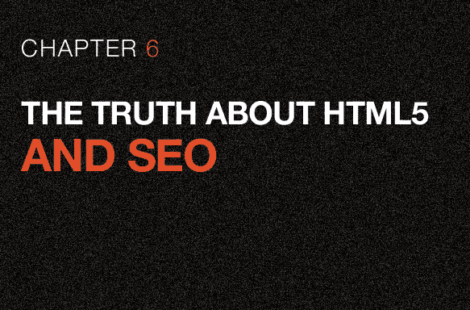

# 

## 标记和 SEO 神话

书籍和博客中流传的一个奇怪的神话是，新的(甚至旧的)HTML 元素将有助于搜索引擎优化(SEO)。让我们现在就把这个问题搁置起来(把 phasers 设置为“咆哮”)，并考虑更广泛的标记和 SEO 问题。

SEO 就是给定的搜索项在搜索引擎(通常是谷歌，但也可能是必应，甚至是中国的百度)的索引中排名靠前。例如，我可能希望这本书在“HTML5 book”(嘿，我可以做梦)中排名靠前。但是这个排名和标记没有什么关系——不管是语义上的还是其他方面的。(我在这里做了很大的简化——像[http://searchengineland.com](http://searchengineland.com)和[http://searchenginewatch.com](http://searchenginewatch.com)这样的行业网站展示了现代 SEO 的广阔世界，但我们在这里将保持简单，并专注于标记和排名的问题。)

## 黑暗时代的 SEO

一百万年前，搜索引擎仅仅通过查看你的页面内容来对你的页面进行排名——使用了什么关键词，在哪里使用，以及出现的频率。直到今天，人们仍然认为他们需要“关键词”元标签(`<meta name="keywords" content="redundant, page, keywords">`)，因为谷歌在它的排名中使用它。

它没有。谷歌多年来一直忽视它，因为人们滥用它。(参见:[http://googlewebmastercentral.blogspot.com/ 2009/09/google-does-not-use-kewords-meta-tag.html](http://googlewebmastercentral.blogspot.com/2009/09/google-does-not-use-keywords-meta-tag.html)。)今天，关键字元标签只是作为一个有用的指标，看看哪些 SEO“专家”仍然停留在 90 年代。

## 填充你的关键词

还记得那个老笑话“换一个灯泡，灯泡，灯，灯泡，灯，照明，灯开关，开关，能源需要多少 SEO 专家”？

谷歌并不像我们想的那样关心我们网站上的关键词，因为当涉及到他们控制的数据时，人们会撒谎、捏造和欺骗。(要更广泛地了解这种元数据现象，请参见“元捕获”:[http://en.wikipedia.org/维基/元捕获](http://en.wikipedia.org/wiki/Metacrap)。)

谷歌的突破性创新是通过查看指向某个网站的链接的质量、数量和内容来了解其他网站对该网站的评价。也就是说，“离页”因素比“在页”元数据更能决定你的网站在给定搜索项中的排名。(这也是垃圾评论兴起的原因——人们试图通过到处张贴垃圾链接来游戏谷歌的排名，认为更多的链接会导致更好的排名。)

## HTML 和 SEO

新的 HTML5 元素是元数据的一种形式——关于数据的数据——谷歌真的不在乎你是否使用`<article>`、`<footer>`、`
`，甚至是`<table>`来构建你的页面。

(不是真的，谷歌不在乎你是否用表格来布局。这并不是说你应该这样做，但它让你知道他们在处理什么。这里看马特·卡茨的解释:[http://www.youtube.com/手表？v=fL_GZwoC2uQ](http://www.youtube.com/watch?v=fL_GZwoC2uQ) 。)

谷歌必须理解网络的本来面目——光荣而丑陋的无效标签汤——尽可能把最好的信息反馈给用户。换句话说，对网络进行排名的责任落在了谷歌(以及必应和百度)身上，而不是落在每一个网络作者(包括那些使用首页的作者)身上，让他们提供完美标记的网页，让排名仙女保佑。

使用有效 HTML5 的 0.000001%的页面很大程度上是无关紧要的。谷歌不会抓取你的页面，然后说“哇，有一个`<article>`标签，我肯定会把这个页面排得比下一个更高！”(但如果你相信这一点，请参阅我的下一本书“30 个难以置信的 HTML5 SEO 秘密保证增压你的排名！”)

## 但是如果有帮助呢...不知何故？

SEO 可能是一个竞争异常激烈的行业，其基本策略通常是获得比你的竞争对手更多更好的链接(参见这篇文章和关于“链接建设”的现代方法的讨论:[http://www.seomoz.org/博客/战略链接建设-为什么你不需要超越狮子](http://www.seomoz.org/blog/strategic-link-building-why-you-dont-need-to-outrun-lions))。

如果我们认真对待 SEO，这就是我们需要关注的事情。然而，尽管一个网站的链接简介意义重大，一些人仍然坚持认为，也许，只是也许，使用新的 HTML5 元素将“帮助”搜索引擎解析你的内容，并因此提高你的搜索排名。但是这就像说科比可以得到一些关于如何打篮球的建议。你可以假设他们现在已经在谷歌总部找到了答案。

同样，这并不意味着我们应该编写草率的标记——远非如此。毕竟还是要维护的。只不过新的、花哨的标记和搜索引擎排名关系不大。

当搜索引擎要求时，我们应该为搜索结果的显示提供更多的元数据。(正如我们在前一章所看到的，Schema.org 在这方面可能会有所帮助。)用于搜索结果*显示*的元数据不太可能被滥用，因此它应该仍然有用。我们只是不应该相信更多的元数据意味着更好的排名。

但假设我错了，谷歌确实看好 HTML5 标签。猜猜会发生什么？人们会滥用这些标签，试图获得优势，而谷歌会从一开始就取消这些标签带来的任何好处。这就是致力于高质量搜索结果的工程师大军与致力于操纵它们的网站所有者和 SEO 顾问之间的军备竞赛。

(请注意,“操纵”并不总是坏的——通过产生人们链接的伟大内容来增加价值，以良好的方式提高你的搜索排名，这是可能的，也是更可取的，正如 Matt Gemmell 在《非阴茎 SEO》中所描述的那样[http://mattgemmell.com/ 2011/09/20/SEO-for-Non-dicks/](http://mattgemmell.com/2011/09/20/seo-for-non-dicks/)。)

## 僵尸神话必须消亡...最后

当 web 标准刚刚起步时，我们可以认为 web 标准对 SEO 有好处，因为它们比 Flash 页面更好，Flash 页面使搜索机器人无法“看到”隐藏在 Flash 文件中的链接和内容。同样，将整个网站导出为图片的印刷设计师也没有给自己带来任何 SEO 好处，因为图片中的文本几乎是无用的。但就谷歌而言，如果有足够多的好链接回到一个网站，那么这与它的排名高度相关——即使它是一个纯粹的 Flash 网站。

这个关于 SEO 和标记的神话可能就是从这些开始发展起来的。如果基本的文本和标记有助于搜索引擎，那么*更好的*标记一定会帮助他们*甚至*，对吗？

不，是时候结束这个神话了:HTML5 对 SEO 没有帮助。你和下一个人之间排名的差异不是因为你在给定页面上使用的标签。HTML5 带来了许多有趣的东西(尤其是我们将在接下来的章节中看到的)，但改进的搜索引擎排名不在其中。用于 SEO 的 HTML5 和顺势疗法一样有效。