# 第一章。语义结构，肮脏漂亮的呈现

西蒙·科里森

`www.collylogic.com`

在 2006 年开始厄斯金设计之前，**西蒙·科利森**是 Agenzia ( `www.agenzia.co.uk`)的首席网页开发员，在那里他为唱片公司做了许多网页项目。Simon 热情地确保他构建的所有东西都是可访问的，并且符合当前的网络标准。

西蒙与人合著了*博客设计解决方案*和 *CSS 掌握*(均由 ed 之友出版)。他的第一本个人书籍*开始 CSS Web 开发* ( `www.csswebdevelopment.com`)于 2006 年由 Apress 出版。

在办公室之外，Simon 经营着一个很受欢迎的博客 Colly Logic ( `www.collylogic.com`)，他是一个所谓的 Britpacka 集体的活跃成员，这个集体由懒散的设计师和开发人员组成，他们都热衷于负责任的网页设计。当西蒙离开笔记本电脑时，他很可能出现在酒吧或音乐会上，不停地谈论好音乐、足球或饼干。

 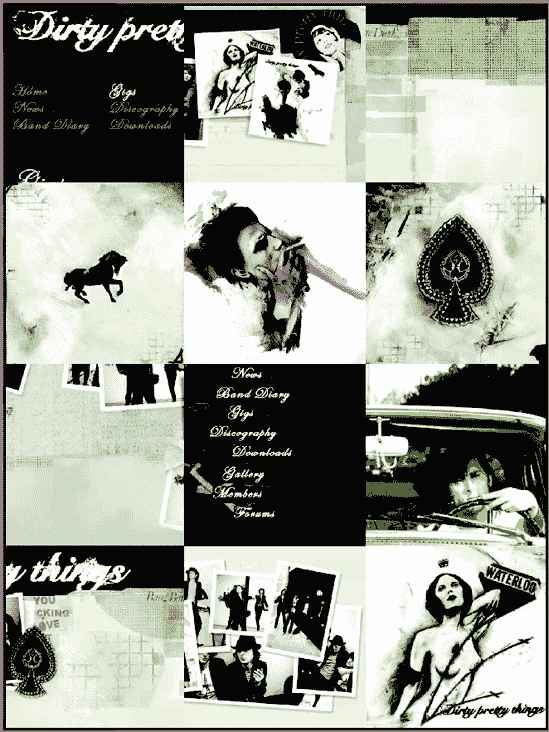

西蒙曾在许多城市生活过，包括伦敦和雷克雅未克，但现在他回到了他心爱的诺丁汉，那里的草是绿色的，女孩也很漂亮。

# 简述

对于唱片公司来说，建立一个符合网络标准的网站是一个挑战。多年来，Flash 一直是乐队网站的必备工具。此外，还有深不可测的导航挑战、点唱机插件、框架、可疑的调色板和无处不在的`Loading`栏。虽然网络看起来很流行，但在音乐行业，它仍然是 1999 年。正如丹·鲁宾将在本书第二章中阐述的那样，情况正在好转，但是好的网站仍然少之又少。

对于 Dirty beautiful Things 网站(`www.dirtyprettythingsband.com`)，我和我在 Agenzia 的设计师同事有机会在 2004 年夏天重新推出的 Libertines ( `www.thelibertines.org.uk`)网站的基础上再接再厉(见[图 1-1](#the_final_version_of_the_libertines "Figure 1.1. The final version of the Libertines website (www.thelibertines.org.uk)") )。我们按照 Web 标准构建了 Libertines 网站，以负责任的方式使用 Flash 元素。我们不顾一切地将内容和表现分开，以利用越来越多的用户通过移动设备访问网站，并确保核心内容的持久性，不管未来的重新设计如何。碰巧的是，英国摇滚的巨大希望在过度和不良行为的漩涡中解散了，但该网站仍然拥有不断增长的用户群体。

18 个月过去了，Libertines 的联合创始人 Carl Barat 组建了一个新的乐队，音乐媒体和乐迷们对此寄予厚望。由于各种错误的原因，前放荡不羁的名人皮特·多赫提充斥着各种小报，现在轮到卡尔和他的公司把欢乐带给成千上万把灵魂出卖给放荡不羁者的粉丝了。从一开始，很明显，任何新网站都将是受欢迎的一方，根据我们从 Libertines 网站获得的经验，很容易说服唱片公司，网络标准是唯一的出路。

Hannah Bays 为乐队创作的大量原创作品扔给了我们，虽然独特而又酷，但似乎没有一件适合网页设计。事实上，整合设计是一个漫长的过程，当我们开始只用 XHTML 和 PHP/MySQL 构建网站的核心内容时，这个过程就被搁置了。


**图 1.1。浪子网站的最终版本(`www.thelibertines.org.uk` )**

本章将加入我们完成 XHTML 和数据库的过程，并返回到表示方法，看看这是如何通过使用 CSS 的一个单独的层来实现的。重点将放在应用外观的视觉接触，如自定义背景，标题和 CSS 的其他部件，留下核心内容不妥协。[图 1-2](#the_completed_dirty_pretty_things "Figure 1.2. The completed Dirty Pretty Things website (www.dirtyprettythingsband.com), launched in January 2006") 显示了网站的最终版本。

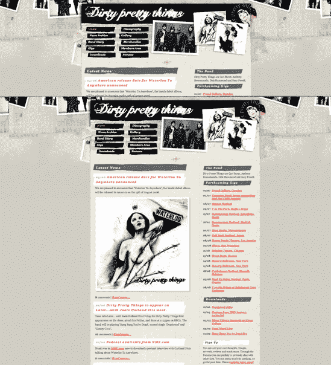

**图 1.2。完成的脏漂亮的东西网站(`www.dirtyprettythingsband.com`)，于 2006 年 1 月推出**

# 语义结构

我们在这里举着 Web 标准的旗帜，所以我们需要确保文档(XHTML plus 内容)与表示(CSS 和装饰性图像)是分离的。通过使用外部样式表应用所有装饰性的表示丰富性，文档(XHTML)保持纯净和集中。由于所有的表示材料都与标记分开保存，所以站点范围内的样式变化可以轻而易举地完成。我们只需要修改一个 CSS 文件，而不是更新网站中的每个页面，这使得大规模的重新设计变得轻而易举。同样重要的是，如果需要，用户可以通过将自己的样式表应用到网站来控制内容。

一个重要的步骤是给添加到核心内容的任何部分(`divs`)起一个有意义的名字，而不是表象的名字。比如刊头叫`masthead`，主栏叫`content_main`，等等。这种方法也适用于较小的细节，比如用于改变元素颜色或强调的 id 和类名。创建一个名为`green_heading`的类是没有意义的，如果这个类以后可能会被 CSS 用来将标题渲染成蓝色。取而代之的是，类被赋予一个描述元素角色的名字，而不是它的风格，比如`date_heading`。在大多数情况下，甚至不需要这样的挂钩，因为样式表中的后代选择器用于选择其他元素的子元素。您将在本章后面的“内容”一节中看到它是如何工作的。T8】

[图 1-3](#the_document_open_parenthesis_xhtml_plu "Figure 1.3. The document (XHTML plus content) as styled purely by the browser's default style sheet") 显示了由浏览器自己的默认样式表设计的网站截图。该站点是一个功能完整的数据库驱动的站点，它完成了构建的第一阶段，并展示了即使样式表不可用，一切都可以很好地运行。

随着构建阶段的结束，团队现在可以开始认真考虑表示，以及如何将核心内容用作网站外观和感觉的框架。是时候变脏，变漂亮了。

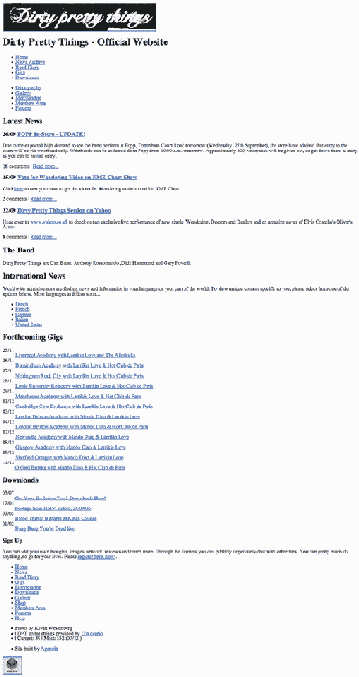

**图 1.3。文档(XHTML plus 内容)的样式完全由浏览器的默认样式表**决定

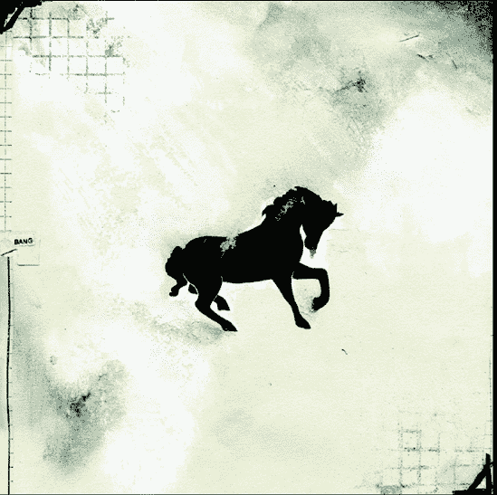

# 肮脏漂亮的展示

当纯粹用 XHTML 构建时，明智的做法是对站点的布局有一个好的想法。很自然地，我们会考虑列和核心区域，比如页眉和页脚，并且这通常会通过 Photoshop 布局(或者甚至是使用铅笔和纸的草图)来传达。)来自团队里的一个设计师。但在《肮脏美丽的事物》网站上，情况并非如此，因为我们都还没有达成一个我们自己都同意的布局，更不用说唱片公司的人了。

通过对功能齐全的 XHTML 站点应用外部样式表，我们有机地解决了这个问题。这意味着，当我们失去了一个一致同意的设计，我们开始通过 CSS 的实验来建立一个外观和感觉。通过创建和修改 CSS 规则，我们测试了从布局(流动、固定或弹性)到字体选择的一切。这种方法很慢，并且需要 Photoshop 一直打开来创建和调整背景图像，这些图像可能会也可能不会进入最终的设计，但这是一个令人兴奋的过程，它消除了已交付的、一成不变的设计的约束。

有了 Hannah Bays 的所有原创作品，并慢慢开发高度、宽度、边距和填充等参数，一个令人满意的设计很快就会实现。由于样式表应用于站点的所有页面，所以很容易看出什么在站点范围内起作用。艺术品的哪些区域可以作为背景？某些区域可以作为背景瓷砖吗？从收集的源材料中，文本和核心元素的通用调色板是否可以实现？

下一步是与同事讨论设计，包括抚摸下巴和喝咖啡，然后确保客户对目前的进展感到满意。然后，我们一点一点地琢磨这些成分，使设计更加严谨，然后再进行可用性测试。最后，网站启动了，收集到的 Agenzians 人可以去酒吧。

## 背景图片

也许从 XHTML 到精心设计的漂亮风格的最戏剧性的变化发生在主背景图像与报头及其后代相遇的地方。大量精心的 Photoshop 工作使用了一系列背景图像，如图 1-4 所示。

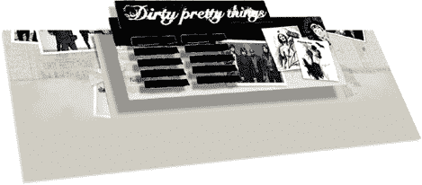

**图 1.4。拆分成几层，各种背景图片并置。**

### 注意

在你开始拼命使用背景图片之前，重要的是要考虑这会如何影响最终用户。虽然没有以前那么重要，但你仍然需要意识到，有些人正在使用非常慢的调制解调器下载网页。一个典型的网页可能包含大约 15KB 的文本，因此下载速度非常快。再加上 35KB 的背景图片，你就大大降低了访问者的浏览速度，至少在浏览器缓存图片之前是如此。保持图像使用光线，只有在真正必要时，或者当你为你知道将使用超高速宽带连接的观众设计时，才过度使用光线。

在任何情况下，如果图像不显示或被用户手动禁用，我们都不会使用背景图像来传达重要信息。例如，我们不使用背景图像来显示网站的标题、任何导航项目或任何类型的扁平文本内容，除非我们在图像关闭的情况下也使用标准文本来提供这些信息。背景图像是装饰性的装饰品，当然不能被认为是“内容”，这就是为什么它们在样式表中作为单独的表示元素被引用。

## 背景、标题和菜单

我们将从背景、标题和主菜单这三个主要层在现有 XHTML 上的样式开始。

一个内嵌图像已经出现:主要的脏漂亮的东西标志。徽标([图 1-5](#the_dirty_pretty_things_logo "Figure 1.5. The Dirty Pretty Things logo becomes an animated GIF, with a jagged background.") )是一个动画 GIF，当页面第一次加载时，它会一个字母一个字母地拼出乐队名称。该徽标在文档流中，位于刊头的左上方。T3】


**图 1.5。Dirty beautiful Things 徽标变成了一个带有锯齿状背景的动画 GIF。**

查看这一部分的 XHTML，您会看到波段名也在`<h1>`元素中指定，该元素使用`display:none`隐藏。这是为了确保如果图像和 CSS 被禁用，该网站仍然是品牌。

```html
<div id="wrapper">
  <div id="masthead">
    <a href="home"></a>
    <h1>Dirty Pretty Things - Official Website</h1>
  </div>
    ...rest of content...
</div>
```

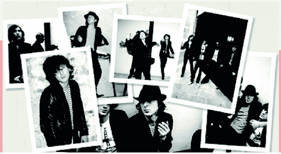

**背景**

接下来，我们将主背景图像([图 1-6](#the_main_background_image_comma_which "Figure 1.6. The main background image, which will be placed in the center and tiled horizontally") )应用到`<body>`元素。虽然比理想的要大得多，但是 JPG 的图像将会像瓷砖一样工作。我更喜欢使用 GIF 格式的背景图像，但是这个大背景图像的细节层次和图像层次要求 JPG 格式有更大的灵活性。

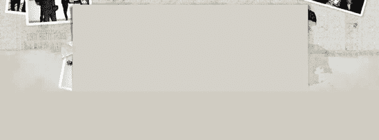

**图 1.6。主背景图像，将被放置在中心并水平平铺**

我们在 CSS 中使用背景速记将平铺显示放在顶部中央，并确保它只水平平铺。查看正文选择器的 CSS，您会看到除了主字体规则和其他项目之外，所有背景规则都使用 CSS 简写进行组合，顺序为`background-color`、`background-image`、`background-position`、`background-attachment`和`background-repeat`。

```html
body {
  margin: 0;
  padding: 0;
  font-size: 95%;
  font-family: Georgia, 'Lucida Grande', Verdana, sans-serif;
  text-align:center;
  color: #333;
  background: #C6C2B6 url(img/background.jpg) center top fixed repeat-x;
}
```

### 注意

由于图像是水平重复的(`repeat-x`)，无论浏览器窗口有多宽，它都会占据整个网站的宽度。但是，页面`background-color`是在背景拼贴底部的平面颜色上采样的。与这种颜色结合的图像将完成整个背景，并给人一种背景图像高得多的印象。

在速记中，我们使用了`background-attachment:fixed`来防止背景与页面的其余部分一起滚动，并使用`background-position:center top`来确保第一个背景图像平铺的中点与浏览器窗口的中点保持一致。填充宽度所需的所有其他图块将放置在该初始居中图像的左侧和右侧。

**刊头**

下一个任务是控制包装和报头。刊头背景图片([图 1-7](#the_masthead_background_image "Figure 1.7. The masthead background image") )是在 Photoshop 中创建的，其中有一个徽标的展平版本。在导出图像之前，徽标已被移除并替换为黑色。我们知道，只要没有对刊头应用填充，动画徽标就会出现在刊头背景的左上角。


**图 1.7。报头背景图像**

现在可以为模板定义一些关键规则了。已经定义了`body`选择器，并将所有元素设置为居中对齐(`text-align:center`)以便我们的内容区域居中，重要的是将下一个主要元素(用 ID `wrapper`定义)设置为`text-align:left`，这是一个所有后代都将继承的值。边距值(`0 auto 0 auto`)将确保`wrapper`的左右边距相等，无论浏览器窗口的宽度是多少。

```html
#wrapper {
  width:779px;
  margin:0 auto 0 auto;
  text-align:left;
}
```

现在，基于报头背景图像的宽度和高度，在报头声明中指定了相等的值。使用试错法来指定边距值，以便在固定背景的顶部对齐我们想要的标题。通过指定 15px 的上边距，我们可以确保当内容开始在固定背景上滚动时，在刊头上方刚好有足够的主背景图像可见。`background-color`是从刊头所在的主背景区域取样的。这个区域包含了几种颜色，但是做了一个粗略的匹配，所以如果用户在等待报头图像的加载，事情看起来还可以。

```html
#masthead {
  width:768px;
  height:254px;
  margin:15px 0 0 8px;
  color:#030;
  background: #ECE4D9 url(img/masthead.jpg) no-repeat
}
```

最后，主内容选择器返回到`wrapper`中定义的`full-width`，允许所有剩余内容重新开始，并指定新的背景图像。这个新图像向各个方向平铺，尽管内容区域的宽度仅够显示垂直平铺。此拼贴扩展了刊头背景中使用的边缘，给人一种又长又旧的页面的感觉。

```html
#content {
  width:779px;
  background: url(img/content.gif)
}
```

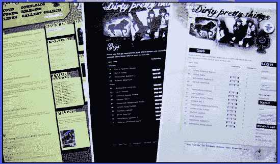

**导航菜单**

下一步是将主导航菜单添加到报头中(见[图 1-8](#various_masthead_ideas "Figure 1.8. Various masthead ideas") 在做出最终决定之前，我们尝试了各种报头想法)。在 XHTML 阶段，我们知道我们想要将导航分成两部分，因为我们已经为 Libertines 网站做了类似的事情，并且发现这是一种充分利用报头空间的极好方式。

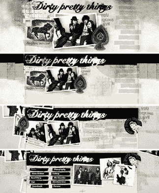

**图 1.8。各种报头创意**

标记如下所示。请注意，两个列表都有相同数量的列表项，并且每个菜单列表都有唯一的 ID ( `m1`和`m2`)。

```html
<ul id="m1">
  <li><a href="#" id="nav_a">Home</a></li>
  <li><a href="#" id="nav_b">News Archive</a></li>
  <li><a href="#" id="nav_c">Band Diary</a></li>
  <li><a href="#" id="nav_d">Gigs</a></li>
  <li><a href="#" id="nav_e">Downloads</a></li>
</ul>
<ul id="m2">
  <li><a href="#" id="nav_f">Discography</a></li>
  <li><a href="#" id="nav_g">Gallery</a></li>
  <li><a href="#">Merchandise</a></li>
  <li><a href="#" id="nav_h">Members Area</a></li>
 li><a href="#" id="nav_j">Forums</a></li>
</ul>
```

我们还知道每个菜单项可能有独特的处理方式，所以每个链接都有自己独特的 ID，很快就会派上用场。

如果没有 CSS，这两个列表将以正常的流程出现，一个在另一个下面。因此，我们使用 margin 值来推动和拉动每一个位置。第一个(`m1`)被简单地给定了 20px 的左边距，使其远离报头的左边缘。第二个(`m2`)从刊头的左边缘移动 130 像素，从其自然位置移动 160 像素。因此，`m2`被移到了另一个菜单的右下方，然后拉高到足以与它对齐，这要感谢大的负顶部边距。不需要定位或浮动。

```html
#masthead ul#m1 {
  margin: 0 0 0 20px;
  padding-top:5px;
}
#masthead ul#m2 {
  margin:-160px 0 0 130px;
}
```


有了我们想要的无序列表，我们可以开始考虑列表项了。每个都被赋予一个`height`和`width`，加上一些其他的自定义值，所有的都将共享。

```html
#masthead ul li {
  width:135px;
  height:25px;
  list-style-type: none;
  padding-top:4px;
  font-size: 12px;
  letter-spacing:0.07em;
}
```

接下来，我们选择每个列表项中的链接。大多数是跨各种状态的常见链接方法，但我们发现包含`display:block`以防止应用于每个链接的各种边距值导致链接聚集在一起并造成巨大破坏是至关重要的。

```html
#masthead ul li a {
  display:block;
  padding-left:11px;
  text-decoration:none;
  font-weight:bold
}
#masthead ul li a:link, #masthead ul li a:visited, #masthead ul li a:active {
  color:#FFF;
}
#masthead ul li a:hover {
  color:#F00;
}
```

有了所有这些，两个菜单被准确地放置在我们想要的位置，现在我们可以考虑单独处理每个链接了。

前面我提到过，我们已经给了每个链接一个唯一的 ID。这些钩子现在可以让我们玩得开心了。在 Photoshop 中，我创建了三个不同的背景图像，它们都适合我们的`<li>`元素的给定宽度。我们现在可以随机地将这三种背景中的任何一种应用于每个 ID，并为每个 ID 设置一个唯一的左边距，这给了我们稍微随机的对齐，以及不同的背景。

下面的 CSS 显示了十个 id 中的三个是如何在样式表中定义的:

```html
#nav_a {;
  background: url(img/buttonback1.gif) no-repeat;
}
#nav_b {
  margin-left:6px;
  background: url(img/buttonback2.gif) no-repeat;
}
#nav_c {
  margin-left:4px;
  background: url(img/buttonback3.gif) no-repeat;
}
...etc...
```

除非你仔细研究最终结果，否则似乎每个列表项都有一个独特的背景，而实际上我们只是简单地交替使用这三个。

在每个模板上，一个 ID 被添加到`<body>`元素中，目的是用 CSS 应用程序的一个小技巧轻松地突出显示主菜单中的当前页面。

```html
<body id="home">
```

在 CSS 中，`<body>`中的`id`选择器和附加在每个菜单链接上的`id`之间的关系被粘合。第一部分`#home`，将动作指向元素选择器为`home`的实例。第二部分`#m1 a#homebutton`，在`#m1`列表中查找被标识为`homebutton`的链接。如果找到匹配，则执行该操作。注意，为了节省空间，这里只显示了三个匹配。

```html
/* Highlight the current page */
#home #m1 a#homebutton, #news #m1 a#newsbutton, #diary #m1 a#diarybutton {
  color: #F00;
}
```

因此，每当用户查看主页时，链接颜色将被设置为红色，但在滚动时仍然是白色。从 CSS 来看，应该清楚新闻模板用的是`<body id="news">`，日记模板用的是`<body id="diary">`。剩下的唯一工作是为每个需要与模板对应的唯一链接 ID 复制 CSS，将目标分组到一个整洁的无所不包的定义中。

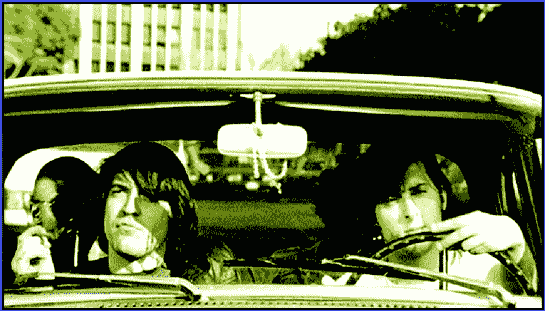

## 内容亮点

有了背景、标题和主导航之后，我们可以更仔细地看看主要内容区域中发生的一些有趣的事情。我们将探究标题、表格和定义列表。

**标题**

Dirty beautiful Things 网站大量使用了 2 级(`<h2>`)和 3 级(`<h3>`)标题。最值得注意的是，二级标题用在所有页面的主要内容区域和侧边栏的顶部，但是有不同的外观。这是通过在样式表中使用后代选择器实现的。

下面的标记反映了一个简化的侧栏。注意，主内容中的`<h2>`元素也没有惟一的 ID 或类。

```html
<div id="sidebar">
  <h2>The Band</h2>
  <p>Dirty Pretty Things are Carl Barat, Anthony Rossomando, Didz Hammond and Gary Powell.</p>
</div>
```

[图 1-9](img/ch01.html#two_jagged_background_images_are "Figure 1.9. Two jagged background images are used for the two differently sized level 2 headings.") 显示了用于两个`<h2>`元素的两个背景图像。


**图 1.9。两个参差不齐的背景图像用于两个不同大小的级别 2 标题。**

主内容区域中使用的`<h2>`的 CSS 规则相对简单。注意`blackhead.gif`被指定为不重复的背景图像，并且使用了足够的填充来确保整个背景可见。

```html
h2 {
  margin:0 0 2px 10px;
  padding: 6px 0 5px 13px;
  font:14px/165% italic Georgia, Arial, Helvetica, sans-serif;
  letter-spacing:0.2em;
  color:#FFF;
  background: #EAE5D8 url(img/blackhead.gif) left bottom no-repeat
}
```

现在，我们继续讨论侧边栏的`<h2>`。巧妙的部分是用后代选择器完成的。当`<h2>`元素在侧边栏中时，选择器`#sidebar h2`告诉浏览器应用这些规则。如果找到匹配，则使用不同的背景图像`blackheadside.gif`，并缩小页边距和`font-size`。

```html
#sidebar h2 {
  margin-top:3px;
  font-size:12px;
  background: #EAE5D8 url(img/blackheadside.gif) left bottom no-repeat;
}
```

### 注意

后代选择器对于避免不必要的类和 id 是必不可少的，否则它们可能会破坏 XHTML 文档。通过使用后代选择器，CSS 规则可以变得更加具体，并且后代选择器可以沿着树向下移动多远——可能是父代的子代的子代？

**表格**

从本质上讲，表是用于表格数据的，而且仅仅是表格数据。大多数负责任的设计师仍然使用表格。您可能无法避免它们，但重要的是只在必要时使用它们。

### 注意

表格数据不能单独由 CSS 布局来组织，或者如果你试图这样做，它将没有什么意义。许多设计人员想出了用纯 CSS 布局和定位来呈现复杂表格数据(如日历、时间表等)的方法。这很好，当然也算是一项成就，但是如果去掉样式表，一切都会分崩离析。该表的美妙之处在于它在语义上呈现信息，为 CSS 样式提供大量元素，并且在样式表不可用的情况下仍然非常有意义。

对于 Dirty beautiful Things disco graphy，一个表中包含了与每首歌曲相关的多行信息。如果一首歌曲分配了歌词、音频、视频、吉他标签或图像，则会在相应的单元格中放置一个小复选图像。标记相当简单，没有任何额外的 id 或类。

```html
<table>
  <thead>
    <tr>
      <th>Title</th><th width="11%">Released</th>
      <th><abbr title="Lyrics">L</abbr></th>
      <th><abbr title="Audio">A</abbr></th>
      <th><abbr title="Video">V</abbr></th>
      <th><abbr title="Guitar">G</abbr></th>
      <th><abbr title="Images">I</abbr></th>
      <th>Comments</th>
    </tr>
  </thead>
    <tr>
      <td><a href="if_you_were_wondering/">Wondering</a></td>
      <td>08/05/06</td>
      <td></td>
      <td></td>
      <td></td>
      <td></td>
      <td>-</td>
      <td>26</td>
    </tr>
</table>
```

这就产生了图 1-10 中[所示的基本表格。](#the_discography_apostrophy_s_tabular "Figure 1.10. The discography's tabular data as styled by the browser's default style sheet")

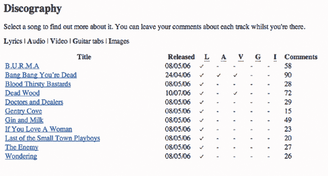

**图 1.10。由浏览器的默认样式表**样式化的 discography 的表格数据

使用一些非常简单的 CSS 就彻底改变了这一点。由于表格下的页面背景，许多工作已经完成，但是进一步定义行和表格标题是有用的。

首先，我们控制表格本身，关闭默认边框(`border:0`)，设置字体大小(`font-size:11px`)，并确保表格将填充可用空间(`width:100%`)。

```html
table {
  width:100%;
  margin: 10px 0 20px 0;
  border:0;
  font-size:11px;
}
```

然后，我们在每一行的顶部放置一个虚线边框，并添加特定的填充，消除对过时的表示标记的需要，如`cellpadding`或`cellspacing`。

```html
td, th {
  margin: 0px;
  border-top:1px dashed #999;
  padding: 3px 5px 3px 5px;
}
```

### 注意

*值得注意的是，*`cellspacing`*没有可靠的 CSS 等价物，所以很多设计师仍然利用这个表象属性*。

这些非常简单的规则，以及桌子被放置在一个吸引人的背景上的事实，给了我们一个更加有趣的如图 1-11 所示的桌子。

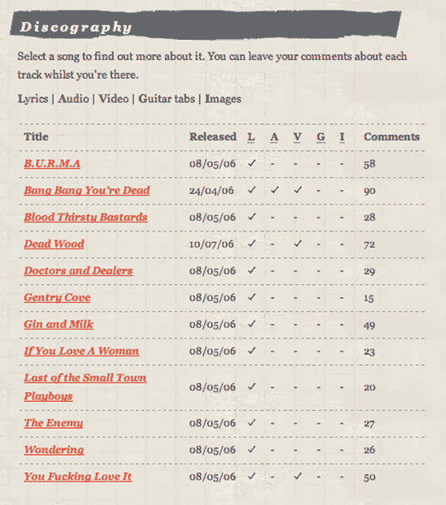

**图 1.11。由于一些非常简单的 CSS，discography 表发生了根本性的变化。**

**定义列表**

使用还是不使用定义列表？这是一个永恒的、无处不在的、越来越沉闷的问题。我们到底应该用它们做什么？就我个人而言，每当我需要比传统无序列表多一点的结构时，我都会使用它们，但不需要表的复杂性。

所有的定义列表都由两个主要部分组成:术语和描述。定义列表是使用三个基本元素构建的:容器(`<dl>`)、定义术语(`<dt>`)和定义描述(`<dd>`)。这个简单的结构适合我们对侧栏标题和游览日期的需求，其中日期充当定义术语，标题或地点是描述。结果是逻辑配对提供了所有必要的样式挂钩。

```html
<h2>Forthcoming Gigs</h2>
<dl>
  <dt>25/11<dt>
  <dd><a href="liverpool_academy">Liverpool Academy...</a></dd>
  <dt>26/11</dt>
  <dd><a href="birmingham_academy">Birmingham Academy...</a></dd>
  <dt>27/11</dt>
  <dd><a href="nottingham_rock_city">Nottingham Rock City...</a></dd>
  <dt>28/11</dt>
  <dd><a href="leeds_university_refectory">Leeds University Refectory...</a></dd>
</dl>
```

### 注意

虽然我觉得这种配对是对定义列表的恰当使用，但是要注意屏幕阅读器会在每一项之前说出标签“术语”或“定义”

[图 1-12](#the_definition_list_styled_by "Figure 1.12. The definition list styled by the browser's default style sheet") 显示了浏览器中未样式化的结果。每个定义术语和定义描述由换行符和默认左边距分隔。


**图 1.12。由浏览器默认样式表**设计的定义列表

现在，可以使用元素选择器来设计整个定义列表的样式。以选择器`dl`、`dt`和`dd`为例，可以应用非常相似的样式将整个部分组合在一起。我们发现没有必要修改定义列表元素本身，尽管如果我们愿意的话，我们可以为`dl`选择器添加声明。我们的第一步是让术语定义变得更难。主要的工作是将定义术语浮动到左边，这将允许定义描述被重新定位到它的右边并内嵌。

```html
dt {
  float:left;
  padding:2px 0 7px 0;
  line-height:130%;
  font-weight:bold;
}
```

接下来，定义描述元素被样式化。非常简单，关键任务是移除默认边距，该边距将它从包含的`<dl>`元素的左边缘推开。

```html
dd {
  margin:0;
  padding:2px 0 7px 0;
  line-height:130%;
}
```

这给我们带来了一个完整的、巨大变化的定义列表。请注意，它足够灵活，可以扩展和适应我们放置它的任何容器，这使它成为侧边栏导航的理想组件。所有这一切的美妙之处在于，在(X)html 中不需要额外的标记，CSS 会处理好一切。最终结果见[图 1-13](#css_to_the_rescue_once_more._the "Figure 1.13. CSS to the rescue once more. The definition list is clearer and aligned much better thanks to a few CSS rules.") 。

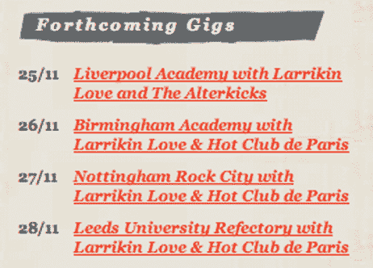

**图 1.13。CSS 再次出手相救。多亏了一些 CSS 规则，定义列表更加清晰，也更加一致。**

这样，由于样式表的强大功能，内容区域的关键组件都被控制住了。内容本身保持纯净和清白，网页设计师可以睡得很香。

# 结论

当然，构建肮脏美好事物网站并不像本章所说的那么简单，还有更多问题(包括代码和现实世界相关的)有时会让生活变得非常困难。这个故事的重要寓意是，由于网络标准，尽管用户数量巨大，该网站使用的带宽相对较少(我没有将视频下载计入该带宽)，尽管装饰复杂且包罗万象，但它仍然可以在移动和打印设备上访问。

我很乐意分享更多我在这次构建中的经历，但是没有空间让其他人讲述他们的故事，所以我邀请你查看源代码(注意，自从我管理这个站点以来，代码可能已经改变)并在这个站点中挖掘。没有更好的方法来弄清楚事物是如何工作的，非常欢迎您来探索。

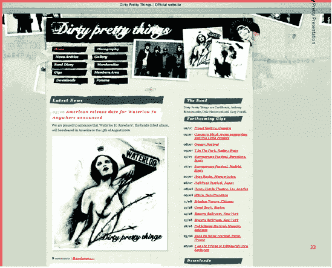